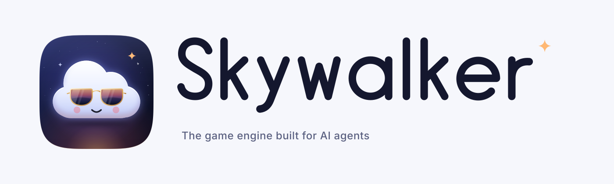
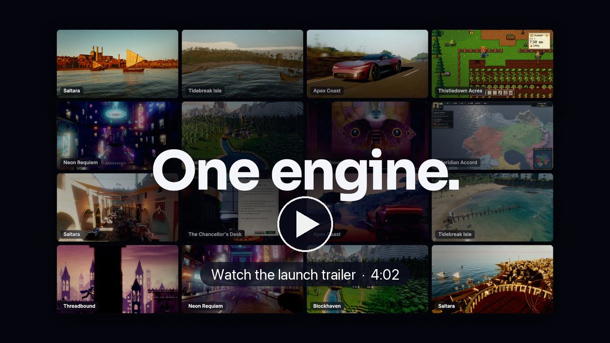
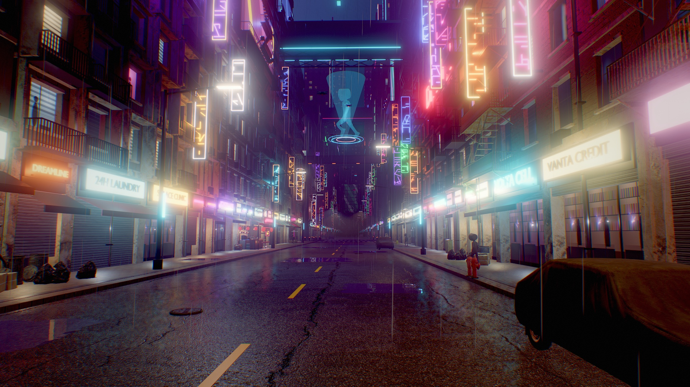
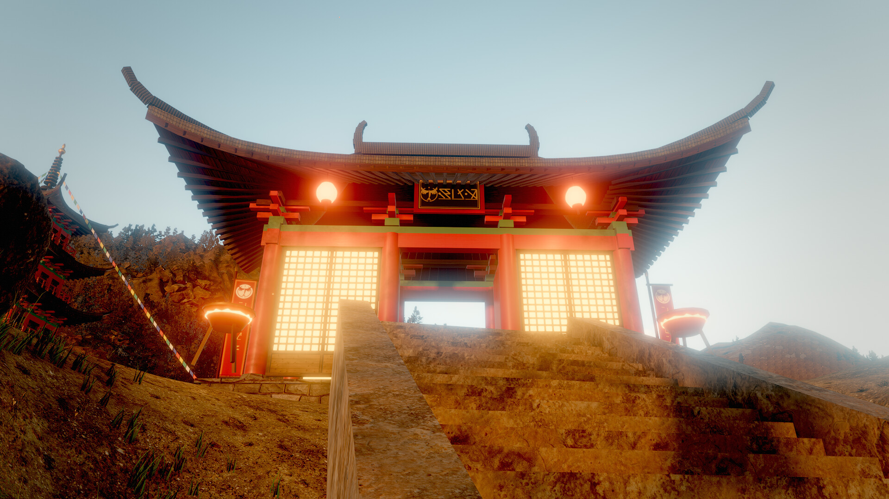
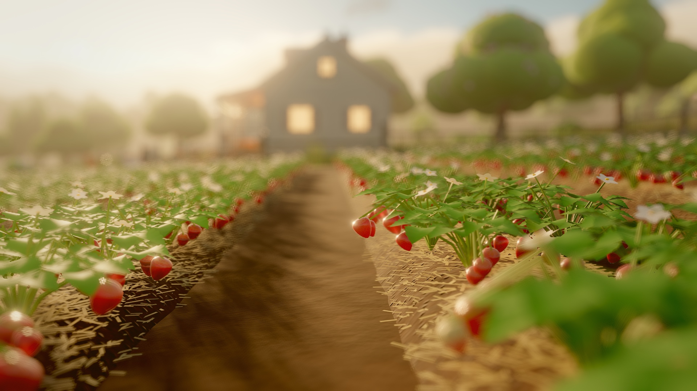
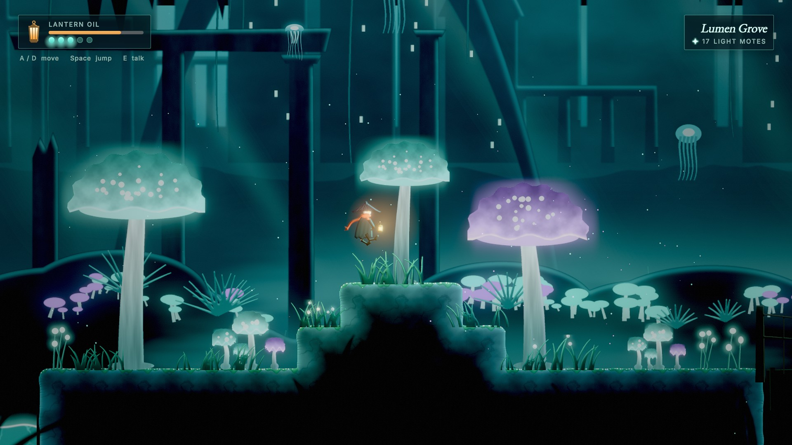
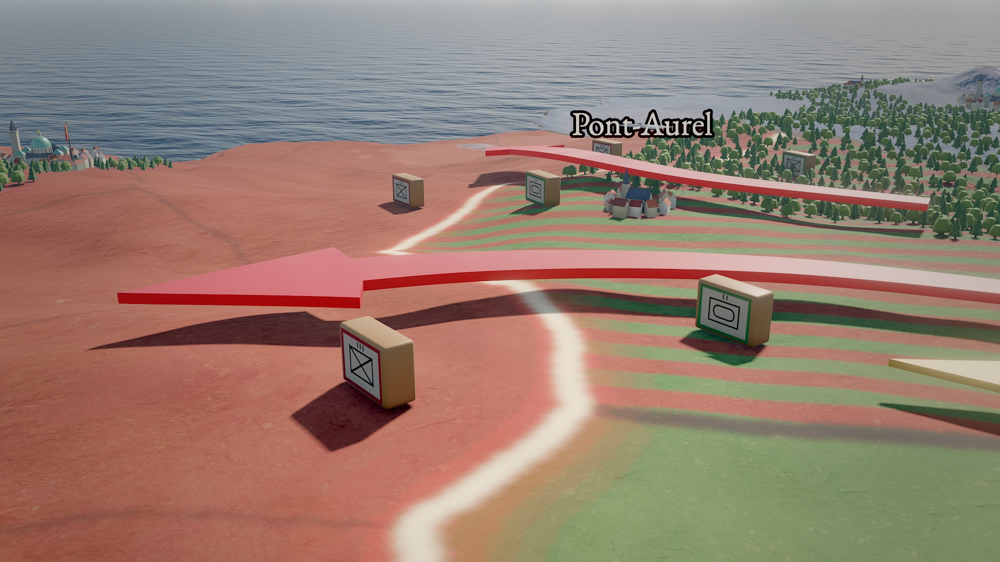
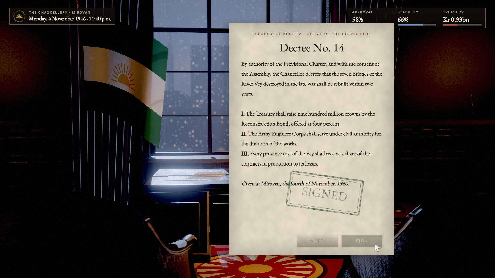
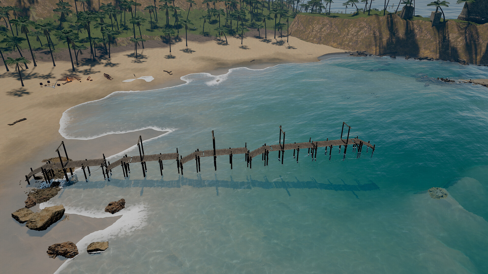

<p align="center">
  <picture>
    <source media="(prefers-color-scheme: dark)" srcset="assets/brand/logo/horizontal-dark.svg">
    
  </picture>
</p>

<p align="center"><b>A game engine built from the ground up for AI agents — and the people who work with them.</b></p>

<p align="center">Developed by: AmirHossein (Amir) Razlighi</p>

---

<p align="center">
  <a href="https://github.com/amirhossein-razlighi/Skywalker/releases/tag/launch-trailer">
    
  </a>
</p>

<p align="center"><a href="https://github.com/amirhossein-razlighi/Skywalker/releases/download/launch-trailer/skywalker-launch-trailer-1080p.mp4"><b>Watch the launch trailer</b></a> (4:02, 1080p). Every shot was rendered by the engine.</p>


Skywalker is a C++20 game engine with a native macOS editor, designed so that AI agents
(Claude, GPT, DeepSeek, local and self-hosted models) can **see** the scene, **act** on it
precisely, **test** what they built, and **collaborate** with you — through the very same
interface the editor uses.

> **Status: v0.1 (pre-release).** macOS / Apple silicon (Metal) first; the core is
> platform-agnostic and has a CPU renderer for headless use. See [ROADMAP](docs/ROADMAP.md).

## Highlights

### Built for agents
- **Everything is a tool.** 164 typed, schema-validated tools cover scenes, entities, worlds,
  terrain, foliage, materials, lighting, effects, physics, navigation, animation, sequences,
  2D, UI, dialogue, audio, assets, Blender, the studio, movies and shipping. The editor, its
  in-app agents and external agents over **MCP** all use the same surface; errors come with
  `did you mean …?` hints. → [docs/TOOLS.md](docs/TOOLS.md)
- **Agents can see.** `viewport_capture` returns an image plus every visible entity's screen box,
  with optional `#id` labels (set-of-mark prompting), buffer views (albedo, normals, GI, AO,
  depth…), clay and pencil-sketch looks, and supersampled stills.
- **Native in your agent.** `skywalker setup claude|codex|gemini|cursor` installs the MCP server,
  13 skills, studio-role subagents and commands. → [docs/INTEGRATIONS.md](docs/INTEGRATIONS.md)
- **A studio of agents.** Directors, designers, programmers, artists and playtesters with roles
  and focus areas; a shared board; playtest bots that really play; feedback the director accepts,
  defers or drops with measured effect; user-defined loops (playtest → triage → fix → verify).
  Anthropic, OpenAI-compatible and local models. → [docs/STUDIO.md](docs/STUDIO.md)
- **Undoable and attributed.** Every edit records who made it (you, `agent:Nimbus`,
  `mcp:claude-code`); deterministic 60 Hz simulation lets agents test gameplay and replay it.

### From words to native code
- **Wander** turns a natural-language intent into deterministic behavior code: functions,
  collections, coroutines, state machines, types, modules and tests on a register VM, a
  visual node-graph view of the same code, and ahead-of-time compilation to C++ native
  modules (up to 33× faster on hot loops). → [docs/WANDER.md](docs/WANDER.md)

### Rendering tuned for Apple silicon
- Deferred-style G-buffer with **clustered lighting** (1,000+ lights), screen-space **GI and
  reflections**, temporal anti-aliasing, **MetalFX** upscaling, PBR with clearcoat and subsurface,
  cascaded soft shadows and AO.
- Physical **atmosphere** with ray-marched **volumetric clouds** and cloud shadows, light shafts,
  height fog, an **FFT ocean**, GPU **fluid fire and smoke**, **GPU particles** (sub-emitters,
  ribbons, flipbooks, collisions) and **strand hair** with Marschner shading.
- Eroded **terrain** with splat layers and wet shorelines, instanced **foliage** with wind and
  automatic LODs and octahedral impostors for distant forests, auto exposure, depth of field, motion blur, looks and .cube LUTs.
- An editor viewport that stays responsive (fast / balanced / full quality while editing), a
  GPU-safe offline path, and an offline **movie renderer** that renders sequences to HEVC / ProRes with
  real motion blur. → [docs/RENDERING.md](docs/RENDERING.md), [docs/MOVIE_RENDER.md](docs/MOVIE_RENDER.md)

### A complete engine
- **Physics** (Jolt) with characters, joints and queries; **navigation** (Recast/Detour);
  **animation** with state machines, IK, retargeted glTF characters and a sequencer;
  **audio** with spatial sound and procedural SFX/music; **2D** sprites, tilemaps and 2D lights;
  **UI** layout with themes and SDF text; a **dialogue** language.
- **Assets:** GUIDs, tags and provenance; glTF/OBJ/PLY/STL import; licensed web downloads with
  automatic credits; procedural PBR textures; a **Blender bridge** that models and imports.
- **Ship it:** `skywalker build` packages a project as a signed macOS app around the standalone
  player. → [docs/SHIPPING.md](docs/SHIPPING.md)

## Made with Skywalker

Sample worlds built by agent crews with the engine's own tools (original IP; every project is in `examples/`).

| | |
|---|---|
|  **Tidebreak Isle**: an island cove at golden hour, FFT surf, palms, a fort and a brig |  **Neon Requiem**: a rain-soaked neon city with hundreds of clustered lights |
|  **Ashen Peaks**: a monastery valley with eroded terrain and impostor forests |  **Berrybrook**: a cozy berry farm with planting, harvest and a tilt-shift lens |
|  **Gloamwater**: a 2D metroidvania with painted parallax and 2D lights |  **Meridian Accord**: a grand strategy map with fronts, units and events |
|  **The Chancellor's Desk**: a political drama of documents, dialogue and decrees |  Every world ships its hero camera moves as sequences, ready for `movie_render` |

## Quick start

Requirements: macOS 15+, Xcode 16+ command-line tools, CMake ≥ 3.29, Ninja.

```bash
cmake --preset release
```

```bash
cmake --build --preset release
```

```bash
ctest --preset release
```

Run the editor with an example project (File › Open Project… switches later):

```bash
open build/release/bin/Skywalker.app --args --project "$PWD/examples/hello_sky"
```

### Use with Claude Code / Codex / Gemini / Cursor

One command wires a tool to Skywalker: the MCP server (attaches to the running editor, otherwise runs headless), thirteen `skywalker-*` skills (the agent loop, world
building, look development, assets, Blender, audio, the multi-agent studio, ...), eight studio-role subagents and five workflow commands.

```bash
skywalker setup claude          # or codex | gemini | cursor | all   (add --global for your user config, --dry-run to preview diffs)
```

Claude Code also ships as a plugin (`claude plugin marketplace add <this repo>` then `claude plugin install skywalker@skywalker`), Gemini CLI as an extension
(`gemini extensions install integrations/gemini`). The same server exposes the docs, skills, the tool catalogue and the live studio as MCP resources and prompts.
Setup merges into existing configs and backs up what it changes. Details, role mapping across tools, and SDK examples (OpenAI Agents SDK, Anthropic tool runner):
[docs/INTEGRATIONS.md](docs/INTEGRATIONS.md). By hand: `claude mcp add skywalker -- "$PWD/build/release/bin/skywalker" mcp --auto`.

### Headless CLI

```bash
build/release/bin/skywalker render examples/hello_sky/scenes/main.sky.json -o shot.png --annotate
```

`skywalker run SCENE --ticks 600` simulates deterministically and prints logs;
`skywalker check file.wander` compiles Wander; `skywalker call TOOL '{json}'` runs one tool.

### Ship a game

```bash
build/release/bin/skywalker build --project examples/sky_dash --out ~/Builds --release   # -> Sky Dash.app
```

`skywalker build` packages a project as a standalone macOS app around `skywalker-player` (scenes, the assets they
reference, scripts, compiled native modules, icon, ad-hoc signature); `skywalker-player PROJECT` plays a folder
directly. Settings live in `game.json`. → [docs/SHIPPING.md](docs/SHIPPING.md)

## Documentation

| Doc | What's inside |
|---|---|
| [ARCHITECTURE](docs/ARCHITECTURE.md) | Layers, threading, data flow, design decisions |
| [PLAN](docs/PLAN.md) | Intent, gap analysis against an industry baseline, workstreams |
| [AGENTS](docs/AGENTS.md) | MCP, the crew, Agent Designer, providers, generative assets |
| [STUDIO](docs/STUDIO.md) | Multi-agent studio: roles, board, feedback, playtests, loops |
| [INTEGRATIONS](docs/INTEGRATIONS.md) | Skills, subagents and setup for Claude Code, Codex, Gemini CLI and Cursor |
| [WANDER](docs/WANDER.md) | The behavior language, graphs, AOT and native modules |
| [RENDERING](docs/RENDERING.md) | The frame, lighting, sky and clouds, terrain and foliage, camera, debug views, performance |
| [MOVIE_RENDER](docs/MOVIE_RENDER.md) | Offline cinematic renders to H.264 / HEVC / ProRes / PNG with motion blur |
| [HAIR_AND_VFX](docs/HAIR_AND_VFX.md) | GPU particles and strand hair |
| [PHYSICS](docs/PHYSICS.md) | Rigid bodies, characters, joints, queries, navigation |
| [ANIMATION](docs/ANIMATION.md) | Skeletal animation, state machines, IK, sequencer |
| [AUDIO](docs/AUDIO.md) | Spatial audio, mixer, procedural sound |
| [2D_AND_UI](docs/2D_AND_UI.md) | Sprites, tilemaps, 2D lights, text, UI, dialogue |
| [INPUT](docs/INPUT.md) | Actions, keyboard, mouse, gamepads |
| [ASSETS](docs/ASSETS.md) | Asset database, glTF, materials, prefabs, spatial tools |
| [DCC](docs/DCC.md) | Blender and other DCC bridges |
| [SHIPPING](docs/SHIPPING.md) | Standalone player, `game.json`, packaging, signing |
| [BRAND](docs/BRAND.md) | Logo, app icon, colors, typography |
| [TOOLS](docs/TOOLS.md) | Generated reference of every tool |
| [DEVELOPMENT](docs/DEVELOPMENT.md) | Building, testing, sanitizers, profiling, conventions |
| [ROADMAP](docs/ROADMAP.md) | What's next |
| [LICENSING](docs/LICENSING.md) | Licensing model (draft, please read) |
| [TERMS](docs/legal/TERMS.md), [PRIVACY](docs/legal/PRIVACY.md) | Terms of Use and Privacy Notice (templates awaiting legal review) |

## License

Skywalker is source available under the **Business Source License 1.1** ([LICENSE](LICENSE)).
It is **free** for individuals, for companies under US$1M in annual revenue and under US$1M in
funding, and for non-profits, education and non-commercial use, including shipping and selling
your games. Larger organizations need a commercial license. Games you make are yours, and each
version becomes Apache-2.0 four years after release. See [docs/LICENSING.md](docs/LICENSING.md).

Developed by: AmirHossein (Amir) Razlighi.
