# Hair, fur and GPU particles

Two GPU effects systems for film-style characters and large-scale visual effects:

- **Strand hair and fur** (`groom` component): real strands grown on a mesh or loaded from a
  file, simulated on the GPU and rendered with a Marschner shading model, deep-opacity
  self-shadowing and a multiple-scattering approximation.
- **GPU particles** (`particles` with `simulation: "gpu"`): compute-shader particles with
  millions per emitter, collisions against everything on screen, sub-emitters, ribbons, lit mesh
  particles and flipbooks, drawn with indirect draws (no CPU readback).

Everything is driven by reflected component fields, so agents, the editor and Wander use the
same knobs. All images below were rendered by the engine through its MCP tools
(`media/demo/hair_vfx.py`).

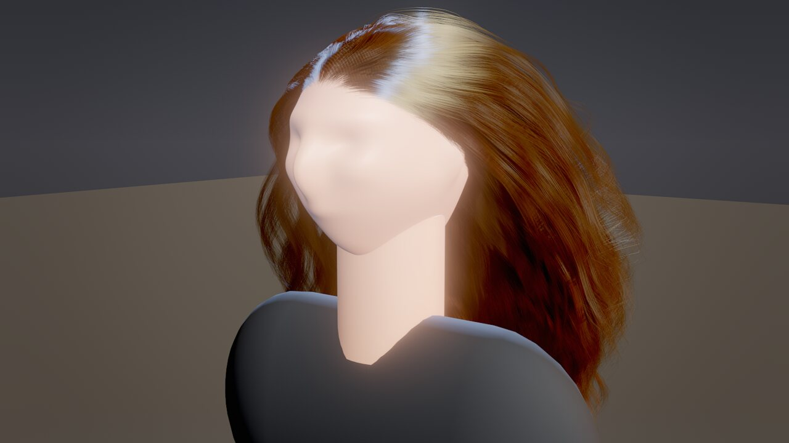

| | | |
|---|---|---|
| 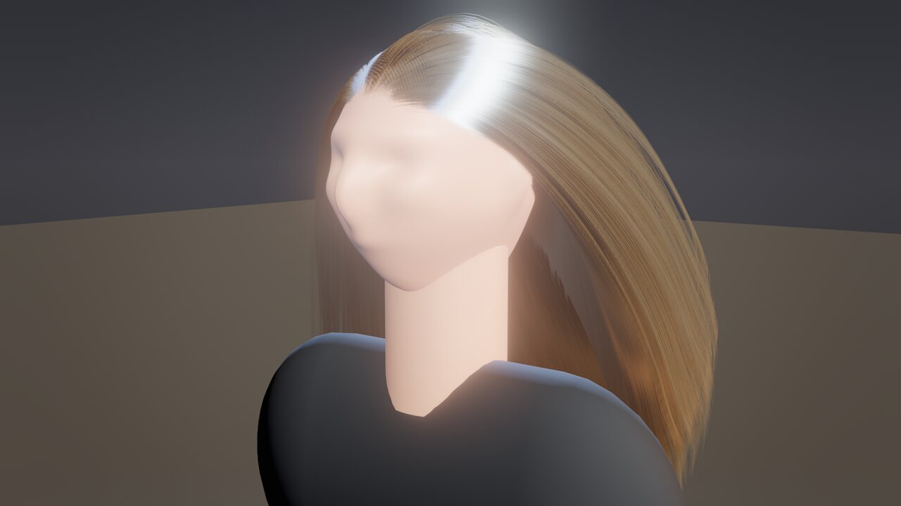 | 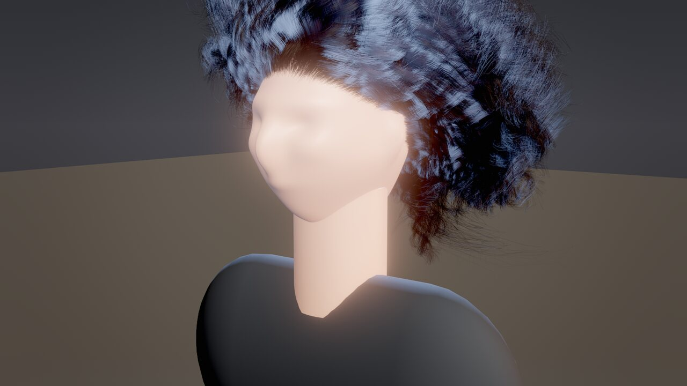 | 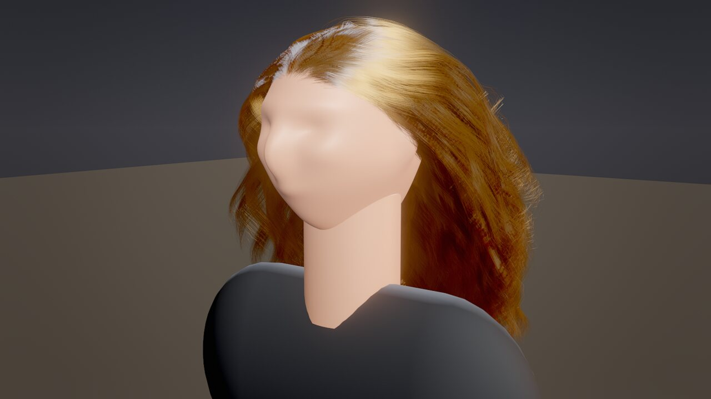 |
| 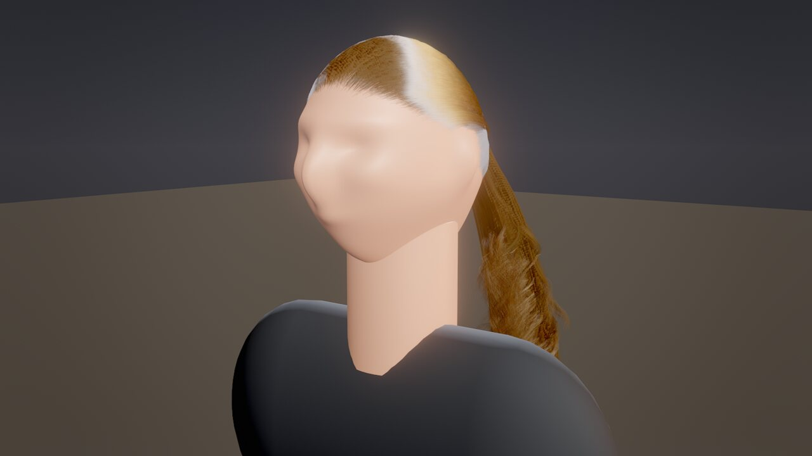 | 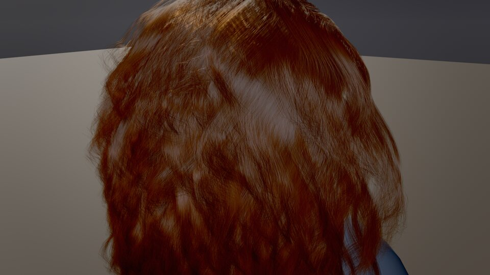 | 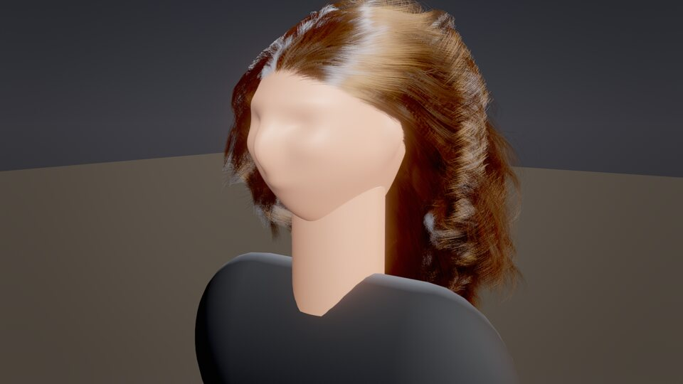 |

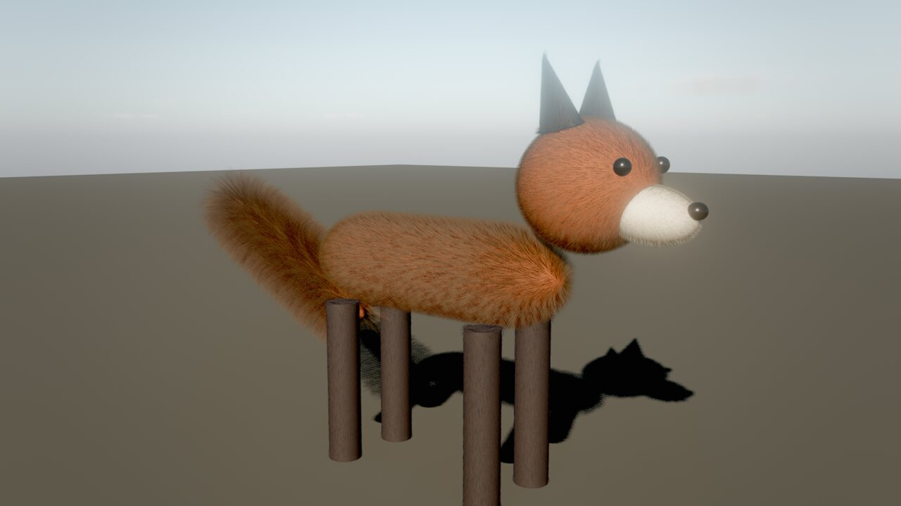

---

## Hair and fur (`groom`)

### Quick start for agents

```jsonc
// A head of wavy auburn hair on an entity with a mesh (a sphere head works too).
groom_create {"entity": "Head", "preset": "hair_wavy", "overrides": {"melanin": 0.5, "redness": 0.6}}
// Change the style; geometry fields regenerate, color/motion fields apply instantly.
groom_update {"entity": "Head", "fields": {"curlRadius": 0.01, "curlFrequency": 16, "length": 0.3}}
// Strand / guide / point counts, memory and the measured GPU cost.
groom_info   {"entity": "Head"}
// Rest pose to a file for DCC round trips (.hair, .groom.json, .skygroom).
groom_export {"entity": "Head", "path": "grooms/head.hair"}
```

Presets: `hair_straight`, `hair_wavy`, `hair_curly`, `hair_ponytail`, `hair_short` (heads: they
grow on the upper back of the mesh), `fur_short`, `fur_long` (cover the whole mesh), and for
rigged characters `hair_scalp`, `beard`, `eyebrows`, `fur_dense`. On a rigged mesh the roots
ride the animated skin and strands collide with capsules fitted to the skeleton: see
[CHARACTERS.md](CHARACTERS.md#hair-and-fur-on-animated-characters).

### How a groom is built

1. **Placement.** Roots are sampled area-weighted on the mesh (the entity's own mesh, or
   `target`'s). The density mask combines a cone (`maskDirection`, `maskAngle`,
   `maskSoftness` = hairline width) with an optional vertex-color channel (`maskChannel`), so
   a painted scalp works. Vertex colors also tint a mesh's surface, so the usual setup is an
   invisible copy of the head with the painted scalp as `target` (see the bust in
   `media/demo/hair_vfx.py`).
2. **Guides** (`guides`, default ~4·√strands) are grown along the surface: from the normal
   toward the comb `direction` projected onto the scalp (`directionBlend`), drooping with
   `gravity`, and kept outside the actual mesh (nearest-vertex tangent planes) so long hair
   drapes over the head. `ponytail` combs every guide to `ponytailPosition` first, then lets
   them hang as one bundle.
3. **Children** (`strands`) interpolate their 3 nearest guides (inverse-distance weights) and
   add, in the guide curve's parallel-transport frame: clumping toward clump centers
   (`clumps`, `clumpStrength`, `clumpShape`), helical curls (`curlRadius`, `curlFrequency`),
   waves (`wave`, `waveFrequency`) and frizz (`frizz`, `frizzScale`). Strands in one clump
   share their curl phase, so curly hair forms ringlets.
4. The result is cached per parameter hash (geometry fields, mesh, entity scale, source file
   time). Generation is deterministic and multi-threaded (~0.3–0.7 s for 100k strands).

Grooms are generated in **meters** on the scaled mesh: an entity scaled to head size does not
shrink its hair. Lengths are in meters, widths in millimeters (human hair 0.05–0.1 mm).

### Files

| Format | Notes |
|---|---|
| `.hair` | Cem Yuksel's HAIR format (binary): segments, points, thickness arrays. Many public groom datasets and DCC exporters use it. |
| `.groom.json` | `{"format":"skywalker-groom","version":1,"strands":[[x,y,z,...],...],"widths":[mm,...]?}` |
| `.skygroom` | `SKYGROOM` magic, u32 version (1), u32 strands, u32 points per strand, u32 flags (bit 0: widths), then floats. |

Set `source` to load one (`importScale` 0.01 for centimeters, `importZUp` for Z-up files);
`strands` then caps the count (a uniform subset). Imported strands keep their exact shape; a
subset becomes the simulated guides.

### Simulation

Guides are simulated on the GPU every frame (one thread per guide, substeps at 120 Hz):
Verlet integration with gravity and gusting environment wind (`wind`), global shape stiffness
toward the groomed pose (strong at the roots, `rootStiffness`), local shape stiffness (each
segment keeps its rest angle relative to its parent, `stiffness`), follow-the-leader length
constraints (inextensible strands) and collisions with spheres, capsules and planes: the
scalp's own proxy plus `colliders` (comma-separated entity names, e.g. `"Torso, Neck"`).
Children follow their guides through the stored frame offsets. `simulate: false` keeps the
groomed shape (it still follows the entity's transform).

### Shading and rendering

- **Strands**: every strand is an instanced triangle strip expanded to a camera-facing ribbon.
  Strands thinner than a pixel are drawn ~1 px wide with proportionally lower coverage; the
  coverage becomes a stochastic MSAA sample mask that changes every frame and sub-sample, so
  thin hair resolves smoothly under TAA and in accumulated stills (no sorting needed).
- **Marschner BSDF** (Karis 2016 real-time fit): R (white primary highlight, shifted by
  `cuticleTilt`), TT (light through the strand: backlit glow) and TRT (colored secondary
  highlight) lobes with longitudinal Gaussians (`roughness`) and azimuthal terms
  (`radialRoughness`), plus a multiple-scattering term (`scatter`) that tints light which went
  through many strands.
- **Color is physically based**: `melanin` (eumelanin + pheomelanin amount) and `redness`
  give an absorption coefficient (d'Eon / Chiang); `dye`, `rootColor` and `tipColor` add
  absorption, so dyed hair keeps a white highlight. Melanin guide: 0.1 platinum, 0.2 blond,
  0.35 dark blond, 0.5 light brown, 0.7 brown, 0.85 dark brown, 0.95+ black.
- **Self-shadowing**: a deep opacity map per groom from the sun (front hair depth + 4
  cumulative density layers, 512²), plus the depth of the opaque meshes around the groom (the
  head shadows the hair). Light through light hair is tinted (dual-scattering approximation).
  External occluders come from the regular cascades, looked up at the groom's sun-facing
  surface so hair is not shadowed twice.
- **Shadows on the scene**: hair is drawn into the sun cascades with stochastic coverage, so
  the face and shoulders get soft hair shadows.
- **G-buffer**: hair writes albedo, its shading normal and a hair flag; screen-space GI,
  reflections and SSAO leave those pixels alone (hair has its own ambient and occlusion).
- **Level of detail**: `lod: auto` draws strands up close and cards far away (`cardsBelow`
  pixels: guide strands as wide ribbons with procedural strand alpha); in real time the strand
  count follows the groom's size on screen (fewer, more opaque strands), while stills
  (`viewport_capture` with `samples` > 1) always draw every strand.

### Recipes

| Look | Settings |
|---|---|
| Long glossy black hair | `hair_straight`, `melanin` 0.97, `roughness` 0.22, `length` 0.5, `stiffness` 0.3 |
| Beach waves, sun-bleached | `hair_wavy`, `melanin` 0.35, `tipColor` "#fff0d8", `wave` 0.018 |
| Tight curls / coils | `hair_curly`, `curlRadius` 0.006, `curlFrequency` 30, `clumps` 2000, `segments` 31 |
| Copper red | `melanin` 0.5, `redness` 0.9 |
| Pastel dye | `melanin` 0.15, `dye` "#ffb0d8" |
| Dark roots, blond lengths | `melanin` 0.2, `rootColor` "#5a4030" |
| Ponytail | `hair_ponytail`; move `ponytailPosition` (mesh space, just outside the scalp) |
| Buzz cut / stubble | `hair_short`, `length` 0.006–0.02, `simulate` false |
| Cat / fox fur | `fur_short`, `strands` 150k–300k, `length` 0.015–0.03, `direction` toward the tail, body mesh color close to the fur color |
| Fluffy tail | `fur_long` on a capsule, `length` 0.08–0.12, `tipColor` "#ffffff" |
| Hair in the wind | `environment_update {windSpeed: 6}`; `wind` on the groom scales it |
| Hair over shoulders | `colliders: "Torso, Neck"` |

---

## GPU particles (`particles` with `simulation: "gpu"`)

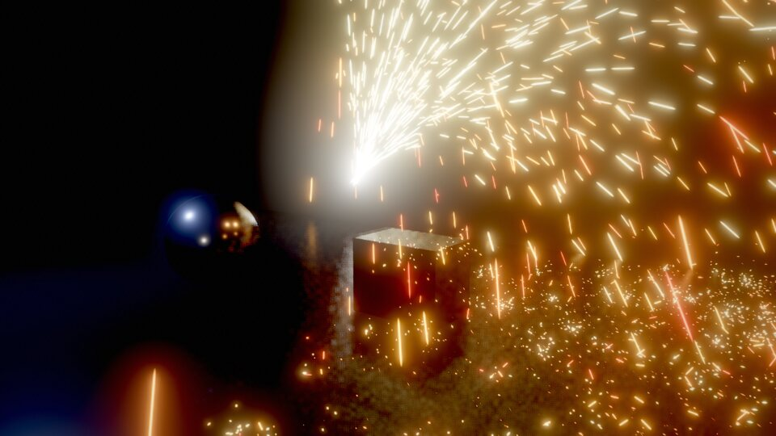

| | | |
|---|---|---|
| 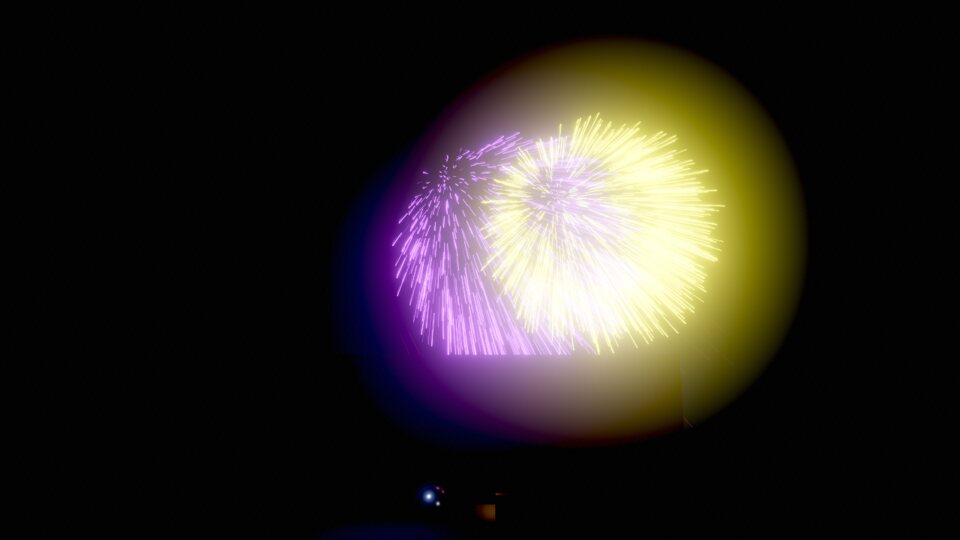 | 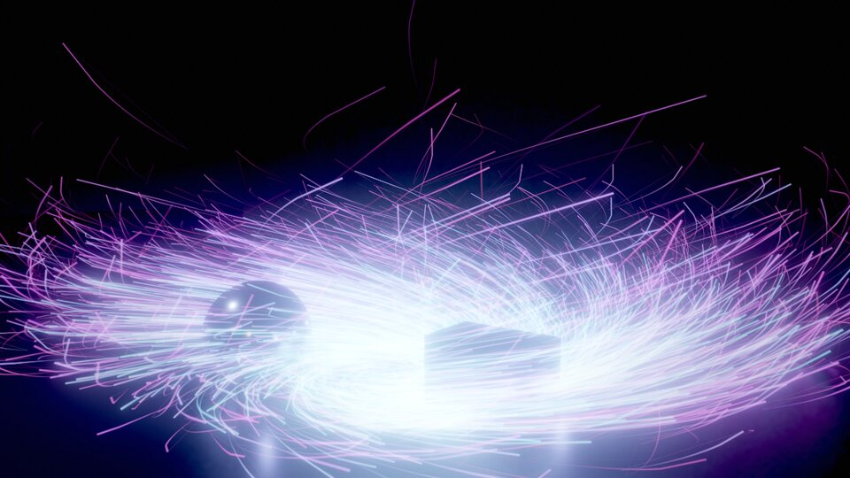 | 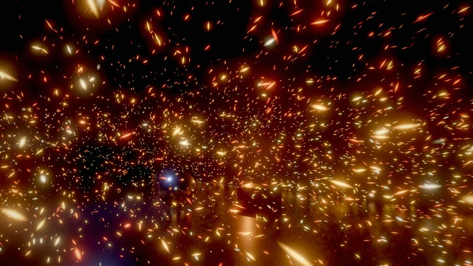 |
| 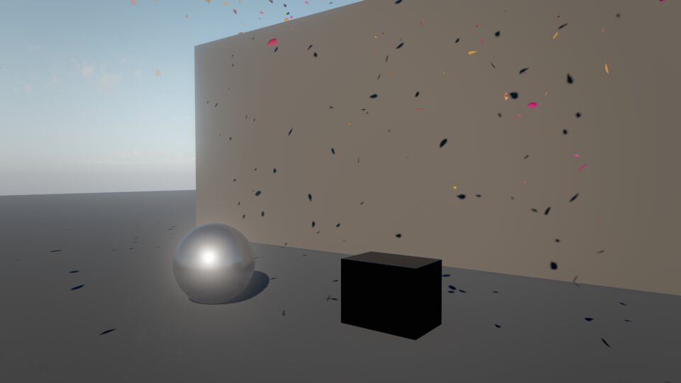 | 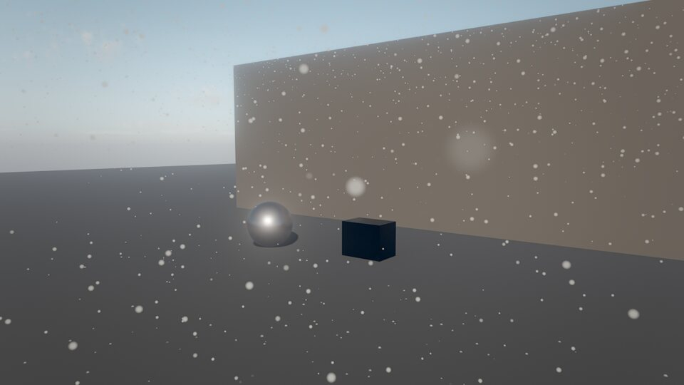 | 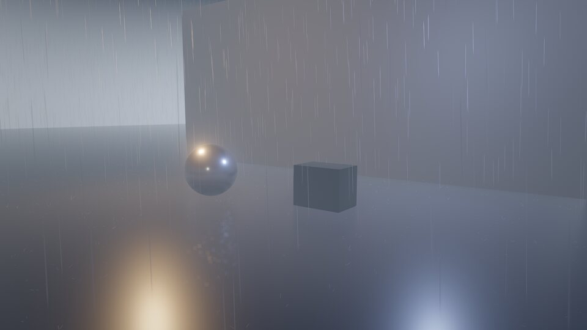 |

The CPU particle path stays the deterministic gameplay simulation (countable, replayable). The
GPU path is for visuals: same component, same looks, plus:

| Feature | Fields |
|---|---|
| Emission | `rate` (up to millions/s), `burst`, `fx_burst` / Wander `burst()`; shapes `point`, `sphere`, `box`, `disc`, `cone`, `mesh` (area-weighted surface of `shapeMesh` or the entity's mesh; particles leave along the normal) |
| Forces | gravity, drag toward the moving air, environment `wind`, **curl noise** (`turbulence`, `turbulenceScale`: 2 octaves of analytic gradient-noise curl, divergence free), force `field`: `vortex` (swirl around `fieldAxis` with `fieldPull` / `fieldLift`), `attractor`, or `texture` (a 3D vector field from an `.fga` file over `fieldSize`) |
| Collisions | `collide` floor plane, `colliders` (entity names: spheres, planes, capsules), **`depthCollision`**: everything visible collides through the scene depth and G-buffer normals. Response: `bounce` (+ `friction`), `stick`, or die |
| Sub-emitters | `subEmitter` (another gpu emitter by name), `subEmitOn` `death` / `collision` / `both`, `subEmitCount`, `subEmitInherit`. Requests are passed on the GPU in the same frame (sparks → embers, rockets → bursts, rain → splashes); `hueVariation` gives each burst its own color |
| Curves | `colorGradient` (`"#rrggbbaa@t ..."`), `sizeCurve`, `opacityCurve` (`"value@t ..."`), baked into 32-entry tables |
| Facing | `camera`, `velocity` (stretched by `stretch`), `horizontal` (ripples, decals), `ribbon` (trails from a per-particle history ring: `trailLength`, `trailSegments`), `mesh` (instanced meshes lit by the standard surface shader and casting shadows: `mesh` = primitive, asset or built-in `fx:leaf`, `fx:shard`, `fx:pebble`; `roughness`, `metallic`) |
| Looks | `glow`, `flame`, `smoke`, `spark`, `rain`, `snow`, `mist` and `sprite` (`texture` sheet with `flipbookColumns` / `flipbookRows` / `flipbookFps`; neighbouring frames cross-fade). Lit looks receive the sun with shadows, the sky and the strongest lights; soft against geometry; premultiplied alpha |
| Sorting | blended looks are sorted back to front on the GPU (bitonic sort; `sort: false` to skip) |
| Light | `light` > 0: the GPU reduces the live particles to up to 4 clustered point lights, read back asynchronously (a frame or two late, never stalling) |
| TAA | particles write a reactive mask; the temporal resolve trusts the current frame there, so fast sparks and rain don't leave ghost trails |

Pipeline per emitter and frame: emit (dead list → alive list) → simulate (indirect dispatch on
the GPU alive count) → finalize (indirect draw arguments) → optional sort and light reduction.
Pools, lists and counters live on the GPU; nothing is allocated per frame.

### Presets (`fx_create`)

Single emitters: `ember_storm`, `magic_vortex`, `dust_storm`, `falling_leaves` (place ~6 m up),
`snow_heavy` (place ~12 m up), `smoke_column_gpu`, and building blocks `sparks_gpu`, `embers_gpu`,
`rain_gpu`, `splashes_gpu`, `rockets_gpu`, `firework_burst_gpu`, `mist_gpu`, `droplets_gpu`.
Composites (wired with sub-emitters): `sparks_shower`, `fireworks`, `rain_heavy`,
`waterfall_mist`.

### Recipes

| Effect | How |
|---|---|
| Grinder sparks bouncing off props | `sparks_shower` near the props (depth collision is on); aim with the Sparks child's `direction` |
| Tornado | `magic_vortex` with `look` `smoke`, `facing` `camera`, `fieldLift` 3, `colorStart` dust brown, `rate` 4000 |
| Paint splatter that sticks | `stick: true`, `depthCollision: true`, `look` `glow` small `sizeStart` |
| Leaves blowing past | `falling_leaves` 6 m up, `environment_update {windSpeed: 5}` |
| Rain with splashes on roofs | `rain_heavy` (splashes come from depth collisions anywhere) |
| Magic trail on a moving object | parent a gpu emitter with `facing: ribbon`, `worldSpace: true` to the object |
| Particles shaped like a mesh | `shape: mesh`, `shapeMesh: "asset:..."`, low `speed` |
| Vector field from Houdini / EmberGen | `field: texture`, `fieldTexture: "fx/wind.fga"`, `fieldSize` = the exported box |
| Flipbook explosion | `look: sprite`, `texture` = sheet, `flipbookColumns`/`Rows`, `intensity` > 1 for emissive |

---

## Performance (Apple M1 Pro, 1920×1080, `fx_benchmark` serial mode)

`fx_benchmark` renders frames back to back and reports the GPU time of the frame and of each
effects pass (`serial: true` waits per frame, so per-pass times don't overlap). Baseline: the
stage scene (floor, props, sky, TAA, GI/SSR, bloom) costs **7.4 ms** per frame.

| Workload | Frame (GPU) | Simulation |
|---|---|---|
| 1,000,000 GPU particles, additive glow, curl noise | 16.2 ms (+8.8 ms) | 3.0 ms |
| 1,000,000 GPU particles, lit smoke, GPU bitonic sort | 38.1 ms (+30.7 ms, fill rate) | 8.4 ms incl. sort |
| 100k-strand groom × 25 points, close-up filling the screen (49k strands drawn) | 28.8 ms (+21.4 ms) | 1.4 ms + 6.7 ms deep opacity |
| same groom, medium shot (20k strands drawn) | 17.5 ms (+10.1 ms) | 0.7 ms + 4.1 ms deep opacity |

Stills (`samples` 16–32) draw every strand. `groom_info` and `fx_stats` report these numbers
live for a scene; budget hair with `strands`, `segments` and the LOD fields.

## Limits and next steps

- GPU particles are visual only (not deterministic, not visible to gameplay); use the CPU path
  for anything a game rule depends on.
- Depth collisions only see what is on screen (the previous frame's depth): particles behind
  objects or off screen fall through.
- Hair has no strand-strand collisions (the shape stiffness keeps volume) and collides only
  with sphere/capsule/plane proxies.
- One sub-emitter per emitter; a sub-emitter's own sub-emitter chain works up to 4 levels.
- The deep opacity map covers the sun only; lamps light hair without self-shadowing.
- Skin uses the pre-integrated `skin` material model ([CHARACTERS.md](CHARACTERS.md#material-models-skin-eye-cloth-hair_card)),
  not a screen-space diffusion pass.
