<!-- Generated by website/scripts/gen_reference.py from website/data. Do not edit: regenerate. -->

# Examples

24 sample projects ship in [`examples/`](https://github.com/amirhossein-razlighi/Skywalker/blob/main/examples). Most were built by agent crews through the engine's own tools, and every one is original: its own world, characters and story. Open any of them in the editor, render it from the command line, play it in the standalone player, or point an agent at it.

<div class="sky-grid">
<a class="sky-card" href="#tidebreak_isle"><div class="sky-card__body"><p class="sky-card__title">Tidebreak Isle</p><p class="sky-card__meta">Open-world Island Adventure</p><p class="sky-card__text">The storm left you one ship, one map and a cove nobody charts. Make landfall before dark.</p><div class="sky-tags"><span class="sky-tag">Eroded terrain</span><span class="sky-tag">FFT surf</span><span class="sky-tag">Sequences</span><span class="sky-tag">Terrain</span><span class="sky-tag">Foliage</span><span class="sky-tag">FFT water</span></div></div></a>
<a class="sky-card" href="#neon_requiem">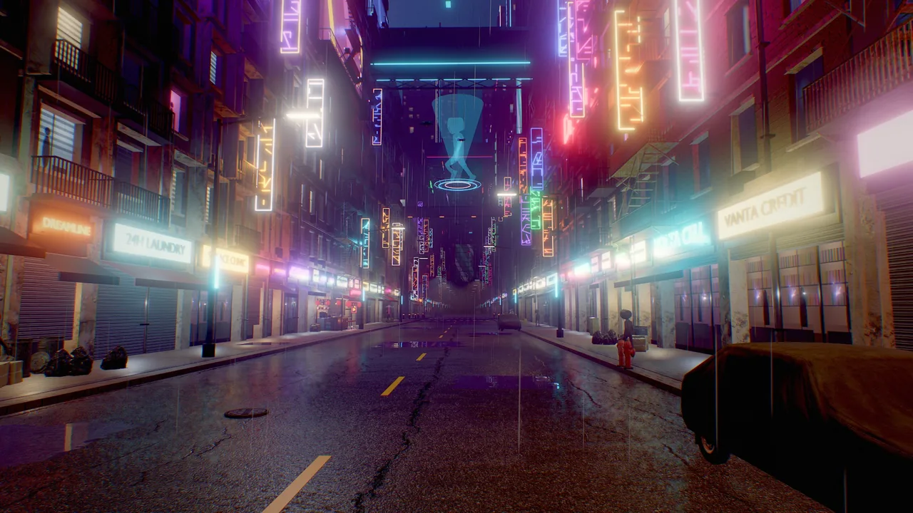<div class="sky-card__body"><p class="sky-card__title">Neon Requiem</p><p class="sky-card__meta">Open-world Neo-noir RPG</p><p class="sky-card__text">Halcyon Avenue never sleeps. It just stops remembering.</p><div class="sky-tags"><span class="sky-tag">Clustered lights</span><span class="sky-tag">Rain and puddles</span><span class="sky-tag">Skinned characters</span><span class="sky-tag">FFT water</span><span class="sky-tag">Fluid fire and smoke</span><span class="sky-tag">Particles</span></div></div></a>
<a class="sky-card" href="#ashen_peaks">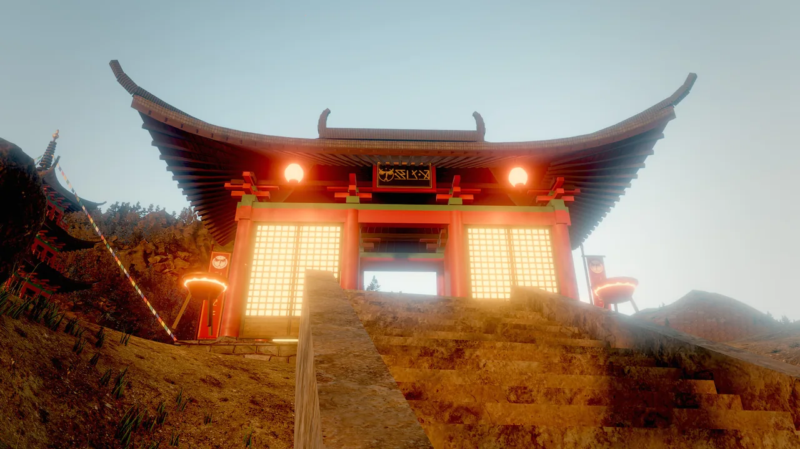<div class="sky-card__body"><p class="sky-card__title">Ashen Peaks</p><p class="sky-card__meta">Mythic Action-Adventure</p><p class="sky-card__text">Nine hundred steps to the Kindled Crane. The lanterns have not gone out in a thousand years.</p><div class="sky-tags"><span class="sky-tag">Eroded terrain</span><span class="sky-tag">Impostor forests</span><span class="sky-tag">Light shafts</span><span class="sky-tag">Terrain</span><span class="sky-tag">Foliage</span><span class="sky-tag">FFT water</span></div></div></a>
<a class="sky-card" href="#berrybrook">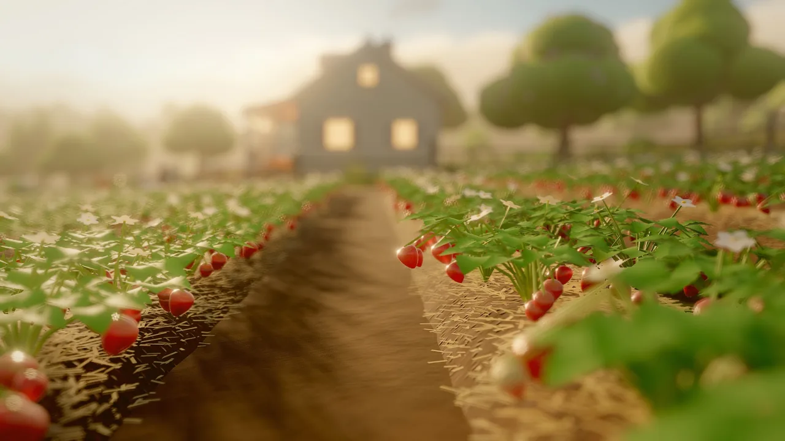<div class="sky-card__body"><p class="sky-card__title">Berrybrook</p><p class="sky-card__meta">Cozy Farming Life Sim</p><p class="sky-card__text">Grandma's berry farm is yours now. Plant a row, mind the hens, and sell the sweetest strawberries on the hill.</p><div class="sky-tags"><span class="sky-tag">Farming gameplay</span><span class="sky-tag">UI hotbar</span><span class="sky-tag">Tilt-shift lens</span><span class="sky-tag">Terrain</span><span class="sky-tag">Foliage</span><span class="sky-tag">FFT water</span></div></div></a>
<a class="sky-card" href="#meridian_accord">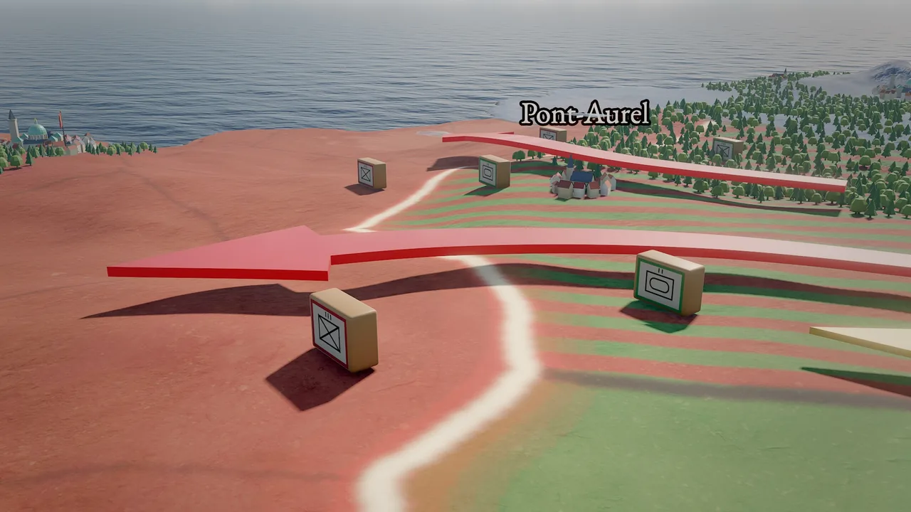<div class="sky-card__body"><p class="sky-card__title">Meridian Accord</p><p class="sky-card__meta">Grand Strategy · Map Wargame</p><p class="sky-card__text">Ten nations, one inland sea, and an accord that will not survive the spring of '37.</p><div class="sky-tags"><span class="sky-tag">Map overlay</span><span class="sky-tag">Clouds below the camera</span><span class="sky-tag">UI</span><span class="sky-tag">Terrain</span><span class="sky-tag">Foliage</span><span class="sky-tag">FFT water</span></div></div></a>
<a class="sky-card" href="#gloamwater">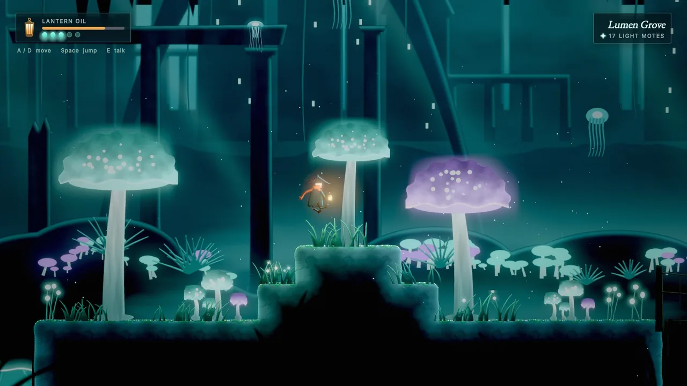<div class="sky-card__body"><p class="sky-card__title">Gloamwater</p><p class="sky-card__meta">Metroidvania · 2D Action-Adventure</p><p class="sky-card__text">Carry the last lantern down into a drowned kingdom where the light went to sleep.</p><div class="sky-tags"><span class="sky-tag">Painted parallax</span><span class="sky-tag">2D camera</span><span class="sky-tag">Particles</span><span class="sky-tag">Sprites</span><span class="sky-tag">Tilemaps</span><span class="sky-tag">2D lights</span></div></div></a>
<a class="sky-card" href="#chancellors_desk">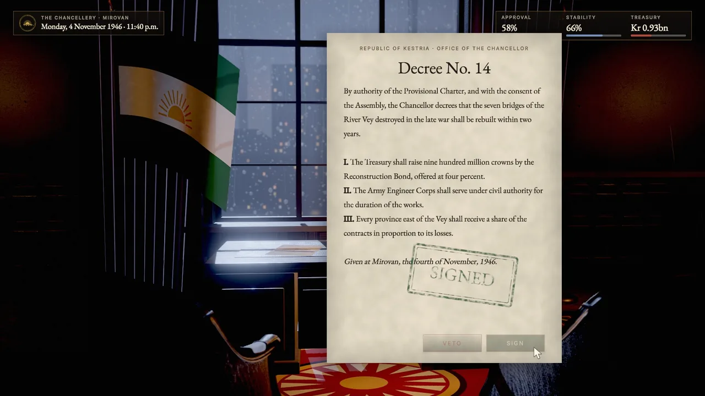<div class="sky-card__body"><p class="sky-card__title">The Chancellor's Desk</p><p class="sky-card__meta">Narrative Political Drama</p><p class="sky-card__text">One desk. One rainy night. The republic is three weeks old and the pen is in your hand.</p><div class="sky-tags"><span class="sky-tag">Document UI</span><span class="sky-tag">Branching dialogue</span><span class="sky-tag">Particles</span><span class="sky-tag">UI</span><span class="sky-tag">Dialogue</span><span class="sky-tag">Sequences</span></div></div></a>
<a class="sky-card" href="#smugglers_cove"><div class="sky-placeholder"><strong>Render on first build</strong>This project downloads its CC0 assets on first build</div><div class="sky-card__body"><p class="sky-card__title">Smuggler's Cove</p><p class="sky-card__meta">Pirate Adventure</p><p class="sky-card__text">The galleon is in. The tide won't wait. Neither will the Navy.</p><div class="sky-tags"><span class="sky-tag">Photoscanned assets</span><span class="sky-tag">FFT ocean</span><span class="sky-tag">Volumetric fire</span><span class="sky-tag">FFT water</span><span class="sky-tag">Fluid fire and smoke</span><span class="sky-tag">Particles</span></div></div></a>
<a class="sky-card" href="#hidden_alley"><div class="sky-placeholder"><strong>Render on first build</strong>This project downloads its CC0 assets on first build</div><div class="sky-card__body"><p class="sky-card__title">Hidden Alley</p><p class="sky-card__meta">Neo-noir Stealth</p><p class="sky-card__text">Somebody left the lights on. Somebody always does.</p><div class="sky-tags"><span class="sky-tag">Photoscanned assets</span><span class="sky-tag">Puddles</span><span class="sky-tag">FFT water</span><span class="sky-tag">Fluid fire and smoke</span><span class="sky-tag">Particles</span><span class="sky-tag">Wander</span></div></div></a>
<a class="sky-card" href="#namaqua_canyon"><div class="sky-placeholder"><strong>Render on first build</strong>This project downloads its CC0 assets on first build</div><div class="sky-card__body"><p class="sky-card__title">Namaqua Canyon</p><p class="sky-card__meta">Open-world Survival</p><p class="sky-card__text">Water's low, the jeep's covered, and the sun is going down fast.</p><div class="sky-tags"><span class="sky-tag">Photoscanned assets</span><span class="sky-tag">Volumetric fire</span><span class="sky-tag">Fluid fire and smoke</span><span class="sky-tag">Particles</span><span class="sky-tag">Wander</span><span class="sky-tag">HDRI sky</span></div></div></a>
<a class="sky-card" href="#abyss">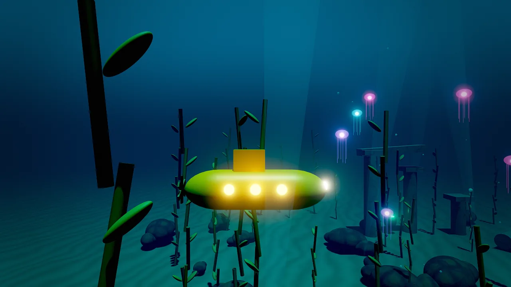<div class="sky-card__body"><p class="sky-card__title">Abyss</p><p class="sky-card__meta">Underwater Horror</p><p class="sky-card__text">Three hundred meters down, something else has a light.</p><div class="sky-tags"><span class="sky-tag">Wander</span></div></div></a>
<a class="sky-card" href="#cyber_alley">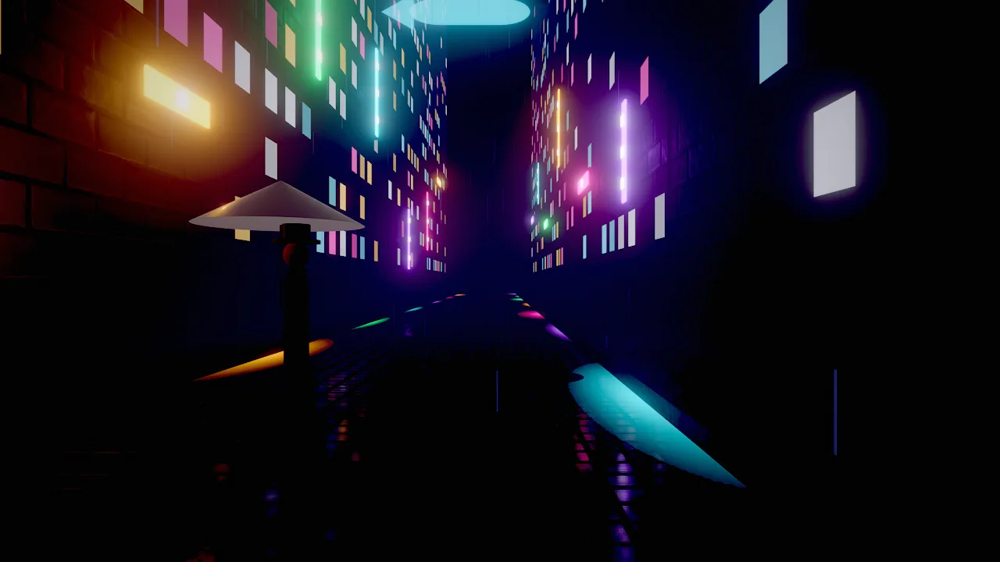<div class="sky-card__body"><p class="sky-card__title">Cyber Alley</p><p class="sky-card__meta">Neo-Noir Adventure</p><p class="sky-card__text">It always rains in the lower city. Someone's waiting under the sign.</p><div class="sky-tags"><span class="sky-tag">Neon</span><span class="sky-tag">Wander</span></div></div></a>
<a class="sky-card" href="#frostlight">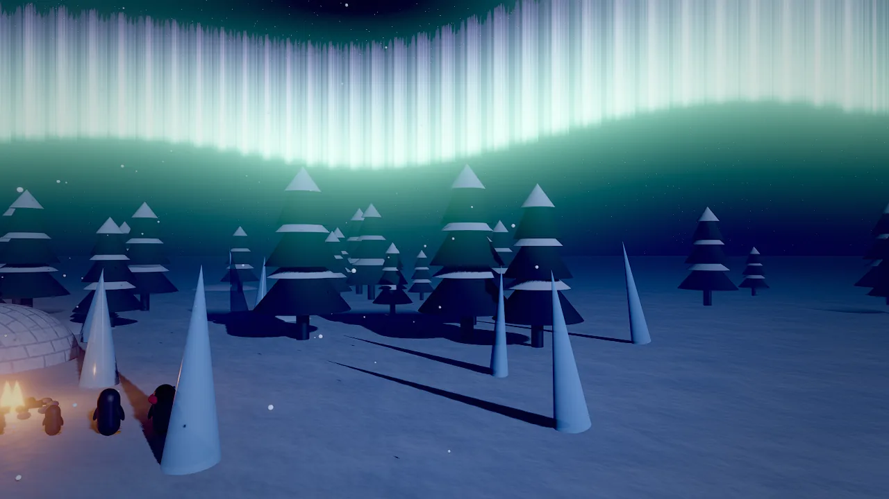<div class="sky-card__body"><p class="sky-card__title">Frostlight</p><p class="sky-card__meta">Cozy Exploration</p><p class="sky-card__text">Under the aurora, the penguins are going home.</p><div class="sky-tags"><span class="sky-tag">Wander</span></div></div></a>
<a class="sky-card" href="#harvest_fair">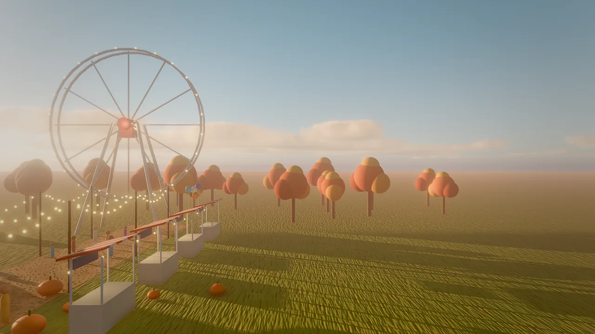<div class="sky-card__body"><p class="sky-card__title">Harvest Fair</p><p class="sky-card__meta">Family · Park Builder</p><p class="sky-card__text">Golden hour, cotton candy, one more ride.</p><div class="sky-tags"><span class="sky-tag">Wander</span><span class="sky-tag">Atmosphere</span><span class="sky-tag">Volumetric clouds</span></div></div></a>
<a class="sky-card" href="#hearthside">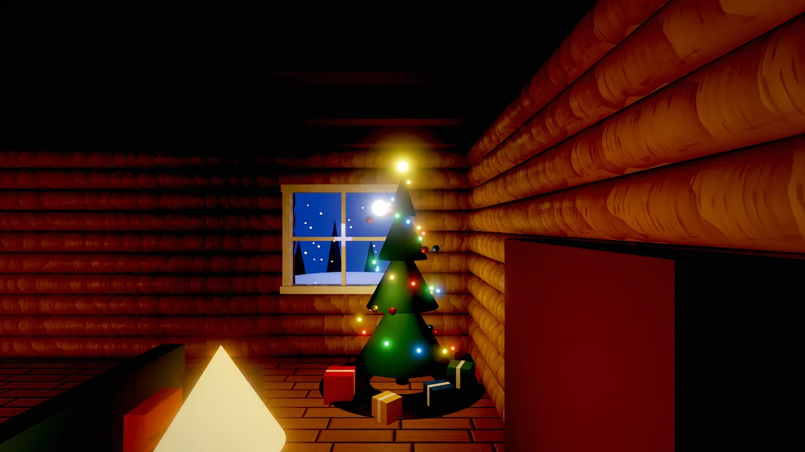<div class="sky-card__body"><p class="sky-card__title">Hearthside</p><p class="sky-card__meta">Cozy Life Sim</p><p class="sky-card__text">Snow outside. Fire inside. Everyone's home.</p><div class="sky-tags"><span class="sky-tag">Wander</span></div></div></a>
<a class="sky-card" href="#hollow_manor">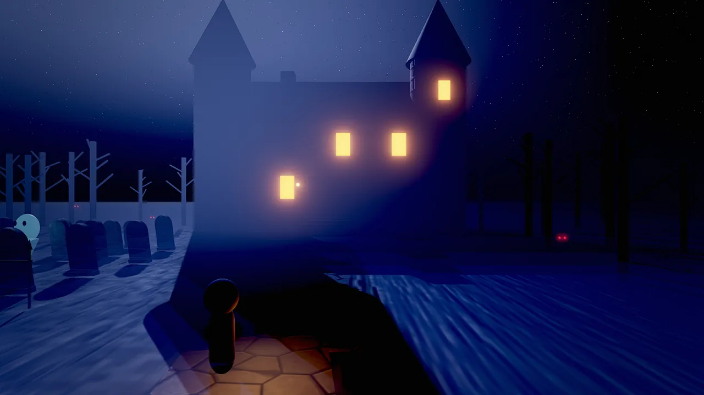<div class="sky-card__body"><p class="sky-card__title">Hollow Manor</p><p class="sky-card__meta">Horror · Exploration</p><p class="sky-card__text">A lantern in the fog, and a manor that should be empty.</p><div class="sky-tags"><span class="sky-tag">Fog</span><span class="sky-tag">Wander</span></div></div></a>
<a class="sky-card" href="#zen_garden">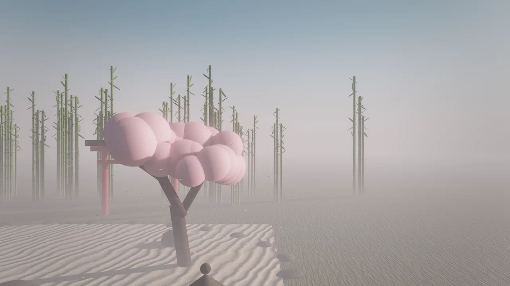<div class="sky-card__body"><p class="sky-card__title">Zen Garden</p><p class="sky-card__meta">Meditative · Art Game</p><p class="sky-card__text">Rake the sand. Feed the koi. Let the petals fall.</p><div class="sky-tags"><span class="sky-tag">Wander</span><span class="sky-tag">Atmosphere</span><span class="sky-tag">Volumetric clouds</span></div></div></a>
<a class="sky-card" href="#toy_kart_rally">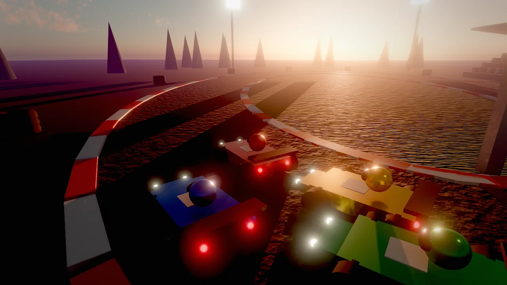<div class="sky-card__body"><p class="sky-card__title">Toy Kart Rally</p><p class="sky-card__meta">Kart Racing</p><p class="sky-card__text">Four karts, one oval, and a crowd that wants fireworks.</p><div class="sky-tags"><span class="sky-tag">Wander</span><span class="sky-tag">Atmosphere</span></div></div></a>
<a class="sky-card" href="#star_lancer">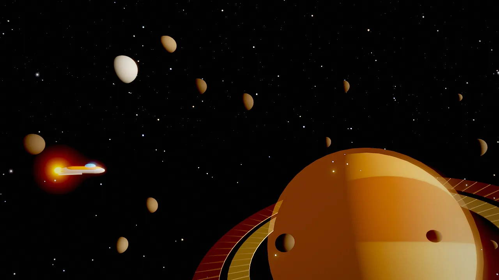<div class="sky-card__body"><p class="sky-card__title">Star Lancer</p><p class="sky-card__meta">Space Shoot 'em Up</p><p class="sky-card__text">Hold the line above the ringed giant.</p><div class="sky-tags"><span class="sky-tag">Wander</span></div></div></a>
<a class="sky-card" href="#neon_drift">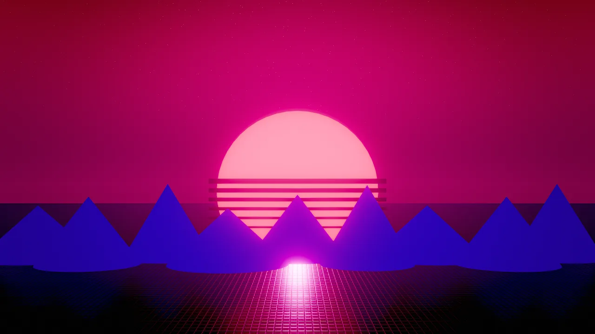<div class="sky-card__body"><p class="sky-card__title">Neon Drift</p><p class="sky-card__meta">Arena Shooter</p><p class="sky-card__text">One ship. Endless drones. Don't stop moving.</p><div class="sky-tags"><span class="sky-tag">Neon</span><span class="sky-tag">Wander</span></div></div></a>
<a class="sky-card" href="#cloudhopper">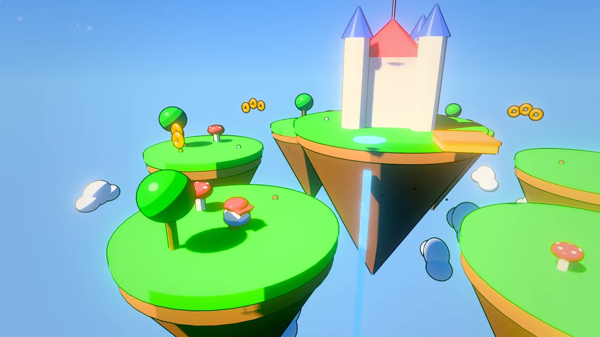<div class="sky-card__body"><p class="sky-card__title">Cloudhopper</p><p class="sky-card__meta">3D Platformer</p><p class="sky-card__text">Six islands, one bouncy hero, every coin in the sky.</p><div class="sky-tags"><span class="sky-tag">Wander</span><span class="sky-tag">Volumetric clouds</span></div></div></a>
<a class="sky-card" href="#sky_dash">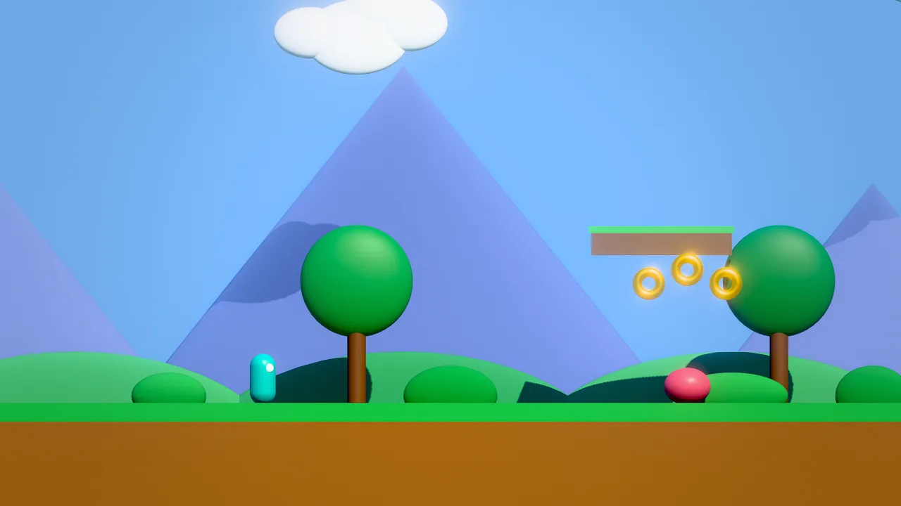<div class="sky-card__body"><p class="sky-card__title">Sky Dash</p><p class="sky-card__meta">2D Platformer</p><p class="sky-card__text">Run, hop, grab every coin. Same engine, two dimensions.</p><div class="sky-tags"><span class="sky-tag">Shipping</span><span class="sky-tag">Wander</span></div></div></a>
<a class="sky-card" href="#sky_village">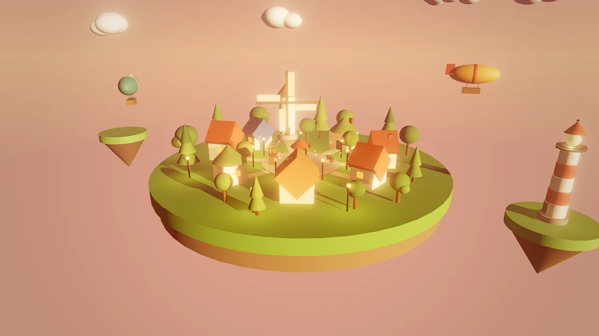<div class="sky-card__body"><p class="sky-card__title">Sky Village</p><p class="sky-card__meta">Diorama</p><p class="sky-card__text">A floating village above the clouds.</p><div class="sky-tags"><span class="sky-tag">Wander</span></div></div></a>
<a class="sky-card" href="#hello_sky">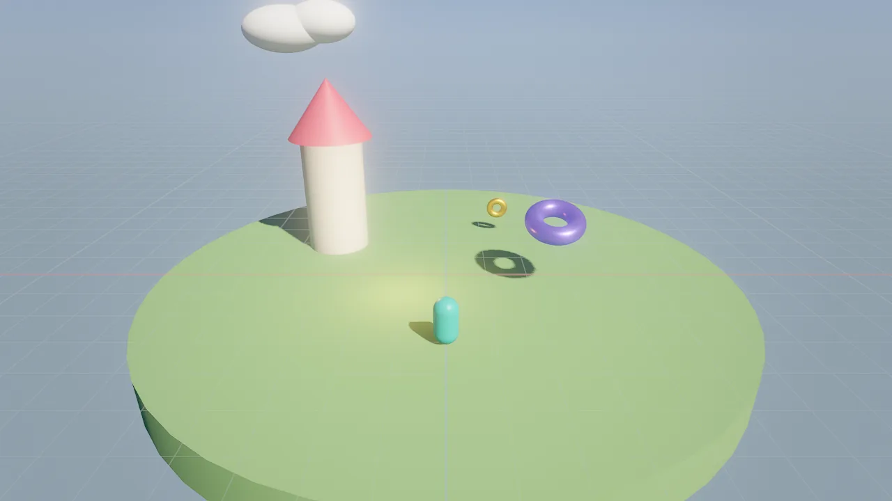<div class="sky-card__body"><p class="sky-card__title">Hello Sky</p><p class="sky-card__meta">Starter scene</p><p class="sky-card__text">The smallest scene that shows the loop.</p><div class="sky-tags"><span class="sky-tag">Wander</span></div></div></a>
</div>

## Tidebreak Isle { #tidebreak_isle }

<video controls muted loop playsinline preload="none" poster="../assets/images/shots/tidebreak_isle/brig.webp"><source src="../assets/video/tidebreak_isle/establishing.mp4" type="video/mp4"></video>

*Open-world Island Adventure* · The storm left you one ship, one map and a cove nobody charts. Make landfall before dark.

An island cove at golden hour, built by an agent crew with the engine's own tools. An erosion-sculpted island with wet sand where the swash reaches, an FFT sea that shoals over the seabed, instanced palms and dune grass, a fort, a brig at anchor and a campfire with volumetric fire. Its hero camera moves ship as sequences, ready for the movie render queue.

| | |
|---|---|
| Folder | [`examples/tidebreak_isle`](https://github.com/amirhossein-razlighi/Skywalker/blob/main/examples/tidebreak_isle) |
| Scenes | `scenes/main.sky.json` |
| Size | 241 entities, 33 behaviors |
| Demonstrates | Eroded terrain, FFT surf, Sequences, Terrain, Foliage, FFT water, Fluid fire and smoke, Particles, Wander, Atmosphere, Volumetric clouds |
| Assets | Poly Haven (CC0), Blender procedural (Skywalker DCC) |

=== "Editor"

    ```bash
    open build/release/bin/Skywalker.app --args --project "$PWD/examples/tidebreak_isle"
    ```

=== "Render a still"

    ```bash
    skywalker render examples/tidebreak_isle/scenes/main.sky.json -o tidebreak_isle.png --scene-camera --samples 8
    ```

=== "Play it"

    ```bash
    skywalker-player examples/tidebreak_isle
    ```

=== "Agent"

    ```bash
    skywalker mcp --project examples/tidebreak_isle --scene scenes/main.sky.json
    ```

## Neon Requiem { #neon_requiem }

<video controls muted loop playsinline preload="none" poster="../assets/images/shots/neon_requiem/avenue_dolly.webp"><source src="../assets/video/neon_requiem/avenue_dolly.mp4" type="video/mp4"></video>

*Open-world Neo-noir RPG* · Halcyon Avenue never sleeps. It just stops remembering.

A rain-soaked neon avenue at midnight with nearly six hundred lights evaluated by clustered lighting, reflective puddles, a monorail, holograms and animated pedestrians (a CC-BY glTF sample character). The city kit was generated in Blender through the DCC bridge.

| | |
|---|---|
| Folder | [`examples/neon_requiem`](https://github.com/amirhossein-razlighi/Skywalker/blob/main/examples/neon_requiem) |
| Scenes | `scenes/main.sky.json` |
| Size | 4291 entities, 57 behaviors |
| Demonstrates | Clustered lights, Rain and puddles, Skinned characters, FFT water, Fluid fire and smoke, Particles, Skeletal animation, Sequences, Wander |
| Assets | Poly Haven (CC0), Khronos glTF sample CesiumMan (CC-BY 4.0), Blender-generated city kit |

=== "Editor"

    ```bash
    open build/release/bin/Skywalker.app --args --project "$PWD/examples/neon_requiem"
    ```

=== "Render a still"

    ```bash
    skywalker render examples/neon_requiem/scenes/main.sky.json -o neon_requiem.png --scene-camera --samples 8
    ```

=== "Play it"

    ```bash
    skywalker-player examples/neon_requiem
    ```

=== "Agent"

    ```bash
    skywalker mcp --project examples/neon_requiem --scene scenes/main.sky.json
    ```

## Ashen Peaks { #ashen_peaks }

<video controls muted loop playsinline preload="none" poster="../assets/images/shots/ashen_peaks/crane_gate.webp"><source src="../assets/video/ashen_peaks/establishing.mp4" type="video/mp4"></video>

*Mythic Action-Adventure* · Nine hundred steps to the Kindled Crane. The lanterns have not gone out in a thousand years.

A monastery valley at a misty sunrise: eroded alpine terrain, forests that turn into octahedral impostors in the distance, lantern-lit stairs, volumetric fires and a mirror lake. It is the scene the foliage impostor measurements in the manual come from.

| | |
|---|---|
| Folder | [`examples/ashen_peaks`](https://github.com/amirhossein-razlighi/Skywalker/blob/main/examples/ashen_peaks) |
| Scenes | `scenes/main.sky.json`, `scenes/sunset.sky.json` |
| Size | 1386 entities, 154 behaviors |
| Demonstrates | Eroded terrain, Impostor forests, Light shafts, Terrain, Foliage, FFT water, Fluid fire and smoke, Particles, Sequences, Wander, Atmosphere, Volumetric clouds |
| Assets | Poly Haven (CC0) + procedural (Blender) |

=== "Editor"

    ```bash
    open build/release/bin/Skywalker.app --args --project "$PWD/examples/ashen_peaks"
    ```

=== "Render a still"

    ```bash
    skywalker render examples/ashen_peaks/scenes/main.sky.json -o ashen_peaks.png --scene-camera --samples 8
    ```

=== "Play it"

    ```bash
    skywalker-player examples/ashen_peaks
    ```

=== "Agent"

    ```bash
    skywalker mcp --project examples/ashen_peaks --scene scenes/main.sky.json
    ```

## Berrybrook { #berrybrook }

<video controls muted loop playsinline preload="none" poster="../assets/images/shots/berrybrook/berry_rows.webp"><source src="../assets/video/berrybrook/berry_rows.mp4" type="video/mp4"></video>

*Cozy Farming Life Sim* · Grandma's berry farm is yours now. Plant a row, mind the hens, and sell the sweetest strawberries on the hill.

A cozy berry farm: plant a row, harvest ripe berries, sell them at the stand and chat with the neighbours. Terrain with painted fields, foliage, a pond, a UI with a hotbar and a dialogue, and a miniature tilt-shift camera for its establishing shot.

| | |
|---|---|
| Folder | [`examples/berrybrook`](https://github.com/amirhossein-razlighi/Skywalker/blob/main/examples/berrybrook) |
| Scenes | `scenes/main.sky.json` |
| Size | 1115 entities, 91 behaviors |
| Demonstrates | Farming gameplay, UI hotbar, Tilt-shift lens, Terrain, Foliage, FFT water, Particles, UI, World text, Dialogue, Sequences, Wander, Atmosphere, Volumetric clouds |
| Assets | Procedural (Blender via Skywalker DCC), Poly Haven (CC0) ground textures |

=== "Editor"

    ```bash
    open build/release/bin/Skywalker.app --args --project "$PWD/examples/berrybrook"
    ```

=== "Render a still"

    ```bash
    skywalker render examples/berrybrook/scenes/main.sky.json -o berrybrook.png --scene-camera --samples 8
    ```

=== "Play it"

    ```bash
    skywalker-player examples/berrybrook
    ```

=== "Agent"

    ```bash
    skywalker mcp --project examples/berrybrook --scene scenes/main.sky.json
    ```

## Meridian Accord { #meridian_accord }

<video controls muted loop playsinline preload="none" poster="../assets/images/shots/meridian_accord/front_line.webp"><source src="../assets/video/meridian_accord/above_the_clouds.mp4" type="video/mp4"></video>

*Grand Strategy · Map Wargame* · Ten nations, one inland sea, and an accord that will not survive the spring of '37.

A grand strategy map of a fictional continent: a terrain with a draped map overlay and map modes, clouds composited below the camera, nearly a hundred world-text labels, fronts and units, and a full UI with nation panels and news events.

| | |
|---|---|
| Folder | [`examples/meridian_accord`](https://github.com/amirhossein-razlighi/Skywalker/blob/main/examples/meridian_accord) |
| Scenes | `scenes/main.sky.json` |
| Size | 434 entities, 78 behaviors |
| Demonstrates | Map overlay, Clouds below the camera, UI, Terrain, Foliage, FFT water, World text, Sequences, Wander, Atmosphere, Volumetric clouds |
| Assets | Poly Haven (CC0) aerial photoscans; procedural maps, flags and art; Blender-generated miniatures |

=== "Editor"

    ```bash
    open build/release/bin/Skywalker.app --args --project "$PWD/examples/meridian_accord"
    ```

=== "Render a still"

    ```bash
    skywalker render examples/meridian_accord/scenes/main.sky.json -o meridian_accord.png --scene-camera --samples 8
    ```

=== "Play it"

    ```bash
    skywalker-player examples/meridian_accord
    ```

=== "Agent"

    ```bash
    skywalker mcp --project examples/meridian_accord --scene scenes/main.sky.json
    ```

## Gloamwater { #gloamwater }

{ loading=lazy }

*Metroidvania · 2D Action-Adventure* · Carry the last lantern down into a drowned kingdom where the light went to sleep.

A 2D metroidvania in a drowned kingdom: painted parallax layers, sprites with flipbook animation, a tilemap, 2D lights with soft shadows and halos, particles, dialogue and a UI, all rendered by the same engine as the 3D worlds.

| | |
|---|---|
| Folder | [`examples/gloamwater`](https://github.com/amirhossein-razlighi/Skywalker/blob/main/examples/gloamwater) |
| Scenes | `scenes/main.sky.json` |
| Size | 255 entities, 10 behaviors |
| Demonstrates | Painted parallax, 2D camera, Particles, Sprites, Tilemaps, 2D lights, UI, World text, Dialogue, Sequences, Wander |

=== "Editor"

    ```bash
    open build/release/bin/Skywalker.app --args --project "$PWD/examples/gloamwater"
    ```

=== "Render a still"

    ```bash
    skywalker render examples/gloamwater/scenes/main.sky.json -o gloamwater.png --scene-camera --samples 8
    ```

=== "Play it"

    ```bash
    skywalker-player examples/gloamwater
    ```

=== "Agent"

    ```bash
    skywalker mcp --project examples/gloamwater --scene scenes/main.sky.json
    ```

## The Chancellor's Desk { #chancellors_desk }

<video controls muted loop playsinline preload="none" poster="../assets/images/shots/chancellors_desk/the_decree.webp"><source src="../assets/video/chancellors_desk/the_decree.mp4" type="video/mp4"></video>

*Narrative Political Drama* · One desk. One rainy night. The republic is three weeks old and the pen is in your hand.

A narrative political drama played across one desk on one rainy night: documents and decrees built with the UI system, a branching dialogue script, lamplight, and rain on the window.

| | |
|---|---|
| Folder | [`examples/chancellors_desk`](https://github.com/amirhossein-razlighi/Skywalker/blob/main/examples/chancellors_desk) |
| Scenes | `scenes/main.sky.json` |
| Size | 171 entities, 2 behaviors |
| Demonstrates | Document UI, Branching dialogue, Particles, UI, Dialogue, Sequences, Wander |
| Assets | Poly Haven (CC0) furniture, props and photoscanned materials; Blender-modeled desk, lamp and flags; procedural art |

=== "Editor"

    ```bash
    open build/release/bin/Skywalker.app --args --project "$PWD/examples/chancellors_desk"
    ```

=== "Render a still"

    ```bash
    skywalker render examples/chancellors_desk/scenes/main.sky.json -o chancellors_desk.png --scene-camera --samples 8
    ```

=== "Play it"

    ```bash
    skywalker-player examples/chancellors_desk
    ```

=== "Agent"

    ```bash
    skywalker mcp --project examples/chancellors_desk --scene scenes/main.sky.json
    ```

## Smuggler's Cove { #smugglers_cove }

*Pirate Adventure* · The galleon is in. The tide won't wait. Neither will the Navy.

A pirate cove at golden hour built from CC0 photoscanned models and textures and an HDRI sky, with an FFT ocean and a volumetric campfire. The movie render queue's performance figures were measured on it.

| | |
|---|---|
| Folder | [`examples/smugglers_cove`](https://github.com/amirhossein-razlighi/Skywalker/blob/main/examples/smugglers_cove) |
| Scenes | `scenes/main.sky.json` |
| Size | 141 entities, 7 behaviors |
| Demonstrates | Photoscanned assets, FFT ocean, Volumetric fire, FFT water, Fluid fire and smoke, Particles, Wander, HDRI sky |
| Assets | Poly Haven (CC0) |
| Note | Downloads its CC0 assets (models, textures, HDRI) on the first build; see the project's `CREDITS.md` |

=== "Editor"

    ```bash
    open build/release/bin/Skywalker.app --args --project "$PWD/examples/smugglers_cove"
    ```

=== "Render a still"

    ```bash
    skywalker render examples/smugglers_cove/scenes/main.sky.json -o smugglers_cove.png --scene-camera --samples 8
    ```

=== "Play it"

    ```bash
    skywalker-player examples/smugglers_cove
    ```

=== "Agent"

    ```bash
    skywalker mcp --project examples/smugglers_cove --scene scenes/main.sky.json
    ```

## Hidden Alley { #hidden_alley }

*Neo-noir Stealth* · Somebody left the lights on. Somebody always does.

A rainy neo-noir alley assembled from CC0 photoscans under a night HDRI, with puddles of real reflective water, rain particles and fire.

| | |
|---|---|
| Folder | [`examples/hidden_alley`](https://github.com/amirhossein-razlighi/Skywalker/blob/main/examples/hidden_alley) |
| Scenes | `scenes/main.sky.json` |
| Size | 933 entities, 5 behaviors |
| Demonstrates | Photoscanned assets, Puddles, FFT water, Fluid fire and smoke, Particles, Wander, HDRI sky |
| Assets | Poly Haven (CC0) |
| Note | Downloads its CC0 assets (models, textures, HDRI) on the first build; see the project's `CREDITS.md` |

=== "Editor"

    ```bash
    open build/release/bin/Skywalker.app --args --project "$PWD/examples/hidden_alley"
    ```

=== "Render a still"

    ```bash
    skywalker render examples/hidden_alley/scenes/main.sky.json -o hidden_alley.png --scene-camera --samples 8
    ```

=== "Play it"

    ```bash
    skywalker-player examples/hidden_alley
    ```

=== "Agent"

    ```bash
    skywalker mcp --project examples/hidden_alley --scene scenes/main.sky.json
    ```

## Namaqua Canyon { #namaqua_canyon }

*Open-world Survival* · Water's low, the jeep's covered, and the sun is going down fast.

A desert canyon at sunset with a covered jeep and a campfire: CC0 photoscanned rocks and props under an HDRI sky.

| | |
|---|---|
| Folder | [`examples/namaqua_canyon`](https://github.com/amirhossein-razlighi/Skywalker/blob/main/examples/namaqua_canyon) |
| Scenes | `scenes/main.sky.json` |
| Size | 194 entities, 1 behaviors |
| Demonstrates | Photoscanned assets, Volumetric fire, Fluid fire and smoke, Particles, Wander, HDRI sky |
| Assets | Poly Haven (CC0) |
| Note | Downloads its CC0 assets (models, textures, HDRI) on the first build; see the project's `CREDITS.md` |

=== "Editor"

    ```bash
    open build/release/bin/Skywalker.app --args --project "$PWD/examples/namaqua_canyon"
    ```

=== "Render a still"

    ```bash
    skywalker render examples/namaqua_canyon/scenes/main.sky.json -o namaqua_canyon.png --scene-camera --samples 8
    ```

=== "Play it"

    ```bash
    skywalker-player examples/namaqua_canyon
    ```

=== "Agent"

    ```bash
    skywalker mcp --project examples/namaqua_canyon --scene scenes/main.sky.json
    ```

## Abyss { #abyss }

{ loading=lazy }

*Underwater Horror* · Three hundred meters down, something else has a light.

Underwater horror three hundred meters down: a lit submarine, drifting bioluminescent jellyfish, kelp and ruins, with a hundred behaviors animating the life around you.

| | |
|---|---|
| Folder | [`examples/abyss`](https://github.com/amirhossein-razlighi/Skywalker/blob/main/examples/abyss) |
| Scenes | `scenes/main.sky.json` |
| Size | 259 entities, 61 behaviors |
| Demonstrates | Wander |

=== "Editor"

    ```bash
    open build/release/bin/Skywalker.app --args --project "$PWD/examples/abyss"
    ```

=== "Render a still"

    ```bash
    skywalker render examples/abyss/scenes/main.sky.json -o abyss.png --scene-camera --samples 8
    ```

=== "Play it"

    ```bash
    skywalker-player examples/abyss
    ```

=== "Agent"

    ```bash
    skywalker mcp --project examples/abyss --scene scenes/main.sky.json
    ```

## Cyber Alley { #cyber_alley }

{ loading=lazy }

*Neo-Noir Adventure* · It always rains in the lower city. Someone's waiting under the sign.

A neon alley in the rain: glowing signs, wet reflective pavement and about two hundred behaviors bringing the street to life.

| | |
|---|---|
| Folder | [`examples/cyber_alley`](https://github.com/amirhossein-razlighi/Skywalker/blob/main/examples/cyber_alley) |
| Scenes | `scenes/main.sky.json` |
| Size | 813 entities, 205 behaviors |
| Demonstrates | Neon, Wander |

=== "Editor"

    ```bash
    open build/release/bin/Skywalker.app --args --project "$PWD/examples/cyber_alley"
    ```

=== "Render a still"

    ```bash
    skywalker render examples/cyber_alley/scenes/main.sky.json -o cyber_alley.png --scene-camera --samples 8
    ```

=== "Play it"

    ```bash
    skywalker-player examples/cyber_alley
    ```

=== "Agent"

    ```bash
    skywalker mcp --project examples/cyber_alley --scene scenes/main.sky.json
    ```

## Frostlight { #frostlight }

{ loading=lazy }

*Cozy Exploration* · Under the aurora, the penguins are going home.

Cozy exploration under an aurora: snowy pines, an igloo and penguins heading home.

| | |
|---|---|
| Folder | [`examples/frostlight`](https://github.com/amirhossein-razlighi/Skywalker/blob/main/examples/frostlight) |
| Scenes | `scenes/main.sky.json` |
| Size | 304 entities, 175 behaviors |
| Demonstrates | Wander |

=== "Editor"

    ```bash
    open build/release/bin/Skywalker.app --args --project "$PWD/examples/frostlight"
    ```

=== "Render a still"

    ```bash
    skywalker render examples/frostlight/scenes/main.sky.json -o frostlight.png --scene-camera --samples 8
    ```

=== "Play it"

    ```bash
    skywalker-player examples/frostlight
    ```

=== "Agent"

    ```bash
    skywalker mcp --project examples/frostlight --scene scenes/main.sky.json
    ```

## Harvest Fair { #harvest_fair }

{ loading=lazy }

*Family · Park Builder* · Golden hour, cotton candy, one more ride.

A family park at golden hour with a Ferris wheel, string lights, stalls and pumpkins under an atmospheric sky.

| | |
|---|---|
| Folder | [`examples/harvest_fair`](https://github.com/amirhossein-razlighi/Skywalker/blob/main/examples/harvest_fair) |
| Scenes | `scenes/main.sky.json` |
| Size | 476 entities, 45 behaviors |
| Demonstrates | Wander, Atmosphere, Volumetric clouds |

=== "Editor"

    ```bash
    open build/release/bin/Skywalker.app --args --project "$PWD/examples/harvest_fair"
    ```

=== "Render a still"

    ```bash
    skywalker render examples/harvest_fair/scenes/main.sky.json -o harvest_fair.png --scene-camera --samples 8
    ```

=== "Play it"

    ```bash
    skywalker-player examples/harvest_fair
    ```

=== "Agent"

    ```bash
    skywalker mcp --project examples/harvest_fair --scene scenes/main.sky.json
    ```

## Hearthside { #hearthside }

{ loading=lazy }

*Cozy Life Sim* · Snow outside. Fire inside. Everyone's home.

A log cabin on a snowy night: firelight, a decorated tree and snow outside the window.

| | |
|---|---|
| Folder | [`examples/hearthside`](https://github.com/amirhossein-razlighi/Skywalker/blob/main/examples/hearthside) |
| Scenes | `scenes/main.sky.json` |
| Size | 316 entities, 66 behaviors |
| Demonstrates | Wander |

=== "Editor"

    ```bash
    open build/release/bin/Skywalker.app --args --project "$PWD/examples/hearthside"
    ```

=== "Render a still"

    ```bash
    skywalker render examples/hearthside/scenes/main.sky.json -o hearthside.png --scene-camera --samples 8
    ```

=== "Play it"

    ```bash
    skywalker-player examples/hearthside
    ```

=== "Agent"

    ```bash
    skywalker mcp --project examples/hearthside --scene scenes/main.sky.json
    ```

## Hollow Manor { #hollow_manor }

{ loading=lazy }

*Horror · Exploration* · A lantern in the fog, and a manor that should be empty.

Horror exploration: a lantern in the fog, a graveyard and a manor that should be empty.

| | |
|---|---|
| Folder | [`examples/hollow_manor`](https://github.com/amirhossein-razlighi/Skywalker/blob/main/examples/hollow_manor) |
| Scenes | `scenes/main.sky.json` |
| Size | 187 entities, 30 behaviors |
| Demonstrates | Fog, Wander |

=== "Editor"

    ```bash
    open build/release/bin/Skywalker.app --args --project "$PWD/examples/hollow_manor"
    ```

=== "Render a still"

    ```bash
    skywalker render examples/hollow_manor/scenes/main.sky.json -o hollow_manor.png --scene-camera --samples 8
    ```

=== "Play it"

    ```bash
    skywalker-player examples/hollow_manor
    ```

=== "Agent"

    ```bash
    skywalker mcp --project examples/hollow_manor --scene scenes/main.sky.json
    ```

## Zen Garden { #zen_garden }

{ loading=lazy }

*Meditative · Art Game* · Rake the sand. Feed the koi. Let the petals fall.

A meditative art game: raked sand, a koi pond, bamboo and falling petals in soft morning haze.

| | |
|---|---|
| Folder | [`examples/zen_garden`](https://github.com/amirhossein-razlighi/Skywalker/blob/main/examples/zen_garden) |
| Scenes | `scenes/main.sky.json` |
| Size | 264 entities, 78 behaviors |
| Demonstrates | Wander, Atmosphere, Volumetric clouds |

=== "Editor"

    ```bash
    open build/release/bin/Skywalker.app --args --project "$PWD/examples/zen_garden"
    ```

=== "Render a still"

    ```bash
    skywalker render examples/zen_garden/scenes/main.sky.json -o zen_garden.png --scene-camera --samples 8
    ```

=== "Play it"

    ```bash
    skywalker-player examples/zen_garden
    ```

=== "Agent"

    ```bash
    skywalker mcp --project examples/zen_garden --scene scenes/main.sky.json
    ```

## Toy Kart Rally { #toy_kart_rally }

{ loading=lazy }

*Kart Racing* · Four karts, one oval, and a crowd that wants fireworks.

Kart racing at dusk: four karts on an oval under floodlights, with a crowd waiting for fireworks.

| | |
|---|---|
| Folder | [`examples/toy_kart_rally`](https://github.com/amirhossein-razlighi/Skywalker/blob/main/examples/toy_kart_rally) |
| Scenes | `scenes/main.sky.json` |
| Size | 451 entities, 116 behaviors |
| Demonstrates | Wander, Atmosphere |

=== "Editor"

    ```bash
    open build/release/bin/Skywalker.app --args --project "$PWD/examples/toy_kart_rally"
    ```

=== "Render a still"

    ```bash
    skywalker render examples/toy_kart_rally/scenes/main.sky.json -o toy_kart_rally.png --scene-camera --samples 8
    ```

=== "Play it"

    ```bash
    skywalker-player examples/toy_kart_rally
    ```

=== "Agent"

    ```bash
    skywalker mcp --project examples/toy_kart_rally --scene scenes/main.sky.json
    ```

## Star Lancer { #star_lancer }

{ loading=lazy }

*Space Shoot 'em Up* · Hold the line above the ringed giant.

A space shoot 'em up above a ringed giant, driven by more than three hundred behaviors.

| | |
|---|---|
| Folder | [`examples/star_lancer`](https://github.com/amirhossein-razlighi/Skywalker/blob/main/examples/star_lancer) |
| Scenes | `scenes/main.sky.json` |
| Size | 493 entities, 337 behaviors |
| Demonstrates | Wander |

=== "Editor"

    ```bash
    open build/release/bin/Skywalker.app --args --project "$PWD/examples/star_lancer"
    ```

=== "Render a still"

    ```bash
    skywalker render examples/star_lancer/scenes/main.sky.json -o star_lancer.png --scene-camera --samples 8
    ```

=== "Play it"

    ```bash
    skywalker-player examples/star_lancer
    ```

=== "Agent"

    ```bash
    skywalker mcp --project examples/star_lancer --scene scenes/main.sky.json
    ```

## Neon Drift { #neon_drift }

{ loading=lazy }

*Arena Shooter* · One ship. Endless drones. Don't stop moving.

A synthwave arena shooter: one ship, endless drones, a grid floor and a setting sun.

| | |
|---|---|
| Folder | [`examples/neon_drift`](https://github.com/amirhossein-razlighi/Skywalker/blob/main/examples/neon_drift) |
| Scenes | `scenes/main.sky.json` |
| Size | 76 entities, 4 behaviors |
| Demonstrates | Neon, Wander |

=== "Editor"

    ```bash
    open build/release/bin/Skywalker.app --args --project "$PWD/examples/neon_drift"
    ```

=== "Render a still"

    ```bash
    skywalker render examples/neon_drift/scenes/main.sky.json -o neon_drift.png --scene-camera --samples 8
    ```

=== "Play it"

    ```bash
    skywalker-player examples/neon_drift
    ```

=== "Agent"

    ```bash
    skywalker mcp --project examples/neon_drift --scene scenes/main.sky.json
    ```

## Cloudhopper { #cloudhopper }

{ loading=lazy }

*3D Platformer* · Six islands, one bouncy hero, every coin in the sky.

A 3D platformer across six floating islands with coins, mushrooms and a castle; the camera follows the hero.

| | |
|---|---|
| Folder | [`examples/cloudhopper`](https://github.com/amirhossein-razlighi/Skywalker/blob/main/examples/cloudhopper) |
| Scenes | `scenes/main.sky.json` |
| Size | 252 entities, 58 behaviors |
| Demonstrates | Wander, Volumetric clouds |

=== "Editor"

    ```bash
    open build/release/bin/Skywalker.app --args --project "$PWD/examples/cloudhopper"
    ```

=== "Render a still"

    ```bash
    skywalker render examples/cloudhopper/scenes/main.sky.json -o cloudhopper.png --scene-camera --samples 8
    ```

=== "Play it"

    ```bash
    skywalker-player examples/cloudhopper
    ```

=== "Agent"

    ```bash
    skywalker mcp --project examples/cloudhopper --scene scenes/main.sky.json
    ```

## Sky Dash { #sky_dash }

{ loading=lazy }

*2D Platformer* · Run, hop, grab every coin. Same engine, two dimensions.

A side-scrolling platformer: run, hop and grab every coin. It is the project the shipping guide packages into a standalone macOS app.

| | |
|---|---|
| Folder | [`examples/sky_dash`](https://github.com/amirhossein-razlighi/Skywalker/blob/main/examples/sky_dash) |
| Scenes | `scenes/main.sky.json` |
| Size | 141 entities, 59 behaviors |
| Demonstrates | Shipping, Wander |

=== "Editor"

    ```bash
    open build/release/bin/Skywalker.app --args --project "$PWD/examples/sky_dash"
    ```

=== "Render a still"

    ```bash
    skywalker render examples/sky_dash/scenes/main.sky.json -o sky_dash.png --scene-camera --samples 8
    ```

=== "Play it"

    ```bash
    skywalker-player examples/sky_dash
    ```

=== "Agent"

    ```bash
    skywalker mcp --project examples/sky_dash --scene scenes/main.sky.json
    ```

## Sky Village { #sky_village }

{ loading=lazy }

*Diorama* · A floating village above the clouds.

A floating village diorama with a windmill, a lighthouse and an airship, small enough to read in one sitting.

| | |
|---|---|
| Folder | [`examples/sky_village`](https://github.com/amirhossein-razlighi/Skywalker/blob/main/examples/sky_village) |
| Scenes | `scenes/main.sky.json` |
| Size | 294 entities, 23 behaviors |
| Demonstrates | Wander |

=== "Editor"

    ```bash
    open build/release/bin/Skywalker.app --args --project "$PWD/examples/sky_village"
    ```

=== "Render a still"

    ```bash
    skywalker render examples/sky_village/scenes/main.sky.json -o sky_village.png --scene-camera --samples 8
    ```

=== "Play it"

    ```bash
    skywalker-player examples/sky_village
    ```

=== "Agent"

    ```bash
    skywalker mcp --project examples/sky_village --scene scenes/main.sky.json
    ```

## Hello Sky { #hello_sky }

{ loading=lazy }

*Starter scene* · The smallest scene that shows the loop.

The starter scene used throughout the getting-started guide: a floating island, a tower, a cloud and a few behaviors. Small enough to read in full and the default target of the CLI examples.

| | |
|---|---|
| Folder | [`examples/hello_sky`](https://github.com/amirhossein-razlighi/Skywalker/blob/main/examples/hello_sky) |
| Scenes | `scenes/main.sky.json` |
| Size | 11 entities, 3 behaviors |
| Demonstrates | Wander |

=== "Editor"

    ```bash
    open build/release/bin/Skywalker.app --args --project "$PWD/examples/hello_sky"
    ```

=== "Render a still"

    ```bash
    skywalker render examples/hello_sky/scenes/main.sky.json -o hello_sky.png --scene-camera --samples 8
    ```

=== "Play it"

    ```bash
    skywalker-player examples/hello_sky
    ```

=== "Agent"

    ```bash
    skywalker mcp --project examples/hello_sky --scene scenes/main.sky.json
    ```
