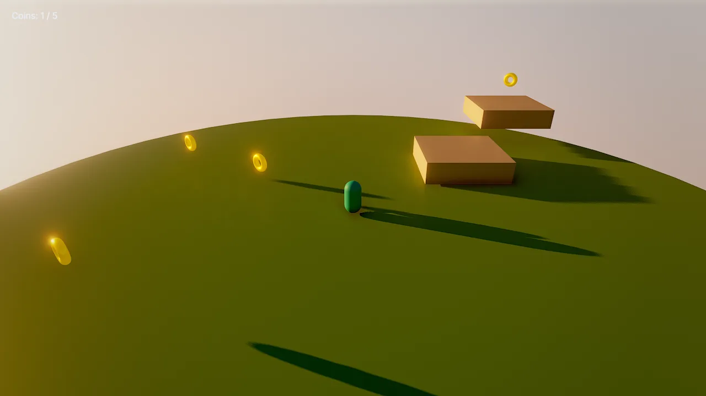
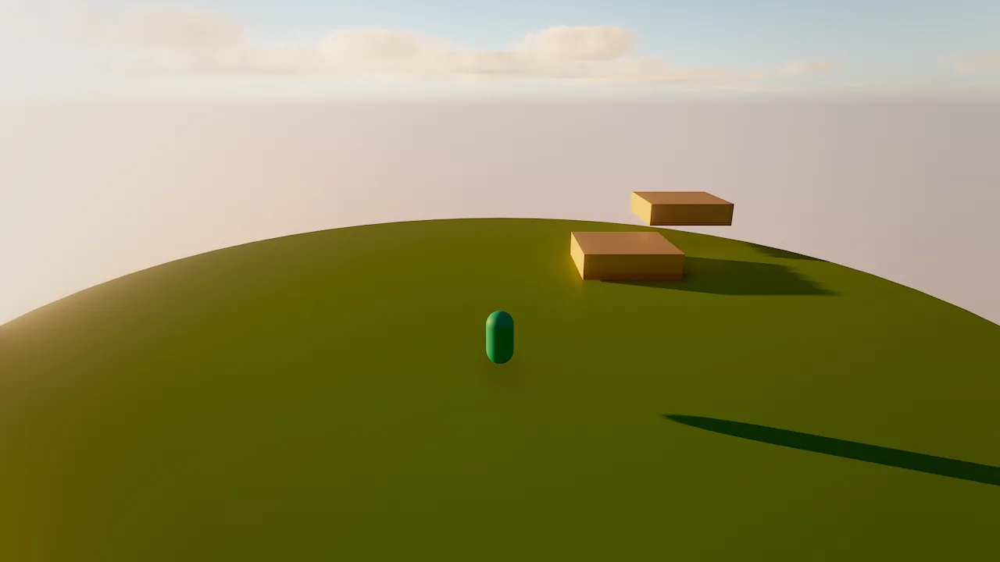
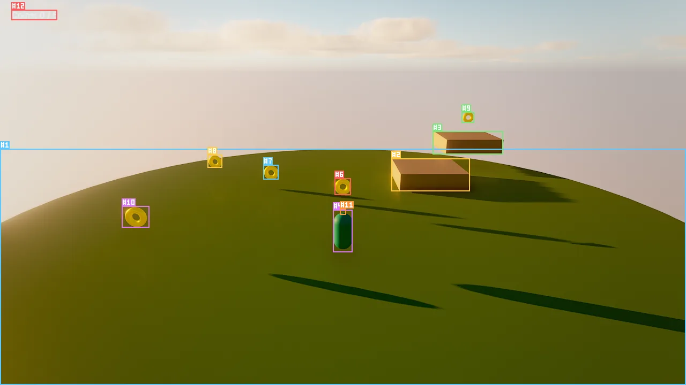

# Your first game in 15 minutes

In this tutorial you build **Coin Run**: a character who walks and jumps across a small island, five spinning coins,
a score on screen and a camera that follows the player. You will use physics, input actions, Wander behaviors with a
test, a UI canvas, and finally package the game as a macOS app.

Every step is a tool call. Paste them into the in-editor agent's chat, run them from an MCP client, or do the same
thing by hand in the editor (each step says how). The calls on this page are executed end to end by
`website/scripts/tutorial_coin_run.py` whenever the site's media are rebuilt, so they are known to work.

<figure markdown>
{ loading=lazy }
<figcaption>Coin Run after the player walked into the first coin: the HUD counts it, the camera follows.</figcaption>
</figure>

## 1. Create the project and the scene

```bash
mkdir -p ~/Games/coin_run
open build/release/bin/Skywalker.app --args --project ~/Games/coin_run
```

Start from an empty scene with a golden-hour sky:

```tool
scene_new {"name": "Coin Run", "empty": true}
environment_update {"preset": "sunset", "skyMode": "atmosphere", "clouds": 0.4, "fogDensity": 0.002, "haze": 0.004, "showGrid": false}
```

`preset` applies first, then the fields override it. In the editor you can do the same from the details panel with the
scene's environment selected.

## 2. Block out the level

One `batch` creates the island, two steps, the player and the camera as a single undoable edit:

```tool
batch {"operations": [
  {"tool": "entity_create", "args": {"name": "Island", "mesh": "cylinder", "position": [0, -0.5, 0], "scale": [24, 1, 24], "color": "#7fb069"}},
  {"tool": "entity_create", "args": {"name": "Step 1", "mesh": "cube", "position": [4, 0.4, -4], "scale": [3, 0.8, 3], "color": "#d9c7a7"}},
  {"tool": "entity_create", "args": {"name": "Step 2", "mesh": "cube", "position": [7, 1.2, -8], "scale": [3, 0.8, 3], "color": "#d9c7a7"}},
  {"tool": "entity_create", "args": {"name": "Player", "mesh": "capsule", "position": [0, 1, 4], "color": "#3cc9b0", "tags": ["player"]}},
  {"tool": "entity_create", "args": {"name": "Camera", "position": [0, 5, 13], "rotation": [-18, 0, 0], "components": {"camera": {"primary": true, "fov": 55}}}}
]}
```

The `player` tag matters: the coins below react to it, and playtest bots look for it.

<figure markdown>
{ loading=lazy }
<figcaption>The level after step 2, seen through the scene camera.</figcaption>
</figure>

## 3. Add physics

The island and the steps become static colliders; the player becomes a capsule character controller that walks up
slopes, steps up ledges and slides along walls.

```tool
physics_add {"entities": ["Island", "Step 1", "Step 2"], "preset": "static_level"}
physics_add {"entity": "Player", "preset": "player_character"}
```

## 4. Make the player move

Behaviors are Wander code with a plain-language intent. This one reads the `move` action (WASD, the arrow keys or the
left stick in the default input map) and the `jump` action (space or the south button):

```wander
behavior PlayerMove
  intent "Walk with WASD or the left stick, jump with space or the south button."
  on tick
    let m = axis("move")
    walk(self, (m.x, 0, -m.y))
  end
  on action "jump"
    jump(self)
  end
end
```

`axis("move")` is a vector with **y forward**, and the scene's forward is −Z, hence `-m.y`. `walk` moves the character
at its `moveSpeed` for this tick; `jump` only works when the character stands on the ground.

```tool
behavior_set {"entity": "Player", "name": "PlayerMove", "source": "behavior PlayerMove\n  intent \"Walk with WASD or the left stick, jump with space or the south button.\"\n  on tick\n    let m = axis(\"move\")\n    walk(self, (m.x, 0, -m.y))\n  end\n  on action \"jump\"\n    jump(self)\n  end\nend\n"}
```

In the editor: select **Player**, add a behavior in the details panel, paste the code. Diagnostics appear as you type.

## 5. A camera that follows

```wander
behavior FollowCam
  intent "Follow the player from behind and above, smoothly."
  on tick
    let p = find("Player")
    if p then
      self.position = lerp(self.position, p.position + (0, 5, 9), 1 - exp(-4 * dt))
      look self at p
    end
  end
end
```

`1 - exp(-4 * dt)` makes the smoothing independent of the frame rate.

```tool
behavior_set {"entity": "Camera", "name": "FollowCam", "source": "behavior FollowCam\n  intent \"Follow the player from behind and above, smoothly.\"\n  on tick\n    let p = find(\"Player\")\n    if p then\n      self.position = lerp(self.position, p.position + (0, 5, 9), 1 - exp(-4 * dt))\n      look self at p\n    end\n  end\nend\n"}
```

## 6. Coins, with a test

Create one coin, make it a trigger zone (a sensor that fires `on trigger_enter`), and give it a behavior:

```tool
entity_create {"name": "Coin", "mesh": "torus", "position": [0, 1, 0], "rotation": [90, 0, 0], "scale": [0.6, 0.6, 0.6], "color": "#f5c542", "components": {"mesh": {"metallic": 1, "roughness": 0.25, "emissive": "#f5c54240"}}}
physics_add {"entity": "Coin", "preset": "trigger_zone"}
```

```wander
behavior Coin
  intent "Spins in place. When the player touches it, it reports a collected coin and disappears."
  param spin = 120 in 0..360 "degrees per second"
  on tick
    rotate self by (0, spin * dt, 0)
  end
  on trigger_enter "player"
    emit "coin_collected"
    destroy self
  end

  test "spins"
    let before = self.rotation.y
    wait 0.5
    expect self.rotation.y != before
  end
end
```

`param` declares a tunable: the editor shows `spin` as a slider from 0 to 360. The `test` block is part of the
behavior; `wander_test` runs it in a sandbox, so the real scene is never touched:

```tool
behavior_set {"entity": "Coin", "name": "Coin", "source": "behavior Coin\n  intent \"Spins in place. When the player touches it, it reports a collected coin and disappears.\"\n  param spin = 120 in 0..360 \"degrees per second\"\n  on tick\n    rotate self by (0, spin * dt, 0)\n  end\n  on trigger_enter \"player\"\n    emit \"coin_collected\"\n    destroy self\n  end\n\n  test \"spins\"\n    let before = self.rotation.y\n    wait 0.5\n    expect self.rotation.y != before\n  end\nend\n"}
wander_test {"entity": "Coin", "name": "Coin"}
```

```json
{"compiled": true, "passed": 1, "failed": 0, "total": 1,
 "tests": [{"name": "spins", "passed": true, "ticks": 31, "seconds": 0.52, "expectations": 1, "behavior": "Coin"}]}
```

Now duplicate it. Duplicates copy components, physics and behaviors:

```tool
entity_duplicate {"entity": "Coin", "offset": [-3, 0, -2], "count": 2}
entity_duplicate {"entity": "Coin", "name": "High Coin", "offset": [7, 1.6, -8]}
entity_duplicate {"entity": "Coin", "name": "Far Coin", "offset": [-6, 0, 3]}
```

In the editor: select the coin and press ++cmd+d++, then move the copies with the move tool (++w++).

## 7. Keep score on screen

`ui_create` builds a whole interface from one JSON tree. A screen-space canvas named **HUD** with one text element:

```tool
ui_create {"canvas": {"name": "HUD", "theme": "dark"}, "elements": [{"type": "text", "name": "Score", "anchor": "top_left", "position": [32, 28], "text": "Coins: 0 / 5", "style": "large"}]}
```

The coins emit `coin_collected`; a behavior on the canvas counts them and updates the text:

```wander
behavior Score
  intent "Counts collected coins and shows the count on the HUD."
  var coins = 0
  on event "coin_collected"
    coins += 1
    find("Score").ui.text = "Coins: {coins} / 5"
    if coins >= 5 then
      find("Score").ui.text = "All coins collected!"
    end
  end
end
```

```tool
behavior_set {"entity": "HUD", "name": "Score", "source": "behavior Score\n  intent \"Counts collected coins and shows the count on the HUD.\"\n  var coins = 0\n  on event \"coin_collected\"\n    coins += 1\n    find(\"Score\").ui.text = \"Coins: {coins} / 5\"\n    if coins >= 5 then\n      find(\"Score\").ui.text = \"All coins collected!\"\n    end\n  end\nend\n"}
scene_save {"path": "scenes/main.sky.json"}
```

<figure markdown>
{ loading=lazy }
<figcaption>The finished level as an agent sees it: <code>viewport_capture {"annotate": true}</code> labels every entity with its id.</figcaption>
</figure>

## 8. Play and verify

Press ++cmd+p++ and collect the coins. An agent verifies the same thing without a screen: play, hold the `move` axis
forward for 70 ticks (60 ticks are one second), step the simulation, and read the HUD's vars.

```tool
sim_control {"action": "play"}
sim_input {"axes": [{"name": "move", "x": 0, "y": 1, "ticks": 70}]}
sim_control {"action": "step", "ticks": 70}
entity_get {"entity": "HUD"}
sim_control {"action": "stop"}
```

`entity_get` shows `"vars": {"coins": 1}`: walking forward collected the first coin. `stop` restores the scene to its
pre-play state. Because the simulation is deterministic, this check gives the same answer every time, which is what
makes agent-written tests and [playtest bots](../manual/studio.md#playtests-that-play) reliable.

## 9. Ship it

Give the game a title and build a standalone app:

```tool
game_settings {"operation": "set", "settings": {"title": "Coin Run", "startScene": "scenes/main.sky.json", "version": "1.0.0"}}
```

```bash
skywalker build --project ~/Games/coin_run --out ~/Builds --release
open ~/Builds/"Coin Run.app"
```

The app contains the player runtime, the scene, the assets it references and the license notices, ad-hoc signed to run
on your Mac. [Shipping](../manual/shipping.md) covers icons, quality presets, signing and notarization.

## Where to go next

- Replace the capsule with a rigged character: [Animation](../manual/animation.md).
- Add sound: `audio_generate {"preset": "coin", "path": "audio/coin.wav"}` and `play_sound("audio/coin.wav")` in the
  coin's `on trigger_enter`. See [Audio](../manual/audio.md).
- Let a crew playtest it and fix what they find: [Studio and crews](../manual/studio.md).
- Learn the language properly: [Wander scripting](../manual/wander/index.md).

!!! agent "For agents"

    The loop you just followed is the agent loop: **orient** (`engine_info`, `scene_overview`), **act** in batches
    (`batch`, `entity_create`, `physics_add`, `behavior_set`), **look** (`viewport_capture` with `annotate`),
    **verify** (`wander_test`, `sim_input` + `sim_control step`, `entity_get`, `logs`), and **undo** with `history`
    when something went wrong.

    ```tool
    viewport_capture {"view": "scene", "annotate": true}
    logs {"limit": 20}
    history {"action": "undo"}
    ```
