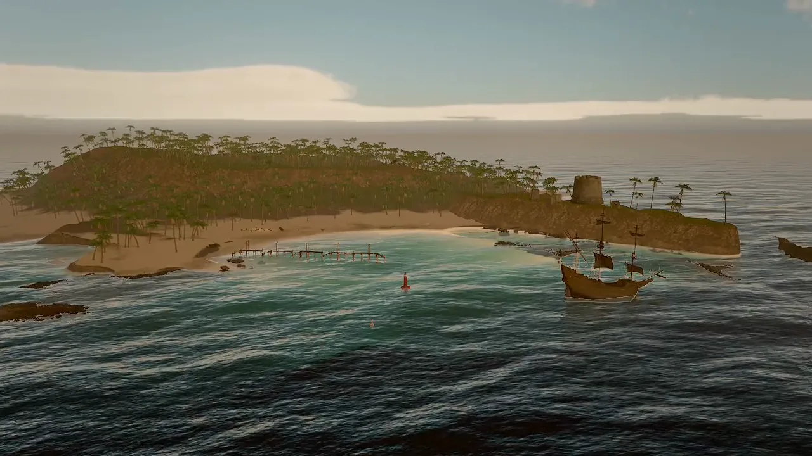
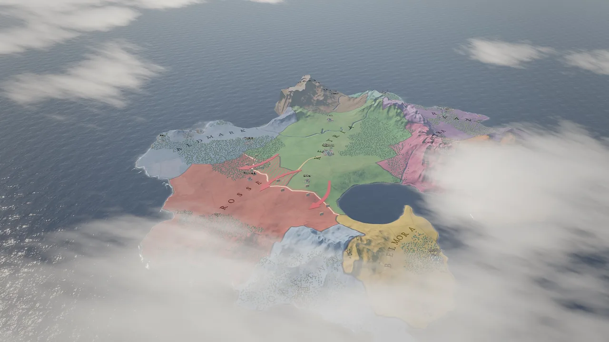
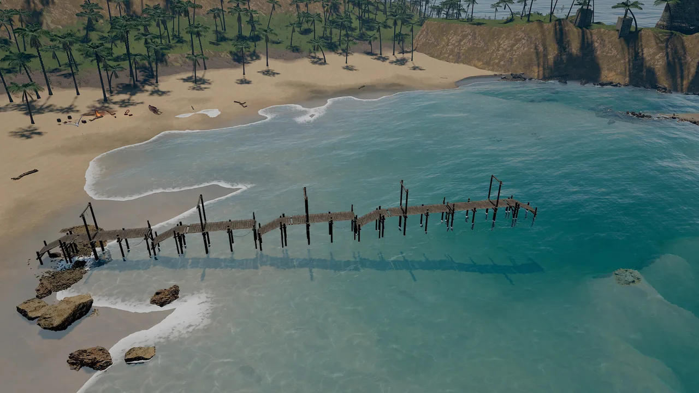
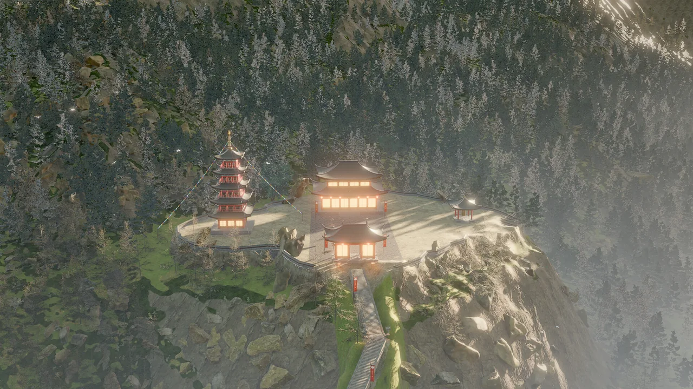
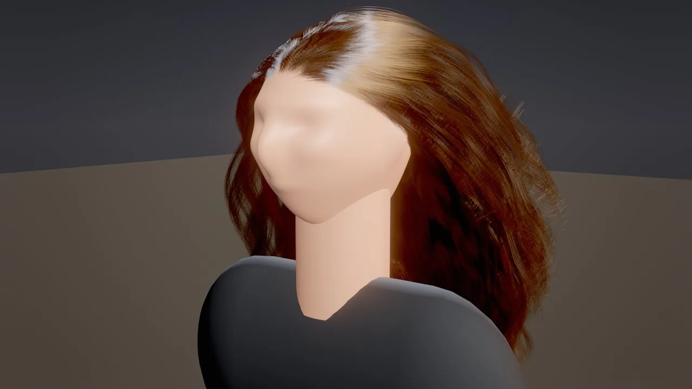
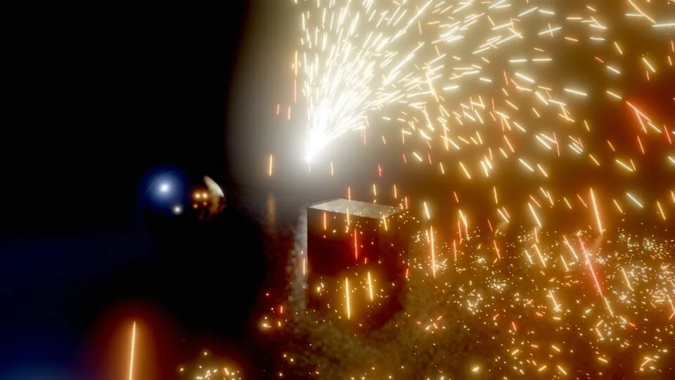
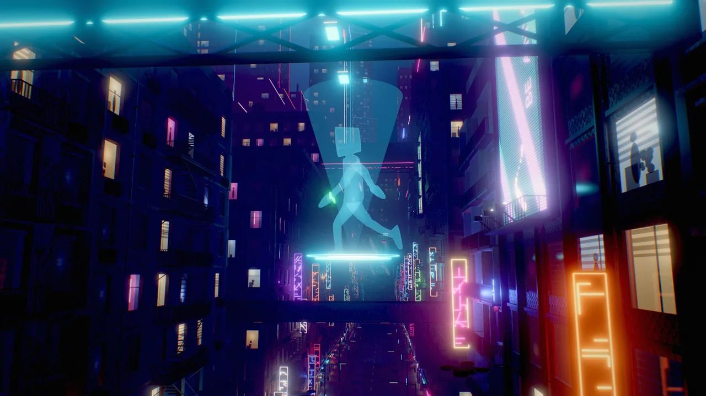

<div class="sky-hero">
  
  <video autoplay muted loop playsinline preload="metadata" poster="assets/video/tidebreak_isle/establishing.webp">
    <source src="assets/video/tidebreak_isle/establishing.mp4" type="video/mp4">
  </video>
  <div class="sky-hero__content">
    <p class="sky-eyebrow">Skywalker v0.1 · pre-release</p>
    <h1>The game engine built for AI agents, and the people who work with them.</h1>
    <p>A C++20 engine with a native macOS editor and a Metal renderer, where every capability is a tool that you, the
    in-editor crew and any MCP agent call the same way: agents see the scene, act on it precisely, test what they
    built and hand it back for review.</p>
    <a class="md-button md-button--primary" href="getting-started/">Get started</a>
    <a class="md-button" href="manual/">Read the manual</a>
    <a class="md-button" href="agents/">Agent guide</a>
  </div>
</div>

## Why Skywalker

<div class="grid cards" markdown>

-   **Everything is a tool**

    ---

    168 typed, schema-validated tools cover scenes, worlds, rendering, physics, animation, audio, UI, assets, the
    studio, movies and shipping. The editor, its crew and external agents share them, so humans and agents never have
    different powers. Errors come with *did you mean …?* hints.

    [:octicons-arrow-right-24: Tool reference](reference/tools/index.md)

-   **Agents can see**

    ---

    `viewport_capture` returns an image plus every entity's screen box and id, with set-of-mark labels, G-buffer and
    diagnostic views, clay and sketch looks, and supersampled stills. `perf_stats` says where the frame time goes.

    [:octicons-arrow-right-24: How agents see](agents/seeing.md)

-   **Undoable, attributed, deterministic**

    ---

    Every edit records who made it (`user`, `agent:Nimbus`, `mcp:claude-code`) and can be undone. A fixed 60 Hz
    simulation with seeded randomness lets agents play the game, test it and replay it exactly.

    [:octicons-arrow-right-24: Simulation and time](manual/simulation.md)

-   **A studio of agents**

    ---

    Directors, designers, programmers, artists and playtesters with roles and budgets, a shared board, playtest bots
    that really play, feedback the director accepts or drops with measured effect, and loops you define.

    [:octicons-arrow-right-24: Studio and crews](manual/studio.md)

</div>

## What it renders

<div class="sky-features">
  <a class="sky-feature" href="manual/rendering/">
    
    <div><h3>Physically based, Apple-silicon fast</h3><p>Clustered lighting for 1,000+ lights, screen-space GI and reflections, TAA and MetalFX upscaling, cascaded soft shadows.</p></div>
  </a>
  <a class="sky-feature" href="manual/rendering/sky/">
    
    <div><h3>Atmosphere and volumetric clouds</h3><p>Physical sky scattering, ray-marched clouds with shadows, light shafts and height fog.</p></div>
  </a>
  <a class="sky-feature" href="manual/world/water/">
    
    <div><h3>FFT ocean and shorelines</h3><p>A simulated sea that shoals over the seabed, with foam, caustics, refraction and wet sand.</p></div>
  </a>
  <a class="sky-feature" href="manual/world/foliage/">
    
    <div><h3>Terrain and foliage at scale</h3><p>Eroded terrain with splat layers, GPU-instanced foliage with wind, LODs and octahedral impostors.</p></div>
  </a>
  <a class="sky-feature" href="manual/hair/">
    
    <div><h3>Strand hair and fur</h3><p>Simulated strands with Marschner shading, physically based color and self-shadowing.</p></div>
  </a>
  <a class="sky-feature" href="manual/vfx/">
    
    <div><h3>GPU particles and fluids</h3><p>Millions of particles with depth collisions and sub-emitters; volumetric fire and smoke simulated on the GPU.</p></div>
  </a>
  <a class="sky-feature" href="manual/2d-ui/">
    
    <div><h3>2D, UI and dialogue</h3><p>Sprites, tilemaps, 2D lights, SDF text, themed UI layouts and a branching dialogue language.</p></div>
  </a>
  <a class="sky-feature" href="manual/movie-render/">
    
    <div><h3>Movie renderer</h3><p>Deterministic offline renders to HEVC, ProRes or PNG with real accumulated motion blur.</p></div>
  </a>
</div>

## From words to native code

Behaviors pair a plain-language **intent** with **Wander** code: a deterministic language with states, coroutines,
collections, modules and in-language tests, a node-graph view of the same code, and ahead-of-time compilation to
native code.

=== "Wander"

    ```wander
    behavior Coin
      intent "Spins; when the player touches it, it adds a point and disappears."
      param spin = 90 in 0..360 "degrees per second"
      on tick
        rotate self by (0, spin * dt, 0)
      end
      on trigger_enter "player"
        emit "score" with {points: 1}
        destroy self
      end

      test "spins"
        let before = self.rotation.y
        wait 0.5
        expect self.rotation.y != before
      end
    end
    ```

=== "Tool calls"

    ```tool
    entity_create {"name": "Coin", "mesh": "torus", "position": [0, 1, 0], "color": "#f5c542"}
    physics_add {"entity": "Coin", "preset": "trigger_zone"}
    wander_check {"source": "on tick\n  rotate self by (0, 90 * dt, 0)\nend"}
    viewport_capture {"annotate": true}
    ```

=== "CLI"

    ```bash
    skywalker render examples/hello_sky/scenes/main.sky.json -o shot.png --annotate
    skywalker run examples/hello_sky/scenes/main.sky.json --ticks 600
    skywalker build --project examples/sky_dash --out ~/Builds --release
    ```

=== "Connect an agent"

    ```bash
    skywalker setup claude     # or codex | gemini | cursor | all
    ```

## Made with Skywalker

<div class="sky-grid">
<a class="sky-card" href="examples/#tidebreak_isle"><div class="sky-card__body"><p class="sky-card__title">Tidebreak Isle</p><p class="sky-card__meta">Open-world island adventure</p><p class="sky-card__text">An island cove at golden hour with FFT surf, palms, a fort and a brig.</p></div></a>
<a class="sky-card" href="examples/#neon_requiem"><div class="sky-card__body"><p class="sky-card__title">Neon Requiem</p><p class="sky-card__meta">Neo-noir RPG</p><p class="sky-card__text">A rain-soaked neon city lit by hundreds of clustered lights.</p></div></a>
<a class="sky-card" href="examples/#berrybrook"><div class="sky-card__body"><p class="sky-card__title">Berrybrook</p><p class="sky-card__meta">Cozy farming sim</p><p class="sky-card__text">A berry farm with planting, harvest and a tilt-shift lens.</p></div></a>
<a class="sky-card" href="examples/#meridian_accord"><div class="sky-card__body"><p class="sky-card__title">Meridian Accord</p><p class="sky-card__meta">Grand strategy</p><p class="sky-card__text">A strategy map with fronts, units, map modes and events.</p></div></a>
</div>

[All 24 example projects :octicons-arrow-right-24:](examples/index.md){ .md-button }
[Showcase :octicons-arrow-right-24:](showcase.md){ .md-button }

## Start here

| I want to… | Go to |
|---|---|
| Build the engine and open the editor | [Install and build](getting-started/install.md) |
| Make a small game end to end | [Your first game in 15 minutes](getting-started/first-game.md) |
| Let Claude Code, Codex, Gemini CLI or Cursor build with me | [Connect an AI agent](getting-started/connect-agent.md) |
| Learn a subsystem in depth | [Manual](manual/index.md) |
| Look up a tool, component, builtin or CLI flag | [Reference](reference/index.md) |

<small>Developed by AmirHossein (Amir) Razlighi · Source available under the
[Business Source License 1.1](about/license.md), free for individuals, small companies, non-profits and education.</small>
