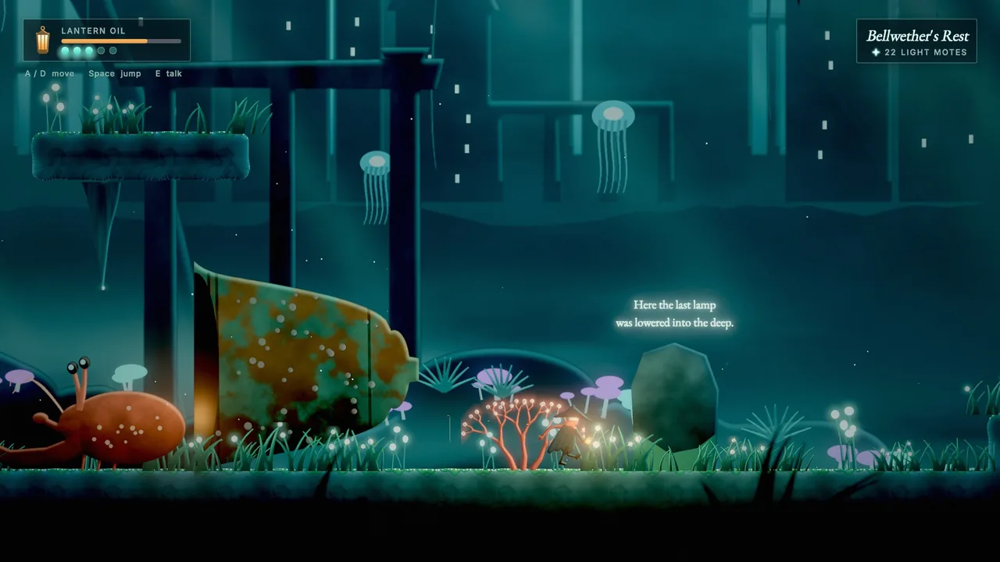
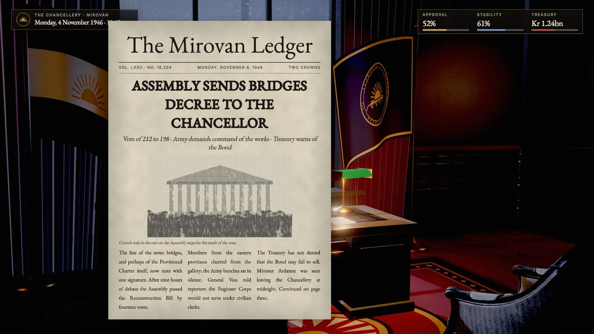
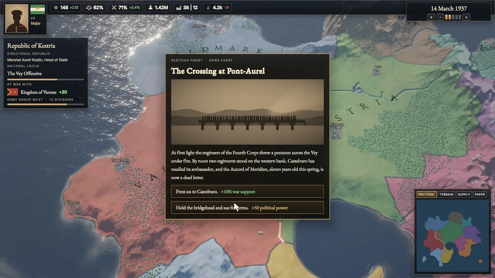
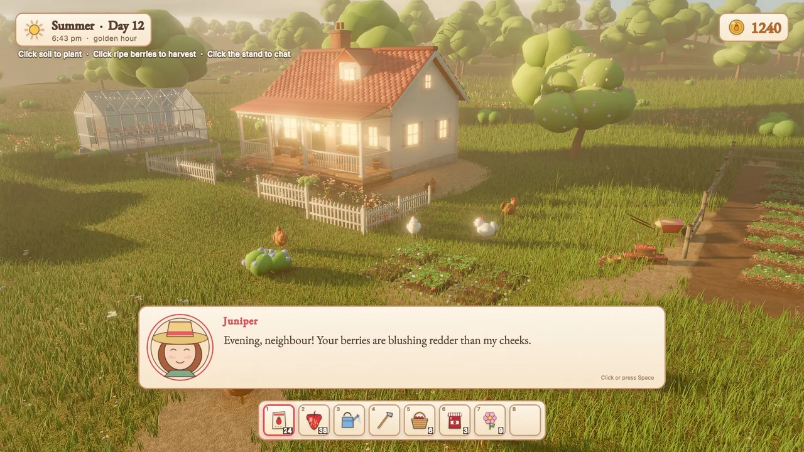
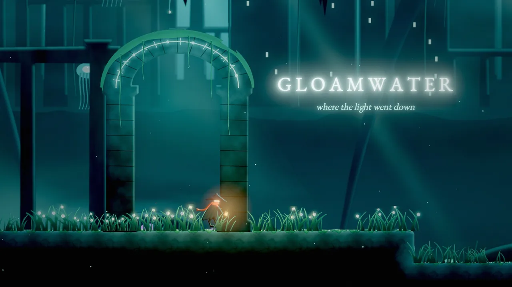

# 2D, text, UI and dialogue

Skywalker draws 2D games (painted side-scrollers, pixel-art farm sims), text in the world, complete user interfaces (HUDs, menus, inventories, map panels, documents) and branching dialogue. Sprites, tilemaps, 2D lights, UI elements and conversations are ordinary reflected components, so you build them with the same tools as 3D scenes, mix them freely with 3D, and capture them with real screen boxes for every element, also on machines without a GPU.

<figure markdown>
{ loading=lazy }
<figcaption>The Gloamwater example: painted sprites lit by 2D lights, flipbook animation, world text, parallax background layers and a UI canvas with a lantern-oil meter and a location panel.</figcaption>
</figure>

## Concepts

### Coordinate conventions

- **World 2D** lives on the XY plane: +Y up, cameras look down −Z. Painter's order is `sortingLayer` (`background` < `midground` < `default` < `foreground` < `overlay`), then `order`, then depth (farther first), then scene order. Sprites depth-test against 3D geometry, so 2.5D scenes work.
- **UI** is in canvas pixels with the origin at the **top-left, y down**: the same space as the boxes that `viewport_capture` and `ui_inspect` return. Paddings and margins use CSS order `[top, right, bottom, left]` and CSS shorthand (`12`, `[8, 16]`).
- **Colours** are authored in sRGB hex (`"#ff8800"`). 2D shading happens in linear HDR, so bloom, fog, exposure and tonemapping apply to sprites. For flat pixel art use `tonemap: "none"`, `bloomIntensity: 0`, and `taa: false` if you want every texel razor sharp.

### Components

| Component | What it is | Key fields |
|---|---|---|
| `sprite` | A textured quad | `texture` (PNG or `*.atlas.json`), `frame`, `columns`/`rows` (grid sheets), `region`, `pivot` ([0.5, 0] = feet), `size` or `pixelsPerUnit`, `color`, `flipX`/`flipY`, `sortingLayer`, `order`, `filter` (`nearest` for pixel art), `normalMap`, `emissive`, `billboard` (`none`, `y`, `full` for 2.5D), `lit`, `castShadows`, `alphaCutoff` |
| `sprite_anim` | A flipbook | `clips` (`{"run": {"frames": "4-11", "fps": 12, "loop": true, "events": {"3": "footstep"}}}`), `clip`, `playing`, `speed` |
| `tilemap` | Layers of tiles | `tileset` (PNG or `*.tileset.json`), `tileSize`, `cellSize`, `width`, `height`, `layers` (`[{name, data, solid, visible, z, tint, sortingLayer, order}]`), `solidTiles`, `autotile`, `filter`, `lit`, `castShadows` |
| `light2d` | A 2D light | `kind` (`point`, `spot` along local +Y, `global` ambient), `color`, `intensity` (HDR), `radius`, `falloff`, `innerAngle`/`outerAngle`, `height` (normal-map relief), `shadows`, `shadowSoftness`, `halo` (glow in the air), `flicker` |
| `parallax` | A parallax layer (the entity and its children) | `factor` (0 = fixed to the camera, below 1 far, above 1 near), `origin`, `repeatX`/`repeatY`, `spacing` |
| `camera2d` | On the camera entity | `pixelsPerUnit`, `referenceHeight` (for example 180: integer upscaling), `pixelSnap`, `zoom`, `follow` with `smoothing`, `deadZone` and `offset`, `bounds` |
| `text` | Text in the world: signs, labels, damage numbers | `text` (rich), `font`, `size` (world em), `color`, `align`, `valign`, `maxWidth`, `lineSpacing`, `outline`, `outlineColor`, `shadowColor`, `emissive` (neon), `billboard`, `sortingLayer` |
| `ui_canvas` | The root of a UI | `mode` (`screen`, `world`), `referenceResolution`, `scaleMode`, `match`, `sortOrder`, `theme`, `styleSheet`, `worldScale`, `interactable` |
| `ui` | A UI element | `widget`, `anchor` (or `custom` with `anchorMin`, `anchorMax`, `pivot`), `position`, `size`, `margin`, `layout`, `gap`, `padding`, `align`, `justify`, `columns`, `fit`, `flex`, `text`, `image`, `value`, `style`, `styleOverrides`, `event`, `interactable`, `visible`, `scroll` |
| `dialogue` | A conversation runner | `script` (`*.dialogue`) or `source`, `startNode`, `autoStart`, `ui` (`default`, `none`), `typewriter`, `portraits`; state: `running`, `node`, `speaker`, `line`, `choices`, `tags` |

Untextured sprites draw as tinted rectangles and tilemaps without a tileset draw flat colours per tile id, so you can block out levels before any art exists.

### Text

Fonts are signed-distance fields rasterized lazily from TrueType and OpenType files with stb_truetype: crisp at any size, zoom or world scale, with outlines, shadows, glows and faux bold computed in the shader, and OpenType (GPOS) kerning. Built-in fonts are **Inter** (`""`, `sans`), **EB Garamond** (`serif`) and **JetBrains Mono** (`mono`); any `*.ttf` or `*.otf` path in the project works too.

Rich text tags work in `text` components and UI text:

| Tag | Effect |
|---|---|
| `<b>`, `<i>`, `<u>`, `<s>` | Bold, italic, underline, strikethrough |
| `<color=#f80>`, `<color=gold>`, `<alpha=0.5>` | Colour and opacity |
| `<size=24>`, `<size=150%>`, `<size=+4>` | Size |
| `<font=serif>` | Font |
| `<br>` | Line break |
| `<noparse>` | Show tags literally |

Text is UTF-8 throughout; missing glyphs fall back to the other built-in fonts. Wrapping prefers spaces, breaks long words and handles CJK text.

### UI layout

- **Anchors** pin an element: `top_left`, `top`, `top_right`, `left`, `center`, `right`, `bottom_left`, `bottom`, `bottom_right` (its `position` is an offset and `size` its size). Stretch anchors fill an axis: `fill`, `top_stretch`, `middle_stretch`, `bottom_stretch`, `left_stretch`, `center_stretch`, `right_stretch`, with insets from `margin`. On an axis that does not stretch, the margin insets the element from the edge it is anchored to: a `bottom_stretch` box with margin bottom 40 floats 40 px above the bottom. `custom` uses `anchorMin`, `anchorMax` and `pivot` as parent fractions.
- **Layouts**: `row` and `column` stack children with `gap`, `padding`, `align` (cross axis: `start`, `center`, `end`, `stretch`; stretch also stretches fit-to-content children, whose text then wraps) and `justify` (`start`, `center`, `end`, `space_between`); `flex` shares leftover space. `grid` fills `columns` equal cells. `fit` sizes an element to its text or children. `ignoreLayout` places an element by its own anchor inside a layout.
- **Canvas scaling**: `scale_with_screen` keeps layouts proportional across resolutions, blending width and height by `match` (0 = match width, 1 = match height); `constant` is 1 px = 1 px.

### UI styling

Styles cascade: the canvas `theme` (`dark`, `light`, `parchment`, `glass`, `pixel`), then its `styleSheet`, by widget kind, `.class` (the element's `style`) and `#Name`, then the element's `styleOverrides`. State blocks `hover`, `pressed`, `focus`, `checked` and `disabled` apply while active, with animated transitions.

Properties: `background`, `background2` (vertical gradient), `backgroundImage`, `slice` (9-slice), `imageTint`, `radius`, `borderWidth`, `borderColor`, `shadowColor`, `shadowOffset`, `shadowBlur`, `opacity`, `padding`, `font`, `fontSize`, `color`, `textAlign`, `verticalAlign`, `bold`, `italic`, `lineSpacing`, `letterSpacing`, `textTransform`, `textOutline`, `textOutlineColor`, `textShadowColor`, `textShadowOffset`, `accent`, `track`, `knob`, `trackHeight`, `knobSize`, `placeholderColor`, `imageFit`, `transition`. Text properties inherit.

Every theme defines the classes `primary`, `ghost`, `danger`, `title`, `heading`, `subtitle`, `muted`, `small`, `large`, `accent`, `card`, `hud`, and the dialogue parts `.dialogue_box`, `.dialogue_name`, `.dialogue_text`, `.dialogue_choice`, `.dialogue_portrait`, `.dialogue_hint`.

A style sheet (`*.uistyle.json`):

```json
{
  "format": "skywalker.uistyle", "extends": "parchment", "vars": {"accent": "#7a1f12"},
  "rules": {
    "button": {"radius": 2, "hover": {"borderColor": "$accent"}},
    ".stamp": {"background": "$accent", "color": "#fff3dc", "textTransform": "uppercase"},
    "#Title": {"fontSize": 72}
  }
}
```

<div class="sky-compare" markdown>
<figure markdown>{ loading=lazy }<figcaption>The Chancellor's Desk: a full-page document built from UI text in the serif font, over a HUD with meters</figcaption></figure>
<figure markdown>{ loading=lazy }<figcaption>Meridian Accord: a news-event panel with an image and two choice buttons, a top bar and a minimap panel</figcaption></figure>
</div>

### UI input

The mouse, the keyboard (Tab and arrow keys move focus, Enter and Space activate, arrows adjust sliders, typing edits a focused input; platform code delivers typed characters with `sky_input_text`) and the wheel (scroll views) drive the UI. Activating a button, toggle, slider or input sends the Wander event `ui:<element name>` (plus the element's `event`, if set) and `on click` to the element itself. While playing, clicks on UI never reach the world behind it; while editing, clicking an element selects it.

UI canvases keep running while the game is paused: their `process` mode defaults to `always`, on the real clock. That is where pause-menu logic belongs.

### Rendering

2D items are drawn in the scene pass (HDR, so they take part in bloom and fog), and the UI is drawn after the final composite at output resolution. Headless captures and CI use a CPU rasterizer that draws the same 2D frame.

## How to script 2D and UI

| Builtin or trigger | Does |
|---|---|
| `play_anim(e, clip, restart)` | Plays a `sprite_anim` clip (keeps playing if it already is, unless `restart`) |
| `on anim "name"` | A frame event of a clip; a non-looping clip's end arrives as `on anim "finished"` |
| `tile_at(map, pos, layer)` | Tile id at a world position (0 = empty) |
| `set_tile(map, pos, tile, layer)` | Sets a tile by id (0 clears) or by an auto-tiled terrain name |
| `on ui "Name"` | The button, toggle, slider or input named `Name` was used (= `on event "ui:Name"`) |
| `start_dialogue(node)`, `start_dialogue(e, node)` | Starts a conversation |
| `dialogue_var(name)`, `dialogue_var(name, value)` | Reads or sets a dialogue variable |
| `dialogue_choose(i)`, `dialogue_advance()` | Picks a choice (0-based) or advances |
| `on dialogue "start"`, `"line"`, `"choice"`, `"end"`, `"<command>"` | Conversation events and custom commands |

Any component field is reachable: `find("Score").ui.text = "Score: " + str(score)`.

```wander
behavior Hero
  intent "Run while D or A is held, idle otherwise; footstep frame events log a step."
  on tick
    if key("d") then
      self.sprite.flipX = false
      play_anim(self, "run")
    elif key("a") then
      self.sprite.flipX = true
      play_anim(self, "run")
    else
      play_anim(self, "idle")
    end
  end
  on anim "footstep"
    log "step"
  end
end

behavior Farmer
  intent "Press E on grass to till it into auto-tiled soil."
  on key "e"
    let map = find("Farm")
    if tile_at(map, self.position) == 3 then   -- grass
      set_tile(map, self.position, "soil")
    end
  end
end
```

## Dialogue scripts

A `.dialogue` file holds nodes. Each node has a `title`, a `---` line, its content and a closing `===`. This script passes `dialogue_check` without errors:

```text
title: Start
---
<<declare $trust = 1>>
<<declare $name = "Councillor">>
Narrator: The council chamber falls silent. #mood:tense
Vale: You're late, {$name}. #portrait:vale_cold
-> I was delayed by the riots.
    <<set $trust += 1>>
    Vale: Riots. Of course.
-> That is none of your concern. <<if $trust > 5>>
    <<jump Confrontation>>
<<if visited("Archive")>>
    Vale: I hear you've been reading old letters.
<<else>>
    Vale: Sit.
<<endif>>
<<lights_dim 0.5>>
===
title: Confrontation
---
Vale: Then we have nothing more to discuss. #mood:angry
<<open_gate>>
===
```

- **Lines** are `Speaker: text` with trailing `#tags`; `#portrait:name` shows `portraits/name.png` in the default dialogue box. `{expr}` interpolates.
- **Choices** are `-> text` with an indented body; a trailing `<<if ...>>` makes a choice conditional.
- **Commands**: `set` (with `to`, `=`, `+=`, `-=`, `*=`, `/=`), `declare`, `if`/`elseif`/`else`/`endif`, `jump`, `wait`, `stop`. Any other command (`<<shake 2>>`) becomes the Wander event `dialogue:shake`, with the arguments in the runner's vars (`vars.dialogue_command`, `vars.dialogue_args`, `vars.dialogue_arg`).
- **Variables** live in the runner entity's vars (`$trust` is the var `trust`).
- **Functions**: `visited`, `visited_count`, `random`, `random_range`, `dice`, `round`, `floor`, `ceil`, `abs`, `min`, `max`.

The built-in dialogue box (portrait, name plate, typewriter text, numbered choices; click, Space or Enter advance, 1–9 pick a choice) is made of ordinary UI entities named `Dialogue Box`, `Dialogue Portrait`, `Dialogue Speaker`, `Dialogue Line` and `Dialogue Choices` under the `Dialogue UI` canvas. Restyle them with the `dialogue_*` classes, or create them in the editor with `ui_create {"template": "dialogue"}`. Set the component's `ui` to `none` to draw your own from Wander with `self.dialogue.line`, `.speaker` and `.choices`.

```wander
behavior Story
  intent "Open the gate when the script runs <<open_gate>>; show the HUD when the conversation ends."
  on dialogue "open_gate"
    destroy find("Gate")
  end
  on dialogue "end"
    find("HUD").enabled = true
    if dialogue_var("trust") > 2 then
      log "Vale trusts you"
    end
  end
end
```

<figure markdown>
{ loading=lazy }
<figcaption>Berrybrook: a dialogue box with a portrait and name plate, a clock panel, a coin counter and an inventory hotbar, over a 3D farm.</figcaption>
</figure>

## Recipes

### A HUD

```tool
ui_create {"canvas": {"name": "HUD", "theme": "dark"}, "elements": [{"type": "panel", "name": "Vitals", "anchor": "top_left", "position": [32, 28], "style": "hud", "layout": "column", "gap": 6, "padding": [10, 14], "children": [{"type": "text", "text": "HEALTH", "style": "small muted"}, {"type": "progress", "name": "Health", "value": 1, "size": [240, 12]}]}, {"type": "text", "name": "Score", "anchor": "top_right", "position": [-32, 28], "text": "0", "style": "large"}]}
ui_inspect {"canvas": "HUD", "width": 1280, "height": 720}
```

Then update it from gameplay:

```wander
behavior HudBinding
  intent "Mirror hp and score into the HUD."
  var hp = 100
  var score = 0
  on tick
    find("Health").ui.value = hp / 100
    find("Score").ui.text = str(score)
  end
  on event "coin_collected"
    score += 10
  end
end
```

### A main menu

```tool
ui_create {"template": "main_menu", "canvas": {"name": "Menu", "theme": "glass"}}
entity_update {"entity": "Title", "components": {"ui": {"text": "Ashes of Veyra"}}}
behavior_set {"entity": "Menu", "name": "Menu", "intent": "Hide the menu when Play is clicked.", "source": "on ui \"Play\"\n  find(\"Menu\").enabled = false\nend\non ui \"Quit\"\n  quit_game()\nend"}
ui_inspect {"canvas": "Menu"}
sim_control {"action": "play"}
ui_interact {"element": "Play"}
sim_control {"action": "step", "ticks": 2}
```

### A pause menu

UI canvases run while the game is paused, so a pause menu is a canvas plus a few handlers:

```tool
ui_create {"template": "pause_menu", "canvas": {"name": "PauseUI", "theme": "glass"}}
entity_update {"entity": "Pause Dim", "components": {"ui": {"visible": false}}}
```

```wander
behavior Pause
  intent "Toggle the pause on the pause action and show the dimmed menu while paused."
  on action "pause"
    if is_paused() then resume_game() else pause_game() end
  end
  on pause
    find("Pause Dim").ui.visible = true
  end
  on resume
    find("Pause Dim").ui.visible = false
  end
  on ui "Resume"
    resume_game()
  end
end
```

`pause_game()` freezes every pausable entity (the default: behaviors, physics, animation, particles, non-UI sounds) from the next tick. A HUD that should freeze too gets a `process` component with `mode: "pausable"`. Verify with:

```tool
sim_control {"action": "pause_game"}
process_info {"entity": "PauseUI"}
ui_interact {"element": "Resume"}
sim_control {"action": "step", "ticks": 2}
```

### A dialogue scene

1. Write `story/intro.dialogue` (the script above), lint it, and preview a branch. The preview starts with `$trust` at 6, so the conditional choice is offered and leads to `Confrontation`:

    ```tool
    dialogue_check {"path": "story/intro.dialogue"}
    dialogue_preview {"path": "story/intro.dialogue", "choices": ["none of your concern"], "vars": {"trust": 6}}
    ```

2. Add a runner and restyle the box:

    ```tool
    entity_create {"name": "Vale", "components": {"dialogue": {"script": "story/intro.dialogue", "autoStart": true, "typewriter": 40}}}
    ui_style {"canvas": "Dialogue UI", "theme": "parchment"}
    ```

    The `Dialogue UI` canvas exists once the conversation has started (or after `ui_create {"template": "dialogue"}`). Portraits go in `portraits/<name>.png`.

3. Drive it in play mode and react in Wander (`on dialogue "<command>"`, `dialogue_var`):

    ```tool
    dialogue_control {"action": "start", "node": "Start"}
    dialogue_control {"action": "advance"}
    dialogue_control {"action": "choose", "choice": 0}
    dialogue_control {"action": "state"}
    ```

### A tilemap level from ASCII

```tool
tilemap_from_ascii {"name": "Level", "tileset": "art/tiles.png", "tile_size": 16, "autotile": {"ground": {"mode": "blob47", "first": 1}}, "legend": {"#": "ground", "=": 49, "o": 57}, "solid": true, "map": "....................\n.......o..o.........\n......======........\n....................\n####################"}
entity_create {"name": "Camera", "position": [10, -2, 10], "components": {"camera": {"orthographic": true}, "camera2d": {"pixelsPerUnit": 16, "referenceHeight": 180, "follow": "Hero"}}}
entity_create {"name": "Torch", "position": [6, -2, 0], "components": {"light2d": {"kind": "point", "color": "#ffb060", "intensity": 2.5, "radius": 6, "halo": 0.6, "flicker": 0.3}}}
tilemap_inspect {"entity": "Level"}
tilemap_paint {"entity": "Level", "action": "fill", "rect": [0, 3, 20, 1], "tile": "ground"}
```

`tilemap_inspect` shows every layer as ASCII with a legend, plus the merged collision rectangles (map-local world units: x right, y up from the top-left corner), ready for physics bodies.

**Auto-tiling modes:**

| Mode | Tiles |
|---|---|
| `blob47` | 47 tiles ordered by ascending reduced 8-neighbour mask (N=1, NE=2, E=4, SE=8, S=16, SW=32, W=64, NW=128; corners count only with both adjacent edges) |
| `wang16` | 16 tiles indexed by N=1, E=2, S=4, W=8 |
| `random` | Mixes variants, with optional `weights` |
| `single` | Places one tile |

Give `first` (consecutive ids) or an explicit `tiles` list.

### Sprite sheets and atlases

```tool
sprite_sheet_slice {"image": "art/knight.png", "cell": [32, 32], "entity": "Knight", "animations": {"idle": {"row": 0, "fps": 6}, "run": {"row": 1, "fps": 12}, "attack": {"frames": "16-21", "fps": 14, "loop": false, "events": {"3": "hit"}}}}
sprite_atlas_pack {"folder": "art/props", "output": "art/props.atlas.json"}
```

`sprite_sheet_slice` names the frames of a grid sheet, turns rows into `sprite_anim` clips and applies both to an entity. `sprite_atlas_pack` packs a folder of images into an atlas (trimmed, padded and edge-extruded, so nothing bleeds) and suggests clips from numbered file names (`run_0` .. `run_7` become `run`).

<figure markdown>
{ loading=lazy }
<figcaption>Gloamwater's title: world text with a glow over sprites, a halo light on the arch and drifting particles.</figcaption>
</figure>

## Pitfalls

- **2D light budget.** At most 32 2D lights per frame (the nearest to the view). 2D shadows are screen-space, so casters must be on screen. The CPU rasterizer lights per sprite, without normal maps or shadows.
- **Text shaping** is per code point: kerning, but no ligatures or complex scripts such as Arabic or Indic.
- **CPU and GPU blending.** The UI blends in linear light on the GPU and in sRGB on the CPU, so soft edges differ slightly in headless captures.
- **World-space canvases** are hit-tested through the game camera; focus navigation is order-based.
- **Framing 2D in the editor.** The editor viewport shows sprites and UI, but for exact 2D framing (orthographic, pixel-perfect, `camera2d` bounds) look through the scene camera; there is no dedicated 2D editing camera yet.
- **Element names are event names.** `on ui "Play"` matches the element named `Play`; renaming the element breaks the handler. Use the `event` field for a stable name.

!!! agent "For agents"

    Build UI from one tree, verify it numerically, then click it like a player:

    ```tool
    ui_create {"template": "main_menu", "canvas": {"name": "Menu", "theme": "dark"}}  # one undoable step
    ui_inspect {"canvas": "Menu", "width": 1920, "height": 1080}                       # rects, no screenshot needed
    ui_style {"canvas": "Menu", "theme": "parchment"}                                  # restyle
    ui_interact {"element": "Play", "action": "click"}                                 # then sim_control step
    dialogue_check {"path": "story/intro.dialogue"}                                    # lint every script you write
    ```

    Check layouts at several viewport sizes with `ui_inspect` before you capture screenshots.

## Reference

- Tools: [`ui_create`](../reference/tools/ui.md#ui_create), [`ui_style`](../reference/tools/ui.md#ui_style), [`ui_inspect`](../reference/tools/ui.md#ui_inspect), [`ui_interact`](../reference/tools/ui.md#ui_interact), [`dialogue_check`](../reference/tools/dialogue.md#dialogue_check), [`dialogue_preview`](../reference/tools/dialogue.md#dialogue_preview), [`dialogue_control`](../reference/tools/dialogue.md#dialogue_control), [`sprite_atlas_pack`](../reference/tools/asset.md#sprite_atlas_pack), [`sprite_sheet_slice`](../reference/tools/asset.md#sprite_sheet_slice), [`tilemap_from_ascii`](../reference/tools/world.md#tilemap_from_ascii), [`tilemap_paint`](../reference/tools/world.md#tilemap_paint), [`tilemap_inspect`](../reference/tools/world.md#tilemap_inspect).
- Components: [2D, text and UI](../reference/components/2d-ui.md), [`process`](../reference/components/core.md#process).
- Wander: [2d](../reference/wander.md#2d), [dialogue](../reference/wander.md#dialogue), [time](../reference/wander.md#time).
- Related pages: [Input](input.md), [Audio](audio.md), [Simulation and time](simulation.md).
- Design document: [docs/2D_AND_UI.md](https://github.com/amirhossein-razlighi/Skywalker/blob/main/docs/2D_AND_UI.md).
