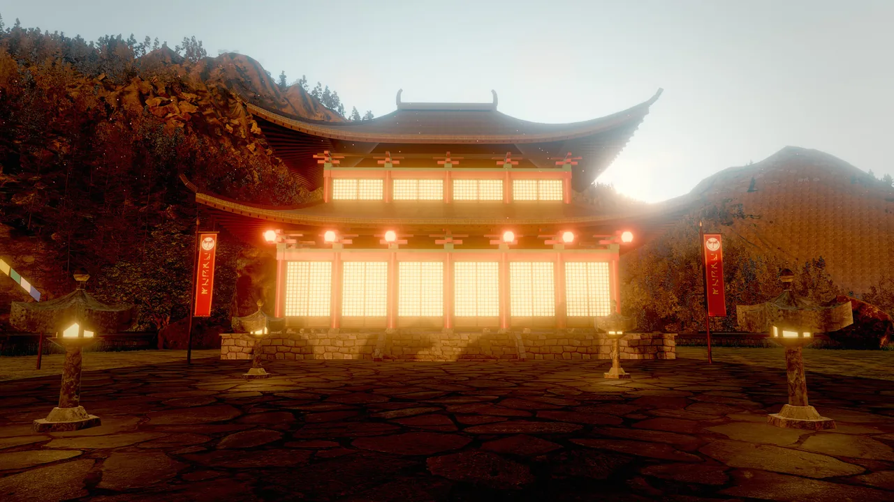
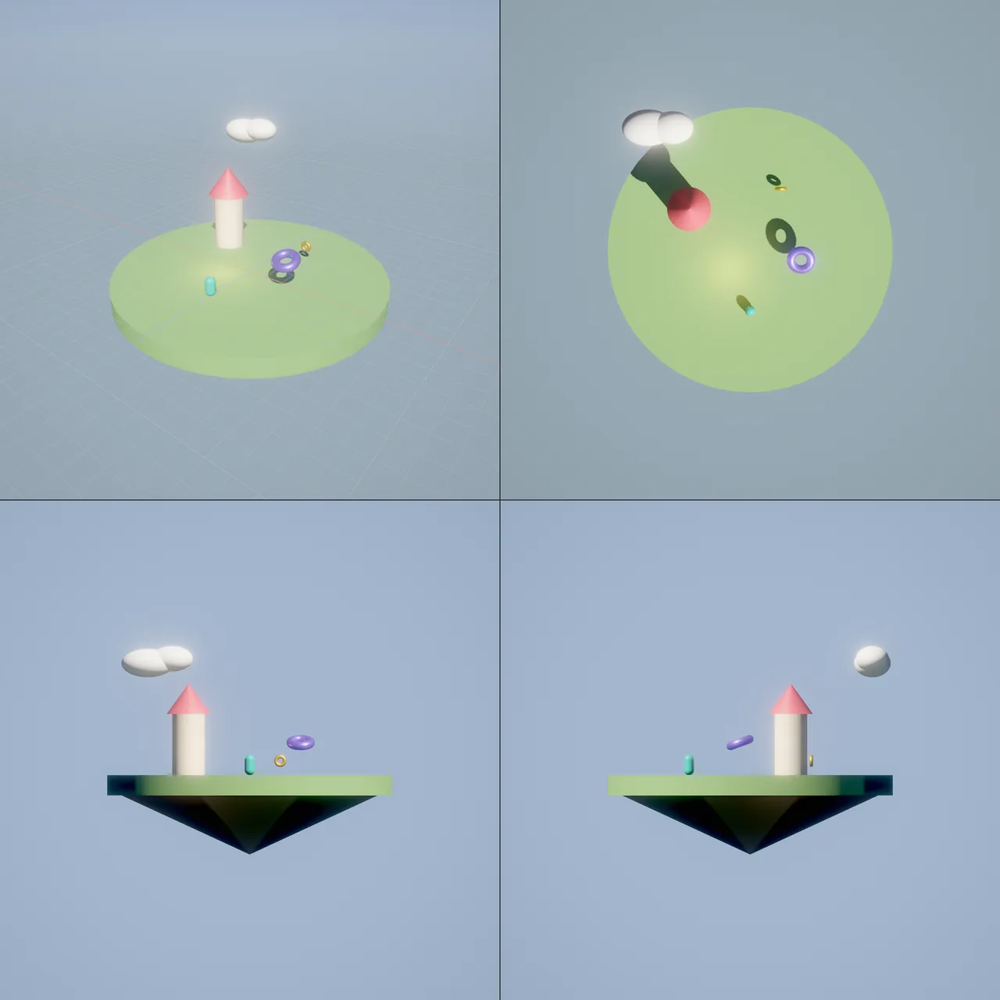

# Assets and prefabs

The project folder is the asset store. Every file the engine understands (meshes, textures, materials, prefabs,
scenes, audio, scripts) becomes an **asset record** with a stable GUID, a type, tags, a description and its
provenance, so you and your agents can search, preview, reuse and credit it. Linked prefabs package entity trees for reuse,
materials package surfaces, and the placement tools put assets on real geometry.

<figure markdown>
{ loading=lazy }
<figcaption>The ashen_peaks example builds its terrain and vegetation from downloaded, openly licensed scans; each download is recorded with its license and author in the asset's <code>.meta</code> and in the project's <code>CREDITS.md</code>.</figcaption>
</figure>

## Concepts

### Asset records

| Field | Meaning |
|---|---|
| `guid` | A stable id stored in a `<file>.meta` sidecar next to the file. It survives renames and moves. Tools accept `"guid:3f2a…"` wherever they take an asset. |
| `path` | Project-relative path with `/` separators. Scenes reference assets by path (`"asset:models/boat.glb"`). |
| `type` | One of `mesh`, `texture`, `material`, `prefab`, `scene`, `audio`, `video`, `script`, `agent`, `animation`, `controller`, `sequence`. |
| `tags`, `description` | Free-form search metadata. Write them: they are how the next agent finds the asset. |
| `source` | Provenance, for example `{"generator": "texgen", "kind": "grass", "seed": 1}` or the license and author of a download. |
| `import` | Importer settings and output, for example `normalize` and `z_up` for a mesh. |

A `.meta` file is small JSON:

```json
{
  "guid": "8c612c6ac5452d7cfac912192eaf1aed",
  "type": "texture",
  "tags": ["generated", "grass"],
  "description": "",
  "source": {"generator": "texgen", "kind": "grass", "seed": 1, "by": "mcp:Pixel"},
  "import": {}
}
```

The database rescans the project every two seconds while you edit, and on `asset_refresh`. The scan skips
dot-folders, `build/`, `node_modules/` and `DerivedData/`. Commit `.meta` files with your assets so GUIDs stay stable
for everyone on the team.

### Types by file name

| Type | Files |
|---|---|
| Mesh | `.glb`, `.gltf`, `.obj` (with `.mtl`), `.ply`, `.stl` |
| Texture | `.png`, `.jpg`, `.jpeg`, `.hdr` (sky panoramas for `skyMode: hdri`) |
| Material | `.mat.json` |
| Prefab | `.prefab.json` |
| Scene | `.sky.json` |
| Script | `.wander` |
| Agent | `.agent.json` |
| Animation, controller, sequence | `.anim`, `.animctl.json`, `.sequence.json` |
| Audio | `.wav`, `.mp3`, `.ogg`, `.m4a`, `.flac` |
| Video | `.mp4`, `.mov`, `.webm` |

## Meshes

| Format | What is imported |
|---|---|
| glTF 2.0 / GLB | The node hierarchy (flattened), normals, UVs, vertex colors and the materials: base color, metal/roughness, emissive, normal, ORM and emissive maps, alpha mask or blend, double-sided. A model with several materials becomes *parts* (`asset:model.gltf#<material index>`), one entity each, saved together as `<model>.prefab.json`. Embedded, data-URI and external buffers all load; external textures are referenced in place. |
| OBJ + MTL | Polygons (triangulated), normals, UVs, `v x y z r g b` vertex colors and the first `.mtl` material (`Kd`, `d`, `Ns`/`Pr` to roughness, `Pm`, `Ke`, `map_Kd`, `map_Bump`/`norm`). |
| PLY | ASCII and binary (both byte orders): positions, normals, UVs, vertex colors, polygon faces. Point clouds without faces are rejected with a hint. |
| STL | ASCII and binary, flat-shaded facets (CAD and 3D-printing models). |

Import options, stored in the asset's `.meta` so the model loads the same way every time:

- `normalize` (default `true`) scales the model to fit a 1 m cube, centered on the ground, so generated models arrive
  at a predictable size. Use `false` for assets already in real-world meters (photoscans). The result reports the
  model's `bounds`, so you can place it precisely.
- `z_up` rotates Z-up sources (CAD, scans, some exporters) to Y-up.

Rigged or animated glTF characters also get an animation library (`<name>.anim`: skeleton plus clips) and a prefab
with an `animator`; they keep their real size unless you pass `normalize`, and are turned to face −Z. Animation-only
glTF files become clip libraries. See [Animation](animation.md).

Meshes of 3,000 triangles or more get an automatic level-of-detail chain at load. The engine also keeps a CPU copy of
every mesh, which makes `raycast`, `place_on_surface` and `scatter` triangle-accurate.

## Materials

A material asset (`.mat.json`) holds the same surface fields as the `mesh` component: color, metallic, roughness,
emissive, maps, shading model, triplanar projection, clearcoat, subsurface, rim and outline. When `mesh.material` is
set, the material overrides the entity's inline color, PBR values, emissive and texture. Editing a material updates
every entity that uses it, live.

```json
{
  "format": "skywalker.material",
  "version": 1,
  "color": "#e0b040",
  "metallic": 1,
  "roughness": 0.25,
  "emissive": "#000000",
  "shading": "pbr",
  "texture": "",
  "tilingU": 1,
  "tilingV": 1
}
```

```tool
material_create {"path": "materials/brass.mat.json", "preset": "gold", "roughness": 0.35}
material_assign {"entities": ["Bell", "Door Handle"], "material": "materials/brass.mat.json"}
material_update {"path": "materials/brass.mat.json", "color": "#c8a050"}
texture_generate {"kind": "cobblestone", "name": "textures/plaza_stones", "color1": "#8a8580"}
```

`texture_generate` writes a seamless albedo, normal and ORM set and, by default, a triplanar material that uses them.
The field-by-field guide, every preset and every texture kind are on [Materials](rendering/materials.md).

## Prefabs

A prefab (`.prefab.json`) is a saved entity tree: components, behaviors (intent and Wander), vars, tags and children.
The root's position is stored at zero, so instances can go anywhere.

```json
{
  "format": "skywalker.prefab",
  "version": 1,
  "name": "Bamboo",
  "root": {
    "name": "Bamboo",
    "enabled": true,
    "tags": [],
    "vars": {},
    "components": {"transform": {"position": [0, 0, 0], "rotation": [0, 0, 0], "scale": [1, 1, 1]}},
    "behaviors": [
      {"name": "Sway", "intent": "Sway gently in the breeze, each cluster on its own phase.", "source": "on tick\n  self.rotation = (sin(time * 0.7 + self.id) * 2.5, 0, cos(time * 0.55 + self.id * 1.3) * 2.5)\nend", "enabled": true}
    ],
    "children": [
      {"name": "Bamboo Cane 1", "enabled": true, "tags": [], "vars": {},
       "components": {"transform": {"position": [0.35, 3, 0], "scale": [0.16, 6, 0.16]},
                      "mesh": {"mesh": "cylinder", "color": "#6a9a3a", "roughness": 0.45}}}
    ]
  }
}
```

(An abridged copy of `examples/zen_garden/prefabs/bamboo.prefab.json`.)

| To | Use |
|---|---|
| Create | `prefab_create`, or right-click an entity in the Outliner and choose **Save as Prefab** |
| Place one | `prefab_instantiate` (with `on_surface` to drop it onto the geometry below), or drag it from the asset browser |
| Place many | `scatter` with `prefab` |
| Spawn at run time | Wander `spawn("prefab:prefabs/coin.prefab.json", position)` |

### Linked prefabs and overrides

A placed prefab stays **linked** to its `.prefab.json`. `prefab_instantiate`, `scatter` with a prefab, the asset browser
and Wander's `spawn("prefab:...")` all create linked instances, and `prefab_create` links the source entity to the new
prefab (`link: false` opts out). Instances are ordinary entities to rendering, physics and Wander; the scene file
stores only what each instance changes, its **overrides**:

| Override | Example |
|---|---|
| One component field | `light.intensity` |
| A component added or removed | `light` (the whole component, or `null`) |
| A record field | `name`, `enabled`, `tags`, `unique`, `behaviors` (behaviors compare as a whole) |
| One variable | `vars.hp` |

The instance root's name and transform are its *placement* and never count as overrides. Every way of editing (tools,
the editor, the gizmo, Wander in edit mode) produces overrides, field by field.

When the prefab file changes (an edit on disk, or `prefab_apply`), every instance in the open scene is rebuilt from the
new version and keeps its overrides; other scenes pick the change up when they load. Entity ids of existing members
stay the same, and while the game is playing the update waits until play stops. A missing prefab file loads as a
placeholder that keeps its saved data, and `scene_load` warns about it.

| To | Use |
|---|---|
| See what an instance changes | `prefab_overrides {"entity": ...}`; without `entity`, every instance with its override count |
| Undo an override | `prefab_revert` (one property, all of an entity's overrides, or the whole instance) |
| Make an override the default | `prefab_apply` pushes it into the prefab file; other instances update and keep their own overrides |
| Detach an instance | `prefab_unpack` keeps the entities as they are, unlinked |
| Adopt copies in an old scene | `prefab_relink` links existing copies whose hierarchy matches the prefab node for node |

```tool
prefab_instantiate {"prefab": "prefabs/lamp.prefab.json", "position": [4, 0, 2]}
prefab_overrides {}
prefab_revert {"entity": "Lamp", "property": "light.intensity"}
prefab_apply {"entity": "Lamp", "property": "light.intensity"}
prefab_relink {"prefab": "prefabs/tree.prefab.json", "dry_run": true}
```

### Entity links and unique names

Component fields that point at another entity (a joint's `target`, a 2D camera's `follow`, an animator's `lookAt`,
bone attachments, IK, hair and particle colliders) store the target's **id** plus its name, so renames never break
them. Duplicating or pasting a group (`entity_duplicate`, `entity_copy` / `entity_paste`) keeps the copies wired to
each other. `entity_refs {"entity": "Door"}` lists what points at an entity; `entity_refs {}` is a scene health check
that lists dangling links, name-only links, duplicate unique names and broken prefab instances, each with a fix.

Mark a part unique (`entity_update {"entity": "Muzzle", "unique": true}`) and Wander's `find("%Muzzle")` finds the
copy inside the caller's own prefab instance, so every spawned enemy finds its own muzzle.

## Downloading assets

`asset_download` fetches an openly licensed model, texture, `.hdr` panorama, sound or `.zip` pack from a URL:

- It saves into `downloads/<name>/` (or `folder`), fetches multi-file glTF and OBJ+MTL dependencies automatically, and
  takes `include` (`{"textures/a.jpg": "https://…"}`) for files hosted elsewhere.
- `.zip` packs are extracted with path-traversal and size guards.
- It records the license, author, URL and retrieval date in every file's `.meta`, and appends a credit line to the
  project's `CREDITS.md`.
- It imports models (`normalize` and `z_up` as above) and can place one as a new entity (`create_entity`,
  `position`).

The license rules are part of the tool:

- Only download assets whose license allows the project's use: CC0, CC-BY with attribution, MIT, public domain, or
  terms the human accepted. Give the license exactly as the source page states it.
- Unknown or "all rights reserved" licenses are refused. Non-commercial and no-derivatives licenses produce warnings.
- Never bypass logins, paywalls or download limits.

`asset_download` is an open-world tool: MCP clients show it as a network action that needs approval, and in the editor
the **Network** permission asks before every download unless you allow it for an agent. See
[Permissions and approvals](../agents/permissions.md).

### Generated assets

For content from an image, 3D or audio generator, an agent queues `asset_request {kind, prompt, target}`. A connected
generator (or another agent) fulfills it with `asset_complete {id, path}`: a mesh is imported and assigned to the
target, a texture becomes its texture, a sprite turns it into a camera-facing textured quad. `asset_requests` lists
pending, done and failed requests. Provenance (the prompt, who made it) lands in the `.meta`.

## Spatial placement

Placement tools work on real triangles, not bounding boxes:

| Tool | Use |
|---|---|
| `raycast` | The first mesh hit along a ray: entity, point, normal and distance. Give `origin` + `direction`, or a pixel `x`, `y` of an editor capture. Ground height, line of sight, aiming. |
| `place_on_surface` | Moves entities straight down (or up) until the bottom of their bounds rests on the geometry below, with an optional `offset`. One undo step. |
| `scatter` | Places 1 to 2000 copies of an entity or prefab in a rectangle (`size`) or circle (`radius`), with `min_distance`, random `yaw` and `scale` ranges, optional snapping to a `surface`, and a `seed`. All copies go under one group entity in one undo step; the same seed gives the same layout. |
| `prefab_instantiate` | One instance with `position`, `yaw` or `rotation`, `scale`, `parent` and `on_surface`. |
| `viewport_multi` | Perspective plus top, front and side orthographic views in one image, to check layout and spacing. |

<figure markdown>
{ loading=lazy }
<figcaption><code>viewport_multi</code> on hello_sky: perspective (top left), top, front and side views in one image.</figcaption>
</figure>

## How to find, inspect and place an asset

=== "Tool call"

    ```tool
    asset_list {"type": "prefab", "query": "tree"}
    asset_info {"asset": "prefabs/pine.prefab.json"}
    asset_preview {"asset": "prefabs/pine.prefab.json", "size": 384}
    prefab_instantiate {"prefab": "prefabs/pine.prefab.json", "position": [4, 10, -2], "on_surface": true}
    ```

=== "Wander"

    ```wander
    behavior CoinFountain
      intent "When the chest is opened, spawn five coins in a ring above it."
      on event "open"
        for i in 0..5
          let a = rad(i * 72)
          spawn("prefab:prefabs/coin.prefab.json", self.position + (cos(a), 1.5, sin(a)))
        end
      end
    end
    ```

=== "CLI"

    ```bash
    skywalker call asset_list '{"type": "mesh"}' --project my_game
    skywalker call asset_preview '{"asset": "models/boat.glb"}' --project my_game -o boat.png
    ```

`asset_info` lists everything about one asset, including **which entities use it**, and type-specific data such as a
material's fields or a prefab's contents. `asset_preview` renders an isolated thumbnail: a mesh, a material on a
sphere, a texture or a prefab.

## How to import a file you placed in the project

```tool
asset_import {"path": "models/lighthouse.glb", "create_entity": "Lighthouse", "position": [12, 0, -30], "normalize": false, "tags": ["landmark"], "description": "Stone lighthouse with a glass lantern room"}
asset_tag {"asset": "models/lighthouse.glb", "tags": ["landmark", "coast"], "description": "Stone lighthouse, real-world scale"}
asset_move {"asset": "models/lighthouse.glb", "to": "models/coast/lighthouse.glb"}
```

`asset_move` moves the file together with its `.meta` and GUID and rewrites references in the open scene. The file move
itself is not part of the undo history; move it back with another `asset_move`.

## Recipe: a pine forest on an island

```tool
asset_list {"query": "pine"}
asset_preview {"asset": "prefabs/pine.prefab.json"}
scatter {"prefab": "prefabs/pine.prefab.json", "count": 40, "radius": 12, "min_distance": 1.5, "yaw": [0, 360], "scale": [0.8, 1.3], "surface": "Island", "seed": 7}
viewport_multi {"size": 384}
```

If the layout is wrong, undo once (the scatter is one step), change `seed`, `min_distance` or `radius`, and run it
again. For dense ground cover over terrain (grass, flowers, pebbles) use `foliage_add`, which instances on the GPU; see
[Foliage](world/foliage.md).

## The editor's asset browser

The **Assets** dock shows every record with type filters and counts, search over paths, tags and descriptions, and
thumbnails rendered on demand and cached until the file changes. The inspector shows provenance and usage.

- Drag a mesh or prefab into the viewport: it lands on the surface under the cursor.
- Drag a material or texture onto an object in the viewport: it applies to that object.
- Drop an asset on the *Material*, *Texture* or *Mesh* field in Details, or use the field's asset menu.

<div class="sky-placeholder"><strong>Editor screenshot</strong>assets/editor/assets-dock.webp · The Assets dock with type filters and counts, a search for "rock", thumbnails, and the inspector showing a downloaded asset's license and usage</div>

## Pitfalls

- **Normalization changes size.** By default meshes are scaled to 1 m. Pass `"normalize": false` for scans and kits
  authored in meters, and read the reported `bounds`.
- **Materials override inline values.** An entity with `mesh.material` ignores its own color and PBR fields.
- **Overrides win over prefab edits.** A field you changed on an instance keeps its value when the prefab changes; use
  `prefab_revert` to follow the prefab again. Behaviors and tags compare as whole values, so editing one script
  overrides the instance's whole behavior list.
- **No nested prefabs or variants.** A prefab made from a tree that contains instances flattens them; the
  `prefab_create` result says so.
- **Unknown licenses are refused.** `asset_download` needs the license string from the source page; it will not guess.
- **Commit `.meta` files.** Without them, GUIDs are regenerated on another machine and GUID references break.

!!! agent "For agents"

    Search before you make, look before you place, and describe what you add:

    ```tool
    asset_list {"query": "rock", "type": "mesh"}        # reuse what the project already has
    asset_preview {"asset": "models/rock_a.glb"}        # check it is the right thing
    scatter {"source": "Rock A", "count": 25, "radius": 8, "surface": "Ground", "seed": 3}
    viewport_multi {}                                   # verify layout from four views
    asset_tag {"asset": "models/rock_a.glb", "tags": ["rock", "granite"], "description": "Mossy granite boulder, 1 m"}
    ```

    Downloads need the human's approval and a stated license; prefer assets already in the project.

## Reference

- Tools: [Asset tools](../reference/tools/asset.md) (`asset_list`, `asset_info`, `asset_preview`, `asset_import`,
  `asset_tag`, `asset_move`, `material_create`, `prefab_create`, `prefab_instantiate`, `prefab_overrides`,
  `prefab_revert`, `prefab_apply`, `prefab_unpack`, `prefab_relink`),
  [`entity_refs`](../reference/tools/entity.md#entity_refs),
  [`asset_download`](../reference/tools/network.md#asset_download), [`raycast`](../reference/tools/world.md#raycast),
  [`place_on_surface`](../reference/tools/world.md#place_on_surface), [`scatter`](../reference/tools/world.md#scatter),
  [`viewport_multi`](../reference/tools/view.md#viewport_multi)
- Wander: [`spawn`](../reference/wander.md#scene-spawn)
- Design: [docs/ASSETS.md](https://github.com/amirhossein-razlighi/Skywalker/blob/main/docs/ASSETS.md)
