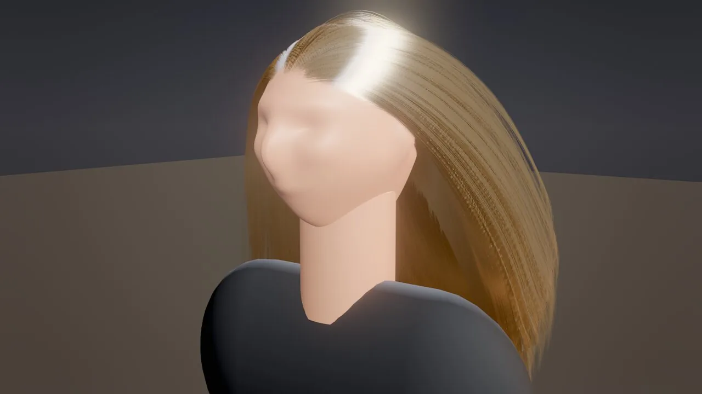
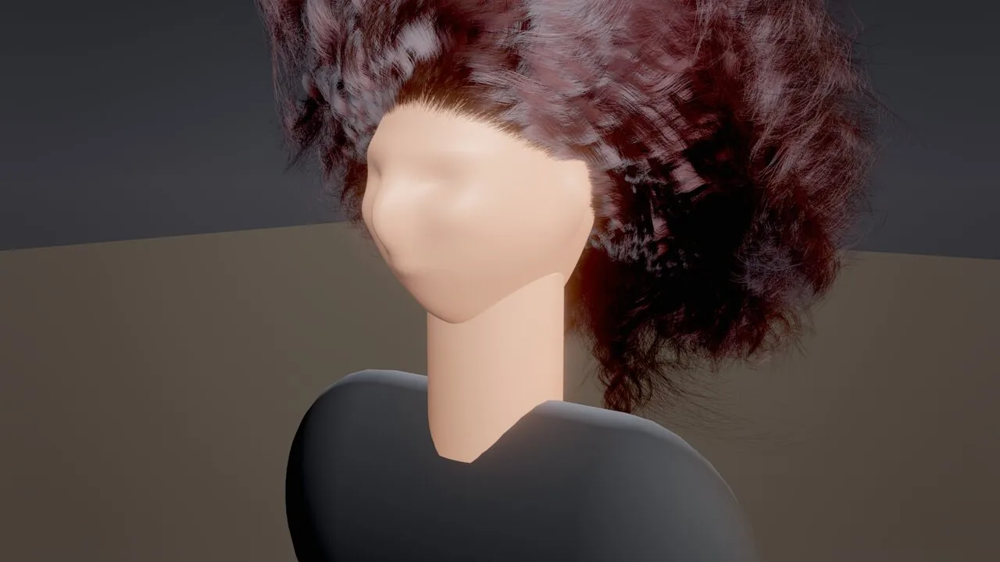
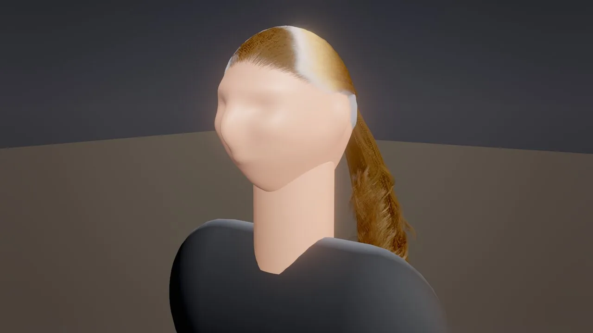
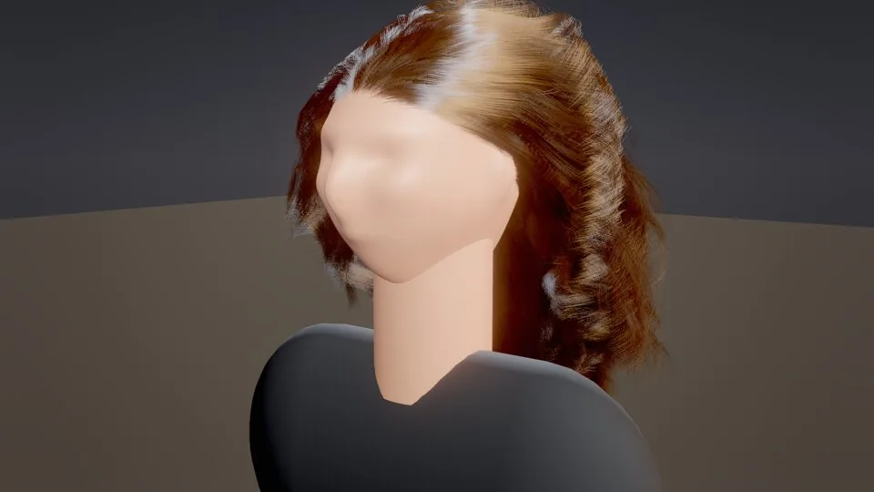
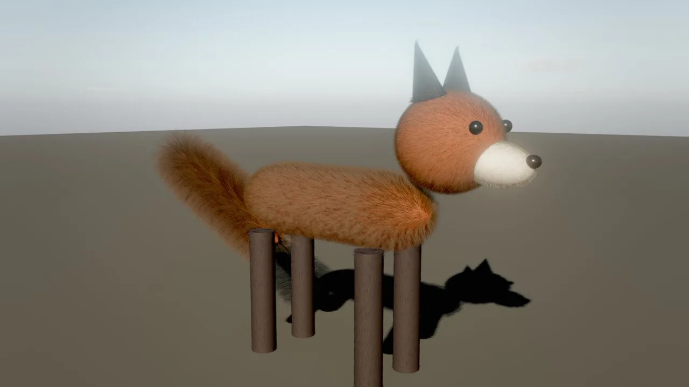
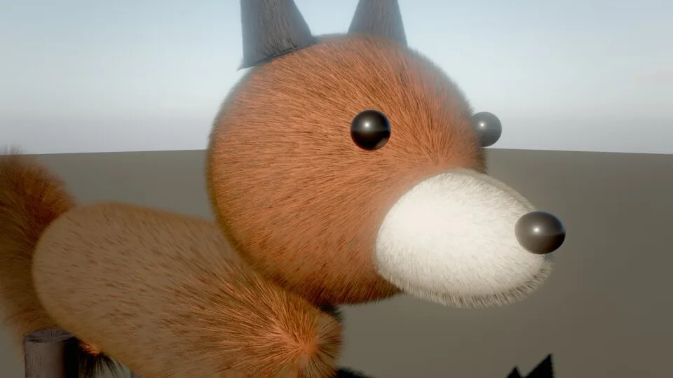

# Hair and fur

The `groom` component gives a character real strand hair or an animal fur: tens of thousands to hundreds of thousands of individual strands grown on a mesh or loaded from a file, simulated on the GPU and shaded with a Marschner hair model, physically based pigment and self-shadowing. You start from a preset with `groom_create`, then style it with the same fields an artist would use: length, comb direction, clumps, curls, waves, frizz and colour.

<figure markdown>
{ loading=lazy }
<figcaption><code>groom_create</code> with the <code>hair_wavy</code> preset on a bust: about 120,000 strands with clumped waves, a white primary highlight and a coloured secondary highlight.</figcaption>
</figure>

## Concepts

### Presets

| Preset | Grows on | Strands | Length | Character |
|---|---|---|---|---|
| `hair_straight` | Upper back of the mesh (a head) | 110,000 | 0.34 m | Straight, dark brown, light clumping |
| `hair_wavy` | Head | 120,000 | 0.38 m | Waves, medium brown with some red |
| `hair_curly` | Head | 90,000 | 0.30 m | Ringlets (curl radius 11 mm), near black, stiffer |
| `hair_ponytail` | Head | 90,000 | 0.50 m | Combed back and tied at `ponytailPosition` |
| `hair_short` | Head | 90,000 | 0.035 m | Crew cut, not simulated |
| `fur_short` | The whole mesh | 160,000 | 0.014 m | Dense pelt, cards below 60 px, not simulated |
| `fur_long` | The whole mesh | 90,000 | 0.07 m | Fluffy, clumped, simulated |

Head presets grow where the surface faces up and back (`maskDirection` [0, 0.8, −0.6], `maskAngle` 95°). For your own head model, adjust the mask or paint a scalp (see below).

<div class="sky-compare" markdown>
<figure markdown>{ loading=lazy }<figcaption><code>hair_straight</code> with a low <code>melanin</code>: blond</figcaption></figure>
<figure markdown>{ loading=lazy }<figcaption><code>hair_curly</code>: clumped ringlets</figcaption></figure>
<figure markdown>{ loading=lazy }<figcaption><code>hair_ponytail</code></figcaption></figure>
</div>

### How a groom is built

1. **Placement.** Roots are sampled area-weighted on the mesh: the entity's own mesh, or the mesh of the entity named in `target`. A density mask combines a cone (`maskDirection`, `maskAngle`, with `maskSoftness` as the width of a soft hairline) with an optional vertex-colour channel (`maskChannel`), so a painted scalp works. Because vertex colours also tint a mesh's surface, the usual setup is an invisible copy of the head carrying the painted scalp, named in `target`.
2. **Guides.** `guides` strands (0 = automatic, about 4·√strands) grow along the surface: from the normal toward the comb `direction` projected onto the scalp (`directionBlend`), drooping with `gravity`, and kept outside the mesh so long hair drapes over the head. With `ponytail`, every guide is first combed to `ponytailPosition`, then hangs as one bundle.
3. **Children.** The rendered strands interpolate their three nearest guides and add detail in each guide's own frame: clumping toward clump centres (`clumps`, `clumpStrength`, `clumpShape`), helical curls (`curlRadius`, `curlFrequency`), waves (`wave`, `waveFrequency`) and frizz (`frizz`, `frizzScale`). Strands in one clump share their curl phase, so curly hair forms ringlets.
4. **Cache.** The result is cached per parameter hash (geometry fields, mesh, entity scale, source file time). Generation is deterministic and multi-threaded: about 0.3–0.7 s for 100,000 strands.

Grooms are generated in **meters** on the scaled mesh: an entity scaled to head size does not shrink its hair. Lengths are in meters and widths in millimeters (human hair is 0.05–0.1 mm).

### Fields

**Shape**

| Field | Meaning |
|---|---|
| `strands` | Rendered strands: 50k–150k for a head of hair, 100k+ for fur. For imported files, a cap (a uniform subset). |
| `guides` | Simulated guide strands; 0 = automatic. |
| `segments` | Segments per strand: 4 for fur, 16–31 for long or curly hair. |
| `length`, `lengthVariation` | Strand length (m) and its random variation (fraction). |
| `widthRoot`, `widthTip` | Strand width in millimeters at the root and tip. |
| `direction`, `directionBlend` | Comb direction in mesh space (for example [0, −1, −0.4] = down and back) and how much the strands follow it instead of the normal. |
| `gravity` | 0 stands up (fur, crew cut) .. 1 hangs down. |
| `curlRadius`, `curlFrequency` | Curl radius (m; 0.005–0.02 for curly hair) and turns per meter. |
| `wave`, `waveFrequency` | Wave amplitude (m) and waves per meter. |
| `clumps`, `clumpStrength`, `clumpShape` | Number of clumps, how far strands pull into them, and the profile (> 1: tips clump more than roots). |
| `frizz`, `frizzScale` | Flyaways (m) and their noise frequency. |
| `ponytail`, `ponytailPosition` | Tie everything at a point in mesh space, just outside the scalp. |
| `maskChannel`, `maskDirection`, `maskAngle`, `maskSoftness` | Where hair grows (see Placement). |
| `density` | Coverage per strand (2 = a full head at typical strand counts). |
| `seed` | A different head of the same style. |

**Colour and shading**

| Field | Meaning |
|---|---|
| `melanin` | Pigment amount: 0 white, 0.1 platinum, 0.2 blond, 0.35 dark blond, 0.5 light brown, 0.7 brown, 0.85 dark brown, 0.95+ black. |
| `redness` | Red pigment fraction: 0.5 auburn, 0.9 ginger. |
| `dye` | Dye tint (white = natural). |
| `rootColor`, `tipColor` | Colour multipliers at the roots and tips (dark roots, sun-bleached tips). |
| `colorVariation` | Per-strand pigment variation. |
| `roughness` | Longitudinal roughness: highlight width (0.2 silky .. 0.6 dull). |
| `radialRoughness` | Azimuthal roughness: softness of light through the strand. |
| `specular` | Strength of the primary (white) highlight. |
| `scatter` | Multiple scattering: light hair glows, dark hair stays rich. |
| `cuticleTilt` | Degrees; separates the two highlights. |

**Motion and rendering**

| Field | Meaning |
|---|---|
| `simulate` | Simulate on the GPU. `false` keeps the groomed shape (it still follows the entity). |
| `stiffness`, `rootStiffness` | How strongly strands keep their groomed shape, overall and near the roots. |
| `damping` | Velocity damping. |
| `wind` | Influence of the environment wind (0–10). |
| `collide`, `colliders` | Collide with the mesh's proxy and with the comma-separated entities in `colliders` (for example `"Torso, Neck"`). |
| `lod`, `cardsBelow` | `auto` (strands up close, cards far away), `strands` or `cards`; the size in pixels below which `auto` switches to cards. |
| `castShadows`, `visible` | Shadows on the scene; drawing on or off. |

Geometry fields (strands, length, curls, clumps, mask) regenerate the strands when they change. Colour, shading and motion fields apply instantly.

### Physically based colour

Colour is an absorption coefficient, not an RGB value. `melanin` sets the amount of eumelanin and pheomelanin and `redness` their ratio; `dye`, `rootColor` and `tipColor` add absorption. Dyed hair therefore keeps a white primary highlight, and the same groom looks right under noon sun, a candle and a neon sign.

### Simulation

Guides are simulated on the GPU every frame, one thread per guide, with substeps at 120 Hz:

- Verlet integration with gravity and the gusting environment wind (scaled by `wind`);
- global shape stiffness toward the groomed pose, strongest at the roots (`rootStiffness`);
- local shape stiffness: each segment keeps its rest angle relative to its parent (`stiffness`);
- follow-the-leader length constraints, so strands do not stretch;
- collisions with spheres, capsules and planes: the head's own proxy plus the entities in `colliders`.

Rendered strands follow their guides through stored frame offsets.

<figure markdown>
{ loading=lazy }
<figcaption>The <code>hair_wavy</code> groom in a breeze: <code>environment_update {"windSpeed": 6}</code>, simulated guides with the children following.</figcaption>
</figure>

### Shading and rendering

- **Strands.** Every strand is an instanced triangle strip expanded to a camera-facing ribbon. Strands thinner than a pixel are drawn about one pixel wide with proportionally lower coverage, turned into a stochastic MSAA sample mask that changes every frame and sub-sample. Thin hair resolves smoothly under temporal anti-aliasing and in accumulated stills, without sorting.
- **Marschner shading.** A real-time fit of the Marschner model with three lobes: R (the white primary highlight, shifted by `cuticleTilt`), TT (light through the strand: the backlit glow) and TRT (the coloured secondary highlight), with longitudinal (`roughness`) and azimuthal (`radialRoughness`) terms, plus a multiple-scattering term (`scatter`).
- **Self-shadowing.** A deep opacity map per groom from the sun (front depth plus four cumulative density layers, 512²), combined with the depth of the opaque meshes around the groom, so the head shadows the hair. Light through light hair is tinted (a dual-scattering approximation). Other occluders come from the regular sun cascades.
- **Shadows on the scene.** Hair is drawn into the sun cascades with stochastic coverage, so the face and shoulders get soft hair shadows.
- **G-buffer.** Hair writes albedo, its shading normal and a hair flag. Screen-space GI, reflections and ambient occlusion leave those pixels alone; hair has its own ambient and occlusion terms.
- **Level of detail.** With `lod: auto`, the groom draws strands up close and cards far away (`cardsBelow` pixels: guide strands as wide ribbons with procedural strand alpha). In real time the strand count follows the groom's size on screen (fewer, more opaque strands). Stills rendered with `samples` > 1 always draw every strand.

<div class="sky-compare" markdown>
<figure markdown>{ loading=lazy }<figcaption>One groom per body part: <code>fur_short</code> on body, head, snout (low <code>melanin</code>: white), ears and legs; <code>fur_long</code> on the tail</figcaption></figure>
<figure markdown>{ loading=lazy }<figcaption>Close-up: individual strands, combed direction and soft self-shadowing</figcaption></figure>
</div>

### Groom files

| Format | Notes |
|---|---|
| `.hair` | The binary HAIR format by Cem Yuksel: segments, points and thickness arrays. Many public groom datasets and DCC exporters write it. |
| `.groom.json` | `{"format": "skywalker-groom", "version": 1, "strands": [[x, y, z, ...], ...], "widths": [mm, ...]}`; `widths` is optional. Readable and easy to script. |
| `.skygroom` | Compact binary: `SKYGROOM` magic, u32 version (1), u32 strands, u32 points per strand, u32 flags (bit 0: widths), then floats. |

Set `source` to load a file. `importScale` converts units (0.01 for centimeters) and `importZUp` handles Z-up files. `strands` then caps the count with a uniform subset. Imported strands keep their exact shape; a subset becomes the simulated guides.

## How to add hair

=== "Tool call"

    ```tool
    groom_create {"entity": "Head", "preset": "hair_wavy", "overrides": {"melanin": 0.5, "redness": 0.6}}
    groom_update {"entity": "Head", "fields": {"curlRadius": 0.01, "curlFrequency": 16, "length": 0.3}}
    groom_info {"entity": "Head"}
    ```

=== "CLI"

    ```bash
    skywalker call groom_create '{"entity": "Head", "preset": "hair_straight", "overrides": {"melanin": 0.2}}' --project .
    ```

=== "Wander"

    ```wander
    behavior WindBlownHair
      intent "Hair reacts more strongly to the wind while the character stands on the cliff edge."
      param calm = 1 in 0..10 "wind influence away from the edge"
      param exposed = 4 in 0..10 "wind influence near the edge"

      on tick
        let edge = find("Cliff Edge")
        if edge and distance(self, edge) < 6 then
          self.groom.wind = approach(self.groom.wind, exposed, dt * 2)
        else
          self.groom.wind = approach(self.groom.wind, calm, dt * 2)
        end
      end
    end
    ```

`groom_create` works on any entity with a mesh; a sphere stands in for a head while you block out the look. `groom_update` can also reset to another preset first (`"preset": "hair_curly"`) and then apply `fields`.

### Paint a scalp

1. Duplicate the head mesh and paint the hair region into a vertex-colour channel (for example red) in your DCC app.
2. Import the copy as `Scalp`, parent it to the head at the same transform and make its mesh invisible, so the painted colours do not tint the face.
3. Point the groom at it and select the channel. `maskAngle` 180 leaves the decision to the painted mask:

    ```tool
    entity_update {"entity": "Scalp", "parent": "Head", "components": {"transform": {"position": [0, 0, 0]}, "mesh": {"visible": false, "castShadows": false}}}
    groom_update {"entity": "Head", "fields": {"target": "Scalp", "maskChannel": "r", "maskAngle": 180, "colliders": "Torso, Neck"}}
    ```

### Load a groom file

```tool
entity_update {"entity": "Head", "components": {"groom": {"source": "grooms/long_hair.hair", "importScale": 0.01, "importZUp": true, "strands": 80000}}}
groom_export {"entity": "Head", "path": "grooms/head.groom.json"}
```

`groom_export` writes the rest-pose strands to `.hair`, `.groom.json` or `.skygroom` for a round trip through a DCC app (see [DCC bridge](dcc.md)).

## Recipes

| Look | Settings |
|---|---|
| Long glossy black hair | `hair_straight`, `melanin` 0.97, `roughness` 0.22, `length` 0.5, `stiffness` 0.3 |
| Beach waves, sun-bleached | `hair_wavy`, `melanin` 0.35, `tipColor` "#fff0d8", `wave` 0.018 |
| Tight curls or coils | `hair_curly`, `curlRadius` 0.006, `curlFrequency` 30, `clumps` 2000, `segments` 31 |
| Copper red | `melanin` 0.5, `redness` 0.9 |
| Pastel dye | `melanin` 0.15, `dye` "#ffb0d8" |
| Dark roots, blond lengths | `melanin` 0.2, `rootColor` "#5a4030" |
| Ponytail | `hair_ponytail`; move `ponytailPosition` (mesh space, just outside the scalp) |
| Buzz cut or stubble | `hair_short`, `length` 0.006–0.02, `simulate` false |
| Cat or fox fur | `fur_short`, `strands` 150k–300k, `length` 0.015–0.03, `direction` toward the tail, body mesh colour close to the fur colour |
| Fluffy tail | `fur_long` on a capsule, `length` 0.08–0.12, `tipColor` "#ffffff" |
| Hair in the wind | `environment_update {"windSpeed": 6}`; the groom's `wind` scales it |
| Hair over shoulders | `colliders` "Torso, Neck" |

### Recipe: a fox

The fox above is built from primitives with one groom per part. Shared pigment settings keep the parts consistent:

```tool
entity_create {"name": "Body", "mesh": "capsule", "color": "#9c4a22", "position": [0, 0.44, 0], "rotation": [0, 0, 90], "scale": [0.36, 0.64, 0.34]}
groom_create {"entity": "Body", "preset": "fur_short", "overrides": {"melanin": 0.62, "redness": 0.9, "colorVariation": 0.3, "tipColor": "#f4e2cc", "density": 3.5, "strands": 300000, "length": 0.03, "direction": [0, 1, 0], "directionBlend": 0.7, "gravity": 0.25}}
entity_create {"name": "Tail", "mesh": "capsule", "color": "#9c4a22", "position": [-0.46, 0.42, 0], "rotation": [0, 0, 64], "scale": [0.14, 0.55, 0.14]}
groom_create {"entity": "Tail", "preset": "fur_long", "overrides": {"melanin": 0.62, "redness": 0.9, "colorVariation": 0.3, "density": 3.5, "strands": 120000, "length": 0.1, "direction": [0, 1, 0], "directionBlend": 0.6, "tipColor": "#fffaf2"}}
viewport_capture {"eye": [1.5, 1.0, 2.2], "target": [0, 0.6, 0], "samples": 16}
groom_info {}
```

Keep the body mesh colour close to the fur colour so gaps between strands do not show the skin.

## Performance

Measured with `fx_benchmark` in serial mode on an Apple M1 Pro at 1920×1080. The stage scene alone (floor, props, sky, TAA, GI and reflections, bloom) costs 7.4 ms per frame.

| Workload | Frame (GPU) | Simulation |
|---|---|---|
| 100,000-strand groom × 25 points, close-up filling the screen (49,000 strands drawn) | 28.8 ms (+21.4 ms) | 1.4 ms + 6.7 ms deep opacity |
| Same groom, medium shot (20,000 strands drawn) | 17.5 ms (+10.1 ms) | 0.7 ms + 4.1 ms deep opacity |

Stills (`samples` 16–32) draw every strand. `groom_info` and `fx_stats` report strand, guide and point counts, memory and the measured GPU cost live for your scene. Budget hair with `strands`, `segments` and the LOD fields; a hero head under about 2 ms at 1080p is a reasonable target.

## Limits

- **No strand-strand collisions.** Shape stiffness keeps the volume. Hair collides only with sphere, capsule and plane proxies.
- **Sun-only self-shadowing.** The deep opacity map covers the sun; lamps light hair without self-shadowing.
- **Visual only.** Hair is simulated on the GPU; gameplay cannot query strand positions.
- **Cards far away.** Distant grooms switch to cards; set `lod: "strands"` for a hero shot if the switch shows.
- **Skin.** Screen-space subsurface scattering for skin is not implemented; surfaces use the wrap and transmission `subsurface` term.

!!! agent "For agents"

    Block out the look on a stand-in, then measure before you commit to strand counts:

    ```tool
    groom_create {"entity": "Head", "preset": "hair_wavy", "overrides": {"melanin": 0.25}}     # a styled starting point
    viewport_capture {"eye": [0.6, 1.7, 0.8], "target": [0, 1.6, 0], "samples": 16}            # stills draw every strand
    groom_update {"entity": "Head", "fields": {"clumps": 900, "wave": 0.018}}                   # iterate on style
    fx_benchmark {"frames": 60}                                                                 # real-time GPU cost
    groom_info {"entity": "Head"}                                                               # strands, memory, ms
    ```

    Judge hair in captures with `samples` of 8 or more: single-sample previews show the stochastic coverage as noise.

## Reference

- Tools: [`groom_create`](../reference/tools/render.md#groom_create), [`groom_update`](../reference/tools/render.md#groom_update), [`groom_info`](../reference/tools/render.md#groom_info), [`groom_export`](../reference/tools/asset.md#groom_export), [`fx_benchmark`](../reference/tools/render.md#fx_benchmark), [`fx_stats`](../reference/tools/render.md#fx_stats).
- Component: [`groom`](../reference/components/world.md#groom).
- Related pages: [Visual effects](vfx.md), [Animation](animation.md), [DCC bridge](dcc.md).
- Design document: [docs/HAIR_AND_VFX.md](https://github.com/amirhossein-razlighi/Skywalker/blob/main/docs/HAIR_AND_VFX.md).
