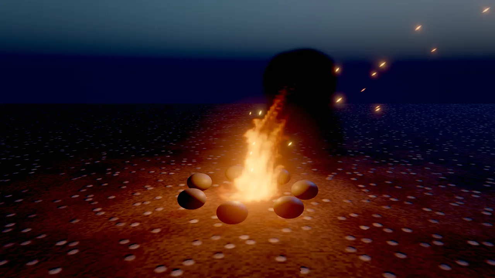

# Manual

The manual explains how Skywalker works and how to use each part of it: the data model of scenes, entities and
components, the renderer, the world tools, characters and effects, gameplay systems, the Wander behavior language and
the production pipeline. Every page shows the same task three ways where it applies (a tool call, Wander code and the
command line), because the editor, agents and scripts all use the same tools. For exhaustive lists of tools,
components, builtins and CLI options, use the [Reference](../reference/index.md).

<div class="sky-features" markdown>
<div class="sky-feature" markdown>
{ loading=lazy }
<div markdown>
### [Core](scenes.md)
Scenes, entities, components, assets and the deterministic simulation every other system builds on.
</div>
</div>
<div class="sky-feature" markdown>
{ loading=lazy }
<div markdown>
### [Rendering](rendering/index.md)
Materials, lights and shadows, sky, GI and reflections, camera and grading, debug views and the profiler.
</div>
</div>
<div class="sky-feature" markdown>
{ loading=lazy }
<div markdown>
### [World](world/terrain.md)
Eroded terrain, FFT water and GPU-instanced foliage for landscapes of any size.
</div>
</div>
<div class="sky-feature" markdown>
{ loading=lazy }
<div markdown>
### [Characters and effects](vfx.md)
Strand hair and fur, particles and fluids, skeletal animation and cinematics.
</div>
</div>
</div>

## Map of the manual

### Core

| Page | What you learn |
|---|---|
| [Scenes and entities](scenes.md) | Scene files, stable ids, hierarchy, tags and vars, the undoable and attributed edit history, saving and loading |
| [Components](components.md) | The reflected component model, component families, reading and writing fields, adding a component to the engine |
| [Assets and prefabs](assets.md) | Asset records and GUIDs, mesh import, materials, prefabs, licensed downloads, placement on real geometry |
| [Simulation and time](simulation.md) | Play, pause and step, determinism, the game's pause and time scale, `process` modes, render interpolation |

### Rendering

| Page | What you learn |
|---|---|
| [Rendering overview](rendering/index.md) | The frame and its passes, real-time versus stills, quality tiers, render scale, shaders, render layers |
| [Materials](rendering/materials.md) | Surface fields, PBR, toon and unlit shading, presets, generated PBR textures |
| [Lighting and shadows](rendering/lighting.md) | Clustered lights, the `light` component, sun cascades, cloud shadows, volumetric light |
| [Sky and atmosphere](rendering/sky.md) | Gradient, atmosphere and HDRI skies, volumetric clouds, stars, fog, wind, presets |
| [GI and reflections](rendering/gi.md) | Screen-space GI, reflections and AO, the sky probe, samples for stills |
| [Camera and post-processing](rendering/post.md) | Lens and depth of field, exposure, tonemapping, grading and looks, bloom, TAA, motion blur |
| [Debug views](rendering/debug-views.md) | Every buffer and diagnostic view, legends, texture density checks |
| [Profiler](rendering/profiler.md) | Per-pass GPU timing, CPU scopes, benchmarks, the slow-frame recipe |

### World

| Page | What you learn |
|---|---|
| [Terrain](world/terrain.md) | Heightfield terrain generation, sculpting, painting layers, heightmaps and map overlays |
| [Water](world/water.md) | The FFT ocean, lakes and pools, shores, and querying wave heights for gameplay |
| [Foliage](world/foliage.md) | GPU-instanced grass, plants, rocks and trees, wind, LODs and impostors |

### Characters and effects

| Page | What you learn |
|---|---|
| [Hair and fur](hair.md) | Strand grooms from presets or files, shading, simulation and budgets |
| [Visual effects](vfx.md) | CPU and GPU particles, volumetric fluids and the effect presets |
| [Animation](animation.md) | Skeletal animation, animator controllers, IK, bone attachments and sequences |

### Gameplay

| Page | What you learn |
|---|---|
| [Physics and navigation](physics.md) | Rigid bodies, colliders, characters, joints, navmeshes and agents |
| [Audio](audio.md) | Sound sources, the mixer and its buses, listeners and generated audio |
| [Input](input.md) | Input actions and axes, keyboard, mouse and gamepad, simulated input for tests |
| [2D and UI](2d-ui.md) | Sprites, tilemaps, 2D lights and cameras, world text, UI canvases and dialogue |

### Wander scripting

| Page | What you learn |
|---|---|
| [Wander overview](wander/index.md) | Behaviors as intent plus code, and how scripts attach to entities |
| [Language](wander/language.md) | Syntax, triggers, states, coroutines, types, modules and builtins |
| [Specs and tests](wander/testing.md) | Deriving rules from an intent and proving them with `test` blocks |
| [Graphs and native code](wander/native.md) | The node-graph view, compiling behaviors to native code and C++ modules |

### Production

| Page | What you learn |
|---|---|
| [Studio and crews](studio.md) | Agent crews, tasks, feedback, loops and playtests inside a project |
| [DCC bridge](dcc.md) | Agents working in Blender (and, through untested adapters, Maya, Houdini and 3ds Max), with results imported as assets |
| [Movie render queue](movie-render.md) | Offline cinematics with accumulated samples and real motion blur |
| [Shipping](shipping.md) | `game.json`, quality presets and packaging a standalone macOS app |
| [Performance](performance.md) | Budgets and measurements across rendering, simulation and effects |

## How the manual is organised

Every manual page follows the same shape, so you know where to look:

| Section | What it holds |
|---|---|
| Introduction | What the feature is and what you use it for, in a few sentences, with a picture made by the engine |
| **Concepts** | How it works: the mental model, the important fields in tables, defaults and ranges |
| **How to …** | Task steps with tabs for the tool call, the Wander code and the CLI command that do it |
| **Recipe** | A complete, copyable sequence that reaches a concrete goal |
| **Pitfalls** and **Limits** | Real limitations and the mistakes people make, taken from the engine's own design notes |
| **For agents** | The tool calls an AI agent uses for the feature, in order, with one line each on why |
| **Reference** | Links to the generated reference for every tool, component and builtin on the page, and to the design document |

Code samples on this site are checked against the engine: tool calls use real tool names and arguments, Wander blocks
compile with `skywalker check`, and CLI lines use real commands.

=== "Tool call"

    ```tool
    scene_overview {}
    ```

=== "Wander"

    ```wander
    on tick
      rotate self by (0, 90 * dt, 0)
    end
    ```

=== "CLI"

    ```bash
    skywalker render scenes/main.sky.json -o shot.png --samples 8
    ```

!!! agent "For agents"

    The manual is written for people and agents alike. An agent that starts on an unfamiliar feature reads the
    matching manual page, then confirms the details in the live registry, which always matches the running engine:

    ```tool
    engine_info {}                                   # version, renderer, tool categories
    component_schema {"component": "light"}          # every field of a component, with ranges and enums
    wander_reference {}                              # every Wander builtin and trigger
    ```

    The design documents under `docs/` are also served by the MCP server as resources (`skywalker://docs/<NAME>`).
    See the [Agent Guide](../agents/index.md).

## Where to go next

- New to Skywalker: start with [Getting started](../getting-started/index.md) and
  [Your first game in 15 minutes](../getting-started/first-game.md).
- Looking for one tool or field: the [Reference](../reference/index.md) lists all of them.
- Working with an AI agent: read [How agents see](../agents/seeing.md) and
  [Best practices and prompts](../agents/best-practices.md).
