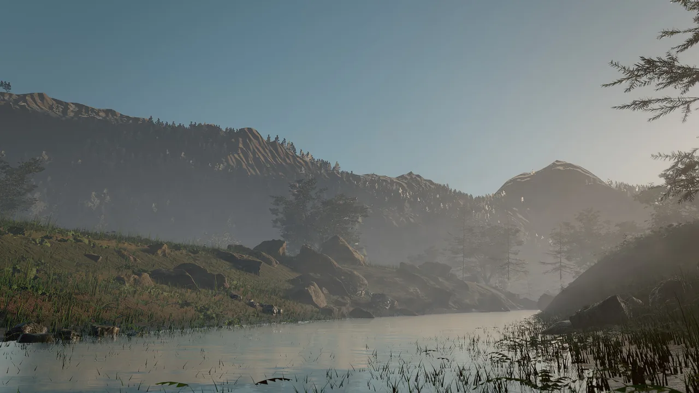

# Performance

This page explains how to keep a Skywalker game inside its frame budget: how to measure where time goes, which settings
trade quality for speed, what the CPU side costs, and how startup and memory behave. Every number quoted here was
measured on an Apple M1 Pro under the stated conditions; measure your own scenes with the same tools.

<figure markdown>
{ loading=lazy }
<figcaption>The ashen_peaks example, the heaviest scene in the repository: imported trees, grass and rocks scattered over terrain. Its foliage numbers below come from <code>perf_stats</code> benchmarks of this scene.</figcaption>
</figure>

## Concepts

### The budget mindset

A frame has a fixed budget: **16.6 ms at 60 fps**, 8.3 ms at 120 fps. The budget is shared by the CPU (simulation,
building the frame, encoding GPU work) and the GPU (rendering), which run in parallel; the slower of the two sets the
frame rate.

| Part | What runs | Where it shows |
|---|---|---|
| Simulation | Fixed 1/60 s ticks: Wander behaviors, physics, animation, particles, native systems | CPU scope `sim.step` |
| Frame build | Gathering visible entities, terrain and foliage chunks, particles, 2D | CPU scopes `frame.build`, `scene.buildFrame`, `world.gather`, `particles.gather`, `2d.gather` |
| Encode and present | Recording GPU commands; waiting for readback; presenting | `render.encode`, `render.readback`, `render.present` |
| GPU | Shadows, the main pass, screen-space effects, volumetrics, post, upscaling | `profile.passes` and `profile.groups` |

The simulation always ticks at 60 Hz. On a faster display, frames between ticks show interpolated transforms, so
rendering more frames per second costs GPU time but no extra simulation.

Budget by area, not by feature: decide what a scene may spend on shadows, foliage, hair, particles and post, measure
each, and keep the sum under the frame time with headroom for the slowest view.

## Measuring

### perf_stats

`perf_stats` is the main measuring tool. Without arguments it reports the current scene's complexity and last frame
cost: GPU and CPU frame time, triangles drawn, draw calls, lights, terrain nodes, foliage instances, entities, behaviors
and assets. With `frames` it first benchmarks real-time rendering of a view (temporal anti-aliasing, no supersampling)
and returns average, minimum and maximum GPU milliseconds.

| Argument | Meaning |
|---|---|
| `frames` | Benchmark this many real-time frames first (0 = just report). With `frames > 0` the profile covers exactly the benchmark frames. |
| `width`, `height` | Benchmark resolution (default 1920 × 1080). |
| `view` | `"editor"` (default), `"scene"` (the game camera), or a custom camera `{eye, target, fov}`. |
| `quality` | The viewport tier to benchmark: `full` (default, as in play mode and captures), `balanced`, `fast`. |
| `passes` | Add the per-pass GPU timeline and the CPU scopes. |

With `passes: true` the result has a `profile`:

| Field | Contents |
|---|---|
| `passes` | GPU time per render pass in encode order (`Main`, `Shadow cascades`, `SSGI`, `SSR`, `Lighting resolve`, `TAA`, `Bloom`, `Composite`, `Foliage cull`, `GPU particles`, `Hair`, ...), with rolling 60-frame average, minimum and maximum |
| `groups` | The same summed by area: `shadows`, `main`, `ao`, `ssgi`, `ssr`, `resolve`, `effects`, `volumetrics`, `clouds`, `temporal`, `upscale`, `post`, `foliage`, `particles`, `hair`, `skinning`, `environment`, `2d`, `ui`, `overlays`, `debug` |
| `cpu` | CPU scopes: `frame.build`, `scene.buildFrame`, `world.gather`, `particles.gather`, `2d.gather`, `render.encode`, `render.readback`, `render.present`, `sim.step` |
| `spanMs`, `sumMs`, `frameGpuMs` | First-to-last sample span, the sum of the groups, and the command-buffer time; `sumMs` is close to `frameGpuMs` |

The `gpu` section also carries foliage statistics (`meshInstances`, `impostorInstances`, foliage triangles with and
without shadows, per-model triangle counts with their impostor and cull distances, impostor bake and memory figures),
light counts in `gpu.lights`, and `perf_stats.frameFlow` reports render-interpolation alpha and frame-pacing jitter. The
[Profiler](rendering/profiler.md) page explains how the GPU timeline is sampled and how to read overlapping passes.

=== "Tool call"

    ```tool
    perf_stats {}
    perf_stats {"frames": 30, "passes": true, "view": "scene"}
    perf_stats {"frames": 30, "view": {"eye": [0, 300, -600], "target": [0, 80, 0], "fov": 50}, "quality": "fast"}
    ```

=== "Editor"

    The viewport stats overlay shows fps and CPU and GPU milliseconds. Click its frame line to expand the same per-pass
    list `perf_stats` returns.

=== "C++"

    ```cpp
    #include "skywalker/core/Profiler.h"

    // Inside any engine function you want to time (the engine's own scopes include "sim.step" and "frame.build"):
    {
        SKY_PROFILE_SCOPE("game.pathfinding");  // shows up in perf_stats {passes: true} -> profile.cpu
        // ... the work to measure ...
    }
    ```

### Specialized measurements

| Tool | Measures |
|---|---|
| `fx_benchmark` | Renders frames back to back with the effects clock advancing (GPU particles and hair simulate) and reports GPU time per frame and per effects pass, plus wall-clock time. `serial: true` (default) waits per frame for exact per-pass times; `false` overlaps frames like a game loop. |
| `fx_stats` | The measured GPU cost of the last rendered frames: the whole frame, the GPU simulation pass (particles and hair), per-emitter live particle counts and per-groom sizes. |
| `groom_info` | Strand, guide and point counts, CPU and GPU memory, generation time and the measured GPU cost of each groom. |
| `engine_info` | Startup: how the shader library was loaded, `shaderCompileMs`, renderer startup and the pipeline cache's hits and misses. |
| `wander_bench` | A standalone benchmark of Wander workloads in the VM and, with `--native`, as AOT code (`tools/wander_bench` in the repository). |
| `viewport_capture` with `debug_view` | Visual diagnostics: `overdraw`, `lod`, `light_complexity`, `texel_density`, `uv_checker`, `wireframe`, `impostors`. |

```tool
fx_benchmark {"width": 1920, "height": 1080, "frames": 120}
fx_stats {}
groom_info {}
engine_info {}
```

<div class="sky-compare" markdown>
<figure markdown>{ loading=lazy }<figcaption>overdraw</figcaption></figure>
<figure markdown>{ loading=lazy }<figcaption>lod</figcaption></figure>
<figure markdown>{ loading=lazy }<figcaption>light_complexity</figcaption></figure>
</div>

*Three diagnostic views of the look-development courtyard, captured with `viewport_capture` and `debug_view`. See
[Debug views](rendering/debug-views.md) for every legend.*

## The levers

| Lever | Setting | Effect |
|---|---|---|
| Internal resolution | `environment.renderScale` 0.33–1, or `renderScale` in `game.json` | 0.5–0.77 renders fewer pixels and MetalFX temporal upscaling reconstructs full resolution. About 25% faster at 0.67 on an M1 Pro. Textures get a mip bias so they stay sharp. |
| Shipping quality preset | `quality` in `game.json` | `low` = 0.67 scale, no GI or screen-space reflections, half AO, flat clouds; `medium` = 0.85 scale, half-strength GI ([Shipping](shipping.md)). |
| Editor tier | `viewport_quality` | `fast` (the default while editing): lower internal resolution, no screen-space GI, reflections or light shafts, near-only foliage shadows, coarser LODs. `balanced` in between. `full` is what the game and captures show; play mode always renders full. |
| Screen-space GI and reflections | `environment.gi`, `environment.giDistance`, `environment.ssr` | Lower values reduce the `ssgi` and `ssr` groups. |
| Clouds | `environment.cloudMode` `flat` instead of `volumetric` | Removes the ray-marched cloud pass. |
| Volumetric light | `environment.godRays` (0 = off) | Removes or reduces the `volumetrics` group. |
| Sun shadows | `environment.shadowDistance` | A shorter range concentrates the four cascades. |
| Lights | `light.range`, `light.distanceFade` with `fadeBegin` and `fadeLength` | Shorter ranges mean fewer lights per pixel in clustered shading; faded-out lights are not sent to the GPU at all. |
| Mesh LODs | Automatic for meshes of 3,000+ triangles | The level is chosen by on-screen error under one pixel (foliage allows about 3 px). |
| Foliage impostors | `impostors`, `impostorDistance`, `impostorResolution`, `impostorFrames` per foliage layer | Heavy models (300+ triangles) become octahedral impostors beyond a transition distance set from on-screen size. The balanced and fast tiers move it to 0.75× and 0.5×. |
| Foliage triangle budget | Automatic | All foliage LODs coarsen if a frame would exceed 120M camera triangles (30M in safe mode after a GPU fault). |
| Hair | `groom.strands`, `groom.segments`, `groom.lod` (`auto`, `strands`, `cards`), `groom.cardsBelow` (pixels) | Fewer strands and segments, or cards when the groom is small on screen. `groom_info` suggests keeping a hero head under about 2 ms at 1080p. |
| GPU particles | `particles.maxParticles`, `look` | Lit, sorted smoke costs far more than additive glow at the same count (fill rate). |

```tool
environment_update {"renderScale": 0.67}
environment_update {"gi": 0.5, "ssr": 0.5, "godRays": 0.5, "cloudMode": "flat"}
entity_update {"entity": "StreetLamp", "components": {"light": {"range": 8, "distanceFade": true, "fadeBegin": 40, "fadeLength": 10}}}
groom_update {"entity": "Hero", "fields": {"strands": 60000, "lod": "auto"}}
viewport_quality {"quality": "fast"}
```

### The CPU side

| Area | What to know |
|---|---|
| Wander VM | An empty `on tick` on 5,000 entities costs about 0.24 ms per tick; vars, movement, branches and timers on 5,000 entities about 1.2 ms (M1 Pro, Release). |
| AOT behaviors | `wander_compile_native` ran the arithmetic and math-builtin benchmarks about 2–2.5× faster than the VM, with identical results. Behaviors dominated by property access and engine calls stay in the VM. |
| Native modules | C++ for algorithms that do not belong in a script: flocking, procedural generation, custom simulation ([Graphs and native code](wander/native.md)). |
| Step budget | 1,000,000 steps per handler run. A script that hits it has a loop that does too much work per tick: spread the work over ticks with `wait frames 1`. |
| Shared programs | Identical behavior sources compile once, so thousands of identical entities cost one compile. |
| Frame data | Per-frame data uses a triple-buffered ring with a frames-in-flight limit. Static geometry, terrain and instance buffers are uploaded once and cached; on Apple silicon, terrain and instance textures use unified memory without staging copies. |

### Startup: shader library and pipeline cache

With the offline Metal toolchain installed at build time, the shader library is precompiled to a `.metallib` and
embedded; without it, the engine compiles about 6,000 lines of shader source at startup. Every pipeline state also goes
through a binary archive in `~/Library/Caches/Skywalker/shaders/`, keyed by shader source, engine version, GPU and OS
build, so a changed shader never loads stale binaries.

Startup on an M1 Pro (`skywalker call engine_info`, release build, without the offline Metal toolchain):

| Case | Renderer startup | Library compile | Pipelines (86) |
|---|---|---|---|
| Cold: first launch after a shader change | 2464 ms | 1201 ms | 1203 ms |
| Warm: system Metal cache and pipeline archive | 48–51 ms | 3 ms | 4 ms |

The cold library compile (1.2 s) is what the precompiled `.metallib` removes. The archive pays off when the system's own
Metal cache misses (after an OS or Xcode update, a cache purge, or in a shipped game whose archive was pre-warmed);
recording it costs one write of about 0.3 s on the cold launch.

```bash
skywalker call engine_info '{}' --project ~/Games/MyGame
```

## Measured numbers

All on an Apple M1 Pro.

**Foliage with impostors**, ashen_peaks, 1920 × 1080, full quality, 30-frame `perf_stats`:

| View | Before impostors | With impostors (full) | Fast editing tier |
|---|---|---|---|
| Aerial | 852 ms, 1.35 G triangles | 19 ms | 7 ms |
| Mid-valley | 2022 ms, 3.9 G triangles | 39 ms, 7.7 M triangles | 10 ms |
| Ground | 2002 ms, 3.2 G triangles | 63 ms, 18 M triangles | 19 ms |

The same scene without any foliage costs about 13 ms (aerial) and 17 ms (ground). What remains at ground level is
mostly one 3.5M-triangle tree mesh near the camera and dense alpha-tested grass. Assets with game-ready triangle counts
(20–100k) fall well within budget.

**Effects**, 1920 × 1080, `fx_benchmark` serial mode, on a stage scene (floor, props, sky, TAA, GI and reflections,
bloom) that costs 7.4 ms per frame on its own:

| Workload | Frame (GPU) | Simulation |
|---|---|---|
| 1,000,000 GPU particles, additive glow, curl noise | 16.2 ms (+8.8 ms) | 3.0 ms |
| 1,000,000 GPU particles, lit smoke, GPU bitonic sort | 38.1 ms (+30.7 ms, fill rate) | 8.4 ms including the sort |
| 100k-strand groom × 25 points, close-up filling the screen (49k strands drawn) | 28.8 ms (+21.4 ms) | 1.4 ms + 6.7 ms deep opacity |
| The same groom, medium shot (20k strands drawn) | 17.5 ms (+10.1 ms) | 0.7 ms + 4.1 ms deep opacity |

**Velocity buffer** (motion vectors), 1920 × 1080, `perf_stats` with `frames`: about +0.2 to +0.4 ms per frame
(hello_sky 5.95 → 6.35 ms, ashen_peaks 25.9 → 26.1 ms).

**Wander**, fixed 1/60 s ticks, Release build, best of four runs:

| Scenario | VM | AOT |
|---|---|---|
| Arithmetic loop, 500 iterations × 100 entities | 0.93 ms | 0.37 ms |
| Vars, movement, branches, timers × 5,000 entities | 1.20 ms | 1.22 ms (left in the VM) |
| Vector math loop, 100 iterations × 100 entities | 0.50 ms | 0.41 ms |
| Math builtins, 300 iterations × 100 entities | 1.99 ms | 0.93 ms |
| Empty `on tick` × 5,000 entities | 0.24 ms | |

**Movie rendering**, smugglers_cove at 1920 × 1080, 24 fps, `samples: 8`, `shutter: 0.5`, `simulate: true`: about
230 ms per frame ([Movie render queue](movie-render.md)).

## Recipe: find and fix a slow frame

1. Benchmark the view players see and read where the time goes:

    ```tool
    perf_stats {"frames": 30, "passes": true, "view": "scene"}
    ```

    Read `profile.groups` for the expensive area and `profile.passes` for the pass.

2. **`main` or `shadows` high.** Look for stacked transparent quads and dense grass, and for missing LODs:

    ```tool
    viewport_capture {"debug_view": "overdraw", "samples": 1}
    viewport_capture {"debug_view": "lod", "samples": 1}
    ```

    Red or magenta near the camera is fine in the `lod` view; green far away means a mesh has no coarser level (meshes
    under 3,000 triangles get none) or an imported model needs decimating ([DCC bridge](dcc.md)).

3. **Many lights.** Orange and red areas evaluate seven or more lights per pixel: shorten `range` or merge lights.

    ```tool
    viewport_capture {"debug_view": "light_complexity", "samples": 1}
    ```

4. **`ssgi`, `ssr`, `clouds` or `volumetrics` high.** Lower `gi`, `ssr`, the cloud mode or `godRays` with
   `environment_update`, or benchmark `quality: "balanced"` to see what the lower tier would buy.

5. **`foliage` or `hair` high.** Check impostor statistics in `perf_stats` and per-groom cost in `groom_info`; reduce
   strands or switch distant grooms to cards.

6. **Everything high.** Try `renderScale` 0.67 and compare.

7. Repeat step 1 and compare `profile.groups` before and after.

For textures, the `texel_density` view should be mostly green (512 texels per meter) near the camera, and `uv_checker`
shows stretched or flipped UVs.

## Pitfalls

- **The editor is not the game.** The editor viewport renders the `fast` tier while you edit; benchmark with
  `quality: "full"` (the default of `perf_stats`) or `view: "scene"` for numbers that match play mode and shipped
  builds.
- **One frame is noise.** Use `frames: 30` or more; `profile` reports rolling averages, minimums and maximums.
- **Vertex and fragment overlap.** On Apple GPUs, vertex work of later passes overlaps earlier fragment work, so the
  profiler reports vertex time separately (`vertexMs`) and pass times are fragment spans. MetalFX upscaling is not
  sampled.
- **Debug builds are slow on the CPU.** Measure with the `release` preset; debug builds are several times slower.
- **Several heavy GPU jobs at once** (two movie renders, a benchmark during a render) interleave through the machine-wide
  GPU lock and distort each other's timings.
- **GPU particles and hair are visual only.** They do not affect gameplay, so cutting them never changes the
  simulation.

!!! agent "For agents"

    Measure after every big change (a scatter, a generator, a look change) and before claiming a scene is fast:

    ```tool
    perf_stats {"frames": 30, "passes": true, "view": "scene"}      # where the frame time goes
    viewport_capture {"debug_view": "overdraw", "samples": 1}       # why main or shadows are expensive
    impostor_bake {"entity": "Forest", "preview": true}             # check foliage atlases and transition distances
    fx_benchmark {"frames": 120}                                    # cost of particles and hair
    groom_info {}                                                   # per-groom strands, memory and GPU cost
    environment_update {"renderScale": 0.67}                        # the cheapest large win
    ```

    Report numbers with their conditions: resolution, view, quality tier and frame count.

## Reference

- Tools: [`perf_stats`](../reference/tools/render.md#perf_stats), [`fx_benchmark`](../reference/tools/render.md#fx_benchmark),
  [`fx_stats`](../reference/tools/render.md#fx_stats), [`groom_info`](../reference/tools/render.md#groom_info),
  [`impostor_bake`](../reference/tools/render.md#impostor_bake),
  [`environment_update`](../reference/tools/render.md#environment_update),
  [`viewport_quality`](../reference/tools/view.md#viewport_quality),
  [`viewport_capture`](../reference/tools/view.md#viewport_capture)
- Components: [`environment`](../reference/components/core.md#environment), [`light`](../reference/components/core.md#light),
  [`groom`](../reference/components/world.md#groom), [`foliage`](../reference/components/world.md#foliage)
- [Profiler](rendering/profiler.md), [Debug views](rendering/debug-views.md)
- Design documents: [docs/RENDERING.md](https://github.com/amirhossein-razlighi/Skywalker/blob/main/docs/RENDERING.md),
  [docs/WANDER.md](https://github.com/amirhossein-razlighi/Skywalker/blob/main/docs/WANDER.md)
