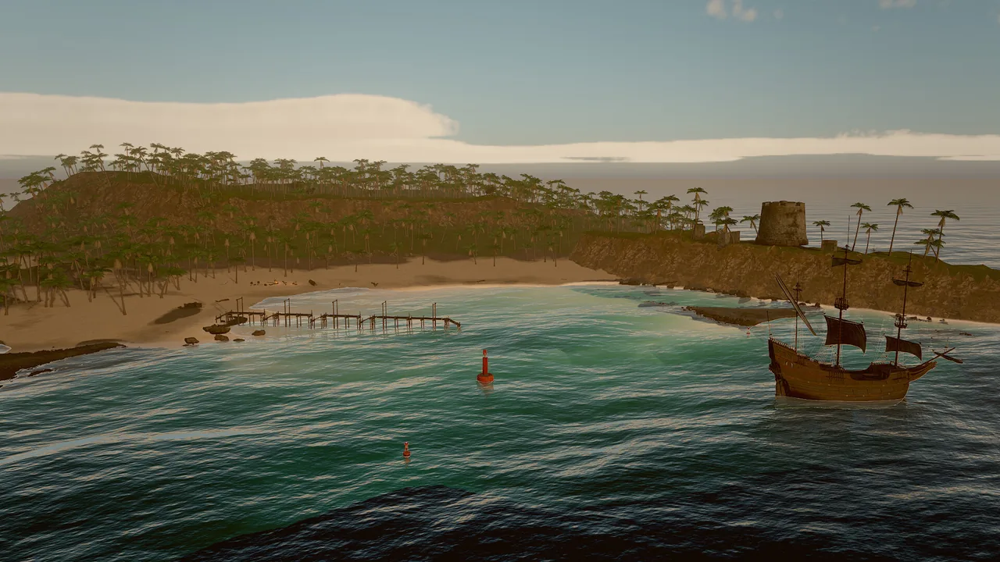

# Rendering

Skywalker's renderer aims at two kinds of image at once: physically based pictures that read as real (metal, glass,
skin, stone, water, sky) and strongly stylized ones (toon shading, outlines, neon, flat 2D). It is a Metal renderer
with an HDR pipeline, clustered lighting, screen-space global illumination and reflections, volumetric clouds and
light, temporal anti-aliasing and a full camera and grading stack. Every setting is a reflected field, so you, the
editor and agents set looks through the same tools: `entity_update`, `material_create` and `environment_update`.

<figure markdown>
{ loading=lazy }
<figcaption>Tidebreak Isle: FFT ocean, instanced palms on an eroded terrain, atmosphere sky with clouds, rendered by the engine from the example's sequence camera.</figcaption>
</figure>

## The rendering pages

| Page | What it covers |
|---|---|
| [Materials](materials.md) | Surface fields of `mesh` and material assets, PBR, toon and unlit shading, maps, presets, generated textures |
| [Lighting and shadows](lighting.md) | Clustered lights, the `light` component, sun cascades, cloud shadows, volumetric light |
| [Sky and atmosphere](sky.md) | Gradient, atmosphere and HDRI skies, volumetric clouds, stars, fog, wind, presets |
| [GI and reflections](gi.md) | Screen-space GI, reflections and AO, the lighting resolve, the sky probe |
| [Camera and post-processing](post.md) | Lens, exposure, tonemapping, grading, looks and LUTs, bloom, TAA, motion blur |
| [Debug views](debug-views.md) | Every buffer and diagnostic view with its legend |
| [Profiler](profiler.md) | Per-pass GPU timing, CPU scopes, benchmarks and the slow-frame recipe |

## Concepts

### A CPU front end and a thin GPU back end

Rendering runs in two stages: `Scene → FrameBuilder (CPU) → FrameData → Renderer`. The front end turns the scene into a
renderer-independent frame description: visible draws, lights in priority order, cameras, effects. Everything an agent
relies on (visible entities, on-screen boxes, picking, gizmo hit tests) is computed on the CPU from that description,
so it behaves the same on every backend and in tests. The `Renderer` interface is small (render, readback, present,
upload a mesh, reload shaders); Metal is the production backend and a CPU fallback keeps headless runs working.

### The frame

| # | Pass | What it does |
|---|---|---|
| 0 | Environment | Renders the sky (with clouds) into a 128² cubemap and prefilters 6 roughness mips for image-based light. Re-baked only when the sky changes. |
| 1 | Shadows | 4 sun cascades in a 4096² atlas. Terrain, alpha-tested foliage, hair and mesh particles cast too; meshes use a coarser LOD. |
| 2 | Clouds | Half resolution ray-marched cloud layer, reprojected over time in real time. |
| 3 | Scene | 4× MSAA in tile memory with a jittered projection: sky, opaque meshes with automatic LODs, terrain, instanced foliage, strand hair, mesh particles, outlines, transparent meshes, the grid. Writes HDR color and a G-buffer (albedo and material AO; normal, roughness and metallic) and object motion. Surfaces use clustered lighting. |
| 4 | SSAO, SSGI, SSR | Half resolution ambient occlusion, global illumination and reflections, accumulated over time in real time. |
| 5 | Lighting resolve | Replaces the sky-probe indirect light of PBR surfaces with GI and reflections, and applies AO to indirect diffuse. |
| 6 | Effects | Fluid simulation, FFT water, fluid volumes, GPU particles and CPU particles over the lit scene. |
| 7 | Volumetric light | Half resolution sun shafts and lamp cones through height-falling haze. |
| 8 | Velocity | Camera reprojection of the depth buffer plus object motion: the velocity buffer. |
| 9 | Temporal | Applies the volumetric light, then TAA, accumulation of still sub-samples, or a pass-through when MetalFX upscales. |
| 10 | Upscale | When `renderScale` < 1: MetalFX temporal upscaling from internal to output resolution. |
| 11 | Camera | Motion blur, bokeh depth of field and auto exposure. |
| 12 | Post | Bloom, then the composite: chromatic aberration, white balance, exposure, tonemap, saturation and contrast, look or LUT, vignette, grain, sharpening, dithering. Debug views replace the image here. |
| 13 | Overlays | Gizmos, drawn on top in display range. |

### Real-time frames and accumulated stills

A frame renders one or more jittered sub-samples:

- **Real time** (the editor viewport, play mode, the player): one sample per frame, with temporal history. GI,
  reflections and AO converge over a few frames.
- **Stills and cinematics** (`viewport_capture`, `skywalker render`, the movie render queue): `samples` jittered
  sub-samples are accumulated in one render, so the image is supersampled and GI and reflections come out
  noise-free. `samples: 1` is the fastest preview; 4 is the capture default; 16 to 32 make final stills.

=== "Tool call"

    ```tool
    viewport_capture {"samples": 1, "annotate": false}
    viewport_capture {"view": "scene", "width": 1920, "height": 1080, "samples": 16, "save_path": "renders/hero.png"}
    ```

=== "CLI"

    ```bash
    skywalker render scenes/main.sky.json -o hero.png --width 1920 --height 1080 --samples 16 --scene-camera
    ```

### Quality tiers

The live editor viewport can trade quality for speed while you edit heavy worlds. Play mode and captures always use
`full` unless you ask otherwise.

| Tier | What changes |
|---|---|
| `full` | Nothing: what the game and captures show. |
| `balanced` | Internal resolution at most 0.75 (upscaled by MetalFX), no depth of field or motion blur; foliage impostors start at 0.75× their distance, and the shadow cascades from the 2nd on draw impostors only. |
| `fast` (editor default) | Internal resolution at most 0.5; no depth of field, motion blur, screen-space GI, reflections or light shafts; sun shadows limited to 150 m; foliage beyond about 60 m casts no shadow; mesh-only foliage layers cull at 0.4× their distance; impostors start at 0.5× distance; coarser LODs. |

```tool
viewport_quality {"quality": "balanced"}
perf_stats {"frames": 30, "quality": "fast"}
viewport_capture {"quality": "fast", "samples": 1}
```

Shipped games choose a player preset in `game.json` (`quality`: `low`, `medium`, `high`, `ultra`) that adjusts the
scene's environment at load: `low` renders at 0.67 scale and turns off GI and screen-space reflections, `medium` uses
0.85 scale and half-strength GI, `high` keeps what the scene authored and `ultra` forces full resolution. See
[Shipping](../shipping.md).

### Render scale and MetalFX

`renderScale` (environment, 0.33 to 1) renders fewer pixels in real time and lets the MetalFX temporal scaler
reconstruct the output resolution, fed with the velocity buffer, the engine's exposure and a reactive mask for GPU
particles. Textures get a mip bias of log2(`renderScale`) so they stay sharp. Values of 0.5 to 0.77 are the useful
range; at 0.67 a frame is about 25% faster on an M1 Pro. Stills and captures with `samples` > 1 always render at
native resolution.

```tool
environment_update {"renderScale": 0.67, "taa": true, "sharpen": 0.35}
```

### Anti-aliasing

The scene pass renders with 4× MSAA, and temporal anti-aliasing (`taa`, on by default) removes shimmer from thin
detail and specular highlights using the velocity buffer, history clamping and a reactive mask for particles.
`sharpen` applies contrast-adaptive sharpening after the temporal pass. Specular anti-aliasing widens roughness where
normals vary within a pixel, so detailed normal maps do not sparkle.

### The CPU fallback renderer

Without Metal (Linux, CI, the `headless` preset), the engine renders with a CPU fallback: a sky gradient, every
visible draw as a flat-shaded screen-space box sorted back to front, then sprites, tiles, world text and UI. It is not
meant to be pretty; it guarantees that agents always get a picture with the right layout, and that tests never depend
on GPU output. `engine_info` reports which renderer is active. Shader tools and GPU profiling are unavailable on it.

## Shaders: library, cache and hot reload

- **Precompiled library.** With the offline Metal toolchain installed (`xcodebuild -downloadComponent
  MetalToolchain`), the build compiles the standard shader library to a `.metallib` and embeds it (CMake option
  `SKY_PRECOMPILE_SHADERS`, on by default). Without the toolchain the engine compiles the embedded source at startup.
- **Pipeline cache.** Every pipeline state goes through a Metal binary archive at
  `~/Library/Caches/Skywalker/shaders/`, keyed by shader source, engine version, GPU and OS build, so a changed shader
  never loads stale binaries. The 3 newest archives are kept. The archive is off under Metal validation.
- **Hot reload.** `shader_get` returns the renderer's current Metal Shading Language source; `shader_set` replaces it
  at run time. On a compile error nothing changes and the compiler diagnostics come back. Function names and struct
  layouts must be kept. Hot reloads always compile from source.

```tool
engine_info {}
shader_get {}
```

Startup on an M1 Pro (release build, no Metal toolchain, measured with `engine_info`):

| Case | Renderer startup | Library compile | Pipelines (86) |
|---|---|---|---|
| Cold: first launch after a shader change | 2464 ms | 1201 ms | 1203 ms |
| Warm: system Metal cache and pipeline archive | 48–51 ms | 3 ms | 4 ms |

Environment switches for benchmarking and debugging (`SKY_SHADER_SOURCE=1`, `SKY_SHADER_CACHE=0`,
`SKY_SHADER_CACHE_DIR`, `SKY_SHADER_NONCE`, `SKY_GPU_PROFILER=0`) are listed on the [Profiler](profiler.md#environment-switches) page.

## Render layers

There are twenty render layers. A mesh is **on** layers; cameras and lights **see** layers through a cull mask. Bit
`i` of a mask is layer `i + 1`.

| Field | On | Default | Meaning |
|---|---|---|---|
| `layers` | `mesh` | 1 | Layers the mesh is on |
| `cullMask` | `camera` | all (1048575) | Layers the camera draws; meshes outside it are not drawn and cast no shadow in that view |
| `cullMask` | `light` | all | Layers the light illuminates |

Name layers once in `game.json` and use the names everywhere:

```json
{"render": {"layers": {"1": "world", "2": "hero", "3": "fx", "20": "editor_only"}}}
```

=== "Tool call"

    ```tool
    render_layers {"action": "name", "layer": 2, "name": "hero"}
    render_layers {"action": "set", "entities": ["Hero"], "layers": ["world", "hero"]}
    render_layers {"action": "set", "entities": ["RimLight"], "cull_mask": "hero"}
    render_layers {"action": "set", "entities": ["Main Camera"], "cull_mask": "editor_only", "mode": "remove"}
    render_layers {}
    ```

=== "Wander"

    ```wander
    on start
      find("Mirror").camera.cullMask = layer_mask("world", "fx")
    end
    ```

Masks accept a number (raw bits), a layer name, a layer number as a string (`"3"`), `"all"`, `"none"` or a list;
misspelled names fail with a did-you-mean hint. `mode` `add` and `remove` edit the existing mask. `render_layers {}`
lists the named layers, the meshes on each layer, cameras and restricted lights, and warns about meshes no camera draws
and lights that light nothing.

| Goal | Setup |
|---|---|
| A rim light only on the hero | Hero on `["world", "hero"]`; the rim light's `cull_mask` is `"hero"` |
| First-person arms not in the mirror | Arms on an `"arms"` layer; the mirror camera's mask excludes it |
| Editor helpers hidden in the game | Helpers on `"editor_only"` (20); the game camera's mask is `["world", "fx"]` |
| A 3D preview lit separately | The model on `"preview"`, lit by a light with `cull_mask` `"preview"` only |

Terrain, foliage, water, particles and hair have no `layers` field yet and count as layer 1.

## Recipe: from a blank scene to a photoreal daylight look

```tool
environment_update {"skyMode": "atmosphere", "sunElevation": 35, "sunAzimuth": 120, "clouds": 0.4, "tonemap": "agx", "ao": 1, "gi": 1, "ssr": 1}
texture_generate {"kind": "cobblestone", "name": "textures/plaza", "tiling": 0.5}
material_assign {"entities": ["Ground"], "material": "materials/plaza.mat.json"}
material_create {"path": "materials/brass.mat.json", "preset": "gold", "roughness": 0.3}
viewport_capture {"samples": 16}
perf_stats {"frames": 30, "passes": true}
```

`texture_generate` writes `textures/plaza_albedo.png`, `_normal.png` and `_orm.png`, and the material `materials/plaza.mat.json` (named after the last part of `name`). Check the result in [debug views](debug-views.md)
(`lighting_only` for light placement, `texel_density` for texture scale) and the cost with the [profiler](profiler.md).

## Limits

- Point and spot lights do not cast shadows yet; only the sun (four cascades), clouds and hair cast shadows.
- GI and reflections are screen-space: what is off screen comes from the sky probe. There are no reflection probes or
  world-space GI yet.
- Transparent meshes do not refract (water does). Particles and fluid volumes render after transparent meshes.
- Fluid volumes do not cast shadows on the scene yet.
- Toon outlines and distant hair cards write no object motion; they reproject with the camera only.
- The GPU backend is Metal only (macOS on Apple silicon); elsewhere the CPU fallback renders layout pictures.

!!! agent "For agents"

    Judge a look with your own eyes, then with numbers:

    ```tool
    environment_get {}                                   # current sky, sun, grading and quality settings
    viewport_capture {"samples": 8}                      # the image
    viewport_capture {"debug_view": "lighting_only", "samples": 4}   # light placement without textures
    perf_stats {"frames": 30, "passes": true}            # cost per pass and per area
    ```

    Use `samples` of 8 or more before judging GI, reflections or noise; one sample shows the raw, unconverged buffers.

## Reference

- Tools: [Render tools](../../reference/tools/render.md) (`environment_update`, `shader_get`, `shader_set`,
  `perf_stats`, `render_layers`), [View tools](../../reference/tools/view.md) (`viewport_capture`,
  `viewport_quality`, `viewport_debug_view`), [`engine_info`](../../reference/tools/scene.md#engine_info)
- Components: [`mesh`](../../reference/components/core.md#mesh), [`light`](../../reference/components/core.md#light),
  [`camera`](../../reference/components/core.md#camera), [`environment`](../../reference/components/core.md#environment)
- Wander: [`layer_mask`](../../reference/wander.md#render-layer_mask)
- CLI: [`skywalker render`](../../reference/cli.md#render)
- Design: [docs/RENDERING.md](https://github.com/amirhossein-razlighi/Skywalker/blob/main/docs/RENDERING.md)
