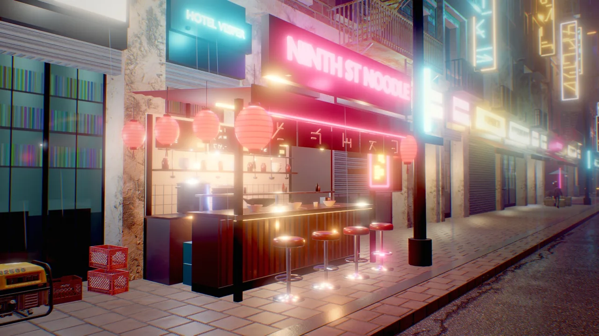
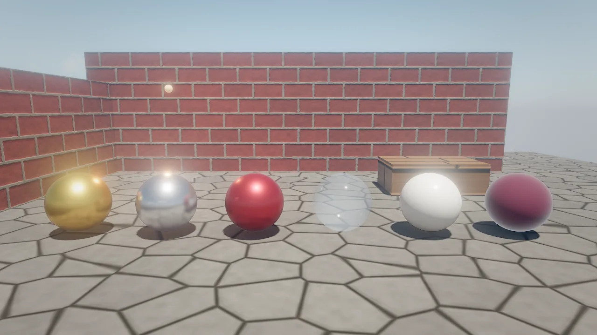
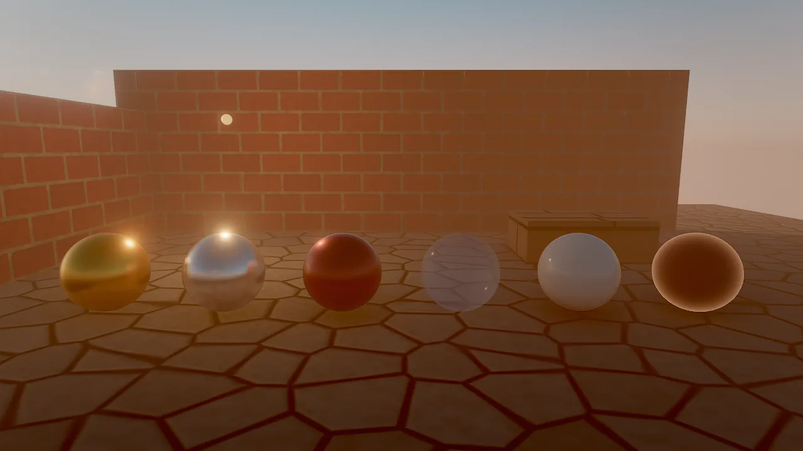
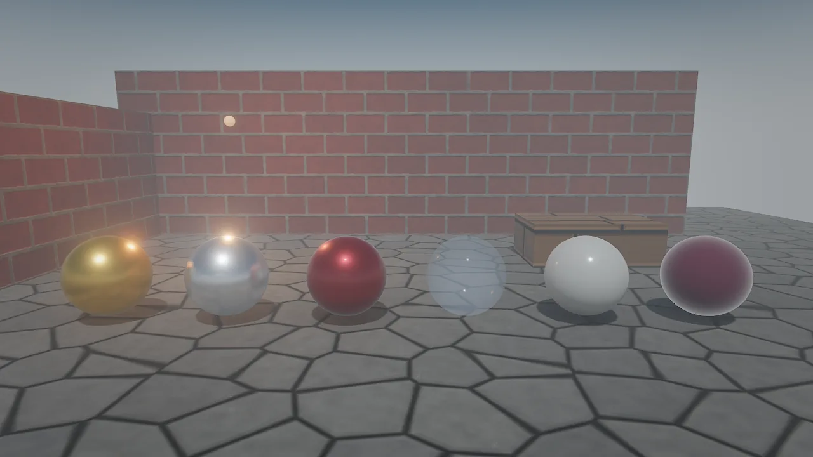
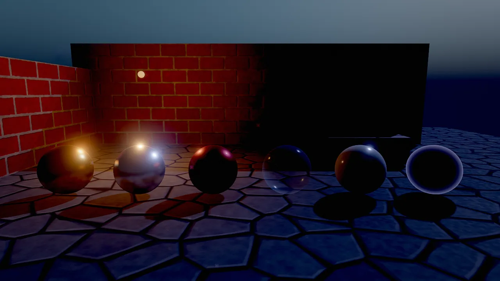
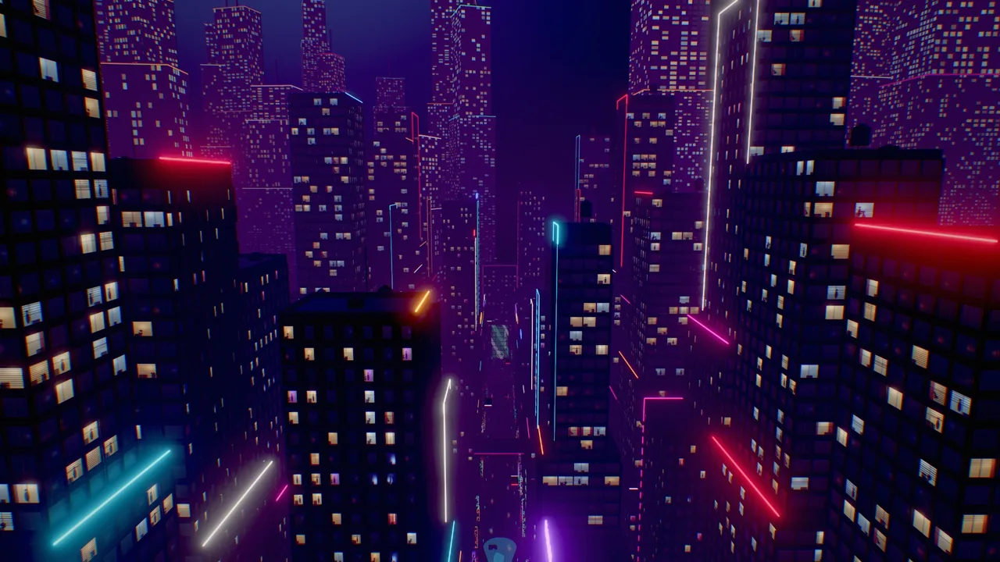

# Lighting and shadows

A scene is lit by the sun and sky of its environment plus any number of `light` components: directional, point and
spot lights with color temperature, physical or artist falloff, soft spot edges, volumetric strength and render-layer
masks. Lights are clustered, so a street with hundreds of lamps costs only the lights near each pixel. The sun casts
four cascades of soft shadows, clouds cast drifting shadows, and lamps and the sun can draw visible shafts through
hazy air.

<figure markdown>
{ loading=lazy }
<figcaption>neon_requiem: paper lanterns, emissive signs and many small point lights on a night street, from the example's shot list.</figcaption>
</figure>

## Concepts

### The sun, the sky and lamps

| Source | Where it lives | Notes |
|---|---|---|
| Sun | `environment`: `sunAzimuth`, `sunElevation`, `sunColor`, `sunIntensity`, `sunSize` | The only shadow-casting light. Its direction also drives the atmosphere sky. |
| Sky light | `environment`: `ambient`, `ground`, `reflections`, the sky itself | Image-based light from a prefiltered cubemap of the sky; `ambient` scales it (lower it for interiors, caves and night), `reflections` scales the specular part. |
| Lights | `light` components on entities | Directional, point or spot. Directional lights use the entity's rotation; point and spot lights use its position; a spot points along the entity's forward axis (−Z). |
| Emissive surfaces | `mesh.emissive` | Glow with bloom and add light through on-screen GI; not light sources otherwise. |

### Clustered lighting

The view is split into 16×9×24 clusters on the CPU, and each pixel evaluates only the lights whose range touches its
cluster. Up to 1024 lights are used per frame: directional lights first, then the point and spot lights nearest to
what the camera looks at. Directional lights apply everywhere. The 16 most important lights also light water,
particles, fluids and volumetric fog.

`debug_view: "light_complexity"` shows how many lights each pixel's cluster evaluates, on the same color ramp as
overdraw: black 0, dark blue 1, blue 2, cyan 3, green 4, yellow 5–6, orange 7–9, red 10–15, white 16 or more.

### The light component

| Field | Default | Meaning |
|---|---|---|
| `kind` | `point` | `directional`, `point` or `spot` |
| `color` | warm white | Light color |
| `intensity` | 1 | Brightness multiplier (0 to 1000) |
| `range` | 10 | Falloff distance in meters (point and spot) |
| `spotAngle` | 35 | Cone half-angle in degrees (1 to 89) |
| `innerAngle` | 0 | Spot: half-angle of the full-intensity core; 0 = an automatic soft edge, close to `spotAngle` = a hard edge |
| `temperature` | 0 | Kelvin, multiplied with `color`: 1900 candle, 2700 tungsten, 4000 fluorescent, 5500 noon, 6500 white, 9000 overcast sky; 0 = off |
| `attenuation` | `smooth` | `smooth`: a soft curve that reaches 0 at `range`. `inverse_square`: physical 1/d², brighter near the source, with its peak capped by the emitter radius `size`, still windowed to `range` |
| `size` | 0.1 | Emitter radius in meters for `inverse_square` |
| `specular` | 1 | Highlight strength; 0 = diffuse only (fill lights that should not sparkle) |
| `volumetric` | 1 | Strength in volumetric light (needs environment `godRays`) |
| `negative` | false | Subtracts light: stylized darkening, fake occlusion |
| `distanceFade`, `fadeBegin`, `fadeLength` | off, 40, 10 | Fade out with distance from the camera; faded-out lights are not sent to the GPU at all |
| `cullMask` | all layers | Render layers the light illuminates (see [Render layers](index.md#render-layers)) |
| `indirect` | 1 | Reserved for world-space GI; no effect yet |

### Sun shadows

The sun casts **cascaded shadow maps**: 4 cascades packed into one 4096² atlas (2048² per cascade). Cascades are fit
to bounding spheres and snapped to texels, so shadows do not shimmer as the camera moves, and are filtered with
rotated Poisson PCF.

| Setting | Where | Effect |
|---|---|---|
| `shadowSoftness` | environment, 0..6 (default 1) | Penumbra size |
| `shadowDistance` | environment, meters (0 = automatic) | How far from the camera sun shadows reach; a shorter distance gives sharper near shadows |
| `castShadows` | `mesh` | Whether a mesh casts (default on) |

Meshes, terrain, alpha-tested foliage, strand hair and mesh particles cast sun shadows; meshes render into the
shadow map at a coarser level of detail. Transparent surfaces do not cast. `debug_view: "shadow_cascades"` colors each
pixel by cascade (red 0 nearest, green 1, blue 2, yellow 3, gray beyond the shadow distance).

### Cloud shadows

With clouds in the sky, drifting cloud shadows dim the sun on every surface. They move with `windDirection` and
`cloudSpeed`. See [Sky and atmosphere](sky.md).

### Volumetric light

`godRays` (environment, 0 = off, 1 = natural, up to 8) draws shadow-mapped sun shafts and cones under lamps through
air whose density is `haze` (extinction per meter: 0.0003 for a clear landscape, 0.002 for a hazy valley, 0.01 to
0.03 for a misty alley or an interior). The pass runs at half resolution and the haze thins with height. Each light's
`volumetric` field scales its own cone; set it to 0 for lights that should not show in the air.

<div class="sky-compare" markdown>
<figure markdown>{ loading=lazy }<figcaption>preset noon</figcaption></figure>
<figure markdown>{ loading=lazy }<figcaption>preset sunset</figcaption></figure>
<figure markdown>{ loading=lazy }<figcaption>preset overcast</figcaption></figure>
<figure markdown>{ loading=lazy }<figcaption>preset night</figcaption></figure>
</div>

*The same courtyard under the four outdoor `environment_update` presets; the warm point lamp on the back wall carries
the night image.*

## How to add and tune lights

=== "Tool call"

    ```tool
    entity_create {"name": "Street Lamp", "position": [2.4, 3.6, 12], "rotation": [-90, 0, 0], "components": {"light": {"kind": "spot", "color": "#ffb46a", "intensity": 12, "range": 11, "spotAngle": 32, "innerAngle": 20}}}
    entity_create {"name": "Candle", "position": [0, 1.1, 0], "components": {"light": {"kind": "point", "temperature": 1900, "intensity": 2, "range": 4, "attenuation": "inverse_square", "size": 0.02}}}
    entity_update {"entity": "Street Lamp", "components": {"light": {"volumetric": 2}}}
    environment_update {"sunElevation": 12, "sunAzimuth": 250, "shadowSoftness": 2, "shadowDistance": 120}
    ```

=== "Wander"

    ```wander
    behavior Flicker
      intent "A failing fluorescent tube: steady, with short random dropouts."
      param base = 6 in 0..50 "normal intensity"
      var off_time = 0
      on tick
        if off_time > 0 then
          off_time -= dt
          self.light.intensity = base * 0.1
        else
          self.light.intensity = base
          if chance(0.01) then off_time = random(0.05, 0.2) end
        end
      end
    end
    ```

=== "CLI"

    ```bash
    skywalker call entity_create '{"name": "Fill", "components": {"light": {"kind": "point", "intensity": 2, "range": 8, "specular": 0}}}' --project my_game --scene scenes/main.sky.json
    ```

- **Aim a spot or directional light** by rotating its entity: a spot with `rotation` `[-90, 0, 0]` points straight
  down. In Wander, `look self at target` aims it at a point or an entity.
- **Use `temperature`** rather than hand-picked colors for believable lamps; keep `color` white and let the Kelvin
  value tint it.
- **Use `inverse_square`** with a small `size` for lamps that should be bright up close and fall off physically;
  keep `smooth` for game lighting that must end cleanly at `range`.
- **Fill lights** with `specular: 0` brighten shadows without adding highlights.
- **Many small lights** (windows, candles across a level): turn on `distanceFade` so distant ones cost nothing.
- **Rim or hero lights** that should touch only one character: use [render layers](index.md#render-layers).

The flicker above runs in `on tick` with seeded randomness, so it replays exactly. For purely visual flicker at
display rate, use an `on frame` handler with `noise` (see [Components](../components.md#recipe-give-a-prop-a-glowing-flickering-lamp)).

## Recipe: horror night

```tool
environment_update {"preset": "night", "skyMode": "gradient", "skyTop": "#020308", "skyHorizon": "#0b1020", "stars": 0.6, "fogDensity": 0.03, "fogHeight": 0.4, "ambient": 0.05, "vignette": 0.5}
entity_create {"name": "Lantern", "position": [1, 1.6, 0], "components": {"light": {"kind": "point", "temperature": 1900, "intensity": 4, "range": 7}}}
behavior_set {"entity": "Lantern", "name": "Flicker", "intent": "Flicker like a flame.", "source": "on frame\n  self.light.intensity = 4 * (0.8 + 0.2 * noise(time * 10))\nend\n"}
viewport_capture {"samples": 8}
```

A gradient sky near black, stars, ground fog, very low ambient light and warm, flickering point lights. Raise
`exposure` slightly if the image is too dark to read, rather than raising `ambient`, which flattens the mood.

## Recipe: rainy neon street

```tool
environment_update {"preset": "night", "fogDensity": 0.02, "godRays": 1, "haze": 0.02, "bloomIntensity": 0.8, "ssr": 1}
material_create {"path": "materials/wet_asphalt.mat.json", "color": "#1a1c20", "roughness": 0.15}
material_assign {"entities": ["Street"], "material": "materials/wet_asphalt.mat.json"}
material_create {"path": "materials/sign_pink.mat.json", "preset": "neon", "emissive": [1, 0.2, 0.6, 4]}
fx_create {"effect": "rain", "position": [0, 12, 0], "overrides": {"floorHeight": 0}}
viewport_capture {"samples": 16}
```

Unlit emissive signs (strength 2 to 5), a dark glossy street (`roughness` 0.1 to 0.2) so screen-space reflections pick
up the signs, misty air for visible lamp cones, and rain with its floor at street level.

<div class="sky-compare" markdown>
<figure markdown>{ loading=lazy }<figcaption>neon_requiem, puddle_mirror</figcaption></figure>
<figure markdown>{ loading=lazy }<figcaption>neon_requiem, skyline: emissive strips and lit windows</figcaption></figure>
</div>

## Recipe: light shafts

Set `godRays: 1` and `haze` between 0.01 and 0.03, then put a low sun behind trees, pillars, canyon walls or a window.
Lamps in the same air get visible cones automatically.

```tool
environment_update {"godRays": 1, "haze": 0.015, "sunElevation": 10, "sunAzimuth": 80}
viewport_capture {"samples": 16}
```

## Not available yet

- **Point and spot lights do not cast shadows.** Only the sun (four cascades), clouds and hair cast shadows. Fake
  local occlusion with `negative` lights, ambient occlusion and careful light ranges.
- **No baked lighting.** There are no lightmaps or bake modes; `indirect` is reserved for future world-space GI.
- **No shadow caster masks.** Render layers decide what a light illuminates, not what casts its shadow.

## Pitfalls

- **Too many overlapping lights** make every pixel evaluate many lights. Check `light_complexity`; shorten `range`
  or merge lights where it turns orange or red.
- **Spot lights point along −Z.** An unrotated spot shines horizontally; rotate the entity to aim it.
- **Fog and haze are different.** `fogDensity` is distance fog for the whole image; `haze` is the medium volumetric
  light scatters in.
- **Night scenes still have a sun.** The `night` preset keeps a weak, blue sun as moonlight; lower `sunIntensity`
  further if the moonlight should not cast visible shadows.

!!! agent "For agents"

    Light placement is easiest to judge without textures:

    ```tool
    scene_query {"component": "light"}                                        # every light and where it is
    viewport_capture {"debug_view": "lighting_only", "samples": 4}            # light and shadow on white
    viewport_capture {"debug_view": "light_complexity", "samples": 1}         # lights per pixel
    perf_stats {}                                                             # gpu.lights: total, layerMasked, negative, inverseSquare
    viewport_capture {"samples": 16}                                          # final check
    ```

## Reference

- Tools: [`environment_update`](../../reference/tools/render.md#environment_update), [`entity_update`](../../reference/tools/entity.md#entity_update),
  [`render_layers`](../../reference/tools/render.md#render_layers), [`viewport_capture`](../../reference/tools/view.md#viewport_capture)
- Components: [`light`](../../reference/components/core.md#light), [`environment`](../../reference/components/core.md#environment)
- Wander: [`chance`](../../reference/wander.md#random-chance), [`noise`](../../reference/wander.md#math-noise)
- Design: [docs/RENDERING.md](https://github.com/amirhossein-razlighi/Skywalker/blob/main/docs/RENDERING.md) (Lighting; Lights; Recipes; Limits)
