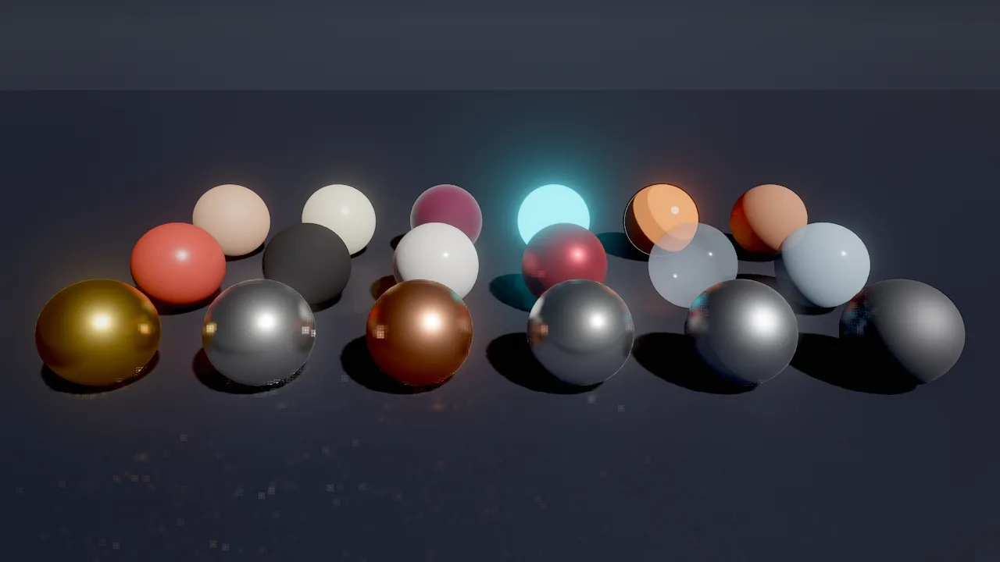
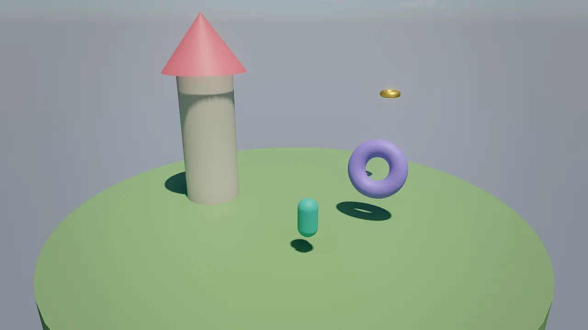
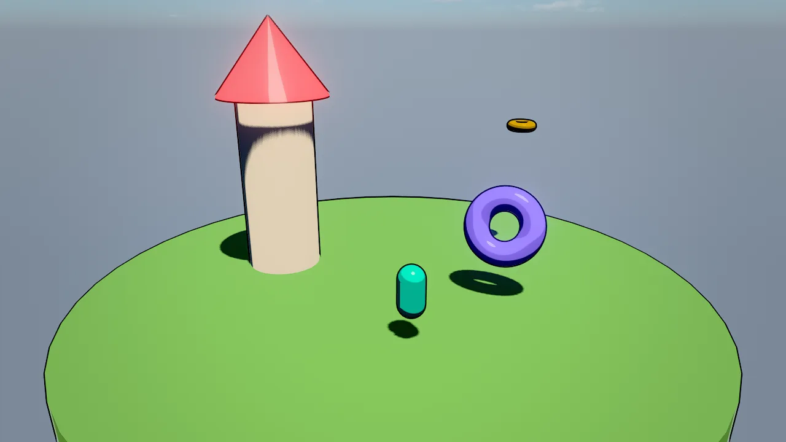
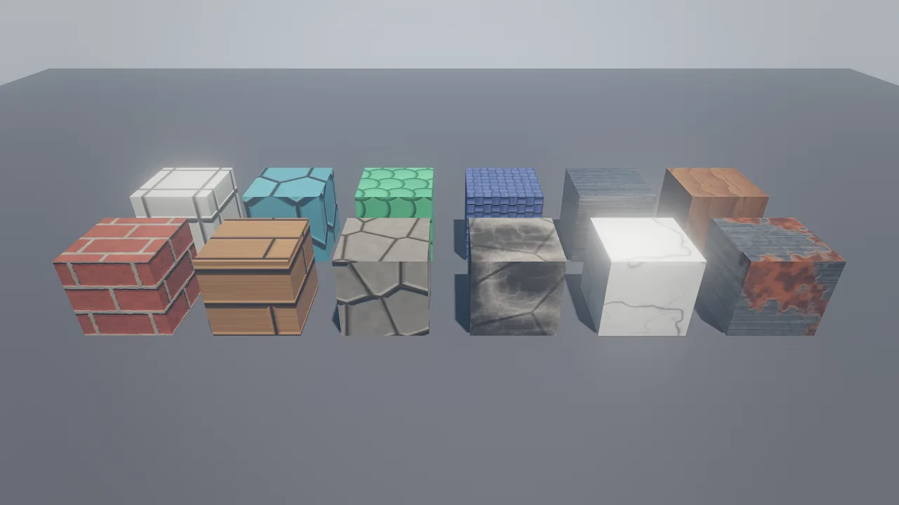

# Materials

A surface's look comes from the fields of its `mesh` component or, when `mesh.material` is set, from a reusable
material asset (`.mat.json`) with the same fields. Surfaces are physically based by default (metal/roughness PBR with
image-based light), and the same fields drive stylized looks: toon bands, rim light, cartoon outlines and flat unlit
color. Built-in presets and a procedural PBR texture generator give you good starting points without any image files.

<figure markdown>
{ loading=lazy }
<figcaption>Material presets from <code>material_create</code>. Front row: gold, silver, copper, chrome, brushed_steel, iron. Middle: plastic, rubber, ceramic, car_paint, glass, ice. Back: skin, wax, velvet, neon, toon, clay.</figcaption>
</figure>

## Concepts

### Shading models

`shading` selects how a surface responds to light:

| `shading` | Look | Use for |
|---|---|---|
| `pbr` (default) | Metal/roughness PBR: GGX specular with height-correlated Smith visibility, Lambert diffuse, split-sum image-based light, screen-space GI and reflections | Realistic surfaces |
| `toon` | Banded light, a crisp highlight and a hemispheric fill | Cartoon and cel-shaded games |
| `unlit` | The color or texture as is, without lighting or shadows | 2D, UI, signs, stylized neon |
| `water` | Animated waves on a large plane; `color` is the deep water tint | Simple water on a plane (the `water` component is the full ocean) |

Toon and unlit surfaces keep their stylized lighting: screen-space GI and reflections replace the probe light of PBR
surfaces only.

<div class="sky-compare" markdown>
<figure markdown>{ loading=lazy }<figcaption>shading pbr</figcaption></figure>
<figure markdown>{ loading=lazy }<figcaption>shading toon, outline 2.5, rim 0.4</figcaption></figure>
</div>

### Surface fields

These fields exist on the `mesh` component and on material assets:

| Field | Range | Meaning |
|---|---|---|
| `color` | color | Base color (sRGB), multiplied with `texture`. An alpha below 1 makes the surface transparent. |
| `metallic` | 0..1 | 0 = dielectric, 1 = metal |
| `roughness` | 0.02..1 | 0.02 = mirror, 1 = matte |
| `emissive` | color | Emitted light; the alpha channel is the strength and can exceed 1 (HDR), which glows with bloom |
| `texture` | path | Base color map (png/jpg), project-relative |
| `normalMap` | path | Tangent-space normal map, OpenGL convention. The tangent frame comes from screen-space derivatives, so meshes need no tangents. |
| `normalStrength` | 0..4 | Normal map strength |
| `ormMap` | path | glTF packing: R = occlusion, G = roughness, B = metallic; each channel multiplies the scalar field |
| `emissiveMap` | path | Multiplies `emissive` |
| `tiling` | 0.01..1000 | Texture repeats; with `triplanar`, repeats per meter of world space (`tilingU` / `tilingV` on material assets) |
| `triplanar` | bool | World-space projection with normal blending: textures never stretch on scaled cubes, walls or terrain |
| `clearcoat` | 0..1 | A second glossy lobe on top: car paint, varnish, ceramics |
| `subsurface` | 0..1 | Wrapped diffuse plus back-light transmission: skin, leaves, wax, snow, ice |
| `rim` | 0..4 | Stylized light along silhouettes |
| `outline` | 0..12 | Cartoon outline width in pixels (an inverted hull with constant screen-space width); `outlineColor` sets its color |
| `doubleSided` | bool | Render both faces: leaves, cloth, cards |
| `castShadows` | bool | Cast sun shadows (default on; `mesh` only) |
| `alphaCutoff` | 0..1 | Alpha-tested cutout: texture alpha below this is cut (foliage, fences, sails); 0 = off |
| `unlit` | bool | Flat color or texture without lighting |

Material assets add `occlusionStrength` (0..1, the ORM map's ambient occlusion) and separate `tilingU` / `tilingV`.
The `mesh` component also has `mesh`, `visible`, `billboard`, `material` and `layers` (see
[Render layers](index.md#render-layers)).

Roughness is widened automatically where normals vary within a pixel (specular anti-aliasing), so detailed normal
maps do not sparkle in motion.

### Transparency

A `color` alpha below 1 makes a surface transparent: glass, ghosts, light shafts. Transparent surfaces are sorted
back to front, drawn after opaque ones, and do not cast shadows. For hard-edged cutouts (leaves, chain-link fences,
torn sails) use `alphaCutoff` instead: alpha-tested surfaces stay opaque, sort correctly and cast shadows.

### Emissive light and bloom

`emissive` is `[r, g, b, strength]` or `"#rrggbbaa"`, where the alpha byte is the strength from 0 to 1; use the
array form for strengths above 1. Those are HDR and glow through the bloom chain; how much depends on the environment's `bloomThreshold` and `bloomIntensity`.
Emissive surfaces also light their surroundings through screen-space GI when they are on screen (see
[GI and reflections](gi.md)), but they are not light sources for the clustered lighting; add a `light` where a lamp
must light things off screen.

## Material assets and presets

A material asset is a `.mat.json` file with `"format": "skywalker.material"`. When an entity's `mesh.material` points
at it, the material overrides the entity's inline color, PBR values, emissive and texture. Editing a material updates
every entity that uses it instantly.

`material_create` starts from a preset; any field you pass overrides it:

| Preset | Base values |
|---|---|
| `gold`, `silver`, `copper`, `chrome`, `brushed_steel` | Metals: `metallic` 1, `roughness` 0.04 (chrome) to 0.38 (brushed steel) |
| `iron` | `metallic` 0.9, `roughness` 0.62 |
| `plastic`, `rubber` | Dielectrics: `roughness` 0.32 and 0.92 |
| `ceramic` | `roughness` 0.12, `clearcoat` 0.6 |
| `car_paint` | Red, `metallic` 0.6, `roughness` 0.38, `clearcoat` 1 |
| `glass` | Pale blue at about 22% alpha, `roughness` 0.03, double-sided |
| `water` | `shading: water`, deep teal |
| `ice`, `skin`, `wax`, `snow` | `subsurface` 0.5 to 0.9 |
| `leaves` | Green, `subsurface` 0.6, double-sided |
| `velvet` | `roughness` 0.85, `rim` 1.2 |
| `neon` | Black, cyan emissive at strength 4, unlit |
| `toon`, `toon_metal` | `shading: toon`, `rim` 0.6 / 0.8, `outline` 2 |
| `clay` | Terracotta, `roughness` 0.95 |

=== "Tool call"

    ```tool
    material_create {"path": "materials/car_body.mat.json", "preset": "car_paint", "color": "#1d4fa8"}
    material_assign {"entities": ["Kart Body"], "material": "materials/car_body.mat.json"}
    material_update {"path": "materials/car_body.mat.json", "clearcoat": 0.8}
    asset_preview {"asset": "materials/car_body.mat.json"}
    ```

=== "Wander"

    ```wander
    behavior DamageFlash
      intent "Flash red-hot for a quarter second when hit."
      on event "hit"
        self.mesh.emissive = (1, 0.2, 0.1, 3)
        wait 0.25
        self.mesh.emissive = (0, 0, 0, 1)
      end
    end
    ```

=== "JSON"

    ```json
    {
      "format": "skywalker.material",
      "version": 1,
      "color": "#1d4fa8",
      "metallic": 0.6,
      "roughness": 0.38,
      "clearcoat": 1,
      "shading": "pbr"
    }
    ```

!!! note "Scripts write the entity, not the asset"

    `self.mesh.emissive` changes the entity's own field. When the entity uses a material asset, the asset's values win
    for color, PBR values, emissive and texture; flash an entity that has no `material`, or clear it first.

## Generated PBR textures

`texture_generate` writes a seamless albedo, normal and ORM set (`<name>_albedo.png`, `_normal.png`, `_orm.png`) and,
by default, a triplanar material `materials/<last part of name>.mat.json` that uses them, at 0.5 repeats per meter.
Provenance (`generator: texgen`, kind, seed) is stored in each file's `.meta`.

<figure markdown>
{ loading=lazy }
<figcaption><code>texture_generate</code> kinds on cubes. Front row: bricks, planks, cobblestone, rock, marble, rust. Back row: tiles, hexagons, scales, fabric, metal_brushed, wood.</figcaption>
</figure>

| Group | Kinds |
|---|---|
| Masonry and floors | `bricks`, `tiles`, `cobblestone`, `hexagons`, `planks`, `checker`, `stripes` |
| Natural | `rock`, `marble`, `wood`, `grass`, `dirt`, `sand`, `noise`, `scales` |
| Manufactured | `metal_brushed`, `rust`, `fabric` |
| Stylized | `stylized` |
| Soft effect textures | `glow` (radial), `curtain` (vertical rays fading upward): transparent edges and a self-lit, double-sided material for light pools, auroras, shafts and steam |

Customize with `color1` (primary), `color2` (secondary), `color3` (mortar, grout, veins, rust), `scale` (feature
count), `variation`, `bump`, `roughness`, `metallic`, `seed` and `size` (64 to 2048 pixels, power of two).

```tool
texture_generate {"kind": "bricks", "name": "textures/old_bricks", "color1": "#9a4a3a", "color3": "#c8bfae", "seed": 4, "size": 1024}
material_assign {"entities": ["Wall North", "Wall East"], "material": "materials/old_bricks.mat.json"}
viewport_capture {"debug_view": "texel_density", "samples": 1}
```

## Imported materials

Importing a glTF or GLB model extracts base color, metallic-roughness (with packed occlusion), normal and emissive
maps, alpha mask or blend and double-sidedness into material assets next to the mesh. OBJ files bring their first
`.mtl` material. See [Assets and prefabs](../assets.md#meshes).

## Recipes

| Look | Settings |
|---|---|
| Photoreal stone and metal | `texture_generate` kinds with their triplanar materials; metals from presets with `roughness` 0.2 to 0.4; environment `tonemap: agx`, `ao: 1` |
| Cartoon | `shading: toon`, `outline` 2 to 3, `rim` 0.5, saturated colors; environment `tonemap: neutral`, `saturation: 1.2` |
| Neon sign | `neon` preset or `unlit` with `emissive` strength 2 to 5 on a dark glossy floor (`roughness: 0.3`); `bloomIntensity: 0.8` |
| Wet street | `roughness` 0.1 to 0.2 on the ground with `ssr: 1`, so lamps and signs reflect |
| Pixel-art 2D | `shading: unlit`, an orthographic camera, `tonemap: none`, bloom off |
| Foliage card | Texture with alpha, `alphaCutoff: 0.5`, `doubleSided: true`, `subsurface: 0.5` |

## Recipe: a toon look in four calls

```tool
material_create {"path": "materials/hero_toon.mat.json", "preset": "toon", "color": "#2ec4b6", "outline": 2.5, "rim": 0.4}
material_assign {"entities": ["Hero"], "material": "materials/hero_toon.mat.json"}
environment_update {"tonemap": "neutral", "saturation": 1.2, "bloomIntensity": 0.3}
viewport_capture {"samples": 8}
```

## Pitfalls

- **Material wins.** With `mesh.material` set, inline `color`, `metallic`, `roughness`, `emissive` and `texture` are
  ignored. Change the material, or clear `material` with `material_assign {"entities": [...], "material": ""}`.
- **Transparent surfaces do not refract** and cast no shadow. Water refracts; glass does not yet.
- **Normal maps use the OpenGL convention** (green up). Maps authored for the other convention look inverted; flip
  their green channel.
- **Triplanar tiling is per meter.** A triplanar material with `tiling` 0.5 repeats every 2 m regardless of the
  mesh's scale; check `texel_density` in [debug views](debug-views.md).
- **Emissive is not a light.** Glowing surfaces light the scene only through on-screen GI.

!!! agent "For agents"

    Prefer presets and generated textures to guessing numbers, and look at the result:

    ```tool
    material_create {"path": "materials/stone.mat.json", "preset": "clay", "roughness": 0.9}   # start from a preset
    texture_generate {"kind": "rock", "name": "textures/cliff"}                               # PBR maps + triplanar material
    asset_preview {"asset": "materials/cliff.mat.json"}                                       # material on a sphere
    material_assign {"entities": ["Cliff"], "material": "materials/cliff.mat.json"}
    viewport_capture {"samples": 8}
    viewport_capture {"debug_view": "material", "samples": 1}                                 # roughness red, metallic green
    ```

## Reference

- Tools: [`material_create`](../../reference/tools/asset.md#material_create), [`material_update`](../../reference/tools/asset.md#material_update),
  [`material_assign`](../../reference/tools/asset.md#material_assign), [`texture_generate`](../../reference/tools/asset.md#texture_generate),
  [`asset_preview`](../../reference/tools/asset.md#asset_preview)
- Component: [`mesh`](../../reference/components/core.md#mesh)
- Design: [docs/RENDERING.md](https://github.com/amirhossein-razlighi/Skywalker/blob/main/docs/RENDERING.md) (Surfaces; Materials and textures for agents), [docs/ASSETS.md](https://github.com/amirhossein-razlighi/Skywalker/blob/main/docs/ASSETS.md)
