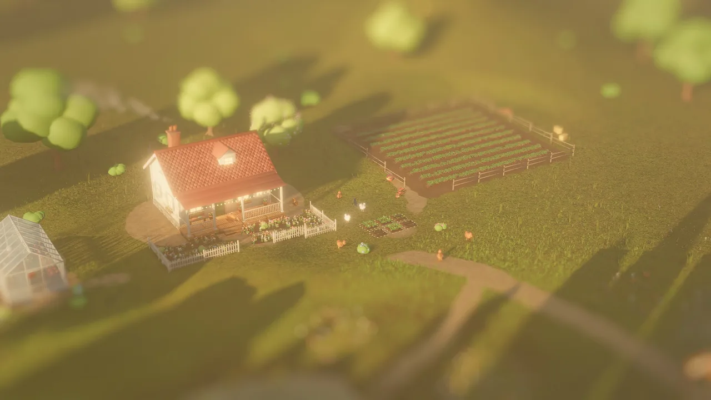
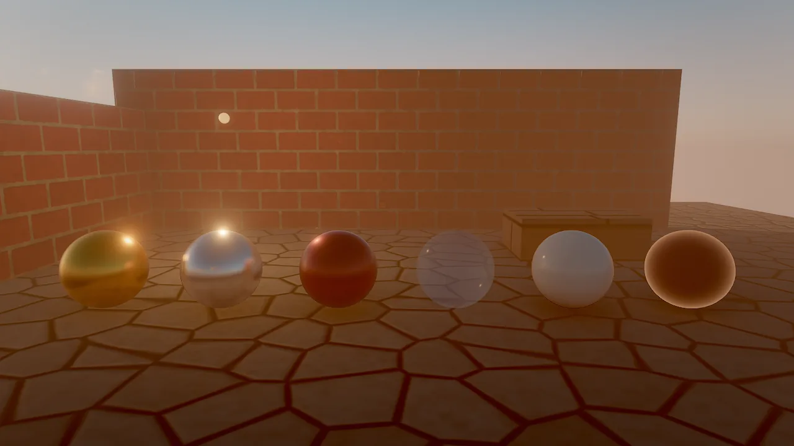
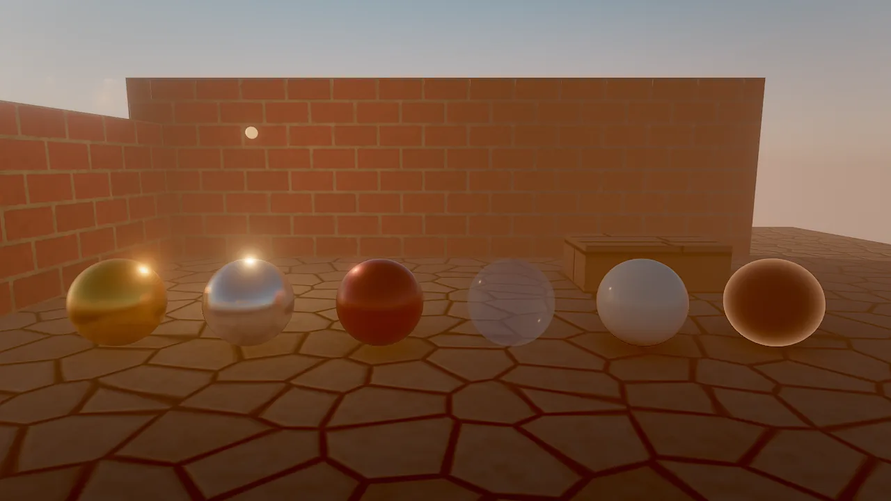
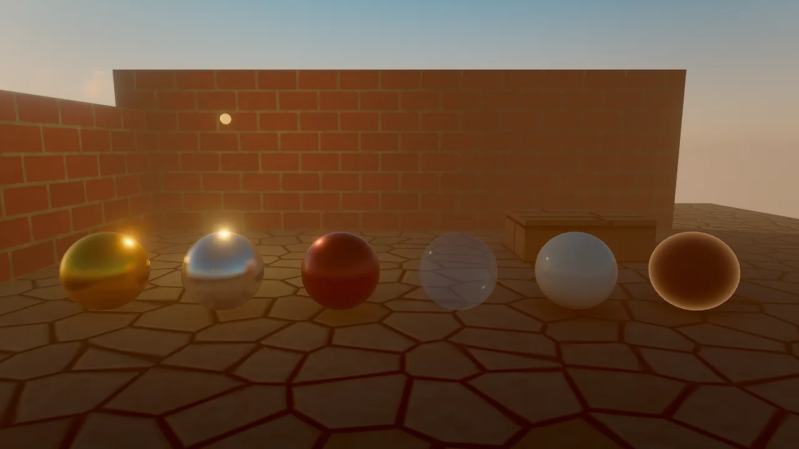
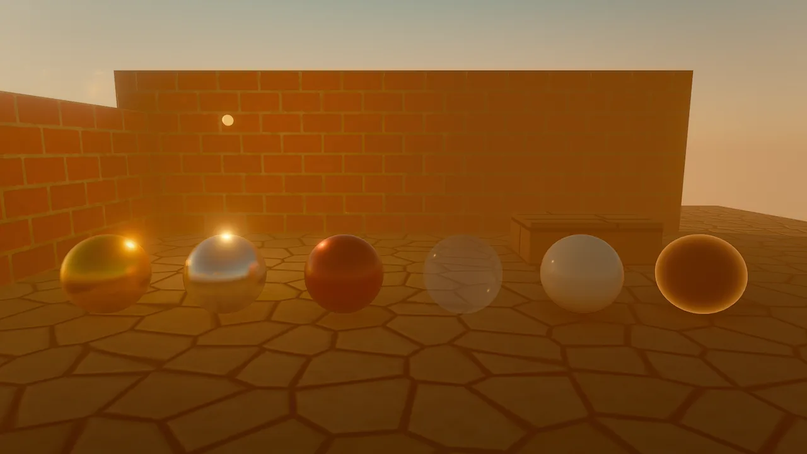
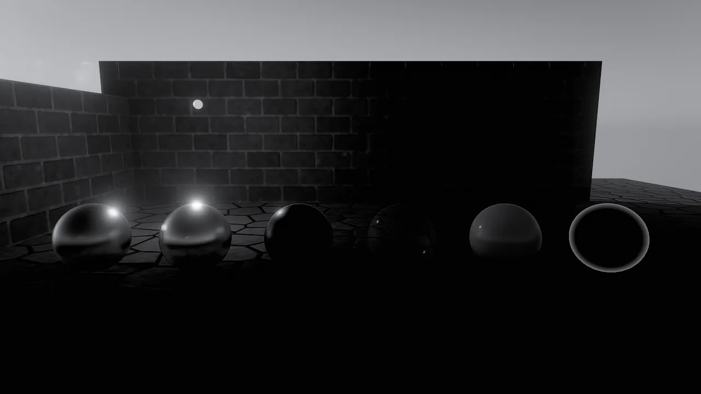
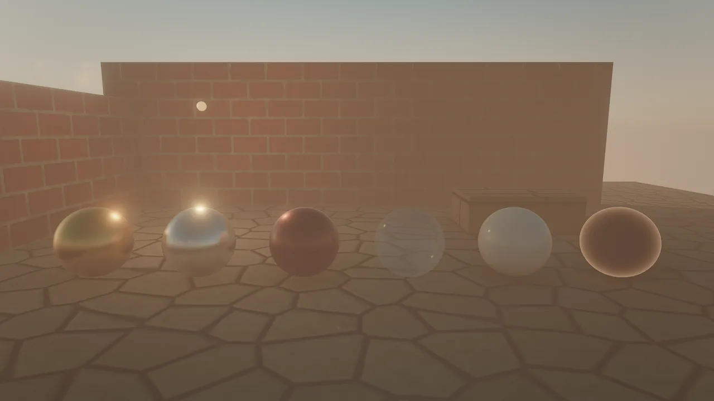
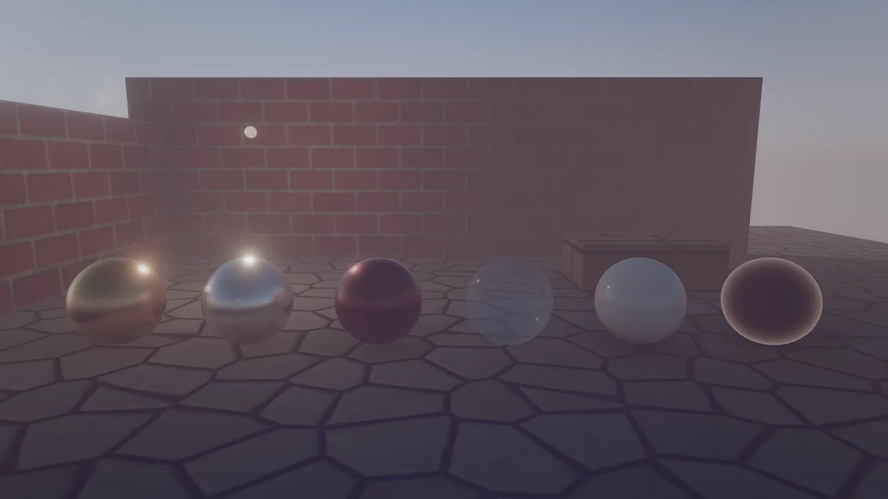

# Camera and post-processing

The camera turns the lit HDR scene into the picture you see. Lens settings live on the `camera` component (field of
view, depth of field, tilt-shift, motion blur); exposure, tonemapping, color grading, looks and lens character live in
the scene's `environment`. Together they form one HDR pipeline: temporal anti-aliasing, motion blur, depth of field
and auto exposure, then bloom and the final composite.

<figure markdown>
{ loading=lazy }
<figcaption>berrybrook, "miniature": <code>tiltShift</code> keeps a band across the middle of the frame sharp and blurs above and below it, the toy-town look for aerial shots.</figcaption>
</figure>

## Concepts

### The camera component

| Field | Default | Meaning |
|---|---|---|
| `fov` | 60 | Vertical field of view in degrees (5 to 170) |
| `nearPlane`, `farPlane` | 0.1, 500 | Clip distances in meters |
| `orthographic`, `orthoSize` | false, 5 | Orthographic projection for 2D and isometric games; `orthoSize` is half the visible height |
| `primary` | true | The first primary camera in scene order is the game camera |
| `aperture` | 0 | Depth of field f-stop: 1.4 very shallow to 16 deep; 0 = everything sharp |
| `focusDistance` | 0 | Focus distance in meters; 0 = autofocus on the center of the frame |
| `tiltShift` | 0 | Miniature look: 0 = off, 1 = strong |
| `motionBlur` | 0 | Shutter fraction: 0.5 = a film-like 180° shutter, 0 = off |
| `cullMask` | all layers | [Render layers](index.md#render-layers) the camera draws |

The editor has its own orbit camera (`camera_set`), which is what the viewport and default captures show.
`viewport_capture {"view": "scene"}` renders through the game camera, `camera_entity` through any camera entity, and
`eye` / `target` / `fov` (with `aperture`, `focus_distance` and `tilt_shift`) through a one-off custom lens.

### Order of operations

After the scene is lit, the frame goes through: volumetric light and the temporal pass (TAA, or accumulation for
stills), MetalFX upscaling when `renderScale` < 1, then the camera stage (motion blur, depth of field, auto exposure),
then post: the bloom chain and the composite, which applies chromatic aberration, white balance, exposure, the
tonemap, saturation and contrast, the look or LUT, vignette, grain, contrast-adaptive sharpening and dithering.

### Depth of field and tilt-shift

Depth of field is a thin-lens model: each pixel's circle of confusion comes from its depth, `aperture` and
`focusDistance`, and a bokeh gather at half resolution blurs it. `tiltShift` fakes a tilt-shift lens: a sharp band
across the middle of the frame with blur growing above and below it. A real aperture cannot blur a scene 50 m away
that much, which is what makes aerial shots read as miniatures. It shares the bokeh gather with `aperture` and
combines with it.

<div class="sky-compare" markdown>
<figure markdown>{ loading=lazy }<figcaption>aperture 0 (all sharp)</figcaption></figure>
<figure markdown>{ loading=lazy }<figcaption>aperture 1.4, autofocus</figcaption></figure>
</div>

### Exposure

| Field | Default | Meaning |
|---|---|---|
| `exposure` | 1 | Manual exposure multiplier; still applies with auto exposure |
| `autoExposure` | false | Eye adaptation from center-weighted metering |
| `exposureCompensation` | 0 | EV stops added on top, −6 to 6 |
| `adaptationSpeed` | 1.5 | How fast auto exposure adapts |

Captures and stills meter instantly; real-time frames adapt over time. Movie renders adapt by the movie's frame time,
so exposure changes are stable across frames.

### Tonemapping

`tonemap` maps HDR to the display: `aces` (the default), `agx`, `neutral`, `filmic` or `none`. As starting points,
the recipes in this manual use `agx` for photoreal scenes, `neutral` for cartoon looks and `none` for pixel art and flat
2D, where colors must come out exactly as authored.

### Grading and looks

| Field | Default | Meaning |
|---|---|---|
| `temperature` | 0 | White balance: −1 cool to +1 warm |
| `tint` | 0 | −1 green to +1 magenta |
| `saturation` | 1.05 | 1 = neutral (0 to 2) |
| `contrast` | 1.05 | 1 = neutral (0.5 to 2) |
| `look` | `none` | `warm`, `cool`, `teal_orange`, `golden_hour`, `bleach`, `noir`, `vivid`, `moonlight`, `vintage` |
| `lut` | none | A project-relative `.cube` 3D LUT; when set, it is used instead of `look` |
| `lookStrength` | 1 | Blend of the look or LUT |

`.cube` files must be 3D LUTs (`LUT_3D_SIZE` 2 to 256); 1D LUTs are rejected. A LUT file is reloaded when it changes
on disk.

<div class="sky-compare" markdown>
<figure markdown>{ loading=lazy }<figcaption>none</figcaption></figure>
<figure markdown>{ loading=lazy }<figcaption>teal_orange</figcaption></figure>
<figure markdown>{ loading=lazy }<figcaption>golden_hour</figcaption></figure>
<figure markdown>{ loading=lazy }<figcaption>noir</figcaption></figure>
<figure markdown>{ loading=lazy }<figcaption>vintage</figcaption></figure>
<figure markdown>{ loading=lazy }<figcaption>moonlight</figcaption></figure>
</div>

### Bloom and lens character

| Field | Default | Meaning |
|---|---|---|
| `bloomIntensity` | 0.55 | Glow around bright and emissive things (0 = off, up to 5) |
| `bloomThreshold` | 1 | Brightness where glow starts; lower = more glow |
| `vignette` | 0.22 | Darkens the corners |
| `grain` | 0 | Film grain |
| `chromaticAberration` | 0 | Color fringing toward the frame edges |
| `sharpen` | 0.35 | Contrast-adaptive sharpening after the temporal pass |

### Temporal anti-aliasing and the velocity buffer

Every frame knows how each pixel moved since the previous one. The scene pass writes **object motion** (meshes from
their previous transform, skinned meshes from their previous pose, foliage from the previous wind time, hair and mesh
particles from their own history); **camera motion** is added from the depth buffer. TAA (`taa`, on by default) uses
it to reproject history with dilated velocity, Catmull-Rom filtering and variance clipping, so moving and animated
things stay sharp instead of ghosting. MetalFX upscaling reads the same buffer.

### Motion blur

`motionBlur` on the camera is the shutter fraction. In real time it is a post-process blur of camera and object
motion: the largest motion per tile of about 40 pixels and its neighbors drives a depth-aware gather, so moving
objects blur over a sharp background. The blur length is capped at two tiles. Movie renders use a real accumulated
shutter instead (see [Movie renderer](../movie-render.md)).

`debug_view: "motion"` shows the velocity buffer: hue is direction, strength is speed on a log scale. Capture it with
`samples: 1` right after something moved. On an M1 Pro at 1920×1080 the velocity buffer costs about 0.2 to 0.4 ms per
frame.

## How to set up a shot

=== "Tool call"

    ```tool
    entity_create {"name": "Shot Camera", "position": [0, 1.6, 6], "rotation": [-5, 0, 0], "components": {"camera": {"fov": 35, "aperture": 2, "focusDistance": 5.5, "motionBlur": 0.5}}}
    environment_update {"tonemap": "agx", "autoExposure": true, "exposureCompensation": 0.3, "look": "golden_hour", "lookStrength": 0.6, "vignette": 0.3, "grain": 0.15}
    viewport_capture {"camera_entity": "Shot Camera", "samples": 16}
    viewport_capture {"eye": [8, 3, 8], "target": [0, 1, 0], "fov": 30, "aperture": 1.4, "samples": 16}
    ```

=== "Wander"

    ```wander
    behavior FocusPull
      intent "Keep the hero in focus as it moves, and widen the lens while it sprints."
      on tick
        let hero = find("Hero")
        if hero then
          self.camera.focusDistance = distance(self, hero)
          let target_fov = 55
          if key("shift") then target_fov = 70 end
          self.camera.fov = approach(self.camera.fov, target_fov, 40 * dt)
        end
      end
    end
    ```

=== "CLI"

    ```bash
    skywalker render scenes/main.sky.json -o shot.png --scene-camera --width 1920 --height 1080 --samples 16
    ```

## Recipe: camera shake that never changes the game

Shake belongs in an `on frame` handler: it runs at display rate and its writes are undone after the frame.

```wander
behavior CameraShake
  intent "Shake when hit, decaying over about a second."
  var trauma = 0
  on event "hit"
    trauma = min(1, trauma + 0.5)
  end
  on tick
    trauma = max(0, trauma - dt * 1.5)
  end
  on frame
    let k = trauma * trauma * 0.3
    self.position = self.position + (noise(time * 40), noise(time * 40 + 9), 0) * k
  end
end
```

## Recipe: looks in one call

| Look | Settings |
|---|---|
| Photoreal daylight | `tonemap: agx`, `autoExposure: true`, `saturation: 1`, `contrast: 1.05`, low `vignette` |
| Cinematic dusk | `look: golden_hour`, `lookStrength: 0.7`, `temperature: 0.2`, `vignette: 0.35`, `grain: 0.1` |
| Thriller | `look: teal_orange` or `bleach`, `contrast: 1.2`, `chromaticAberration: 0.2` |
| Noir | `look: noir`, `contrast: 1.3`, `vignette: 0.5`, `grain: 0.3` |
| Cartoon | `tonemap: neutral`, `saturation: 1.2`, bloom low |
| Pixel art | Orthographic camera, `shading: unlit` materials, `tonemap: none`, `bloomIntensity: 0`, `vignette: 0` |
| Miniature | Camera high and looking down, `tiltShift: 0.6`, `saturation: 1.2` |

```tool
environment_update {"look": "noir", "contrast": 1.3, "vignette": 0.5, "grain": 0.3}
viewport_capture {"view": "scene", "samples": 8}
```

## Pitfalls

- **Depth of field and motion blur are off in the fast and balanced editor tiers.** Judge them in play mode or in a
  capture (`full` by default).
- **`aperture: 0` means no depth of field**, not an infinitely wide aperture.
- **Autofocus looks at the center.** With `focusDistance: 0`, the focus follows whatever is in the middle of the frame;
  set a distance for off-center subjects.
- **A LUT replaces the look.** Setting `lut` ignores `look`; clear `lut` (`""`) to go back to the built-in looks.
- **Pixel art.** For crisp pixels use an orthographic camera, `tonemap: none`, no bloom, and
  `process.interpolation: off` on things that must snap to the pixel grid.
- **Exposure stacks.** Manual `exposure` multiplies auto exposure; reset it to 1 when switching to auto.

!!! agent "For agents"

    Look through the game camera, change grading in one call, and compare:

    ```tool
    scene_query {"component": "camera"}                                 # which cameras exist
    viewport_capture {"view": "scene", "samples": 8}                    # the shot as players see it
    environment_update {"tonemap": "agx", "look": "teal_orange", "lookStrength": 0.5}
    viewport_capture {"view": "scene", "samples": 8}                    # compare against the previous image
    viewport_capture {"view": "scene", "debug_view": "motion", "samples": 1}   # velocity, after a sim step
    ```

## Reference

- Tools: [`environment_update`](../../reference/tools/render.md#environment_update), [`viewport_capture`](../../reference/tools/view.md#viewport_capture),
  [`camera_set`](../../reference/tools/view.md#camera_set), [`movie_render`](../../reference/tools/render.md#movie_render)
- Components: [`camera`](../../reference/components/core.md#camera), [`environment`](../../reference/components/core.md#environment)
- Wander: [`approach`](../../reference/wander.md#math-approach), [`noise`](../../reference/wander.md#math-noise)
- Design: [docs/RENDERING.md](https://github.com/amirhossein-razlighi/Skywalker/blob/main/docs/RENDERING.md) (Camera, grading and looks; Velocity buffer), [docs/MOVIE_RENDER.md](https://github.com/amirhossein-razlighi/Skywalker/blob/main/docs/MOVIE_RENDER.md)
