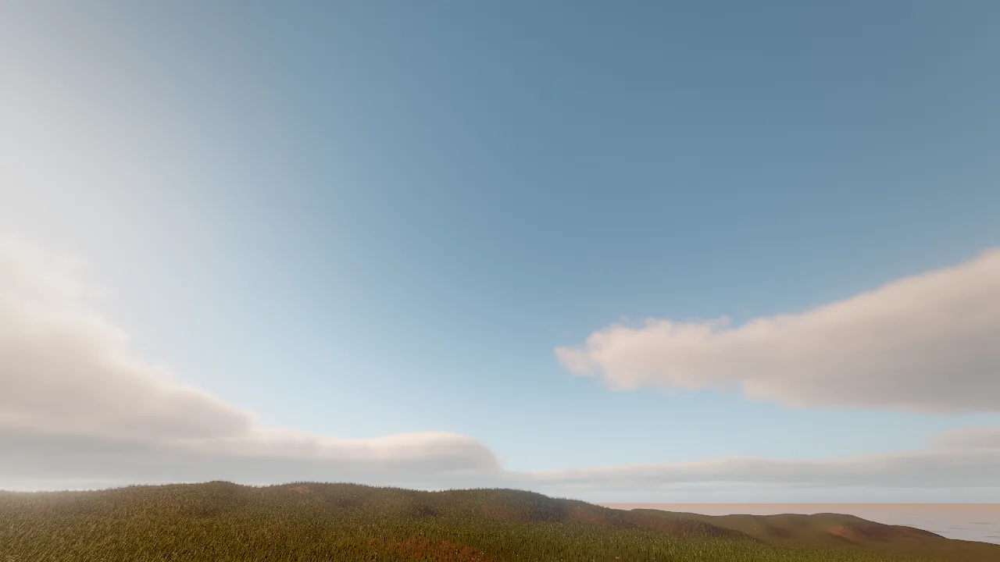

# Sky and atmosphere

The sky is part of the scene's `environment`: a two-color gradient, a physically based atmosphere driven by the sun,
or a photographed HDR panorama, with volumetric clouds, stars, distance and height fog, and wind. The sky does more than
fill the background: it is rendered into a cubemap that lights and reflects every surface, so changing the sky changes
the lighting of the whole scene. All of it is set with `environment_update`, optionally starting from a preset.

<figure markdown>
{ loading=lazy }
<figcaption>Volumetric clouds over a foliage-covered terrain, atmosphere sky.</figcaption>
</figure>

## Concepts

### Sky modes

| `skyMode` | What it is | Key fields |
|---|---|---|
| `gradient` (default) | Two artist colors from horizon to zenith | `skyTop`, `skyHorizon`, `ground` (bounce color from below) |
| `atmosphere` | Rayleigh and Mie single scattering from the sun plus a multiple-scattering term, so horizons stay bright rather than brown | The sun fields drive it: `sunElevation`, `sunAzimuth`, `sunColor`, `sunIntensity` |
| `hdri` | A photographed equirectangular `.hdr` panorama lights and backs the scene | `hdri` (project-relative path), `hdriRotation` (degrees), `hdriIntensity` |

With `hdri`, call `environment_update {"align_sun_to_hdri": true}` to point the sun (the direction of light and
shadows) at the brightest spot of the panorama, so cast shadows agree with the photograph. `.hdr` files are texture
assets; `asset_download` fetches openly licensed panoramas.

### The sky probe

Every frame starts with the environment pass: the sky, with its clouds, is rendered into a 128² cubemap and
prefiltered into 6 roughness levels. Rough surfaces read blurry sky light from it, glossy ones sharp reflections. It
is re-baked only when the sky changes. The environment's `ambient` scales the diffuse sky light and `reflections` the
specular part (see [GI and reflections](gi.md)).

### The sun

| Field | Default | Meaning |
|---|---|---|
| `sunAzimuth` | 35 | Compass direction in degrees (0 = +Z) |
| `sunElevation` | 50 | Height above the horizon, −90 to 90 |
| `sunColor` | warm white | Light color |
| `sunIntensity` | 1.9 | Brightness (0 to 100) |
| `sunSize` | 1 | Sun and moon disc size multiplier |

The sun is also the only light that casts shadows; see [Lighting and shadows](lighting.md#sun-shadows).

### Volumetric clouds

`clouds` sets the coverage (0 = clear). In `volumetric` mode, a curved cloud layer is ray-marched at half resolution
through GPU-generated Perlin-Worley noise, lit with a Beer-powder term, multiple scattering and a dual-lobe phase
function, reprojected over time in real time, and visible in reflections. Clouds cast drifting shadows on the ground.

| Field | Default | Meaning |
|---|---|---|
| `clouds` | 0 | Cover, 0 to 1 |
| `cloudMode` | `volumetric` | `volumetric` (ray-marched, lit, shadowing) or `flat` (a cheap painted layer) |
| `cloudHeight` | 1500 | Base of the layer in meters (100 to 12000) |
| `cloudThickness` | 1800 | Thickness in meters (100 to 10000) |
| `cloudDensity` | 1 | 0.3 wispy to 2 stormy (up to 4) |
| `cloudScale` | 1 | Feature size: 0.5 small puffs to 3 huge banks (0.1 to 8) |
| `cloudSpeed` | 8 | Drift in m/s along `windDirection` |

**Clouds below the camera.** When the camera is above or inside the layer (a strategy map, a flight), clouds are
composited over the ground seen through them, not only over the sky. For map-scale scenes use a low layer and small
features, for example `cloudHeight: 330`, `cloudThickness: 150`, `cloudScale: 0.1`.

<figure markdown>
{ loading=lazy }
<figcaption>meridian_accord: a low cloud layer composited over a terrain with a map overlay, seen from above the clouds.</figcaption>
</figure>

### Stars

`stars` (0 to 1) adds a star field that fades in as the sky darkens, so the same value works through a sunset.

### Fog

| Field | Default | Meaning |
|---|---|---|
| `fogColor` | pale blue | Fog color |
| `fogDensity` | 0.004 | Exponential distance fog (0 = off) |
| `fogHeight` | 0 | Above 0, fog pools near the ground: graveyards, swamps, valleys (up to 2) |

Fog in-scatters warm light toward the sun, so fog lit from behind glows. Distance fog is separate from the
volumetric haze that light shafts scatter in (`haze`, `godRays`, see
[Lighting and shadows](lighting.md#volumetric-light)).

### Wind

`windSpeed` (m/s, 0 to 60, default 2) and `windDirection` (degrees, the direction the wind blows toward, 0 = +Z) carry
smoke, rain, snow and every particle emitter whose `wind` is above 0, and set the direction clouds drift in. Water and
foliage have their own wind settings on their components.

## Presets

`environment_update` accepts a `preset`, applied first, so other fields in the same call override it:

| Preset | Sun | Sky and fog | Ambient, exposure |
|---|---|---|---|
| `noon` | Elevation 70°, intensity 2.6 | Deep blue to pale horizon, light fog | 0.4, 1 |
| `sunset` | Elevation 8°, azimuth 250°, orange, 2.4 | Indigo to orange, warm fog | 0.3, 1.1 |
| `night` | Elevation 35°, pale blue moonlight, 0.35 | Near-black blue, denser fog | 0.12, 1.3 |
| `overcast` | Elevation 60°, gray-white, 0.6 | Gray sky and fog | 0.85, 1 |
| `studio` | Elevation 45°, white, 2 | Dark neutral gray, no fog | 0.55, 1 |

Presets set gradient colors, sun, ambient, fog and exposure; they do not change `skyMode`, clouds, tonemapping or grading.

<div class="sky-compare" markdown>
<figure markdown>{ loading=lazy }<figcaption>noon</figcaption></figure>
<figure markdown>{ loading=lazy }<figcaption>sunset</figcaption></figure>
<figure markdown>{ loading=lazy }<figcaption>overcast</figcaption></figure>
<figure markdown>{ loading=lazy }<figcaption>night</figcaption></figure>
</div>

## How to set up a sky

=== "Atmosphere"

    ```tool
    environment_update {"skyMode": "atmosphere", "sunElevation": 25, "sunAzimuth": 140, "clouds": 0.4, "cloudDensity": 0.8, "stars": 0.4}
    viewport_capture {"samples": 8}
    ```

=== "HDRI"

    ```tool
    environment_update {"skyMode": "hdri", "hdri": "skies/harbor_sunset.hdr", "hdriIntensity": 1.2, "align_sun_to_hdri": true}
    viewport_capture {"samples": 8}
    ```

=== "Gradient"

    ```tool
    environment_update {"preset": "sunset", "skyTop": "#2a3a7a", "skyHorizon": "#ffa070", "fogHeight": 0.5}
    viewport_capture {"samples": 8}
    ```

=== "CLI"

    ```bash
    skywalker call environment_update '{"skyMode": "atmosphere", "clouds": 0.5}' --project my_game --scene scenes/main.sky.json
    skywalker render scenes/main.sky.json -o sky.png --samples 8
    ```

`environment_get` returns every current value. Environment edits are undoable like entity edits.

## Recipe: a day that turns to night

Scripts do not write the environment directly, but [sequences](../animation.md) key any environment field. A looping
two-minute sequence that sets the sun and fades in the stars:

```tool
sequence_create {"path": "cinematics/day_cycle.sequence.json", "duration": 120, "loop": true, "entity": "Day Cycle"}
sequence_key {"sequence": "cinematics/day_cycle.sequence.json", "keys": [
  {"property": "environment.sunElevation", "t": 0, "value": 60, "ease": "smooth"},
  {"property": "environment.sunElevation", "t": 60, "value": -8, "ease": "smooth"},
  {"property": "environment.sunElevation", "t": 120, "value": 60, "ease": "smooth"},
  {"property": "environment.stars", "t": 50, "value": 0},
  {"property": "environment.stars", "t": 65, "value": 0.8},
  {"property": "environment.stars", "t": 110, "value": 0}
]}
environment_update {"skyMode": "atmosphere", "clouds": 0.3}
sim_control {"action": "play"}
sim_control {"action": "step", "ticks": 3600}
viewport_capture {"view": "scene", "samples": 4}
```

The atmosphere sky follows the sun by itself: it reddens near the horizon and darkens below it. Sequences run in the
simulation, so the environment returns to its edit-time values when play stops. A Wander behavior can start or seek
the cycle with `play_sequence(find("Day Cycle"), 30)`.

## Recipe: an aerial strategy map

```tool
environment_update {"skyMode": "atmosphere", "clouds": 0.5, "cloudHeight": 330, "cloudThickness": 150, "cloudScale": 0.1, "cloudDensity": 0.8, "cloudSpeed": 4}
viewport_capture {"eye": [0, 900, -700], "target": [0, 0, 0], "samples": 8}
```

## Pitfalls

- **Presets reset sun and sky colors.** Apply a preset first, then your overrides in the same or a later call.
- **`hdri` needs a file.** `skyMode: hdri` without `hdri` has nothing to show; the path is project-relative.
- **Cloud cover of 0 hides every cloud setting.** Set `clouds` above 0 before tuning height, scale or density.
- **Volumetric clouds cost GPU time.** In heavy scenes compare `profile.groups.clouds` with `perf_stats` and switch to
  `cloudMode: flat` if needed.
- **Fog hides distance.** A high `fogDensity` makes large worlds look small; prefer `fogHeight` for low-lying mist.

!!! agent "For agents"

    Read before you write, change the sky in one call, then judge it at final quality:

    ```tool
    environment_get {}                                       # current sky, sun, fog, clouds, grading
    environment_update {"preset": "sunset", "skyMode": "atmosphere", "clouds": 0.35}
    viewport_capture {"view": "scene", "samples": 8}         # clouds and GI need samples to converge
    perf_stats {"frames": 30, "passes": true}                # check profile.groups.clouds and environment
    ```

## Reference

- Tools: [`environment_update`](../../reference/tools/render.md#environment_update), [`environment_get`](../../reference/tools/render.md#environment_get),
  [`sequence_key`](../../reference/tools/animation.md#sequence_key), [`asset_download`](../../reference/tools/network.md#asset_download)
- Component: [`environment`](../../reference/components/core.md#environment)
- Wander: [`play_sequence`](../../reference/wander.md#animation-play_sequence)
- Design: [docs/RENDERING.md](https://github.com/amirhossein-razlighi/Skywalker/blob/main/docs/RENDERING.md) (Sky, atmosphere and clouds; Environment)
