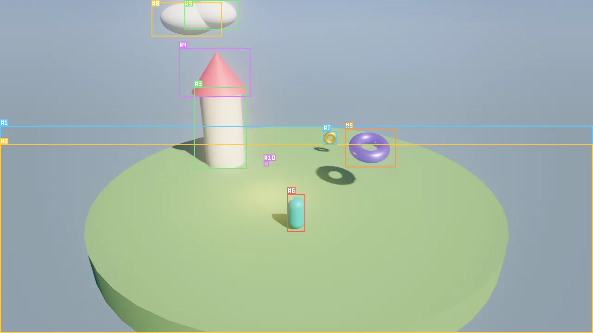

# Scenes and entities

A scene is the authoritative state of one level, menu or cutscene: an ordered list of entities, each with a name, a
place in a hierarchy, tags, free-form variables, components and behaviors, plus the scene-wide environment. Scenes
are plain JSON files (`.sky.json`) that you can read, diff and merge. Every change to a scene, made by you in the
editor, by an agent or by a tool, goes through one validated, undoable and attributed path.

<figure markdown>
{ loading=lazy }
<figcaption>The hello_sky example captured with <code>viewport_capture {"annotate": true}</code>: every visible entity carries its stable <code>#id</code> and its screen box.</figcaption>
</figure>

## Concepts

### Entities

An entity is an id plus a record:

| Part | What it holds |
|---|---|
| `id` | A stable 64-bit number, written `#12` in tool output. Ids are never reused within a scene, so an agent can hold on to `#12` across many edits. |
| `name` | A display name. Names need not be unique; tools accept an id or an exact name. |
| `parent` | The parent entity id, or `0` for a root entity. |
| `enabled` | A disabled entity, and everything under it, is not drawn and runs nothing. |
| `tags` | A list of strings for grouping and queries (`"enemy"`, `"static"`, `"coin"`). |
| `vars` | A free-form JSON object. Wander `var`s live here, so tools and the editor can read and change gameplay state. |
| `components` | Data: `transform`, `mesh`, `light`, `body`, `audio` and the rest. See [Components](components.md). |
| `behaviors` | Logic: an intent in plain language plus Wander code. See [Wander scripting](wander/index.md). |

Tools resolve an entity reference by exact id first (`12` or `"#12"`), then by exact name, then by name without
regard to case. When two entities share a name, use the id.

### Stable ids

Internally the ECS uses compact (index, generation) handles, but nothing public ever sees them. Every tool, every
scene file, the C API and Wander use 64-bit ids that the scene hands out in increasing order. When a scene loads,
the ids in the file are kept, and new entities continue above the highest one. Deleting `#40` never gives `#40`
to a later entity, so an id an agent noted down an hour ago either still means the same entity or no longer exists.

### Scene order

Entities are kept in a stable, deterministic order: creation order, with children following the hierarchy. The
order is saved in the file and restored exactly by undo and redo. It matters at run time: the simulation visits
entities in scene order every tick, so two runs of the same scene behave identically (see
[Simulation and time](simulation.md#determinism)).

### Hierarchy

Any entity can be the parent of others. A child's `transform` is relative to its parent, so moving a cart moves its
wheels. The world transform of an entity combines all of its ancestors.

- Disabling a parent disables the whole subtree: an entity is active only when it and all its ancestors are enabled.
- Deleting an entity deletes its children. Duplicating an entity copies its children, components and behaviors.
- `transform` with `"space": "world"` places an entity at a world position even when it has a parent.
- In Wander, `e.parent` and `children(e)` read the hierarchy; reparenting is an editing operation
  (`entity_update` with `parent`), not a script operation.

### The environment

Each scene carries one `environment`: sky, sun, ambient light, fog, exposure, post-processing, wind. It is saved with
the scene, edited with `environment_update` and undone like any other edit. The rendering pages describe its fields:
[Sky and atmosphere](rendering/sky.md), [Lighting](rendering/lighting.md),
[Camera and post-processing](rendering/post.md).

## The scene file

A scene is a `.sky.json` file in the project, usually under `scenes/`. This is an excerpt of
`examples/hello_sky/scenes/main.sky.json`:

```json
{
  "format": "skywalker.scene",
  "version": 1,
  "name": "Hello Sky",
  "seed": 7,
  "environment": {
    "skyTop": "#3f7fe0",
    "skyHorizon": "#a8c8f2",
    "sunAzimuth": 40,
    "sunElevation": 42,
    "tonemap": "agx",
    "gi": 0.6
  },
  "entities": [
    {
      "id": 3, "name": "Tower", "parent": 0, "enabled": true, "tags": ["building"], "vars": {},
      "components": {
        "transform": {"position": [-3, 1.5, -2], "scale": [1.6, 3, 1.6]},
        "mesh": {"mesh": "cylinder", "color": "#e9e2d0", "roughness": 0.7}
      }
    },
    {
      "id": 4, "name": "Tower Roof", "parent": 3, "enabled": true, "tags": [], "vars": {},
      "components": {
        "transform": {"position": [0, 0.75, 0], "scale": [1.35, 0.5, 1.35]},
        "mesh": {"mesh": "cone", "color": "#d1495b", "roughness": 0.5}
      }
    },
    {
      "id": 5, "name": "Crystal", "parent": 0, "enabled": true, "tags": ["magic"], "vars": {},
      "components": {
        "transform": {"position": [2.5, 1.6, 0.5], "rotation": [20, 0, 0], "scale": [1.4, 1.4, 1.4]},
        "mesh": {"mesh": "torus", "color": "#7b61ff", "metallic": 0.6, "roughness": 0.25, "emissive": "#4a2bff33"}
      },
      "behaviors": [
        {
          "name": "Hover",
          "intent": "Float gently up and down and slowly spin, like it is alive.",
          "source": "behavior Hover\n  intent \"Float gently up and down and slowly spin, like it is alive.\"\n  var base = 1.6\n  on tick\n    rotate self by (0, 40 * dt, 0)\n    self.position.y = base + sin(time * 2) * 0.25\n  end\nend\n",
          "enabled": true
        }
      ]
    }
  ]
}
```

| Key | Meaning |
|---|---|
| `format`, `version` | Always `"skywalker.scene"` and `1`. A file without this `format` is rejected with `invalid_scene`. |
| `name` | The scene's display name (default `"Untitled"`). |
| `seed` | Seeds every random generator of the simulation (default `1`). The same seed replays the same game. |
| `environment` | Scene-wide sky, sun, fog and post-processing. Missing fields keep their defaults. |
| `entities` | Entities in scene order. Each has `id`, `name`, `parent`, `enabled`, `tags`, `vars`, `components` and optionally `behaviors`. |

Component objects in the file hold only what they need: missing fields take their defaults. Saving writes every
field, so files written by the engine are complete and explicit. Loading creates all entities first and then applies
their data, so a child may appear before its parent in the file.

!!! tip "Files are reviewable"

    Because scenes, prefabs and materials are JSON with stable ids, a change made by an agent shows up in version
    control as a readable diff. Commit the `.meta` files next to your assets as well (see
    [Assets and prefabs](assets.md)).

## The edit history

Every edit runs inside a **transaction**. The history watches the scene: the first time a transaction touches an
entity it snapshots that entity, and at commit it snapshots it again. Undo and redo restore those snapshots, plus the
full entity order and the environment. There are no hand-written command classes, so every tool and every editor
action is undoable by construction.

| Property | Behavior |
|---|---|
| Granularity | One tool call is one entry. A `batch` is one entry, labeled with its `label`. An interactive drag or gizmo move is one entry per gesture. |
| Atomicity | If any operation of a `batch` fails, the whole batch is rolled back and the failing index is reported. Live edits during play are rolled back the same way when they fail. |
| Attribution | Each entry records its **actor**: `user`, `agent:Nimbus` (an in-editor crew member), `mcp:claude-code` (an MCP client). `history {"action": "list"}` shows who did what. |
| Capacity | The last 256 entries are kept. |
| Shared | Undo and redo are global: `history {"action": "undo"}` undoes the latest edit, whoever made it. |
| Reset | Loading a scene clears the history. |

Agent tool calls never land inside your gesture: while you drag something in the viewport, queued tool calls wait
until you release, so their edits are never attributed to you.

## How to create and organize entities

=== "Tool call"

    ```tool
    entity_create {"name": "Cart", "mesh": "cube", "color": "#8a5a3c", "position": [0, 0.6, 0], "scale": [2, 0.6, 1.2], "tags": ["prop"]}
    entity_create {"name": "Wheel FL", "parent": "Cart", "mesh": "cylinder", "position": [0.7, -0.5, 0.6], "rotation": [90, 0, 0], "scale": [0.25, 0.1, 0.25]}
    entity_update {"entity": "Cart", "vars": {"cargo": 3}, "tags": ["prop", "movable"]}
    transform {"entity": "Cart", "translate": [4, 0, 0]}
    entity_duplicate {"entity": "Cart", "name": "Cart 2", "offset": [0, 0, 3]}
    ```

=== "Wander"

    ```wander
    behavior CrateDropper
      intent "Every two seconds, drop a tagged crate above this entity, up to ten crates."
      on tick
        every 2 seconds
          if count("crate") < 10 then
            let c = spawn("cube", self.position + (0, 4, 0), "Crate")
            add_tag(c, "crate")
          end
        end
      end
    end
    ```

=== "CLI"

    ```bash
    skywalker call entity_create '{"name": "Cart", "mesh": "cube", "position": [0, 0.6, 0]}' --project my_game --scene scenes/main.sky.json
    ```

Notes on the arguments:

- `entity_create` takes shorthands (`mesh`, `color`, `position`, `rotation`, `scale`) or full component objects in
  `components`, for example `{"light": {"kind": "point", "intensity": 3}}`.
- `entity_update` merges component objects field by field. `tags` replaces the list; `vars` merges, and a `null` value
  deletes a key. Set a component to `null` to remove it.
- `parent` takes an id or a name; `0` makes the entity a root.
- Entities spawned by Wander during play are part of the play session and disappear when you stop.

## How to find entities

`scene_overview` prints the whole scene as one line per entity in hierarchy order (id, name, mesh and color,
position, tags), followed by the environment and the selection. Start every session with it. `scene_query` narrows the
search by name glob, tag, component or distance:

```tool
scene_overview {"max_entities": 200}
scene_query {"tag": "enemy"}
scene_query {"name": "tree*", "near": [0, 0, 0], "radius": 20}
scene_query {"component": "light"}
entity_get {"entity": "#5"}
```

`entity_get` returns everything about one entity: every component field, tags, vars and behaviors with their intent
and source. In the editor, the Outliner shows the same hierarchy; `selection_get` tells an agent what you have
selected ("this", "these"), and `selection_set` lets an agent point at entities for you.

<div class="sky-placeholder"><strong>Editor screenshot</strong>assets/editor/outliner-hierarchy.webp · The Outliner with a parent entity expanded, tags shown as chips, and one disabled entity dimmed</div>

From Wander, `find("Door")` (or `find("#12")`) returns one entity, `find_all("coin")` every active entity with a tag,
`nearest("enemy", 10)` the closest one, and `children(e)` the direct children:

```wander
on start
  for child in children(self)
    log "{child.name} at {child.position} tags {child.tags}"
  end
  let lamp = find("#12")
  if lamp then lamp.enabled = false end
end
```

## How to save and load

```tool
scene_save {"path": "scenes/level1.sky.json"}
scene_load {"path": "scenes/level1.sky.json"}
scene_new {"name": "Arena", "empty": true}
```

- `scene_save` without a path writes the current file. Paths are relative to the project.
- `scene_load` replaces the open scene and clears the history. Save first.
- `scene_new` starts a scene with a ground plane, a cube and a camera; `"empty": true` starts with nothing.
- In the editor, **File › Save Scene** (++cmd+s++) writes `scenes/main.sky.json`; use `scene_save` with a path to
  save under another name. ++cmd+z++ and ++cmd+shift+z++ undo and redo.

The CLI works on scene files directly:

```bash
skywalker render scenes/main.sky.json -o shot.png --annotate
skywalker run scenes/main.sky.json --ticks 600 -o after.png
skywalker call scene_overview '{}' --project my_game --scene scenes/main.sky.json
```

## Recipe: build a camp in one undoable step

Group related edits in a `batch`. Later operations can refer to entities created earlier in the same batch by name.

```tool
batch {"label": "Build camp", "operations": [
  {"tool": "entity_create", "args": {"name": "Camp", "position": [6, 0, -4], "tags": ["camp"]}},
  {"tool": "entity_create", "args": {"name": "Tent", "parent": "Camp", "mesh": "cone", "color": "#c8a165", "position": [0, 1, 0], "scale": [2, 2, 2]}},
  {"tool": "entity_create", "args": {"name": "Fire", "parent": "Camp", "position": [3, 0.6, 1], "components": {"light": {"kind": "point", "color": "#ff9a4a", "intensity": 6, "range": 14}}}},
  {"tool": "entity_create", "args": {"name": "Log", "parent": "Camp", "mesh": "cylinder", "color": "#6b4a2f", "position": [2, 0.2, 2.2], "rotation": [0, 0, 90], "scale": [0.3, 1.2, 0.3]}}
]}
viewport_capture {"annotate": true}
history {"action": "list", "limit": 5}
```

If the result is wrong, one `history {"action": "undo"}` removes the whole camp. Moving `Camp` moves everything in it.

## Pitfalls

- **Play-mode edits are temporary.** Stopping play restores the scene as it was before play, including entities
  spawned and vars changed by scripts. Make lasting edits while stopped.
- **Names are not unique.** `entity_update {"entity": "Tree"}` picks the first match. Use ids for anything you
  created in bulk (`scatter`, `entity_duplicate` with `count`).
- **Disabled means silent.** A disabled entity runs no behaviors at all, not even `on pause`. To hide something
  but keep its logic running, set `mesh.visible` to `false` instead.
- **Loading clears the history.** `scene_load` cannot be undone; save before switching scenes.
- **`tags` replaces.** `entity_update` with `tags` writes the whole list; read the current tags first if you only
  want to add one (or use `add_tag` in Wander).
- **Not everything is undoable.** File operations such as `asset_move` change files on disk; the history covers the
  open scene.

!!! agent "For agents"

    The loop for any scene edit: look, act in one transaction, verify, and keep the undo handle in mind.

    ```tool
    scene_overview {}                                   # what exists, ids and hierarchy
    selection_get {}                                    # what the human means by "this"
    batch {"label": "Add lamps", "operations": [{"tool": "entity_create", "args": {"name": "Lamp", "components": {"light": {"kind": "point", "intensity": 4}}}}]}
    viewport_capture {"annotate": true}                 # confirm placement by #id
    history {"action": "list", "limit": 3}              # confirm the entry and its label
    ```

    Refer to entities by `#id` once you know it, label batches with what a human would call the change, and never
    rely on edits made during play surviving a stop.

## Reference

- Tools: [`scene_overview`](../reference/tools/scene.md#scene_overview), [`scene_query`](../reference/tools/scene.md#scene_query),
  [`batch`](../reference/tools/scene.md#batch), [`scene_save`](../reference/tools/scene.md#scene_save),
  [`scene_load`](../reference/tools/scene.md#scene_load), [`scene_new`](../reference/tools/scene.md#scene_new),
  [`entity_get`](../reference/tools/entity.md#entity_get), [`entity_create`](../reference/tools/entity.md#entity_create),
  [`entity_update`](../reference/tools/entity.md#entity_update), [`transform`](../reference/tools/entity.md#transform),
  [`entity_delete`](../reference/tools/entity.md#entity_delete), [`entity_duplicate`](../reference/tools/entity.md#entity_duplicate),
  [`history`](../reference/tools/history.md#history), [`selection_get`](../reference/tools/view.md#selection_get),
  [`selection_set`](../reference/tools/view.md#selection_set)
- Wander: [`find`](../reference/wander.md#scene-find), [`find_all`](../reference/wander.md#scene-find_all),
  [`spawn`](../reference/wander.md#scene-spawn), [`children`](../reference/wander.md#scene-children)
- CLI: [`skywalker render`](../reference/cli.md#render), [`skywalker run`](../reference/cli.md#run),
  [`skywalker call`](../reference/cli.md#call)
- Design: [docs/ARCHITECTURE.md](https://github.com/amirhossein-razlighi/Skywalker/blob/main/docs/ARCHITECTURE.md)
