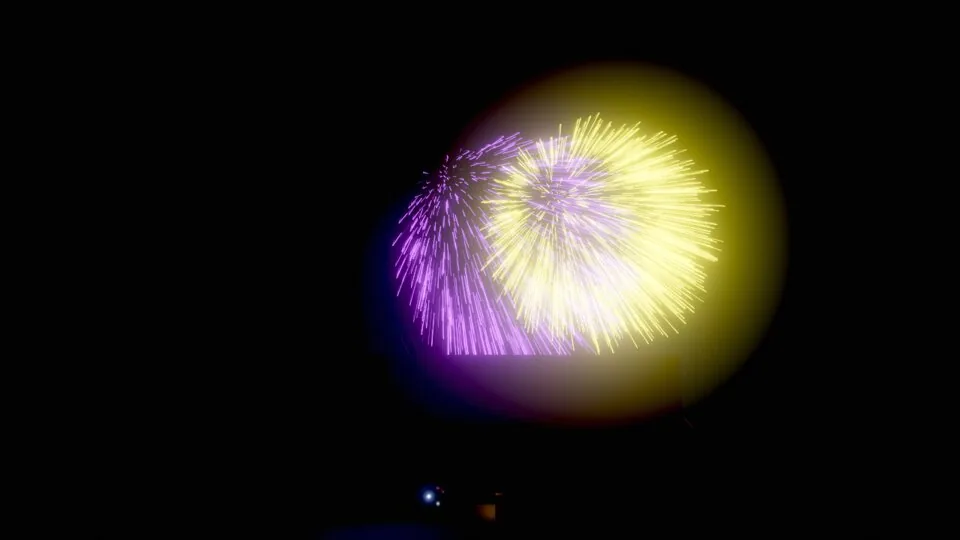
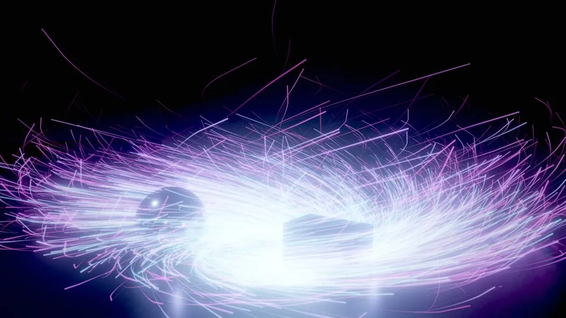
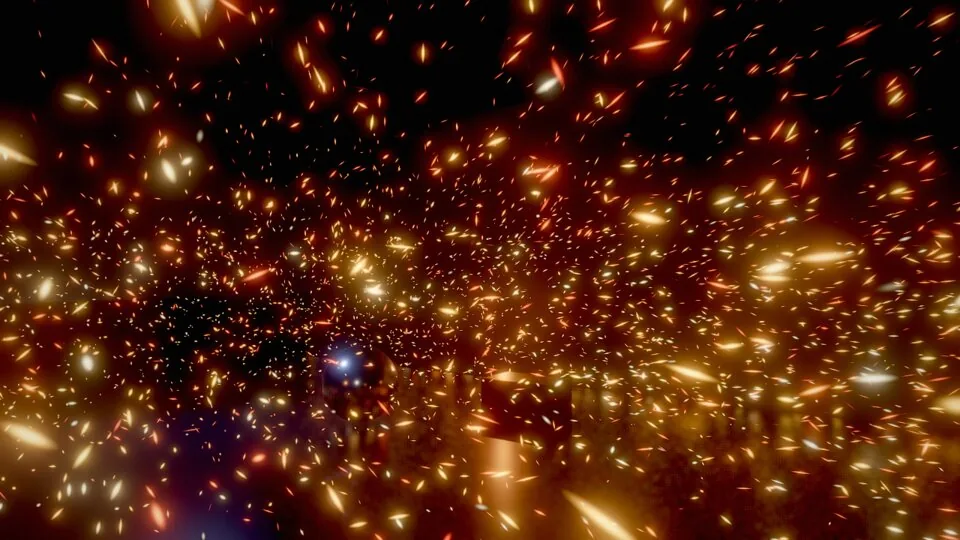
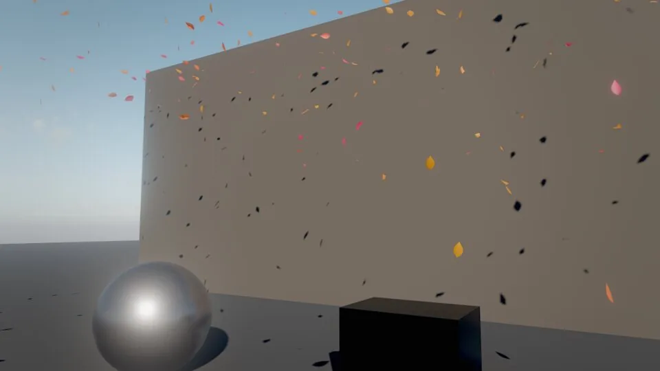
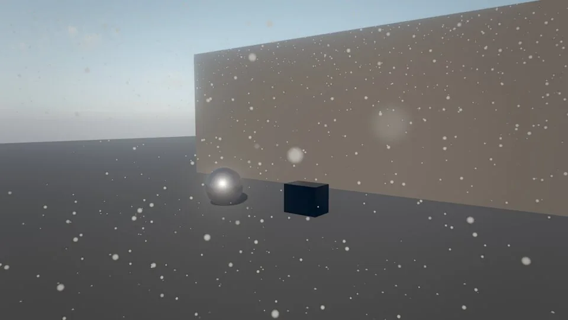
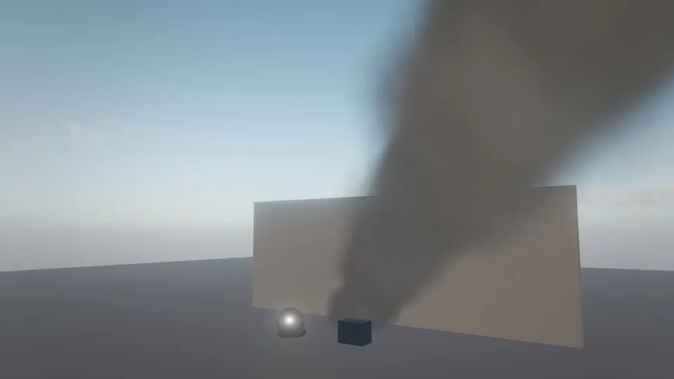

# Visual effects

Skywalker has three effect systems that share one workflow: create from a preset with `fx_create`, tweak a few fields, look, measure. **CPU particles** are deterministic and countable, so gameplay can depend on them. **GPU particles** run on compute shaders with millions of particles, collisions against everything on screen, sub-emitters, ribbons, mesh particles and flipbooks, for visuals only. **Volumetric fluids** simulate fire and smoke as a real gas on a 3D grid and light the scene around them.

<figure markdown>
{ loading=lazy }
<figcaption><code>fx_create {"effect": "campfire"}</code> at night: a volumetric fluid fire, particle embers and the flickering light the fire casts on the stones and ground.</figcaption>
</figure>

## Concepts

### Choosing a system

| Need | Use | Why |
|---|---|---|
| Effects a game rule depends on (hit sparks that count, pickups, weather a script reads) | CPU particles (`simulation: "cpu"`, the default) | Deterministic, seeded per emitter, replay identically; up to 50,000 per emitter |
| Large visual effects: storms, fireworks, vortices, leaves, grinder sparks | GPU particles (`simulation: "gpu"`) | Up to 4,000,000 per emitter, collisions with the visible scene; not deterministic and invisible to gameplay |
| Hero fire and smoke, explosions that light a scene | Volumetric fluids (`fluid` component) | A real gas simulation, ray-marched; keep to one or two on screen |
| A complete fire with embers and light | Composites: `campfire`, `torch`, `burning_barrel`, `explosion` | Fluid plus particles plus light in one call |
| Water surfaces | `water` component | See [Water](world/water.md) |

### The particles component

One `particles` component covers both CPU and GPU emitters. The important fields:

| Group | Fields |
|---|---|
| Emission | `emitting`, `rate` (per second), `burst` (once at start), `maxParticles`, `lifetime` (+ `lifetimeJitter`), `shape` (`point`, `sphere`, `box`, `disc`, `cone`) with `shapeSize`, `direction`, `speed` (+ `speedJitter`), `spread`, `prewarm` (start fully developed), `seed` |
| Forces | `gravity` (negative rises like hot gas), `drag` toward the moving air, `wind` (environment wind influence), `turbulence` and `turbulenceScale` (a divergence-free curl-noise swirl, so smoke curls instead of jittering) |
| Appearance | `look`, `colorStart`, `colorEnd`, `sizeStart`, `sizeEnd` (+ `sizeJitter`), `intensity` (HDR; glows with bloom above about 1), `stretch`, `spin`, `softness` (fade where particles meet geometry) |
| Space | `worldSpace`: particles stay behind when the emitter moves (trails) |
| Collision | `collide` with a floor plane at `floorHeight`: die, `bounce`, or `splash` into droplets |
| Light | `light` > 0 casts a point light (`lightColor`, `lightRange`) whose strength follows the live particles, so it flickers with the simulation |

**Looks** (`look`):

| Look | What it draws |
|---|---|
| `flame` | Procedural fire tongues: tapering, swaying, noise-eroded, with a heat ramp from a yellow core to red tips; partly opaque so overlaps keep their hue |
| `smoke`, `mist` | Lit billowing volumes: the sun with shadows and forward scattering, sky light and every point light |
| `glow` | Soft light points: embers, fireflies, magic |
| `spark`, `rain` | Velocity-stretched streaks; rain glints under lamps |
| `snow` | Soft flakes |
| `sprite` | A texture or flipbook sheet (GPU only) |

All looks are soft particles that fade where they meet geometry.

### CPU particles

The engine simulates CPU particles on the fixed tick, seeded per emitter. In play mode they are deterministic: the same scene replays the same particles, and agents can count and test them. They also preview live while you edit.

**Presets:** `fire`, `embers`, `smoke`, `steam`, `sparks`, `rain`, `snow`, `mist`, `spray`, `dust`, `fireflies`, `magic`, `fireball`, `debris_smoke`, `shrapnel`, and the cheap composite `sprite_campfire`.

### GPU particles

Set `simulation: "gpu"` (or start from a GPU preset). Each frame and emitter, the GPU emits from a dead list into an alive list, simulates with an indirect dispatch sized by the live count, writes indirect draw arguments and optionally sorts and reduces lights. Pools, lists and counters live on the GPU; nothing is allocated per frame and nothing is read back for drawing.

| Feature | Fields |
|---|---|
| Emission | `rate` (up to millions per second), `burst`, `fx_burst` and Wander `burst()`; shapes plus `mesh` emission from the surface of `shapeMesh` (or the entity's mesh), leaving along the normal |
| Forces | Gravity, drag, wind, curl noise (two octaves of analytic gradient-noise curl), and a force `field`: `vortex` (swirl around `fieldAxis` with `fieldPull` and `fieldLift`), `attractor` (toward `fieldCenter`), or `texture` (a 3D vector field from an `.fga` file over `fieldSize`), with `fieldStrength` and `fieldRadius` |
| Collisions | The `collide` floor plane, `colliders` (entity names: sphere meshes collide as spheres, planes and quads as planes, other meshes as bounding spheres) and `depthCollision`: everything visible collides through the scene depth and normals. Response: `bounce` with `friction`, `stick`, or die |
| Sub-emitters | `subEmitter` (another GPU emitter, by name) spawned on `subEmitOn` `death`, `collision` or `both`, with `subEmitCount` and `subEmitInherit` (velocity fraction). Requests pass on the GPU in the same frame: sparks to embers, rockets to bursts, rain to splashes. `hueVariation` gives each burst its own colour |
| Curves | `colorGradient` (`"#rrggbbaa@t ..."`), `sizeCurve` and `opacityCurve` (`"value@t ..."`), baked into 32-entry tables |
| Facing | `camera` (billboards), `velocity` (stretched by `stretch`), `horizontal` (flat on the ground: ripples, decals), `ribbon` (trails from a per-particle history: `trailLength` seconds, `trailSegments`), `mesh` (instanced meshes lit by the standard surface shader and casting shadows: `mesh` is a primitive, an asset or a built-in `fx:leaf`, `fx:shard`, `fx:pebble`; with `roughness`, `metallic`) |
| Flipbooks | `look: "sprite"` with `texture`, `flipbookColumns`, `flipbookRows`, `flipbookFps` (0 = once over each life); neighbouring frames cross-fade |
| Lighting | Lit looks receive the sun with shadows, the sky and the strongest lights; premultiplied alpha |
| Sorting | Blended looks are sorted back to front on the GPU (bitonic sort); `sort: false` skips it |
| Light | `light` > 0: the GPU reduces the live particles to up to 4 clustered point lights, read back asynchronously (a frame or two late, never stalling) |
| Temporal AA | Particles write a reactive mask, so fast sparks and rain do not leave ghost trails |

**Presets.** Single emitters: `ember_storm`, `magic_vortex`, `dust_storm`, `falling_leaves` (place about 6 m up), `snow_heavy` (about 12 m up), `smoke_column_gpu`, and the building blocks `sparks_gpu`, `embers_gpu`, `rain_gpu`, `splashes_gpu`, `rockets_gpu`, `firework_burst_gpu`, `mist_gpu`, `droplets_gpu`. Composites wired with sub-emitters: `sparks_shower`, `fireworks`, `rain_heavy`, `waterfall_mist`.

<div class="sky-compare" markdown>
<figure markdown>{ loading=lazy }<figcaption><code>sparks_shower</code>: depth collisions bounce sparks off the props; embers spawn as sub-emitter particles</figcaption></figure>
<figure markdown>{ loading=lazy }<figcaption><code>fireworks</code>: rockets whose death spawns bursts, each with its own hue</figcaption></figure>
<figure markdown>{ loading=lazy }<figcaption><code>magic_vortex</code>: a vortex force field; each particle draws a ribbon trail</figcaption></figure>
</div>

<div class="sky-compare" markdown>
<figure markdown>{ loading=lazy }<figcaption><code>ember_storm</code></figcaption></figure>
<figure markdown>{ loading=lazy }<figcaption><code>falling_leaves</code>: lit <code>fx:leaf</code> mesh particles</figcaption></figure>
<figure markdown>{ loading=lazy }<figcaption><code>snow_heavy</code></figcaption></figure>
</div>

### Volumetric fluids

The `fluid` component simulates fire, smoke, steam and explosions as an Eulerian gas on a GPU 3D grid inside a box that sits on the entity (bottom centre):

- **Solver.** `resolution` cells (16–192) along the longest side of `size`. Second-order MacCormack advection with a limiter; combustion (`fuel` burns at `burnRate` into `heat` and `smoke`); buoyancy; vorticity confinement (`vorticity`: licking flames, curling smoke); source `turbulence`; environment `wind`; then a Jacobi pressure solve and projection (incompressible flow, solid floor, open sides and top). Fluids are prewarmed, so a fire starts already burning, and `burst` gives seconds of heavy fuel for explosions.
- **Rendering.** Ray-marched per pixel with jitter: flame emission from blackbody temperature (`flameTemperature`, Kelvin, with `flameIntensity`), smoke lit by the sun through a shadow march with a forward-scattering phase, sky light, every point light and the fire's own glow (`smokeColor`, `smokeDensity`). The march stops at opaque geometry.
- **Light.** `light` > 0 casts a flickering point light from the fire onto the scene (`lightColor`, `lightRange`).

| Field | Meaning |
|---|---|
| `size`, `resolution` | Box in meters; cells along its longest side (detail against cost) |
| `sourceOffset`, `sourceRadius`, `speed` | Where and how fast gas enters |
| `fuel`, `heat`, `smoke`, `burnRate` | Combustion; lower `burnRate` gives taller flames; `fuel` 0 = smoke or steam only |
| `buoyancy`, `vorticity`, `turbulence`, `wind` | Motion |
| `cooling`, `smokeFade` | How fast heat fades and smoke thins |
| `emitting` | Feed the source; off, the fire dies down |
| `burst` | Seconds of heavy fuel at start |
| `seed` | Variation |

**Presets:** `volume_fire`, `volume_torch`, `volume_smoke`, `steam_vent`, `explosion_volume`. The composites `campfire`, `torch`, `burning_barrel` and `explosion` combine them with particle embers or shrapnel and a light. Fires light their surroundings by themselves; add a separate point light only for a stylized pool of light.

<figure markdown>
{ loading=lazy }
<figcaption><code>smoke_column_gpu</code>: lit GPU smoke, sorted on the GPU, drifting with the environment wind.</figcaption>
</figure>

## How to create an effect

=== "Tool call"

    ```tool
    fx_create {"effect": "campfire", "name": "Camp Fire", "position": [0, 0, 0]}
    fx_create {"effect": "rain", "position": [0, 12, 0], "overrides": {"floorHeight": 0, "rate": 900}}
    fx_create {"effect": "sparks_shower", "position": [3, 1, 0]}
    ```

=== "Wander"

    ```wander
    behavior Brazier
      intent "A brazier that flares up with a burst of sparks when the player lights it, then burns."
      var lit = false

      on start
        self.particles.emitting = false
      end

      on trigger_enter "player"
        if not lit then
          lit = true
          self.particles.emitting = true
          burst(60)
          play_sound("audio/whoosh.wav", 0.8)
        end
      end
    end
    ```

=== "CLI"

    ```bash
    skywalker call fx_create '{"effect": "torch", "position": [2, 1.5, 0]}' --project .
    ```

`overrides` patches the fields of the `particles` (or `water`) component; for composites it is applied to every emitter. Place effects at the right scale: a campfire is about 1 m across, a torch small, an explosion 5–15 m.

### Bursts

```tool
fx_burst {"entity": "Camp Fire", "count": 60}
sim_control {"action": "step", "ticks": 20}
viewport_capture {"eye": [4, 2, 6], "target": [0, 0.8, 0], "samples": 8, "annotate": false, "overlays": false}
```

`fx_burst` emits from an emitter (or from every emitter under a composite) right now, while editing or playing; the default count is the emitter's `burst` field, else 50. A still taken immediately after a burst shows nothing: step a few ticks first. In Wander, `burst(n)` emits from the behavior's own entity and `burst(entity, n)` from another emitter.

### Build a GPU emitter from scratch

```tool
entity_create {"name": "Tornado", "position": [0, 0.3, 0], "components": {"particles": {"simulation": "gpu", "look": "smoke", "facing": "camera", "field": "vortex", "fieldLift": 3, "fieldPull": 2, "rate": 4000, "maxParticles": 200000, "lifetime": 5, "colorStart": "#8a7660"}}}
entity_create {"name": "Ship Trail", "parent": "Ship", "components": {"particles": {"simulation": "gpu", "look": "glow", "facing": "ribbon", "worldSpace": true, "trailLength": 1.2, "trailSegments": 24, "rate": 60, "colorGradient": "#aaddff@0 #3366ff@0.5 #00000000@1"}}}
entity_create {"name": "Explosion Flipbook", "position": [0, 1, 0], "components": {"particles": {"simulation": "gpu", "look": "sprite", "texture": "fx/explosion_sheet.png", "flipbookColumns": 8, "flipbookRows": 8, "flipbookFps": 24, "burst": 1, "rate": 0, "intensity": 2, "lifetime": 1.2, "sizeStart": 3, "sizeEnd": 3}}}
```

### Chain emitters with a sub-emitter

```tool
entity_create {"name": "Grinder Embers", "position": [0, 1, 0], "components": {"particles": {"simulation": "gpu", "look": "glow", "rate": 0, "lifetime": 1.5, "sizeStart": 0.03, "gravity": -1, "colorStart": "#ffb050"}}}
entity_create {"name": "Grinder", "position": [0, 1, 0], "components": {"particles": {"simulation": "gpu", "look": "spark", "facing": "velocity", "rate": 3000, "speed": 9, "spread": 25, "direction": [1, 0.3, 0], "depthCollision": true, "bounce": 0.4, "friction": 0.3, "subEmitter": "Grinder Embers", "subEmitOn": "collision", "subEmitCount": 2}}}
```

## Recipes

| Effect | How |
|---|---|
| Grinder sparks bouncing off props | `sparks_shower` near the props (depth collision is on); aim with the Sparks child's `direction` |
| Tornado | `magic_vortex` with `look` `smoke`, `facing` `camera`, `fieldLift` 3, a dust-brown `colorStart`, `rate` 4000 |
| Paint splatter that sticks | `stick: true`, `depthCollision: true`, `look` `glow`, small `sizeStart` |
| Leaves blowing past | `falling_leaves` 6 m up, `environment_update {"windSpeed": 5}` |
| Rain with splashes on roofs | `rain_heavy` (splashes come from depth collisions anywhere) |
| Rainy neon street | `rain` 12 m up with `floorHeight` at the street, wet materials (roughness 0.1–0.2), `mist` at street level |
| Magic trail on a moving object | A child GPU emitter with `facing: "ribbon"`, `worldSpace: true` |
| Particles shaped like a mesh | `shape: "mesh"`, `shapeMesh: "asset:..."`, low `speed` |
| Vector field from a DCC app | `field: "texture"`, `fieldTexture: "fx/wind.fga"`, `fieldSize` = the exported box |
| Flipbook explosion | `look: "sprite"`, `texture` = the sheet, `flipbookColumns` and `flipbookRows`, `intensity` above 1 for emissive |
| Torch on a wall | `torch` composite at the bracket; its fluid lights the wall |
| Explosion on demand | An `explosion` composite saved as a prefab; `spawn("prefab:prefabs/explosion.prefab.json", point)` from Wander |

### Recipe: a mine that explodes

A trigger zone that spawns an explosion prefab, kicks nearby bodies and removes itself. Save an `explosion` composite as `prefabs/explosion.prefab.json` first (`fx_create` then `prefab_create`).

```wander
behavior Mine
  intent "When the player steps on the mine, spawn an explosion, push nearby crates away and disappear."
  param radius = 4 in 1..10 "blast radius (m)"
  param force = 12 in 0..50 "impulse on crates (N s)"

  on trigger_enter "player"
    spawn("prefab:prefabs/explosion.prefab.json", self.position)
    for crate in find_all("crate")
      let d = distance(self, crate)
      if d < radius then
        impulse(crate, direction(self, crate) * force * (1 - d / radius) + (0, force * 0.5, 0))
      end
    end
    destroy self
  end
end
```

## Measuring cost

```tool
fx_stats {}
fx_benchmark {"width": 1920, "height": 1080, "frames": 120, "serial": true}
perf_stats {"frames": 30, "passes": true}
```

`fx_stats` reports the measured GPU cost of the last rendered frames: the whole frame, the GPU simulation pass (particles and hair), per-emitter live particle counts (read back a few frames late) and per-groom sizes. Render a few frames first. `fx_benchmark` renders real-time frames back to back with the effects clock advancing 1/60 s per frame and reports GPU time per frame and per effects pass; `serial: true` waits for each frame so per-pass times do not overlap. Both report 0 on renderers without GPU effects (the CPU fallback renderer).

Measured with `fx_benchmark` in serial mode on an Apple M1 Pro at 1920×1080; the stage scene alone (floor, props, sky, TAA, GI and reflections, bloom) costs 7.4 ms:

| Workload | Frame (GPU) | Simulation |
|---|---|---|
| 1,000,000 GPU particles, additive glow, curl noise | 16.2 ms (+8.8 ms) | 3.0 ms |
| 1,000,000 GPU particles, lit smoke, GPU bitonic sort | 38.1 ms (+30.7 ms, fill rate) | 8.4 ms including the sort |

To reduce cost: lower `maxParticles`, prefer additive `glow` over lit `smoke`, set `sort: false`, use smaller particles, lower the fluid `resolution`, or lower the environment's `renderScale`.

## Pitfalls

- **GPU particles are visual only.** They are not deterministic and gameplay cannot see them. Anything a game rule depends on must use the CPU path.
- **Depth collisions see only the screen.** They use the previous frame's depth: particles behind objects or off screen fall through.
- **One sub-emitter per emitter.** Chains of sub-emitters work up to 4 levels.
- **Sorting with glass.** Particles and fluid volumes render after transparent meshes, so glass in front of a fire does not sort perfectly.
- **Fluid volumes cast no shadows** on the scene.
- **Rain at ground level.** Rain and snow cover a box around the emitter: place it about 12 m above the area and set `floorHeight` to the ground.
- **Washed-out frames.** Many overlapping soft particles flood the image; lower `rate` or `intensity`, or raise `bloomThreshold`.
- **Pause.** Particles of pausable entities stop while the game is paused (see [Simulation and time](simulation.md)).

!!! agent "For agents"

    Start from the closest preset, look at it over time, then measure:

    ```tool
    fx_create {"effect": "campfire", "name": "Camp Fire", "position": [0, 0, 0]}          # preset at the right scale
    sim_control {"action": "step", "ticks": 30}                                           # let it develop
    viewport_capture {"eye": [4, 2, 6], "target": [0, 0.8, 0], "samples": 8}             # look close up
    viewport_capture {"eye": [4, 2, 6], "target": [0, 0.8, 0], "debug_view": "lighting"}  # is the fire lighting the scene?
    fx_stats {}                                                                            # live counts and GPU ms
    ```

    Capture effects at several moments (start, peak, fade) and from the gameplay camera distance, not only close up. For gameplay effects, confirm the CPU path with `sim_trace` or particle counts.

## Reference

- Tools: [`fx_create`](../reference/tools/render.md#fx_create), [`fx_burst`](../reference/tools/render.md#fx_burst), [`fx_stats`](../reference/tools/render.md#fx_stats), [`fx_benchmark`](../reference/tools/render.md#fx_benchmark), [`perf_stats`](../reference/tools/render.md#perf_stats).
- Components: [`particles`](../reference/components/world.md#particles), [`fluid`](../reference/components/world.md#fluid).
- Wander: [`burst`](../reference/wander.md#effects-burst), [`spawn`](../reference/wander.md#scene-spawn), [`impulse`](../reference/wander.md#physics-impulse).
- Related pages: [Hair and fur](hair.md), [Water](world/water.md), [Performance](performance.md).
- Design documents: [docs/HAIR_AND_VFX.md](https://github.com/amirhossein-razlighi/Skywalker/blob/main/docs/HAIR_AND_VFX.md), [docs/RENDERING.md](https://github.com/amirhossein-razlighi/Skywalker/blob/main/docs/RENDERING.md) ("Effects").
