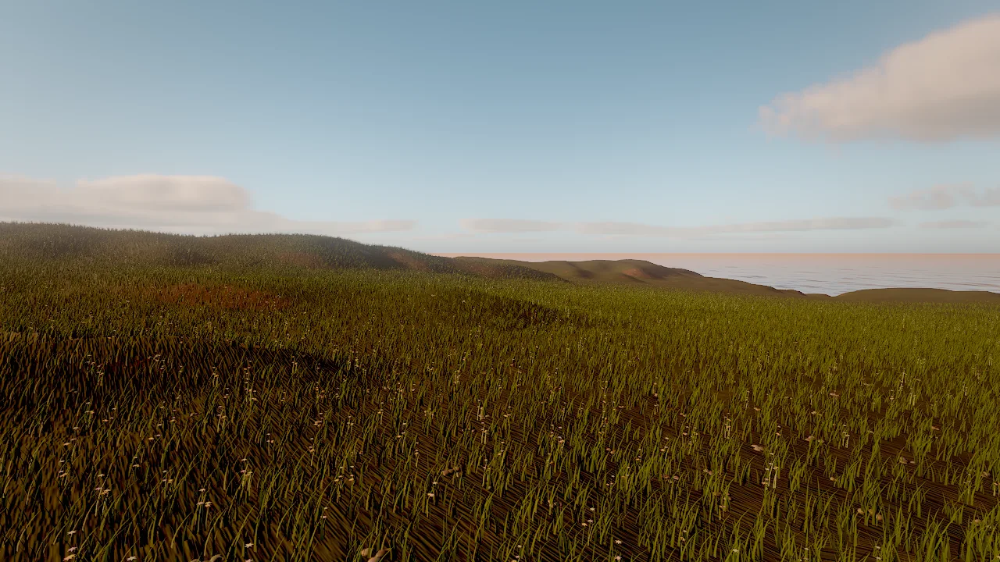
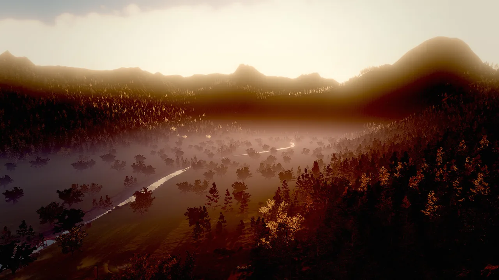

# Foliage

The `foliage` component grows GPU-instanced vegetation and ground detail over a terrain or over scene meshes: grass, flowers, ferns, pebbles, shells, rocks, and any imported tree, bush or plant. Placement is deterministic and rule-based (density, slope, height, painted terrain layer), instances sway in the wind, and heavy models switch to octahedral impostors in the distance so forests can reach the horizon. You add it with `foliage_add` and tune it per layer.

<figure markdown>
{ loading=lazy }
<figcaption><code>foliage_add</code> with the <code>meadow_grass</code> and <code>flowers</code> presets on a terrain: dense instanced blades, clumped, thinned toward the cull distance.</figcaption>
</figure>

## Concepts

### Layers and placement

A foliage component holds a list of **layers**. Each layer is one model (a built-in mesh, an imported mesh or a multi-part prefab) with its own placement rules. A layer may start from a preset and override any field.

Placement is a pure function of the layer, the seed and the chunk coordinates. Each candidate position on a jittered grid (spacing `1/√density`) is kept or rejected by the rules:

| Rule | Fields |
|---|---|
| Density | `density` (instances per m², 0–64), times the component's `density` multiplier |
| Slope | `slopeMin`, `slopeMax` (degrees) |
| Height | `heightMin`, `heightMax` (**world** y) |
| Painted layer | `terrainLayer` (the name of one of the terrain's layers, or its index): only where that layer's weight exceeds `layerThreshold` (default 0.35) |
| Patches | `clumping` (0 uniform .. 1 patches) |

Because a painted terrain layer can gate a foliage layer, painting with `terrain_paint` moves the foliage with it: paint a dirt path and the grass on it disappears.

### Layer fields

| Field | Meaning |
|---|---|
| `preset` | Starting point (see [Presets](#presets)). |
| `name` | Layer name, used by `impostor_bake` and in statistics. |
| `mesh` | A built-in mesh (`grass`, `grass_tall`, `flowers`, `fern`, `pebbles`, `shell`, `rock`) or `"asset:<path>"` (a glTF file; `#part` selects one part). |
| `prefab` | A multi-part model such as an imported tree (trunk plus alpha-cut leaves). All parts share one instance. |
| `material` | A material asset for the mesh; otherwise `color`, `roughness`, `subsurface`, `texture`, `normalMap`, `ormMap`, `triplanar`, `tiling` describe the surface. |
| `color` | Base tint; `colorVariation` (0–1) varies it per instance. |
| `subsurface` | Light through leaves and blades. |
| `scaleMin`, `scaleMax` | Random uniform scale range. |
| `alignToNormal` | 0 = upright, 1 = follows the ground. |
| `randomTilt` | Random lean in degrees. |
| `sink` | Meters pushed into the ground so bases do not float. |
| `wind` | Bend strength multiplier (0 for rocks). |
| `cullDistance` | Meters; chunks beyond are neither generated nor drawn (4–4000). |
| `castShadows` | Casts sun shadows. |
| `seed` | Per-layer seed offset. |
| `impostors`, `impostorDistance`, `impostorResolution`, `impostorFrames` | Distance rendering, see [Impostors](#octahedral-impostors). |

The component itself has `layers`, `seed` (placement seed), `density` (0–4, a multiplier for every layer: a quick quality and performance knob), `surface` (`terrain` or `scene`), `area` (scene mode extent) and `visible`.

### Presets

| Preset | Mesh | Density (/m²) | Cull distance | Notes |
|---|---|---|---|---|
| `meadow_grass` | `grass` | 14 | 70 m | Short blades, no shadows, follows the ground halfway |
| `tall_grass` | `grass_tall` | 4 | 90 m | Clumped, casts shadows, strong wind |
| `dune_grass` | `grass_tall` | 0.9 | 120 m | Sparse straw-coloured tufts, strongest wind |
| `flowers` | `flowers` | 1.2 | 60 m | Strongly clumped patches |
| `ferns` | `fern` | 0.6 | 80 m | Up to 45° slopes |
| `beach_pebbles` | `pebbles` | 0.5 | 45 m | Lies flat on the ground, no wind |
| `shells` | `shell` | 0.25 | 30 m | Lies flat, random tilt, varied colour |
| `rocks_small` | `rock` | 0.08 | 160 m | Triplanar rock texture, above 2.5 m |
| `boulders` | `rock` | 0.0007 | 900 m | Large, sunk half a meter, up to 70° slopes |
| `custom` | your `mesh` or `prefab` | 4 (default) | 120 m (default) | Start from scratch |

### Chunks and streaming

Instances are generated in square chunks around the camera, each sized to hold about 256 instances of its layer: dense grass gets small chunks (fine culling, quick streaming), sparse trees get large ones (few draw calls). Chunks are generated on demand within each layer's `cullDistance` and evicted when the camera leaves, so a dense grass layer costs memory only near the viewer while sparse trees cover the whole world. Instances thin out toward the cull distance instead of ending in a hard line.

### Wind

Instances bend in the environment wind (`environment_update` `windSpeed` and `windDirection`). Gusts travel across the field, each instance has its own phase, and leaves and blades flutter. The bend grows with height above the ground, so trunks stay planted. A layer's `wind` scales its response. The sway is written to the velocity buffer, so motion blur and temporal anti-aliasing treat it correctly.

### Levels of detail

Meshes of 3,000 triangles or more (typically photoscans) get an automatic LOD chain from meshoptimizer: attribute-aware simplification with a fallback for card geometry, so leaf cards keep a readable canopy. The level is chosen per instance from on-screen error; foliage allows about 3 pixels of error. With impostors in place, alpha-tested parts such as leaf cards may drop to LOD 2 at mid distance.

### Octahedral impostors

Imported trees, bushes and rocks often have 50,000 to 3 million triangles. Drawn as meshes out to a 1–2 km cull distance they would cost billions of triangles. Beyond a per-layer **transition distance**, instances draw as **octahedral impostors** instead: camera-facing cards that read a pre-rendered atlas of the model seen from many directions.

**Bake.** Every layer whose model has 300 or more triangles gets an impostor (set `impostors: false` to turn it off). The model is one mesh or every part of a prefab. Upright vegetation is captured on a hemi-octahedral grid of `impostorFrames`² views (default 12×12, from 4 to 32 per side). Each view is rendered with the same material code as the meshes (textures, ORM, normal maps, alpha test per MSAA sample, so leaf edges resolve to true coverage) into two atlases: albedo with coverage, and normal with depth and subsurface. Colours and normals are dilated into empty texels (no dark halos), and the mip chain rescales alpha so distant forests keep their density instead of thinning out.

Baking runs on the GPU, lazily, in short batches: in the live viewport about 100 ms of baking or loading runs per frame, and until its impostor is ready a layer draws only meshes. Atlases are cached in `.skywalker/cache/impostors/` (compressed). The cache key hashes the meshes, materials, part transforms, source file sizes and dates, so editing a mesh, texture or material rebakes it, and identical models share one atlas. The cache is rebuilt on demand and need not be committed.

**Transition distance.** It is set automatically from on-screen size: the distance where one atlas texel covers about 1.5 screen pixels, which for a tree is around 8–10% of the screen height. It scales with the resolution and the lens. Override it per layer:

| Field | Default | Meaning |
|---|---|---|
| `impostors` | `true` | Allow impostors for this layer (used when the model has 300+ triangles). |
| `impostorDistance` | 0 | Transition distance in meters; 0 = automatic, −1 = never. |
| `impostorResolution` | 0 | Atlas edge in pixels; 0 = automatic, 512–2048 by model size. |
| `impostorFrames` | 12 | Capture directions per atlas side, 4–32: more views, sharper turns, more memory. |

The balanced and fast editor quality tiers move the transition to 0.75× and 0.5× of the distance.

**Rendering.** Each card blends the three nearest views with barycentric weights, so nothing pops as the camera orbits, and takes two depth-parallax steps per view to put each pixel on the baked surface. Cards write the G-buffer (normals, roughness, subsurface) and real depth, so sun and clustered lights, shadows, GI, ambient occlusion, reflections and fog treat impostors as geometry. Meshes and impostors crossfade over a band before the transition distance with a complementary per-pixel dither; temporal anti-aliasing (or still accumulation) blends it.

### GPU-driven culling and the triangle budget

One compute threadgroup per chunk tests every instance against the camera and the four sun shadow cascades, sorts it into one of four distance bands (its mesh LOD) or the impostor bin, and writes compact instance lists plus indirect draw arguments. The CPU issues indirect draws only for bands a chunk can touch. Arguments are bounds-checked on the GPU and validated on the CPU; setting the environment variable `SKY_GPU_CULL=0` (or a failed validation) switches to an identical CPU path.

A **triangle budget** coarsens every foliage LOD when a frame would exceed 120 million camera triangles (30 million in a safe mode entered after a GPU fault).

### Shadows

- Near the camera, meshes cast with one LOD coarser than they draw.
- Beyond the transition, sun-facing impostor cards cast, writing depth reconstructed from the baked depth, so canopies self-shadow.
- The far cascades (from the third; from the second in lower quality tiers) draw impostors only.
- Small dense layers (`meadow_grass`, `flowers`) do not cast by default. Set `castShadows` per layer.

### Measured cost

Measured on the [Ashen Peaks](../../examples/index.md#ashen_peaks) example (a mountain valley with several imported tree, shrub, rock and grass layers) on an M1 Pro at 1920×1080, full quality, averaged over 30 frames of `perf_stats`:

| View | Without impostors | With impostors (full) | With impostors (fast editing tier) |
|---|---|---|---|
| Aerial | 852 ms, 1.35 G triangles | 19 ms | 7 ms |
| Mid-valley | 2022 ms, 3.9 G triangles | 39 ms, 7.7 M triangles | 10 ms |
| Ground | 2002 ms, 3.2 G triangles | 63 ms, 18 M triangles | 19 ms |

The same scene without any foliage costs about 13 ms (aerial) and 17 ms (ground). What remains at ground level is mostly a 3.5-million-triangle tree mesh near the camera and dense alpha-tested grass. Assets with game-ready triangle counts (20,000–100,000) stay well within budget.

<div class="sky-compare" markdown>
<figure markdown>{ loading=lazy }<figcaption>Ashen Peaks at ground level: grass and flower layers gated by painted terrain layers, rock layers, conifers</figcaption></figure>
<figure markdown>{ loading=lazy }<figcaption>The same valley from above: distant forest drawn as impostors out to a 2 km cull distance</figcaption></figure>
</div>

## How to add foliage

=== "Tool call"

    ```tool
    foliage_add {"entity": "Terrain", "layers": [{"preset": "meadow_grass"}, {"preset": "flowers", "heightMax": 40}, {"preset": "rocks_small"}], "seed": 4}
    ```

=== "CLI"

    ```bash
    skywalker call foliage_add '{"entity": "Terrain", "layers": [{"preset": "dune_grass", "heightMin": 1.5}]}' --project .
    ```

`foliage_add` creates a child entity named `Foliage` (or `name`) under the terrain. Call it again for a second foliage entity, or edit the layers of an existing one with `entity_update`.

### Gate layers by painted terrain layers

Pass the name (or the index) of a terrain layer. On an `island_beach` terrain the stack is sand 0, seabed 1, grass 2, soil 3, rock 4:

```tool
foliage_add {"entity": "Island", "layers": [{"preset": "meadow_grass", "terrainLayer": "grass"}, {"preset": "ferns", "terrainLayer": "soil"}, {"preset": "shells", "heightMax": 1.2}]}
terrain_paint {"entity": "Island", "layer": 0, "strokes": [{"x": 20, "z": 35, "radius": 3, "strength": 1}]}
```

The painted sand stroke clears the grass along it, because grass only grows where layer 2 dominates.

### Add trees and imported plants

Use a `custom` layer with an imported mesh (`"asset:..."`) or a prefab. Keep the density low and give it a cull distance; heavy models switch to impostors on their own.

```tool
foliage_add {"entity": "Terrain", "name": "Forest", "layers": [{"preset": "custom", "prefab": "downloads/fir/fir_1k.prefab.json", "density": 0.012, "scaleMin": 1.0, "scaleMax": 2.2, "slopeMax": 36, "clumping": 0.8, "cullDistance": 1500, "wind": 0.45, "castShadows": true, "alignToNormal": 0.05}, {"preset": "custom", "mesh": "asset:downloads/shrub/shrub_1k.gltf", "material": "downloads/shrub/shrub_1k.mat.json", "density": 0.014, "scaleMin": 0.7, "scaleMax": 1.5, "slopeMax": 34, "cullDistance": 300}]}
```

### Grow on scene meshes

Without a terrain, set `area` and the foliage raycasts onto the meshes inside it (a rooftop garden, a courtyard, a hand-modelled island):

```tool
foliage_add {"entity": "Courtyard", "area": [30, 10, 30], "layers": [{"preset": "meadow_grass", "density": 6}, {"preset": "beach_pebbles"}]}
```

### Bake and check impostors

```tool
impostor_bake {"entity": "Forest", "rebake": true, "preview": true}
viewport_capture {"debug_view": "impostors", "eye": [0, 120, -400], "target": [0, 40, 0]}
perf_stats {"frames": 30, "view": {"eye": [0, 120, -400], "target": [0, 40, 0]}}
```

`impostor_bake` bakes ahead of time and returns the transition distance of each layer (and with `preview` the first atlas). The `impostors` debug view tints meshes green and impostors magenta. `perf_stats` reports `impostorInstances`, `meshInstances`, `impostorsBaked` and `impostorBakeMs` in its GPU section, and the triangles of each model.

## Recipe: a beach with palms

The Tidebreak Isle approach: dune grass above the swash, shells and pebbles at the waterline, palms and tropical plants inland.

```tool
foliage_add {"entity": "Island", "name": "Island Foliage", "seed": 2, "layers": [{"preset": "dune_grass", "heightMin": 1.5, "heightMax": 6, "density": 3, "colorVariation": 0.8}, {"preset": "shells", "heightMax": 1.2, "density": 0.3}, {"preset": "beach_pebbles", "heightMax": 1.5, "density": 0.08}, {"preset": "custom", "prefab": "downloads/palms/palm_a.prefab.json", "density": 0.003, "scaleMin": 0.8, "scaleMax": 1.25, "heightMin": 2.6, "heightMax": 60, "slopeMax": 38, "clumping": 0.75, "cullDistance": 1600, "wind": 0.45, "randomTilt": 5}, {"preset": "ferns", "heightMin": 6, "terrainLayer": 2}]}
environment_update {"windSpeed": 7, "windDirection": 185}
viewport_capture {"eye": [10, 2, 80], "target": [10, 3, 0], "samples": 8}
```

<figure markdown>
{ loading=lazy }
<figcaption>Tidebreak Isle: palm prefabs from the DCC bridge as foliage layers, dune grass along the beach crest, an ocean behind.</figcaption>
</figure>

## Pitfalls

- **Heights are world heights.** `heightMin` and `heightMax` are world y, not heights above the terrain. Query the terrain first.
- **`terrainLayer` must name a layer of the terrain the foliage grows on.** Names are matched without regard to case;
  a typo fails with a did-you-mean hint, and an index counts from 0 (the base layer).
- **Heavy meshes need low density.** A tree layer at grass density stalls the frame. Start trees at 0.001–0.02 per m² and check `perf_stats`.
- **Impostors are static.** They do not sway in the wind, and their lighting uses the model's mean roughness. Up close they can look slightly brighter than the meshes, which show more inner-canopy shadowing. Keep the transition distance automatic unless the switch is visible.
- **The first frames after a change draw meshes only.** Until its impostor is baked, a layer draws only its mesh range; bake ahead of renders with `impostor_bake`.
- **Dense layers cost memory near the camera.** Raise `cullDistance` of grass carefully; the number of instances grows with its square.

!!! agent "For agents"

    Add foliage after the terrain is final, then verify placement and cost:

    ```tool
    terrain_query {"points": [[0, 0], [50, 50]]}                                 # world heights for heightMin/heightMax
    foliage_add {"entity": "Terrain", "layers": [{"preset": "meadow_grass", "terrainLayer": 0}]}
    viewport_capture {"eye": [0, 3, 30], "target": [0, 1, 0], "samples": 4}      # eye-level look
    impostor_bake {"rebake": false}                                               # bake impostors before final renders
    perf_stats {"frames": 30}                                                     # foliage instances, impostors, GPU ms
    ```

    If the frame is slow, lower the component's `density` multiplier first, then the `cullDistance` of the densest layer.

## Reference

- Tools: [`foliage_add`](../../reference/tools/world.md#foliage_add), [`impostor_bake`](../../reference/tools/render.md#impostor_bake), [`perf_stats`](../../reference/tools/render.md#perf_stats), [`viewport_capture`](../../reference/tools/view.md#viewport_capture).
- Component: [`foliage`](../../reference/components/world.md#foliage).
- Related pages: [Terrain](terrain.md), [Performance](../performance.md), [Debug views](../rendering/debug-views.md).
- Design document: [docs/RENDERING.md](https://github.com/amirhossein-razlighi/Skywalker/blob/main/docs/RENDERING.md) ("Terrain and foliage", "Foliage impostors").
