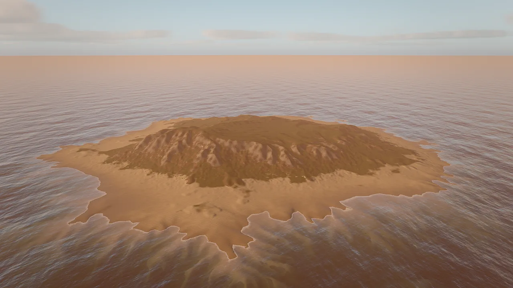
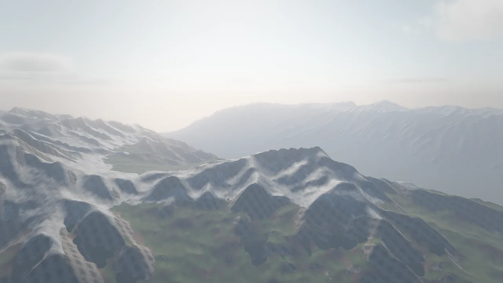
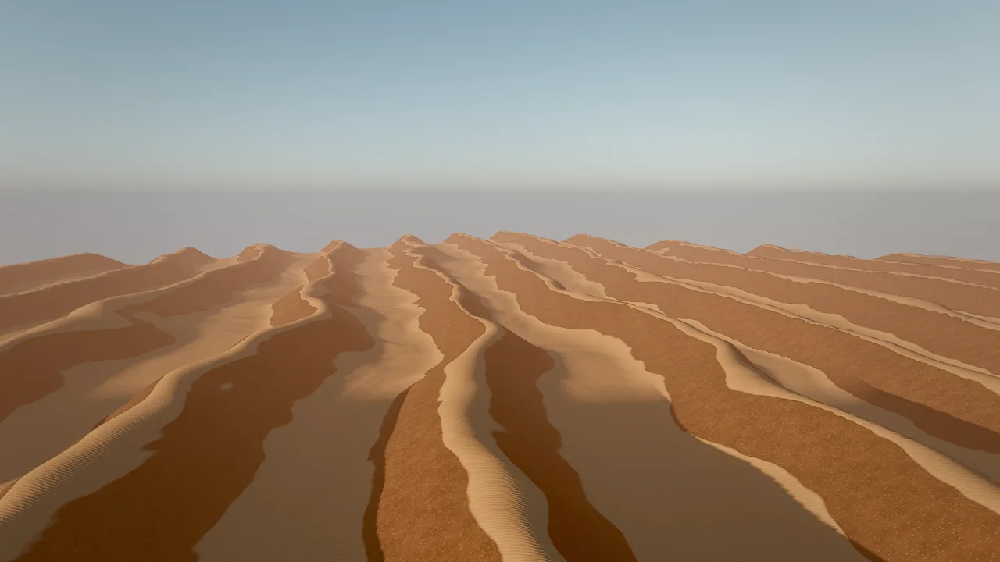
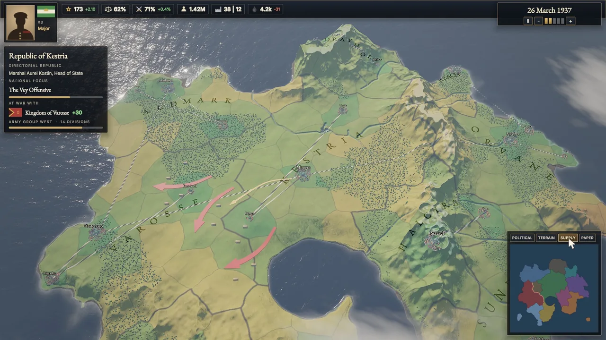

# Terrain

A terrain is a large heightfield on one entity: an island, a coastline, an alpine range, a canyon, dunes or a whole continent from your own heightmap. Skywalker generates the relief with noise and erosion, paints up to eight material layers from height and slope rules, renders it with continuous level of detail, and gives it a matching physics heightfield. You build it with `terrain_create`, shape it with brushes, and query it so that everything you place afterwards sits on real ground.

<figure markdown>
{ loading=lazy }
<figcaption>The <code>island_beach</code> preset with <code>water: true</code>: eroded ridges, a sand shelf auto-painted near sea level, and a calm FFT sea with a wet shoreline.</figcaption>
</figure>

## Concepts

### The terrain component

A terrain is a square grid of `resolution`² height samples that covers `size` × `size` meters, centred on the entity. Heights are stored relative to the entity, so moving the entity moves the whole landscape. The samples and the per-sample layer weights live in a binary `.terrain` file under the project; the component keeps everything needed to rebuild that file.

| Field | Type | What it does |
|---|---|---|
| `data` | string | Project-relative `.terrain` file with heights and layer weights. It is a cache (see below). |
| `size` | number, 8–32768 | Square extent in meters. Default 512. |
| `resolution` | integer | Height samples per side, 2ⁿ+1: 257, 513 (default), 1025, 2049. |
| `generator` | object | Generation parameters: `shape`, `seed`, `minHeight`, `maxHeight`, `featureSize`, `ridges`, `warp`, `erosion`, `thermal`, `terraces`, `beachWidth`, `seaLevel`; for shape `heightmap` also `heightmap` and `detailNoise`. |
| `layers` | array | Up to 8 material layers, base first, each with paint rules. |
| `edits` | array | Hand edits recorded by `terrain_sculpt`, `terrain_paint` and `terrain_layers`, replayed in order over the generator when the cache is rebuilt. Cleared by `terrain_generate`. |
| `waterLevel` | number | World height of the water line. Sand and soil just above it render wet. |
| `wetBand` | number, 0–20 | Meters above the water line that stay damp. Default 1.2. |
| `detail` | number, 0.25–4 | Level-of-detail quality multiplier (0.5 faster, 2 sharper). |
| `macroVariation` | number, 0–1 | Large-scale tone and hue variation across the landscape; breaks up layer tiling. 0 = off, 0.5 natural. |
| `castShadows` | bool | Casts sun shadows. |
| `overlay` | string | Image draped over the whole terrain (political maps, borders, paper maps). |
| `overlayOpacity` | number, 0–1 | Overlay strength, multiplied by the image alpha. |
| `overlayBlend` | enum | `mix`, `multiply` or `glow` (see [Map overlay](#map-overlay)). |

!!! info "The `.terrain` file is a cache"

    Generation is deterministic: the same `generator` and `seed` always produce the same heights. When the `.terrain` file is missing, the engine regenerates it from the generator, repaints the layers from their rules and replays the recorded `edits`, so sculpting and painting survive. You can leave large terrain binaries out of version control.

### Generation

The generator builds the relief in three stages:

1. **Shape.** Warped fractal noise (`featureSize` meters between large features, `warp` for natural, less noisy forms, `ridges` blending toward sharp ridged crests, `terraces` for stepped strata) shaped by the preset's `shape`: `hills`, `mountains`, `island`, `coast`, `canyon`, `dunes`, `plains`, `valley` or `heightmap`.
2. **Erosion.** Deterministic hydraulic droplet erosion (`erosion`, 0–1) carves gullies and fans; thermal erosion (`thermal`, 0–1) relaxes slopes into scree.
3. **Paint.** Each layer's rules (height, slope, noise) compute its weight at every sample. Later layers paint over earlier ones where their rules match.

Heights are absolute meters between `minHeight` and `maxHeight` (negative values lie below the entity, for a seabed). Island and coast shapes add a gentle shelf `beachWidth` meters wide around `seaLevel`.

### Presets

`terrain_create` starts from a preset, which sets the generator and a matching layer stack:

| Preset | Shape | Heights (m) | Layers, base first |
|---|---|---|---|
| `island_beach` | Island with beaches and a seabed; pair with `water: true` | −18 to 48 | sand, seabed, grass, soil, rock |
| `tropical_coast` | Coastline with cliffs and coves | −16 to 70 | sand, seabed, grass, soil, rock |
| `alpine` | Ridged peaks, scree, snow above about 260 m | 0 to 420 | grass, scree, rock, snow |
| `mountain_valley` | A valley between ranges, snow above about 190 m | 0 to 260 | grass, scree, rock, snow |
| `canyon` | Terraced canyon walls | 0 to 140 | dust, gravel, cliff |
| `desert_dunes` | Wind-shaped dunes, no hydraulic erosion | 0 to 26 | sand, crust |
| `rolling_hills` | Gentle pasture and farmland | 0 to 45 | grass, soil, rock |
| `flat` | Level ground for tests and arenas | 0 to 2 | grass, soil, rock |

Every `seed` gives a different landscape with the same character. Rock layers on steep slopes use triplanar projection, so cliffs do not stretch.

<div class="sky-compare" markdown>
<figure markdown>{ loading=lazy }<figcaption><code>mountain_valley</code>: snow on the ridges, scree and rock on steep faces, grass in the valley</figcaption></figure>
<figure markdown>{ loading=lazy }<figcaption><code>desert_dunes</code>: sand on the crests, crust on the steeper flanks</figcaption></figure>
</div>

### Rendering

The renderer does not build a mesh for the terrain. It displaces a shared grid from a height texture with **CDLOD** (continuous distance-dependent level of detail): a quadtree selects 32×32-vertex patches, and vertices morph between levels, so there are no cracks between patches and no popping as the camera moves. A kilometer-scale terrain therefore costs a few textures, not a mesh. `detail` scales the level-of-detail quality.

Layers blend by their painted weights, sharpened by a height blend: each layer's height (derived from its albedo and ambient occlusion) competes with its weight, so sand settles between stones instead of cross-fading. Terrain casts and receives sun shadows like any other surface.

### Material layers

Each layer is an object in `layers` (at most 8). The base layer covers everything; later layers paint over it where their rules match.

| Layer field | Meaning |
|---|---|
| `name` | Name used by `terrain_paint` and in query results. |
| `texgen` | Generate a seamless procedural set: `sand`, `grass`, `dirt`, `rock` or `noise`. Written once per project to `textures/terrain/`. |
| `texture`, `normalMap`, `ormMap` | Your own maps (project paths), for example downloaded photoscans. |
| `material` | A material asset whose surface the layer uses. |
| `color` | Tint (`"#rrggbb"`); white keeps the texture's colour. |
| `roughness`, `metallic`, `normalStrength` | Surface overrides. |
| `tiling` | Meters per texture repeat (default 4). |
| `triplanar` | Project in world space; use it for cliffs. |
| `heightMin`, `heightMax` | World-height band where the layer applies. |
| `slopeMin`, `slopeMax` | Slope band in degrees. |
| `noise` | 0–1 breakup of the edge, so bands do not look ruled. |
| `sharpness` | 0–1 hardness of the transition. |

### Wet shorelines

When `waterLevel` is set, sand and soil darken and turn glossy from the water line up to `wetBand` meters above it, which sells swash running up a beach. `terrain_create` with `water: true` sets `waterLevel` to the sea level and `wetBand` to 1.4 for you. If you add water by hand, set both fields yourself.

### Map overlay

`overlay` drapes one image over the whole terrain. Row 0 of the image is the −Z edge and column 0 the −X edge; the image alpha masks it. Use it for political maps, region tints, supply networks, borders or a parchment look.

| `overlayBlend` | Effect |
|---|---|
| `mix` | Paints over the ground, matte; the relief still shades it. |
| `multiply` | Tints the ground; textures show through. |
| `glow` | Adds the colour unlit; reads at night and suits highlights and borders. |

Swap the image or the opacity at run time to implement map modes. Images that scripts choose at run time must be shipped with the game: list them under `include` in `game.json` (see [Shipping](../shipping.md)).

<figure markdown>
{ loading=lazy }
<figcaption>The Meridian Accord example: a 2.4 km continent built from a heightmap, with a political overlay and a UI panel whose buttons switch map modes.</figcaption>
</figure>

### Physics

Every terrain the tools create or edit gets a matching static `collider` with shape `heightfield`, read from a 16-bit `.r16` file written next to the `.terrain` file. Characters walk on it, bodies land on it and `raycast` hits it. The collider grid is capped at 1024 cells per side; it is regenerated after each sculpt.

## How to create a terrain

=== "Tool call"

    ```tool
    terrain_create {"preset": "island_beach", "size": 600, "resolution": 513, "seed": 11, "water": true}
    ```

=== "CLI"

    ```bash
    skywalker call terrain_create '{"preset": "alpine", "size": 2000, "resolution": 1025, "seed": 3}' --project .
    ```

The result names the entity, the data file and statistics (resolution, cell size, minimum and maximum height). With `water: true` it also returns the id of the `Sea` entity it created.

Choose `resolution` by size: 257 is plenty for a 200 m island, 513 for 500 m, 1025 for one kilometer or more. Higher resolutions cost memory and generation time.

### Tune the generator

Pass `generator` overrides on creation, or re-roll an existing terrain in place:

```tool
terrain_create {"preset": "rolling_hills", "size": 800, "generator": {"maxHeight": 70, "featureSize": 250, "ridges": 0.3, "erosion": 0.7}}
terrain_generate {"entity": "Terrain", "seed": 42, "generator": {"thermal": 0.6, "terraces": 0.2}}
```

!!! warning

    `terrain_generate` regenerates the heights, repaints every layer from its rules and clears the recorded `edits`. Sculpt and paint after you are happy with the generated shape.

### Import a heightmap

Build the relief from your own image: a 16-bit grayscale PNG for smooth slopes, an 8-bit PNG, or a square little-endian `.r16` file. Values 0..1 map to `generator.minHeight..maxHeight`; row 0 is the −Z edge.

```tool
terrain_create {"heightmap": "maps/continent.png", "size": 4000, "resolution": 2049, "generator": {"minHeight": -40, "maxHeight": 160, "detailNoise": 1.5}}
```

Without a preset, a heightmap terrain uses heights 0..100, light erosion (0.2) and thermal smoothing (0.1). `detailNoise` adds that many meters of fractal detail on top of the image; `erosion` and `thermal` still apply. The generator keeps the image path, so the `.terrain` cache is rebuilt from the image when it is missing.

## How to sculpt, paint and undo

`terrain_sculpt` applies brush strokes at world (x, z) positions, in order. Each stroke is `{x, z, radius, strength, mode, target, falloff}`:

| `mode` | Effect | `strength` |
|---|---|---|
| `raise`, `lower` | Push the ground up or down | meters |
| `flatten` | Pull toward the world height `target`: building pads, plazas, roads | 0..1, fraction of the way per stroke |
| `smooth` | Soften the surface; blend the edges of other strokes | 0..1 |
| `noise` | Roughen the ground | meters |
| `set` | Set the ground to the world height `target` | not used |

`falloff` (0..1) controls how softly the brush fades toward its radius.

```tool
terrain_sculpt {"entity": "Terrain", "strokes": [{"x": 30, "z": 10, "radius": 14, "strength": 1, "mode": "flatten", "target": 4.0}, {"x": 30, "z": 10, "radius": 22, "strength": 0.5, "mode": "smooth"}, {"x": -20, "z": 0, "radius": 9, "strength": 1.5, "mode": "lower"}]}
terrain_paint {"entity": "Terrain", "layer": "sand", "strokes": [{"x": 30, "z": 10, "radius": 6, "strength": 1, "falloff": 0.6}]}
terrain_undo {"entity": "Terrain"}
```

`terrain_paint` takes a layer by index (0 = base) or by name, with strength 0..1. `terrain_undo` steps back the last sculpt, paint, generate or layers call on that terrain; changes to the component's fields (such as `wetBand`) use the regular undo history.

### Replace the layers

`terrain_layers` swaps the whole layer stack and repaints it from the rules. Hand-painted weights are replaced unless `auto_paint` is `false`.

```tool
terrain_layers {"entity": "Terrain", "layers": [{"name": "meadow", "texgen": "grass", "tiling": 3}, {"name": "path", "texgen": "dirt", "tiling": 2.5, "slopeMin": 18, "slopeMax": 30, "noise": 0.7, "sharpness": 0.3}, {"name": "cliff", "texture": "textures/cliff.png", "normalMap": "textures/cliff_normal.png", "ormMap": "textures/cliff_orm.png", "tiling": 6, "triplanar": true, "slopeMin": 32, "slopeMax": 90}, {"name": "snow", "texgen": "noise", "color": "#f4f6fa", "heightMin": 240, "slopeMax": 42}]}
```

Generate seamless PBR sets for your own layers with `texture_generate {"kind": "rock", "name": "cliff", "create_material": false}`, or point `texture` at downloaded photoscans.

## How to query the ground

Never guess ground height: terrain heights are absolute, and a `rolling_hills` terrain can sit 20 m above zero.

```tool
terrain_query {"points": [[0, 0], [40, 10], [-60, 25]]}
raycast {"origin": [12, 300, -8], "direction": [0, -1, 0]}
```

`terrain_query` returns height, normal, slope in degrees and the dominant layer at each point, plus terrain statistics. Use it to find flat ground for a village (slope under 8°), the shoreline (height near `waterLevel`) or cliffs (slope over 35°). `raycast` hits the terrain and every other mesh.

To place props on the ground, see `place_on_surface` (drop entities onto the geometry below) and `scatter` with `"surface": "Terrain"` (many copies, land only on the terrain).

## Recipe: an island with a beach

A small island with a wet beach, dune grass above the swash, shells at the waterline, grass inland and a flat pad for a hut.

```tool
terrain_create {"name": "Island", "preset": "island_beach", "size": 400, "resolution": 513, "seed": 7, "water": true}
terrain_query {"entity": "Island", "points": [[0, 0], [60, 20], [-80, 40], [120, 0]]}
terrain_sculpt {"entity": "Island", "strokes": [{"x": 60, "z": 20, "radius": 12, "strength": 1, "mode": "flatten", "target": 6}, {"x": 60, "z": 20, "radius": 20, "strength": 0.5, "mode": "smooth"}]}
foliage_add {"entity": "Island", "layers": [{"preset": "dune_grass", "heightMin": 1.5, "heightMax": 6}, {"preset": "shells", "heightMax": 1.2}, {"preset": "meadow_grass", "terrainLayer": 2}, {"preset": "rocks_small"}]}
entity_update {"entity": "Island", "components": {"terrain": {"wetBand": 1.8, "macroVariation": 0.5}}}
environment_update {"preset": "sunset", "windSpeed": 6, "windDirection": 200}
viewport_capture {"eye": [140, 40, 160], "target": [0, 5, 0], "samples": 8}
```

`terrainLayer` 2 is the `grass` layer of the `island_beach` stack (sand 0, seabed 1, grass 2, soil 3, rock 4), so meadow grass grows only where grass is painted. See [Foliage](foliage.md) for layer fields and [Water](water.md) for the sea.

<figure markdown>
{ loading=lazy }
<figcaption>The Ashen Peaks example: a sculpted mountain terrain with a flattened temple terrace, conifer foliage with distant impostors, and rock props placed on the ground.</figcaption>
</figure>

## Recipe: a strategy map with map modes

A continent from a heightmap, a political overlay, and buttons that switch map modes at run time.

1. Paint (or script) a grayscale `maps/height.png` and several overlay images with alpha: `maps/political.png`, `maps/terrain.png`, `maps/supply.png`.
2. Create the terrain and the overlay:

    ```tool
    terrain_create {"name": "Continent", "heightmap": "maps/height.png", "size": 2400, "resolution": 2049, "generator": {"minHeight": -16, "maxHeight": 150, "detailNoise": 1}}
    entity_update {"entity": "Continent", "components": {"terrain": {"overlay": "maps/political.png", "overlayBlend": "mix", "overlayOpacity": 0.92, "macroVariation": 0.4}}}
    fx_create {"effect": "calm_sea", "position": [0, 0, 0]}
    entity_update {"entity": "Continent", "components": {"terrain": {"waterLevel": 0, "wetBand": 0.6}}}
    ```

3. Ship the overlay images by listing them in `game.json`:

    ```json
    {
      "title": "Accord",
      "startScene": "scenes/main.sky.json",
      "include": ["maps/*.png"]
    }
    ```

4. Attach a behavior that swaps the overlay when UI buttons named `Political`, `Terrain` and `Supply` are used (or keys 1–3 are pressed):

    ```wander
    behavior MapModes
      intent "Switch the continent's map overlay between political, terrain and supply views."
      var mode = "political"

      fn set_mode(m: string)
        mode = m
        let t = find("Continent")
        if m == "political" then
          t.terrain.overlay = "maps/political.png"
          t.terrain.overlayBlend = "mix"
          t.terrain.overlayOpacity = 0.92
        elif m == "terrain" then
          t.terrain.overlay = "maps/terrain.png"
          t.terrain.overlayBlend = "multiply"
          t.terrain.overlayOpacity = 0.85
        else
          t.terrain.overlay = "maps/supply.png"
          t.terrain.overlayBlend = "glow"
          t.terrain.overlayOpacity = 0.9
        end
      end

      on ui "Political"
        set_mode("political")
      end
      on ui "Terrain"
        set_mode("terrain")
      end
      on ui "Supply"
        set_mode("supply")
      end
      on key "1"
        set_mode("political")
      end
      on key "2"
        set_mode("terrain")
      end
      on key "3"
        set_mode("supply")
      end
    end
    ```

For map-scale cloud layers seen from above, use a low, thin layer with small features (for example `environment_update {"cloudHeight": 330, "cloudThickness": 150, "cloudScale": 0.1}`); see [Sky and atmosphere](../rendering/sky.md). The [Meridian Accord](../../examples/index.md#meridian_accord) example implements this recipe with four modes, a paper map and a minimap.

## Pitfalls

- **Camera or props under the ground.** Heights are absolute world values relative to the entity. A frame that is entirely orange or brown usually means the camera is inside the terrain. Query with `terrain_query` before you place anything.
- **Regenerating discards hand work.** `terrain_generate` repaints layers and clears `edits`. Sculpt and paint last.
- **Resolution and size.** A high `resolution` with a large `size` is slow to generate. Start at 257 or 513 and raise it only when silhouettes look faceted.
- **Overlay images in builds.** An overlay assigned only from a script is not referenced by the scene; list it under `include` in `game.json`, or the shipped game shows the ground without it.
- **Foliage heights are world heights.** `heightMin` and `heightMax` on foliage layers are world y, not relative to the terrain.
- **Eight layers at most.** Extra entries in `layers` are ignored.

!!! agent "For agents"

    Build terrain in this order and verify each step with numbers before you look at pixels:

    ```tool
    terrain_create {"preset": "island_beach", "size": 300, "seed": 11, "water": true}   # relief, layers, sea, collider
    terrain_query {"points": [[0, 0], [40, 10], [-60, 25]]}                            # real heights and slopes
    terrain_sculpt {"entity": "Terrain", "strokes": [{"x": 40, "z": 10, "radius": 12, "strength": 1, "mode": "flatten", "target": 5}]}
    foliage_add {"entity": "Terrain", "layers": [{"preset": "dune_grass", "heightMin": 1.5}]}
    viewport_multi {}                                                                   # layout from four views
    perf_stats {"frames": 30}                                                           # cost of the result
    ```

    Use `terrain_undo` for terrain edits, not `history`. Take `target` heights for `flatten` from `terrain_query`, never from a guess.

## Reference

- Tools: [`terrain_create`](../../reference/tools/world.md#terrain_create), [`terrain_generate`](../../reference/tools/world.md#terrain_generate), [`terrain_sculpt`](../../reference/tools/world.md#terrain_sculpt), [`terrain_paint`](../../reference/tools/world.md#terrain_paint), [`terrain_layers`](../../reference/tools/world.md#terrain_layers), [`terrain_undo`](../../reference/tools/world.md#terrain_undo), [`terrain_query`](../../reference/tools/world.md#terrain_query), [`raycast`](../../reference/tools/world.md#raycast), [`place_on_surface`](../../reference/tools/world.md#place_on_surface), [`scatter`](../../reference/tools/world.md#scatter).
- Components: [`terrain`](../../reference/components/world.md#terrain), [`collider`](../../reference/components/physics.md#collider).
- Related pages: [Water](water.md), [Foliage](foliage.md), [Physics and navigation](../physics.md).
- Design document: [docs/RENDERING.md](https://github.com/amirhossein-razlighi/Skywalker/blob/main/docs/RENDERING.md) ("Terrain and foliage").
