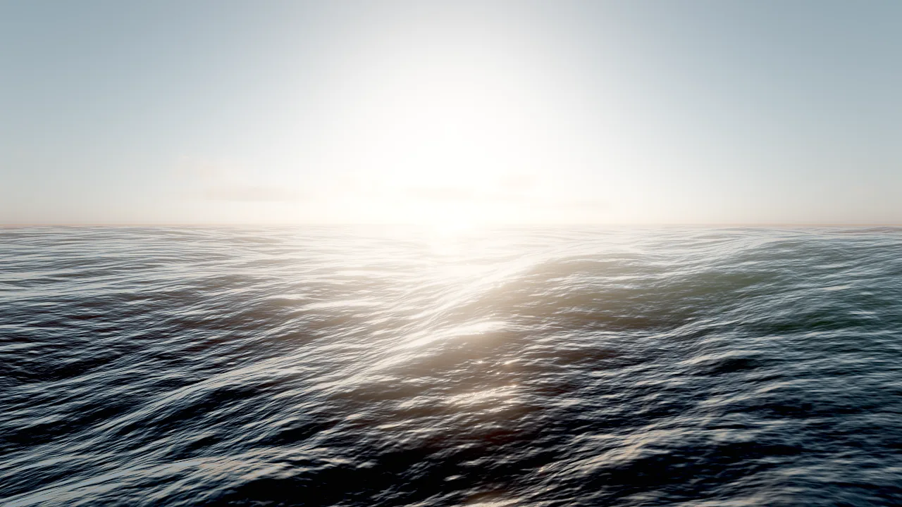
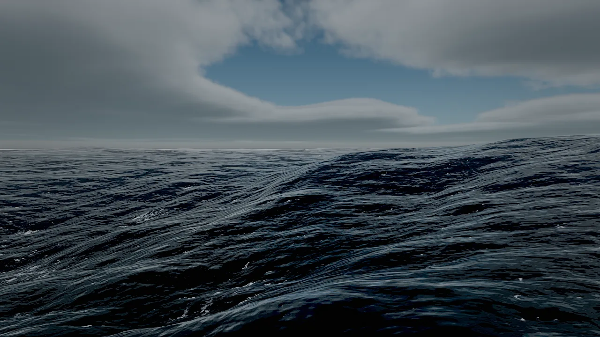

# Water

The `water` component renders a body of water driven by a spectral ocean simulation: wind waves, choppy crests, whitecaps, refraction, depth colour, caustics and reflections. One component covers an endless ocean, a storm sea, a lake, a swimming pool and a puddle on a street. Gameplay reads the same animated surface that is rendered, so boats, buoys and debris ride the waves you see.

<figure markdown>
{ loading=lazy }
<figcaption><code>fx_create {"effect": "ocean"}</code>: an endless FFT ocean with sun glints, seen from just above the surface.</figcaption>
</figure>

## Concepts

### The simulation

Skywalker's ocean is a Tessendorf FFT simulation:

- A **JONSWAP wind-wave spectrum** is built from `windSpeed` (with a 300 km fetch), spread around `windDirection`, and evolved with the finite-`depth` dispersion relation, so shallow water slows waves down.
- **Three cascades** of 256² samples cover tiles of `patchSize`, `patchSize`/4.7 and `patchSize`/19 meters. Together they reach from long swell down to ripples of about 20 cm without visible tiling.
- **Inverse FFTs** (run in parallel on the CPU each frame) produce height, choppy horizontal displacement (`choppiness`), slopes and the displacement Jacobian. Where the Jacobian folds, crests break into whitecaps, which persist and decay over seconds.
- The field is a **pure function** of the parameters, the seed and time. Play sessions replay exactly, and queries return the real surface.

The entity's y position is the water level. All heights the simulation produces are offsets from it.

### Fields

| Field | Range | What it does |
|---|---|---|
| `windSpeed` | 0–40 m/s | Wave energy: 2 for a calm lake, 8 for a breezy sea, 18 for a storm. |
| `windDirection` | degrees | Direction the waves travel (0 = +Z). |
| `choppiness` | 0–3 | Sharpness of crests; 0 is a rolling swell. |
| `waveScale` | 0–5 | Amplitude multiplier on top of the spectrum. |
| `patchSize` | 10–2000 m | Longest simulated wavelength (the largest cascade tile). |
| `size` | 0–100000 m | Square extent; 0 = endless ocean. |
| `depth` | 0.5–5000 m | Water depth for wave physics; shallow water slows waves. |
| `deepColor` | colour | Light scattered inside deep water. |
| `shallowColor` | colour | Tint of what you see through shallow water. |
| `clarity` | 0.1–100 m | How far you can see into the water. |
| `foam` | 0–4 | Whitecaps and shoreline surf. |
| `reflections` | 0–2 | Reflection strength. |
| `refraction` | 0–4 | Refraction distortion of what lies under the surface. |
| `roughness` | 0.005–0.5 | Micro roughness: the size of sun glints. |
| `seed` | integer | Random seed of the wave field. |

Colours accept `"#rrggbb[aa]"` or `[r, g, b(, a)]` in 0..1.

### Presets

`fx_create` creates a water entity from a preset at the position you give:

| Preset | Kind | `windSpeed` | `choppiness` | `patchSize` | `size` | `depth` | `clarity` | `foam` |
|---|---|---|---|---|---|---|---|---|
| `ocean` | Endless sea | 9 | 1.3 | 240 | 0 | 80 | 7 | 1 |
| `calm_sea` | Endless, gentle swell | 4.5 | 0.9 | 160 | 0 | 40 | 10 | 0.5 |
| `storm` | Endless, heavy sea | 19 | 1.8 | 420 | 0 | 200 | 3 | 2.4 |
| `lake` | 300 m body | 3 | 0.8 | 60 | 300 | 8 | 3 | 0.2 |
| `pool` | 12 m body, clear blue | 1.5 | 0.5 | 18 | 12 | 2 | 30 | 0 |
| `puddle` | 2.5 m body, near still, dark | 0.4 | 0.3 | 10 | 2.5 | 0.5 | 0.6 | 0 |

<figure markdown>
{ loading=lazy }
<figcaption><code>fx_create {"effect": "storm"}</code>: high wind, sharp crests and dense whitecaps under volumetric clouds.</figcaption>
</figure>

### Endless and sized bodies

- **Endless** (`size: 0`): a camera-centred grid that reaches the horizon. Far away the sea blends into the horizon, so the grid's edge never shows. Use it for oceans and seas.
- **Sized** (`size` > 0): a square body of `size` meters around the entity with an organic, ragged shore. Use it for lakes, ponds, pools and puddles.

### Shores and shoaling

Over a terrain, waves **shoal**: their height falls with the depth of a low-passed (about 16 m) seabed, keeps about 40% at the waterline so swash still runs up the beach face, and dies about 1 m above it. Hollows behind a beach crest therefore stay dry instead of flooding with every swell, and the shoreline follows the waves rather than the terrain contour.

Set the terrain's `waterLevel` to the water's y and give it a `wetBand`, so sand and soil darken where the swash reaches. `terrain_create` with `water: true` does both and adds a `calm_sea` at sea level. See [Terrain](terrain.md#wet-shorelines).

<video controls muted loop playsinline preload="none" poster="../../../assets/video/tidebreak_isle/swash.webp">
  <source src="../../../assets/video/tidebreak_isle/swash.mp4" type="video/mp4">
</video>

*Swash running up the beach in the Tidebreak Isle example: an endless sea (`windSpeed` 6, `choppiness` 1.1, `clarity` 14) shoaling over the island terrain.*

### Shading

| Effect | Controlled by |
|---|---|
| Refraction of the scene behind the surface | `refraction` |
| Absorption and in-scattering by depth | `clarity`, `shallowColor`, `deepColor` |
| Animated caustics on everything underwater | the wave field |
| Screen-space reflections, the sky (or the HDRI) where they leave the screen | `reflections` |
| GGX sun glints | `roughness` |
| Light through thin crests | the wave field and the sun |
| Persistent whitecaps that break into lace where waves fold; surf at the waterline | `foam` |
| Reflections of every lamp and fire | the 16 most important lights of the frame |

The renderer draws water in the effects pass, after opaque and transparent meshes, so it refracts everything behind it.

<video controls muted loop playsinline preload="none" poster="../../../assets/video/tidebreak_isle/shallows.webp">
  <source src="../../../assets/video/tidebreak_isle/shallows.mp4" type="video/mp4">
</video>

*The shallows of Tidebreak Isle from above: turquoise transmission over sand, darker water over deep sea, surf along the beach and around the rocks.*

## How to add water

=== "Tool call"

    ```tool
    fx_create {"effect": "ocean", "position": [0, 0, 0]}
    fx_create {"effect": "lake", "name": "Mill Pond", "position": [40, 12.5, -30], "overrides": {"size": 80, "clarity": 5, "shallowColor": "#4f7f55"}}
    ```

=== "Component"

    ```tool
    entity_create {"name": "Sea", "position": [0, 0, 0], "components": {"water": {"windSpeed": 6, "windDirection": 185, "choppiness": 1.1, "waveScale": 0.75, "patchSize": 180, "depth": 30, "deepColor": "#03303f", "shallowColor": "#3cd6d2", "clarity": 14, "foam": 1}}}
    ```

=== "CLI"

    ```bash
    skywalker call fx_create '{"effect": "storm", "position": [0, 0, 0]}' --project .
    ```

`overrides` patches any `water` field on top of the preset. Change a body later with `entity_update`:

```tool
entity_update {"entity": "Sea", "components": {"water": {"windSpeed": 14, "choppiness": 1.6, "foam": 1.8}}}
```

## How to make things float

### Query the surface from a tool

```tool
water_query {"points": [[34, 330], [0, 0], [120, -40]]}
```

`water_query` returns, for each [x, z] point, the world height of the animated surface and its normal, at the current effects time. Points outside every water body return `"water": false`. Use it to place a pier above the highest crests or to check that a boat sits at the right draft.

### Read the surface in Wander

`water_height(x, z)` or `water_height(point)` returns the world height of the surface at that spot (0 where there is no water). The behavior below makes a boat ride the waves: it samples four points around the hull, sets its height from their average and pitches and rolls with the difference.

```wander
behavior RideWaves
  intent "Float on the water: follow the animated surface and pitch and roll with the waves."
  param half_length = 6 in 1..30 "half the hull length (m)"
  param half_beam = 2 in 0.5..10 "half the hull width (m)"
  param draft = 0.4 in 0..3 "how deep the hull sits (m)"
  param heading = 75 in 0..360 "course (degrees)"

  on tick
    let p = self.position
    let f = forward(self) * half_length
    let r = right(self) * half_beam
    let bow = water_height(p + f)
    let stern = water_height(p - f)
    let port = water_height(p - r)
    let starboard = water_height(p + r)
    let mid = (bow + stern + port + starboard) / 4
    self.position = (p.x, mid - draft, p.z)
    let pitch = deg(atan2(bow - stern, half_length * 2))
    let roll = deg(atan2(port - starboard, half_beam * 2))
    self.rotation = (pitch, heading, roll)
  end
end
```

For a physics object, push it up in proportion to how deep it sits and let the solver do the rest. The entity needs a dynamic `body` and a `collider` (see [Physics](../physics.md)):

```wander
behavior Buoyancy
  intent "A floating crate: push up in proportion to how far it sits below the waves, with damping."
  param lift = 30 in 0..500 "upward force per meter submerged (N/m)"
  param damping = 4 in 0..50 "vertical damping (N per m/s)"

  on tick
    let depth = water_height(self.position) - self.position.y
    if depth > 0 then
      let v = velocity(self)
      push(self, (0, lift * min(depth, 1) - damping * v.y, 0))
    end
  end
end
```

Choose `lift` so that `lift` × 1 m clearly exceeds the body's weight (mass × 9.81); the crate then floats with part of its height below the surface.

## Recipe: a tropical coast

An island, a turquoise sea that shoals over it, a pier above the crests and a buoy that bobs.

```tool
terrain_create {"name": "Island", "preset": "island_beach", "size": 640, "resolution": 1025, "seed": 3, "water": true}
entity_update {"entity": "Sea", "components": {"water": {"windSpeed": 6, "windDirection": 185, "choppiness": 1.1, "waveScale": 0.75, "patchSize": 180, "depth": 30, "deepColor": "#03303f", "shallowColor": "#3cd6d2", "clarity": 14}}}
entity_update {"entity": "Island", "components": {"terrain": {"waterLevel": 0, "wetBand": 1.1}}}
water_query {"points": [[60, 150], [60, 170], [60, 190]]}
environment_update {"preset": "noon", "windSpeed": 6, "windDirection": 185}
viewport_capture {"eye": [60, 25, 260], "target": [60, 0, 150], "samples": 8}
```

Read the highest `height` from `water_query` along the pier line and build the deck at least half a meter above it. Attach `RideWaves` (above) to the buoy with `behavior_set`.

## Recipe: rain puddles on a street

Small sized bodies with the `puddle` preset turn a dry road into a mirror for neon signs.

```tool
fx_create {"effect": "puddle", "position": [-1.5, 0.008, 22], "overrides": {"size": 3.4}}
fx_create {"effect": "puddle", "position": [2.6, 0.008, 8], "overrides": {"size": 2.7}}
fx_create {"effect": "rain", "position": [0, 12, 10], "overrides": {"floorHeight": 0}}
```

Lift each puddle a few millimeters above the road so it does not z-fight, and vary `size` so the shores do not repeat.

<figure markdown>
{ loading=lazy }
<figcaption>Neon Requiem: puddle bodies 2–5 m wide, 8 mm above the asphalt, reflecting the street's neon signs.</figcaption>
</figure>

## Pitfalls

- **The y position is the water level.** Moving the entity up floods the scene; set the terrain's `waterLevel` to the same value.
- **Queries ignore shoaling.** `water_query` and `water_height` return the open-water wave field of the body. The height reduction near shores is a rendering effect, so a buoy in the swash zone moves more than the waves you see around it. Keep floating objects in open water or scale their motion down near the shore.
- **One body per spot.** Where bodies overlap, queries use the first water entity in scene order. A sized body counts as its full square for queries, not the ragged rendered shore.
- **A surface, not a fluid.** Water is a simulated surface: there is no flow and no splash simulation. Use particles (`spray`, `splashes_gpu`, `waterfall_mist`) for splashes and mist; see [Visual effects](../vfx.md).
- **Wind is separate.** The water's `windSpeed` and `windDirection` drive the waves; `environment_update` wind drives particles, foliage and clouds. Keep them consistent for a believable scene.

!!! agent "For agents"

    Create water from a preset, align the shore, then measure before you place anything on or above it:

    ```tool
    fx_create {"effect": "calm_sea", "position": [0, 0, 0]}                              # y = water level
    entity_update {"entity": "Terrain", "components": {"terrain": {"waterLevel": 0, "wetBand": 1.4}}}
    water_query {"points": [[0, 40], [10, 60]]}                                           # live surface height and normal
    viewport_capture {"eye": [0, 6, 80], "target": [0, 0, 20], "samples": 8}             # judge colour, foam, reflections
    ```

    For floating objects, write a behavior that calls `water_height` every tick; test it with `wander_test` and check positions with `entity_get` while playing.

## Reference

- Tools: [`fx_create`](../../reference/tools/render.md#fx_create), [`water_query`](../../reference/tools/world.md#water_query), [`terrain_create`](../../reference/tools/world.md#terrain_create).
- Component: [`water`](../../reference/components/world.md#water).
- Wander: [`water_height`](../../reference/wander.md#effects-water_height), [`push`](../../reference/wander.md#physics-push), [`velocity`](../../reference/wander.md#physics-velocity).
- Related pages: [Terrain](terrain.md), [Visual effects](../vfx.md), [Sky and atmosphere](../rendering/sky.md).
- Design document: [docs/RENDERING.md](https://github.com/amirhossein-razlighi/Skywalker/blob/main/docs/RENDERING.md) ("Water").
