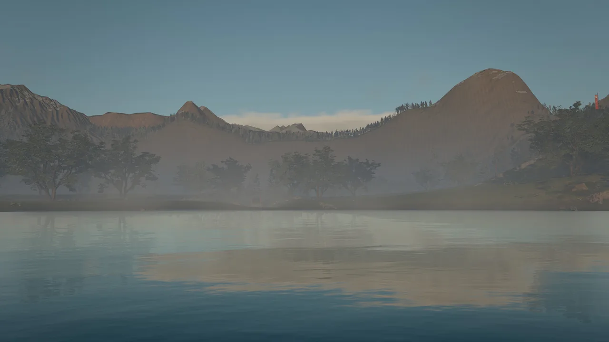
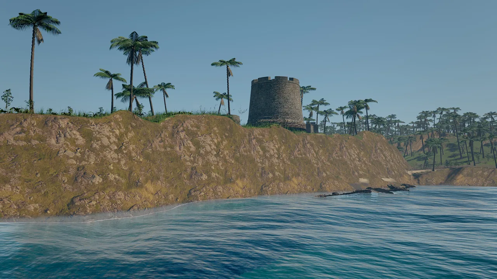
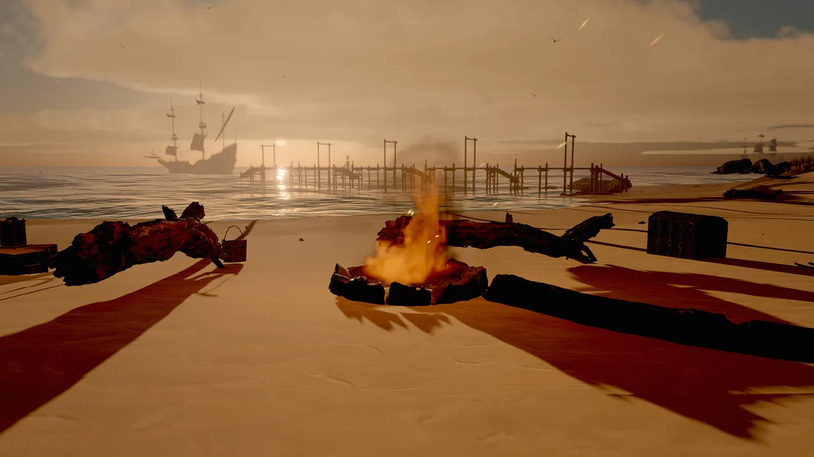
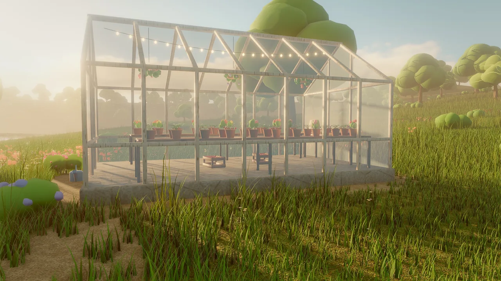
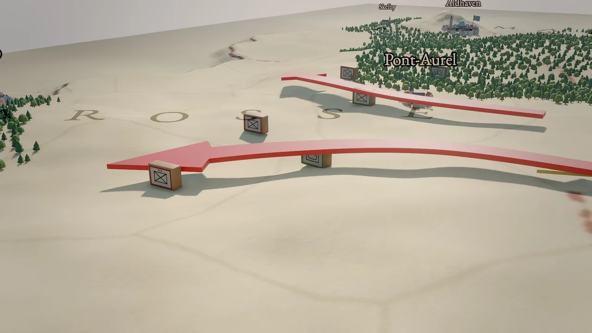
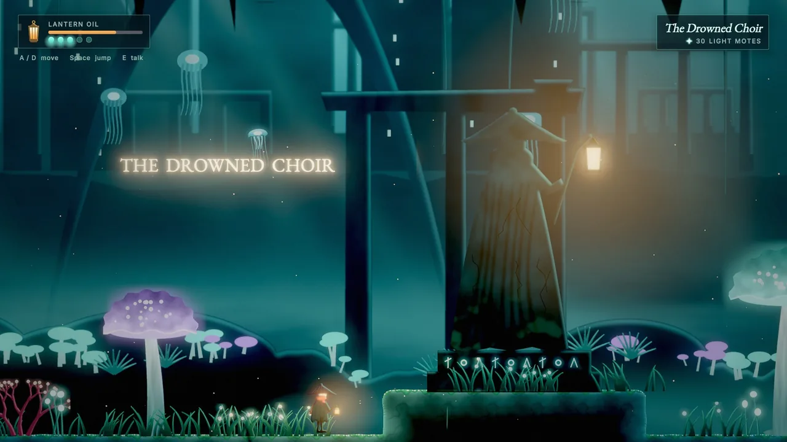
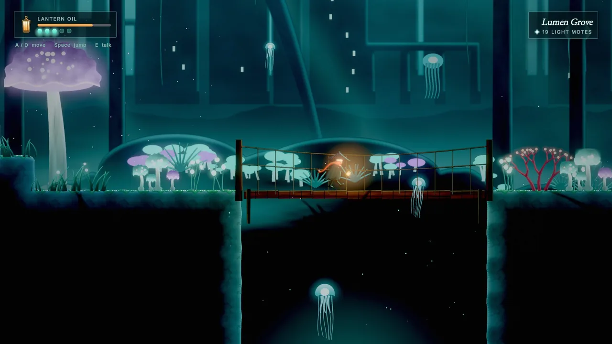
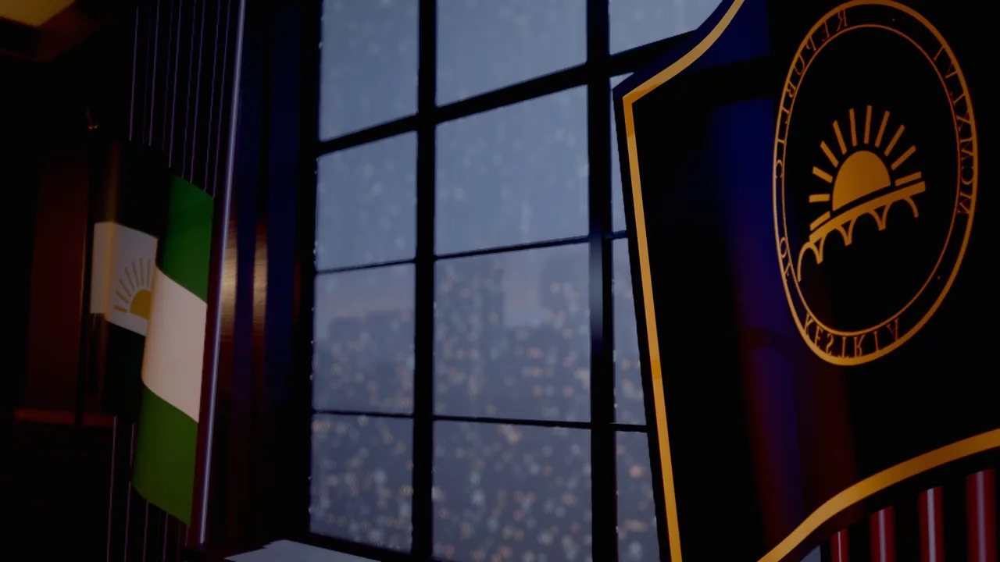

---
hide:
  - toc
---

# Showcase

Every frame on this page was rendered by Skywalker: the clips by the movie render path from each project's own
sequences, the stills by `viewport_capture`. The worlds are original sample projects built with the engine's tools,
most of them by agent crews, and all of them ship in [`examples/`](examples/index.md).

## Worlds in motion

<div class="sky-compare" markdown>
<figure markdown>
<video controls muted loop playsinline preload="none" poster="../assets/video/tidebreak_isle/establishing.webp"><source src="../assets/video/tidebreak_isle/establishing.mp4" type="video/mp4"></video>
<figcaption>Tidebreak Isle · establishing shot over the cove</figcaption>
</figure>
<figure markdown>
<video controls muted loop playsinline preload="none" poster="../assets/video/tidebreak_isle/swash.webp"><source src="../assets/video/tidebreak_isle/swash.mp4" type="video/mp4"></video>
<figcaption>Tidebreak Isle · FFT swash running up the beach</figcaption>
</figure>
<figure markdown>
<video controls muted loop playsinline preload="none" poster="../assets/video/neon_requiem/avenue_dolly.webp"><source src="../assets/video/neon_requiem/avenue_dolly.mp4" type="video/mp4"></video>
<figcaption>Neon Requiem · dolly down the avenue</figcaption>
</figure>
<figure markdown>
<video controls muted loop playsinline preload="none" poster="../assets/video/neon_requiem/monorail.webp"><source src="../assets/video/neon_requiem/monorail.mp4" type="video/mp4"></video>
<figcaption>Neon Requiem · the monorail</figcaption>
</figure>
<figure markdown>
<video controls muted loop playsinline preload="none" poster="../assets/video/ashen_peaks/establishing.webp"><source src="../assets/video/ashen_peaks/establishing.mp4" type="video/mp4"></video>
<figcaption>Ashen Peaks · the valley at sunrise</figcaption>
</figure>
<figure markdown>
<video controls muted loop playsinline preload="none" poster="../assets/video/ashen_peaks/pilgrim_stairs.webp"><source src="../assets/video/ashen_peaks/pilgrim_stairs.mp4" type="video/mp4"></video>
<figcaption>Ashen Peaks · the pilgrim stairs</figcaption>
</figure>
<figure markdown>
<video controls muted loop playsinline preload="none" poster="../assets/video/berrybrook/windmill.webp"><source src="../assets/video/berrybrook/windmill.mp4" type="video/mp4"></video>
<figcaption>Berrybrook · the windmill</figcaption>
</figure>
<figure markdown>
<video controls muted loop playsinline preload="none" poster="../assets/video/berrybrook/lily_pond.webp"><source src="../assets/video/berrybrook/lily_pond.mp4" type="video/mp4"></video>
<figcaption>Berrybrook · the lily pond</figcaption>
</figure>
<figure markdown>
<video controls muted loop playsinline preload="none" poster="../assets/video/meridian_accord/above_the_clouds.webp"><source src="../assets/video/meridian_accord/above_the_clouds.mp4" type="video/mp4"></video>
<figcaption>Meridian Accord · above the clouds</figcaption>
</figure>
<figure markdown>
<video controls muted loop playsinline preload="none" poster="../assets/video/meridian_accord/zoom_to_pont_aurel.webp"><source src="../assets/video/meridian_accord/zoom_to_pont_aurel.mp4" type="video/mp4"></video>
<figcaption>Meridian Accord · zoom to a city</figcaption>
</figure>
<figure markdown>
<video controls muted loop playsinline preload="none" poster="../assets/video/chancellors_desk/the_office.webp"><source src="../assets/video/chancellors_desk/the_office.mp4" type="video/mp4"></video>
<figcaption>The Chancellor's Desk · the office</figcaption>
</figure>
<figure markdown>
<video controls muted loop playsinline preload="none" poster="../assets/video/chancellors_desk/across_the_desk.webp"><source src="../assets/video/chancellors_desk/across_the_desk.mp4" type="video/mp4"></video>
<figcaption>The Chancellor's Desk · across the desk</figcaption>
</figure>
</div>

## Stills

<div class="sky-compare" markdown>
<figure markdown>{ loading=lazy }<figcaption>Ashen Peaks · courtyard</figcaption></figure>
<figure markdown>{ loading=lazy }<figcaption>Ashen Peaks · mirror lake</figcaption></figure>
<figure markdown>{ loading=lazy }<figcaption>Ashen Peaks · storm vista</figcaption></figure>
<figure markdown>{ loading=lazy }<figcaption>Neon Requiem · puddle mirror</figcaption></figure>
<figure markdown>{ loading=lazy }<figcaption>Neon Requiem · skyline</figcaption></figure>
<figure markdown>{ loading=lazy }<figcaption>Neon Requiem · noodle stall</figcaption></figure>
<figure markdown>{ loading=lazy }<figcaption>Tidebreak Isle · cliffs</figcaption></figure>
<figure markdown>{ loading=lazy }<figcaption>Tidebreak Isle · campfire</figcaption></figure>
<figure markdown>{ loading=lazy }<figcaption>Berrybrook · greenhouse</figcaption></figure>
<figure markdown>{ loading=lazy }<figcaption>Berrybrook · tilt-shift miniature</figcaption></figure>
<figure markdown>{ loading=lazy }<figcaption>Meridian Accord · map modes</figcaption></figure>
<figure markdown>{ loading=lazy }<figcaption>Meridian Accord · war table</figcaption></figure>
<figure markdown>{ loading=lazy }<figcaption>Gloamwater · shrine</figcaption></figure>
<figure markdown>{ loading=lazy }<figcaption>Gloamwater · bridge</figcaption></figure>
<figure markdown>{ loading=lazy }<figcaption>The Chancellor's Desk · rain on the glass</figcaption></figure>
<figure markdown>{ loading=lazy }<figcaption>The Chancellor's Desk · lamplight</figcaption></figure>
</div>

## Hair, fur and effects

<div class="sky-compare" markdown>
<figure markdown>{ loading=lazy }<figcaption>Strand hair in the wind</figcaption></figure>
<figure markdown>{ loading=lazy }<figcaption>Curly strand hair</figcaption></figure>
<figure markdown>{ loading=lazy }<figcaption>Fur</figcaption></figure>
<figure markdown>{ loading=lazy }<figcaption>GPU fireworks with sub-emitters</figcaption></figure>
<figure markdown>{ loading=lazy }<figcaption>Vortex force field</figcaption></figure>
<figure markdown>{ loading=lazy }<figcaption>Volumetric campfire</figcaption></figure>
</div>

## How these were made

The sample worlds were assembled through the engine's own tools: terrain, foliage and water presets, Blender models
generated through the DCC bridge, CC0 photoscans downloaded with recorded licenses, and lighting and camera work done
by agents with `viewport_capture` feedback. Each project's hero camera moves are sequences, rendered with
[`movie_render`](manual/movie-render.md):

```tool
movie_render {"sequence": "Intro", "output": "renders/intro.mp4", "resolution": "1080p", "fps": 24, "shutter": 0.5, "samples": 16}
```

```bash
skywalker movie scenes/main.sky.json --project examples/tidebreak_isle --sequence sequences/establishing.sequence.json -o establishing.mp4 --resolution 720p --samples 8
```
